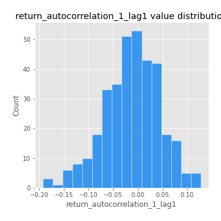
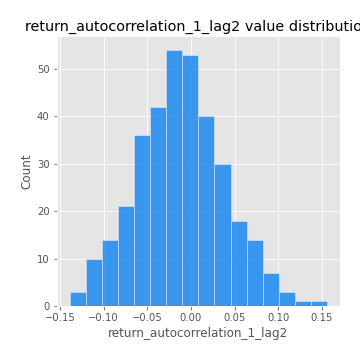

# Exploratory Data Analysis

[<< Go back](../README.md)
## Feature : target
- **Feature type** : categorical
- **Missing** : 0.0%
- **Unique** : 2
- **Count** :347
- **Unique** :2
- **Top** :real
- **Freq** :176

## Feature : return_mean1
- **Feature type** : continous
- **Missing** : 0.0%
- **Unique** : 347
- **Count** :347.0
- **Mean** :0.032053355991558875
- **Std** :0.07721458743196744
- **Min** :-0.22632637961920957
- **25%th Percentile** : -0.018514138805630825
- **50%th Percentile** : 0.029076672762473586
- **75%th Percentile** : 0.07584398154317515
- **Max** :0.37175100008111034

## Feature : return_mean2
- **Feature type** : continous
- **Missing** : 0.0%
- **Unique** : 347
- **Count** :347.0
- **Mean** :0.06710038082487374
- **Std** :0.09010793330546718
- **Min** :-0.24205418062825398
- **25%th Percentile** : 0.015558118692157594
- **50%th Percentile** : 0.06371982250616907
- **75%th Percentile** : 0.11646770717237388
- **Max** :0.4709982057946381

## Feature : return_sd1
- **Feature type** : continous
- **Missing** : 0.0%
- **Unique** : 347
- **Count** :347.0
- **Mean** :1.7186512613694047
- **Std** :0.7864637803241625
- **Min** :0.7470080772831957
- **25%th Percentile** : 1.4215565734964368
- **50%th Percentile** : 1.490326881821138
- **75%th Percentile** : 1.6850232224344688
- **Max** :9.236766377527575

## Feature : return_sd2
- **Feature type** : continous
- **Missing** : 0.0%
- **Unique** : 347
- **Count** :347.0
- **Mean** :1.761737118316881
- **Std** :0.7684208376023705
- **Min** :0.8455946193085045
- **25%th Percentile** : 1.4774583963743204
- **50%th Percentile** : 1.5654775640863168
- **75%th Percentile** : 1.6681043266658757
- **Max** :6.737618636746393

## Feature : return_skew1
- **Feature type** : continous
- **Missing** : 0.0%
- **Unique** : 347
- **Count** :347.0
- **Mean** :-0.12625324983115824
- **Std** :0.6152270015478406
- **Min** :-3.530116233761814
- **25%th Percentile** : -0.2655318276018894
- **50%th Percentile** : -0.08913127606714626
- **75%th Percentile** : 0.04958318035116846
- **Max** :2.5845963767725557

## Feature : return_skew2
- **Feature type** : continous
- **Missing** : 0.0%
- **Unique** : 347
- **Count** :347.0
- **Mean** :-0.23374603700615929
- **Std** :0.8311463843837621
- **Min** :-8.801502855292393
- **25%th Percentile** : -0.37768186537505954
- **50%th Percentile** : -0.14712629435825428
- **75%th Percentile** : 0.04878451710260637
- **Max** :2.2606839051517187

## Feature : return_kurtosis1
- **Feature type** : continous
- **Missing** : 0.0%
- **Unique** : 347
- **Count** :347.0
- **Mean** :3.6038240883319803
- **Std** :6.328819498548355
- **Min** :-0.3249296101098418
- **25%th Percentile** : 0.25047507314354656
- **50%th Percentile** : 1.0608872926042472
- **75%th Percentile** : 3.877119283967012
- **Max** :46.07507808162177

## Feature : return_kurtosis2
- **Feature type** : continous
- **Missing** : 0.0%
- **Unique** : 347
- **Count** :347.0
- **Mean** :4.432189803991772
- **Std** :10.424628509763481
- **Min** :-0.2129436347261522
- **25%th Percentile** : 0.4972883837825659
- **50%th Percentile** : 1.5133306764399754
- **75%th Percentile** : 4.499708476766501
- **Max** :143.10871011533666

## Feature : return_autocorrelation_1_lag1
- **Feature type** : continous
- **Missing** : 0.0%
- **Unique** : 347
- **Count** :347.0
- **Mean** :-0.012062642339952795
- **Std** :0.057240722426068334
- **Min** :-0.19339575314049967
- **25%th Percentile** : -0.04528348613946939
- **50%th Percentile** : -0.008026173079323433
- **75%th Percentile** : 0.02738568890444618
- **Max** :0.12810656890648087

## Feature : return_autocorrelation_1_lag2
- **Feature type** : continous
- **Missing** : 0.0%
- **Unique** : 347
- **Count** :347.0
- **Mean** :-0.011335835414265841
- **Std** :0.04975009906725196
- **Min** :-0.13913091242728307
- **25%th Percentile** : -0.04515488260141892
- **50%th Percentile** : -0.010931661684626217
- **75%th Percentile** : 0.01995529973835872
- **Max** :0.1561488228015672

## Feature : return_autocorrelation_1_lag3
- **Feature type** : continous
- **Missing** : 0.0%
- **Unique** : 347
- **Count** :347.0
- **Mean** :0.0009741290536864523
- **Std** :0.047809284480790804
- **Min** :-0.15117275786205733
- **25%th Percentile** : -0.029110897161401146
- **50%th Percentile** : 0.00010684383579549596
- **75%th Percentile** : 0.032882636020726136
- **Max** :0.17805869530681923

## Feature : return_autocorrelation_2_lag1
- **Feature type** : continous
- **Missing** : 0.0%
- **Unique** : 347
- **Count** :347.0
- **Mean** :-0.0034397992373660035
- **Std** :0.06402889235517296
- **Min** :-0.25075531010123286
- **25%th Percentile** : -0.03804220726836187
- **50%th Percentile** : 0.006345061007531445
- **75%th Percentile** : 0.036313194183115266
- **Max** :0.31863413537898483

## Feature : return_autocorrelation_2_lag2
- **Feature type** : continous
- **Missing** : 0.0%
- **Unique** : 347
- **Count** :347.0
- **Mean** :0.000918593581049996
- **Std** :0.05301154060132275
- **Min** :-0.15323211089747296
- **25%th Percentile** : -0.03385041814336066
- **50%th Percentile** : -0.0020334586063331874
- **75%th Percentile** : 0.035563541265042256
- **Max** :0.20974504043791217

## Feature : return_autocorrelation_2_lag3
- **Feature type** : continous
- **Missing** : 0.0%
- **Unique** : 347
- **Count** :347.0
- **Mean** :0.0018316549444459874
- **Std** :0.05104904980128719
- **Min** :-0.14200107169559698
- **25%th Percentile** : -0.028348963302687966
- **50%th Percentile** : 0.001168038911395616
- **75%th Percentile** : 0.03675578219267154
- **Max** :0.1419999376914021

## Feature : return_correlation_ts1_lag_0
- **Feature type** : continous
- **Missing** : 0.0%
- **Unique** : 347
- **Count** :347.0
- **Mean** :0.3020565204968186
- **Std** :0.11268065358860609
- **Min** :-0.027089510445801036
- **25%th Percentile** : 0.24464753167751419
- **50%th Percentile** : 0.2914813908830169
- **75%th Percentile** : 0.3501584463695155
- **Max** :0.7041861626832071

## Feature : return_correlation_ts1_lag_1
- **Feature type** : continous
- **Missing** : 0.0%
- **Unique** : 347
- **Count** :347.0
- **Mean** :-0.0015270155561585305
- **Std** :0.04995406042890993
- **Min** :-0.15776193292681923
- **25%th Percentile** : -0.034698347527997594
- **50%th Percentile** : 0.0023128402151990253
- **75%th Percentile** : 0.033759187527311024
- **Max** :0.15499424718508623

## Feature : return_correlation_ts1_lag_2
- **Feature type** : continous
- **Missing** : 0.0%
- **Unique** : 347
- **Count** :347.0
- **Mean** :-0.0027685377450030707
- **Std** :0.04454635270310309
- **Min** :-0.11523251525020971
- **25%th Percentile** : -0.03302717279444618
- **50%th Percentile** : -0.004290804190704709
- **75%th Percentile** : 0.026769896036406636
- **Max** :0.11139041036099387

## Feature : return_correlation_ts1_lag_3
- **Feature type** : continous
- **Missing** : 0.0%
- **Unique** : 347
- **Count** :347.0
- **Mean** :0.0022822418302939703
- **Std** :0.049104488814137454
- **Min** :-0.1270218498974763
- **25%th Percentile** : -0.032875082678532445
- **50%th Percentile** : 0.0014003458802558063
- **75%th Percentile** : 0.03581213296889536
- **Max** :0.1636773216468148

## Feature : return_correlation_ts2_lag_1
- **Feature type** : continous
- **Missing** : 0.0%
- **Unique** : 347
- **Count** :347.0
- **Mean** :-0.006746001130661596
- **Std** :0.054731206102954115
- **Min** :-0.20093919236581337
- **25%th Percentile** : -0.04036302612289253
- **50%th Percentile** : -0.007468670291705828
- **75%th Percentile** : 0.027159687635179224
- **Max** :0.11904616209178923

## Feature : return_correlation_ts2_lag_2
- **Feature type** : continous
- **Missing** : 0.0%
- **Unique** : 347
- **Count** :347.0
- **Mean** :-0.0031570491243595967
- **Std** :0.04869930494608943
- **Min** :-0.15299951737180204
- **25%th Percentile** : -0.036137482881533865
- **50%th Percentile** : -0.005802978589074182
- **75%th Percentile** : 0.024715171827892832
- **Max** :0.20772887392904255

## Feature : return_correlation_ts2_lag_3
- **Feature type** : continous
- **Missing** : 0.0%
- **Unique** : 347
- **Count** :347.0
- **Mean** :-0.0004924205320786573
- **Std** :0.05092372889306468
- **Min** :-0.17564076057312866
- **25%th Percentile** : -0.029676497778456594
- **50%th Percentile** : -0.00013584537111536752
- **75%th Percentile** : 0.03483985590645982
- **Max** :0.13128380114518473

## Feature : sqreturn_autocorrelation_ts1_lag1
- **Feature type** : continous
- **Missing** : 0.0%
- **Unique** : 347
- **Count** :347.0
- **Mean** :0.04883380770856505
- **Std** :0.09016817428927792
- **Min** :-0.09087671222172103
- **25%th Percentile** : -0.008171375626341345
- **50%th Percentile** : 0.02646910530292259
- **75%th Percentile** : 0.08430836577564213
- **Max** :0.4439086285737898

## Feature : sqreturn_autocorrelation_ts1_lag2
- **Feature type** : continous
- **Missing** : 0.0%
- **Unique** : 347
- **Count** :347.0
- **Mean** :0.04066093502644348
- **Std** :0.08310739953949542
- **Min** :-0.10338762465034779
- **25%th Percentile** : -0.011211949447805044
- **50%th Percentile** : 0.019716780597215693
- **75%th Percentile** : 0.06623708983397866
- **Max** :0.4522162366773919

## Feature : sqreturn_autocorrelation_ts1_lag3
- **Feature type** : continous
- **Missing** : 0.0%
- **Unique** : 347
- **Count** :347.0
- **Mean** :0.03321036655061994
- **Std** :0.07026274248508561
- **Min** :-0.09136532631661817
- **25%th Percentile** : -0.013178171321009628
- **50%th Percentile** : 0.020314499646379647
- **75%th Percentile** : 0.05810039384347518
- **Max** :0.41030914918857014

## Feature : sqreturn_autocorrelation_ts2_lag1
- **Feature type** : continous
- **Missing** : 0.0%
- **Unique** : 347
- **Count** :347.0
- **Mean** :0.05230344573413033
- **Std** :0.08743284926047595
- **Min** :-0.08806523678896525
- **25%th Percentile** : -0.0031476935667664723
- **50%th Percentile** : 0.02630650408201706
- **75%th Percentile** : 0.08645806371419289
- **Max** :0.510085647437958

## Feature : sqreturn_autocorrelation_ts2_lag2
- **Feature type** : continous
- **Missing** : 0.0%
- **Unique** : 347
- **Count** :347.0
- **Mean** :0.0384835219259695
- **Std** :0.08705968765814784
- **Min** :-0.09886551553432402
- **25%th Percentile** : -0.01311188497872236
- **50%th Percentile** : 0.01300741529117995
- **75%th Percentile** : 0.06131975346786226
- **Max** :0.45676817892778204

## Feature : sqreturn_autocorrelation_ts2_lag3
- **Feature type** : continous
- **Missing** : 0.0%
- **Unique** : 347
- **Count** :347.0
- **Mean** :0.027813444219559603
- **Std** :0.07170955358036263
- **Min** :-0.09060869758598021
- **25%th Percentile** : -0.017974448866348497
- **50%th Percentile** : 0.010674848682306184
- **75%th Percentile** : 0.05577362173783014
- **Max** :0.31225727797735664

## Feature : sqreturn_correlation_ts1_lag_0
- **Feature type** : continous
- **Missing** : 0.0%
- **Unique** : 347
- **Count** :347.0
- **Mean** :0.3020565204968186
- **Std** :0.11268065358860609
- **Min** :-0.027089510445801036
- **25%th Percentile** : 0.24464753167751419
- **50%th Percentile** : 0.2914813908830169
- **75%th Percentile** : 0.3501584463695155
- **Max** :0.7041861626832071

## Feature : sqreturn_correlation_ts1_lag_1
- **Feature type** : continous
- **Missing** : 0.0%
- **Unique** : 347
- **Count** :347.0
- **Mean** :-0.0015270155561585305
- **Std** :0.04995406042890993
- **Min** :-0.15776193292681923
- **25%th Percentile** : -0.034698347527997594
- **50%th Percentile** : 0.0023128402151990253
- **75%th Percentile** : 0.033759187527311024
- **Max** :0.15499424718508623

## Feature : sqreturn_correlation_ts1_lag_2
- **Feature type** : continous
- **Missing** : 0.0%
- **Unique** : 347
- **Count** :347.0
- **Mean** :-0.0027685377450030707
- **Std** :0.04454635270310309
- **Min** :-0.11523251525020971
- **25%th Percentile** : -0.03302717279444618
- **50%th Percentile** : -0.004290804190704709
- **75%th Percentile** : 0.026769896036406636
- **Max** :0.11139041036099387

## Feature : sqreturn_correlation_ts1_lag_3
- **Feature type** : continous
- **Missing** : 0.0%
- **Unique** : 347
- **Count** :347.0
- **Mean** :0.0022822418302939703
- **Std** :0.049104488814137454
- **Min** :-0.1270218498974763
- **25%th Percentile** : -0.032875082678532445
- **50%th Percentile** : 0.0014003458802558063
- **75%th Percentile** : 0.03581213296889536
- **Max** :0.1636773216468148

## Feature : sqreturn_correlation_ts2_lag_1
- **Feature type** : continous
- **Missing** : 0.0%
- **Unique** : 347
- **Count** :347.0
- **Mean** :-0.006746001130661596
- **Std** :0.054731206102954115
- **Min** :-0.20093919236581337
- **25%th Percentile** : -0.04036302612289253
- **50%th Percentile** : -0.007468670291705828
- **75%th Percentile** : 0.027159687635179224
- **Max** :0.11904616209178923

## Feature : sqreturn_correlation_ts2_lag_2
- **Feature type** : continous
- **Missing** : 0.0%
- **Unique** : 347
- **Count** :347.0
- **Mean** :-0.0031570491243595967
- **Std** :0.04869930494608943
- **Min** :-0.15299951737180204
- **25%th Percentile** : -0.036137482881533865
- **50%th Percentile** : -0.005802978589074182
- **75%th Percentile** : 0.024715171827892832
- **Max** :0.20772887392904255

## Feature : sqreturn_correlation_ts2_lag_3
- **Feature type** : continous
- **Missing** : 0.0%
- **Unique** : 347
- **Count** :347.0
- **Mean** :-0.0004924205320786573
- **Std** :0.05092372889306468
- **Min** :-0.17564076057312866
- **25%th Percentile** : -0.029676497778456594
- **50%th Percentile** : -0.00013584537111536752
- **75%th Percentile** : 0.03483985590645982
- **Max** :0.13128380114518473

## Feature : price2_granger_cause_price1
- **Feature type** : continous
- **Missing** : 0.0%
- **Unique** : 347
- **Count** :347.0
- **Mean** :0.3154073396768141
- **Std** :0.3014648968303975
- **Min** :1.1505642493585304e-05
- **25%th Percentile** : 0.04168789418858526
- **50%th Percentile** : 0.23308025728770448
- **75%th Percentile** : 0.5570793982598351
- **Max** :0.9986547988496527

## Feature : price1_granger_cause_price2
- **Feature type** : continous
- **Missing** : 0.0%
- **Unique** : 347
- **Count** :347.0
- **Mean** :0.2652185187465055
- **Std** :0.27371132548002763
- **Min** :1.0032766165682587e-09
- **25%th Percentile** : 0.0339647223395744
- **50%th Percentile** : 0.16927638725462585
- **75%th Percentile** : 0.42554272696638923
- **Max** :0.9951398266867577

[<< Go back](../README.md)
