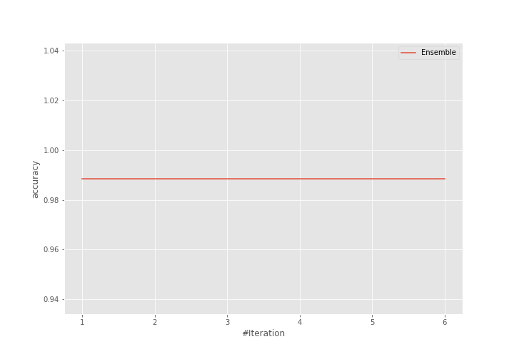
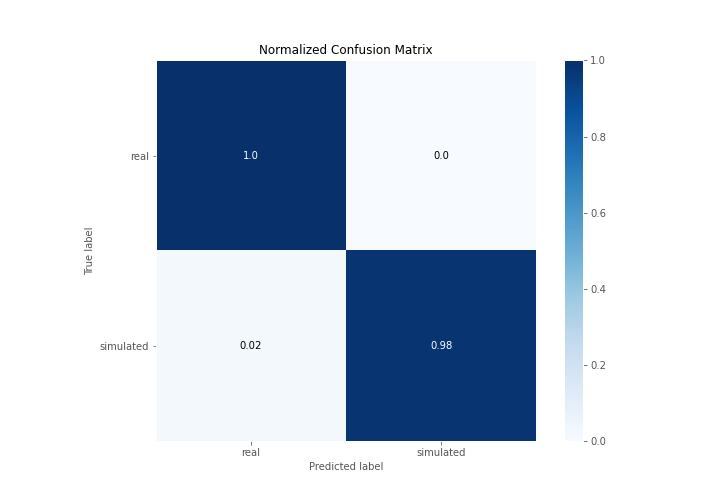
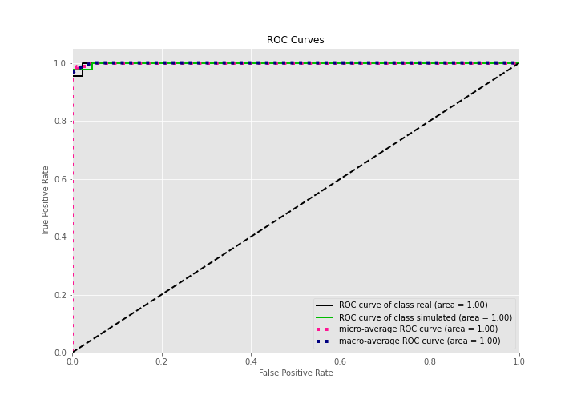
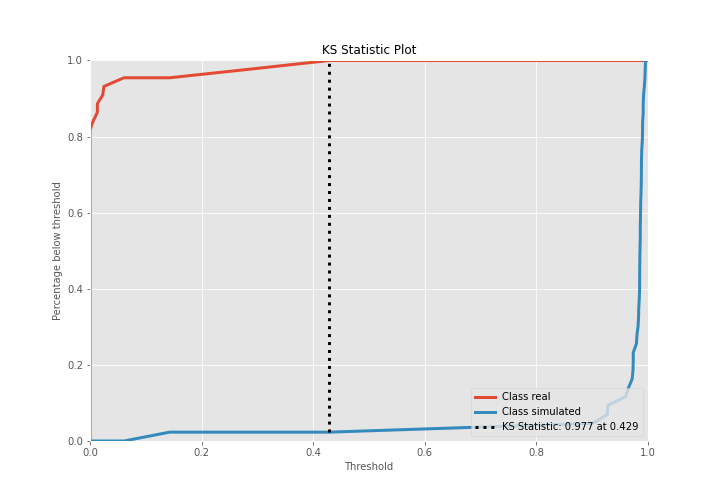
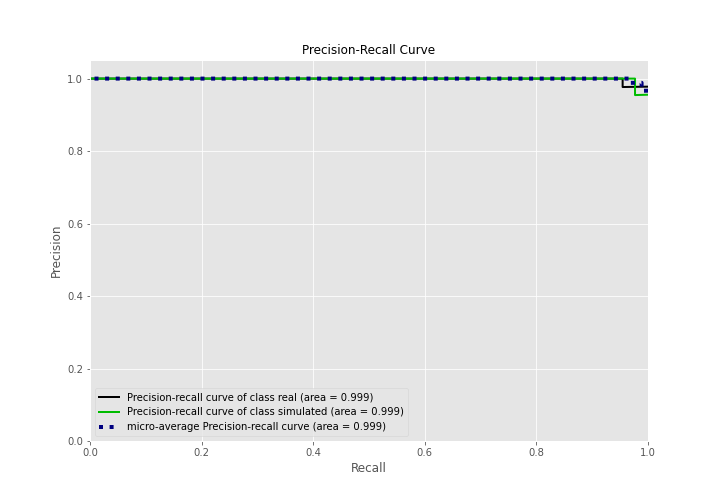
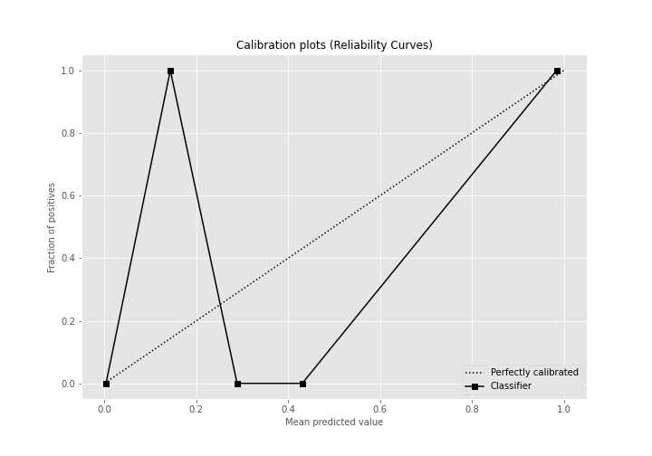
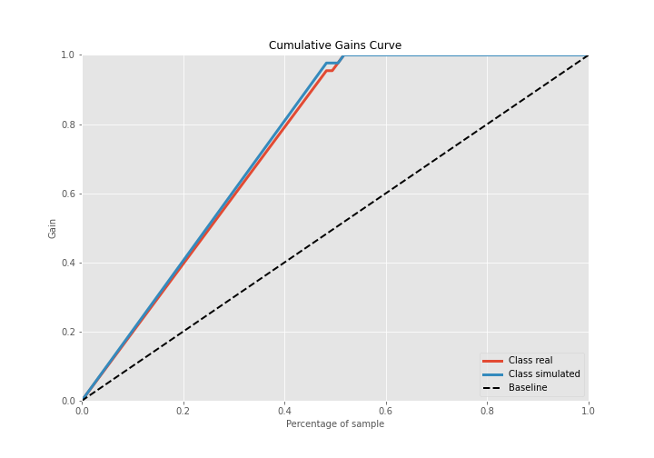
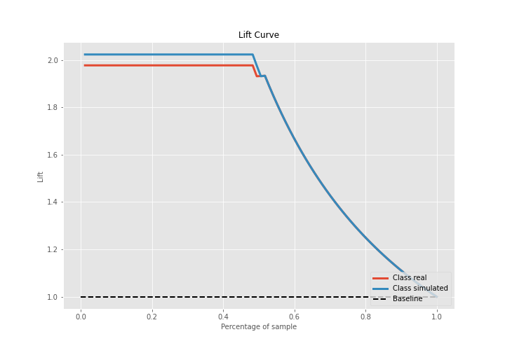

# Summary of Ensemble

[<< Go back](../README.md)

## Ensemble structure
| Model                   |   Weight |
|:------------------------|---------:|
| 5_Default_NeuralNetwork |        1 |

## Metric details
|           |     score |     threshold |
|:----------|----------:|--------------:|
| logloss   | 0.0441865 | nan           |
| auc       | 0.998943  | nan           |
| f1        | 0.988235  |   0.56542     |
| accuracy  | 0.988506  |   0.56542     |
| precision | 1         |   0.56542     |
| recall    | 1         |   3.78145e-19 |
| mcc       | 0.977261  |   0.56542     |

## Confusion matrix (at threshold=0.56542)
|                      |   Predicted as real |   Predicted as simulated |
|:---------------------|--------------------:|-------------------------:|
| Labeled as real      |                  44 |                        0 |
| Labeled as simulated |                   1 |                       42 |

## Learning curves

## Confusion Matrix

## Normalized Confusion Matrix

## ROC Curve

## Kolmogorov-Smirnov Statistic

## Precision-Recall Curve

## Calibration Curve

## Cumulative Gains Curve

## Lift Curve

[<< Go back](../README.md)
