# Summary of 2_DecisionTree

[<< Go back](../README.md)

## Decision Tree
- **n_jobs**: -1
- **criterion**: gini
- **max_depth**: 3
- **explain_level**: 2

## Validation
 - **validation_type**: split
 - **train_ratio**: 0.75
 - **shuffle**: True
 - **stratify**: True

## Optimized metric
accuracy

## Training time

9.8 seconds

## Metric details
|           |    score |   threshold |
|:----------|---------:|------------:|
| logloss   | 0.801392 |  nan        |
| auc       | 0.931481 |  nan        |
| f1        | 0.946237 |    0.508621 |
| accuracy  | 0.942529 |    0.508621 |
| precision | 0.916667 |    0.508621 |
| recall    | 0.977778 |    0        |
| mcc       | 0.886773 |    0.508621 |

## Confusion matrix (at threshold=0.508621)
|                      |   Predicted as real |   Predicted as simulated |
|:---------------------|--------------------:|-------------------------:|
| Labeled as real      |                  38 |                        4 |
| Labeled as simulated |                   1 |                       44 |

## Learning curves
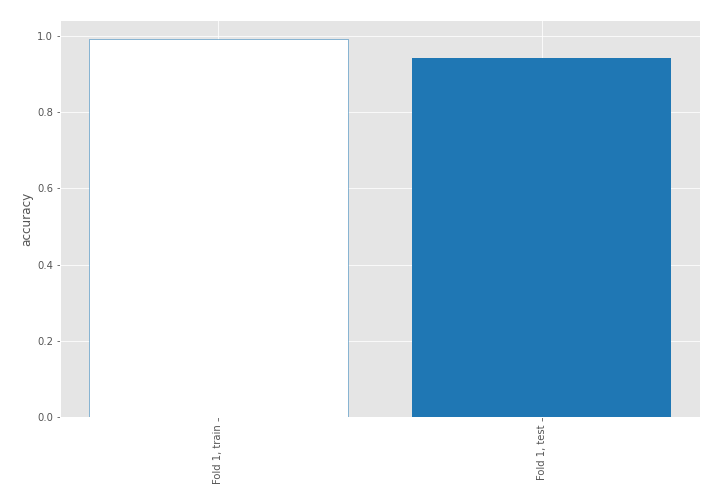

## Decision Tree 

### Tree #1
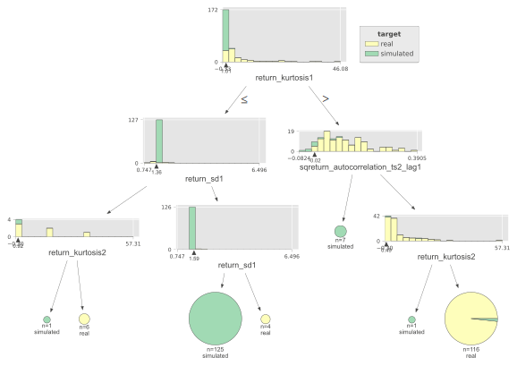

### Rules

if (return_kurtosis1 <= 1.008) and (return_sd1 > 1.36) and (return_sd1 <= 1.588) then class: simulated (proba: 100.0%) | based on 125 samples

if (return_kurtosis1 > 1.008) and (sqreturn_autocorrelation_ts2_lag1 > -0.02) and (return_kurtosis2 > 0.493) then class: real (proba: 98.28%) | based on 116 samples

if (return_kurtosis1 > 1.008) and (sqreturn_autocorrelation_ts2_lag1 <= -0.02) then class: simulated (proba: 100.0%) | based on 7 samples

if (return_kurtosis1 <= 1.008) and (return_sd1 <= 1.36) and (return_kurtosis2 > 0.92) then class: real (proba: 100.0%) | based on 6 samples

if (return_kurtosis1 <= 1.008) and (return_sd1 > 1.36) and (return_sd1 > 1.588) then class: real (proba: 100.0%) | based on 4 samples

if (return_kurtosis1 > 1.008) and (sqreturn_autocorrelation_ts2_lag1 > -0.02) and (return_kurtosis2 <= 0.493) then class: simulated (proba: 100.0%) | based on 1 samples

if (return_kurtosis1 <= 1.008) and (return_sd1 <= 1.36) and (return_kurtosis2 <= 0.92) then class: simulated (proba: 100.0%) | based on 1 samples

## Permutation-based Importance
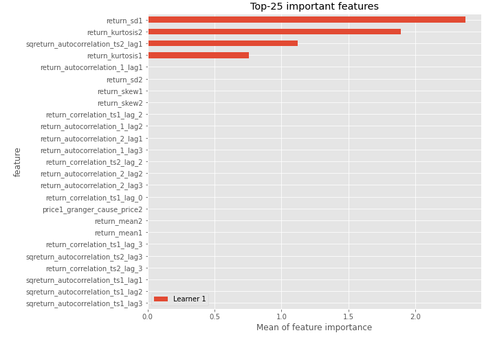
## Confusion Matrix

## Normalized Confusion Matrix

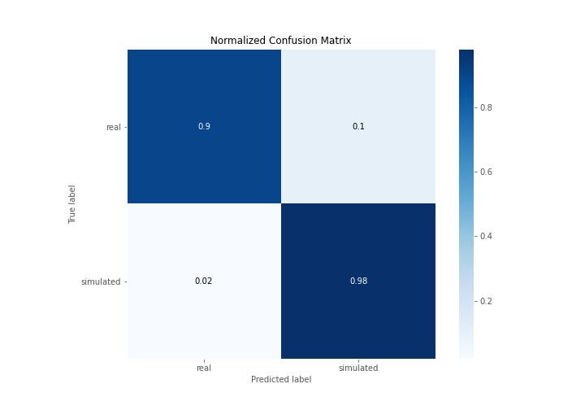

## ROC Curve

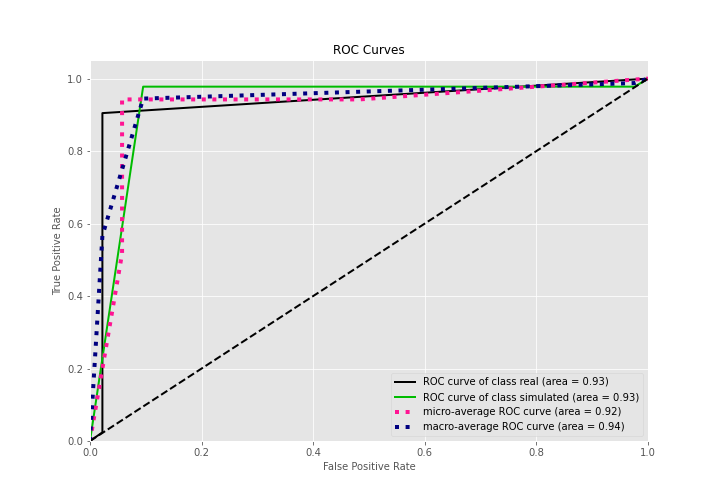

## Kolmogorov-Smirnov Statistic

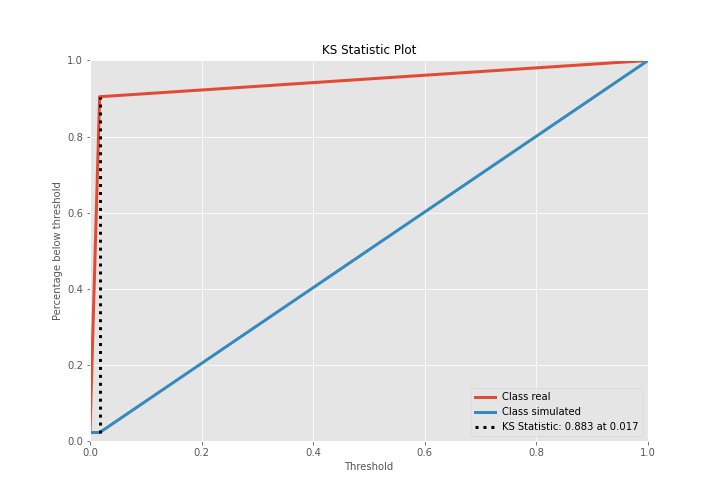

## Precision-Recall Curve

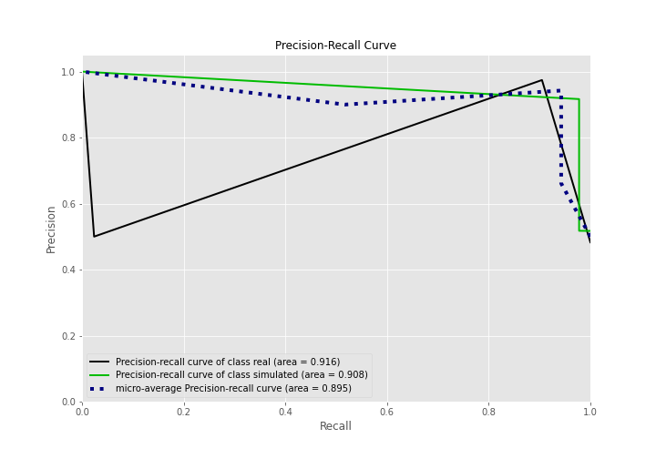

## Calibration Curve

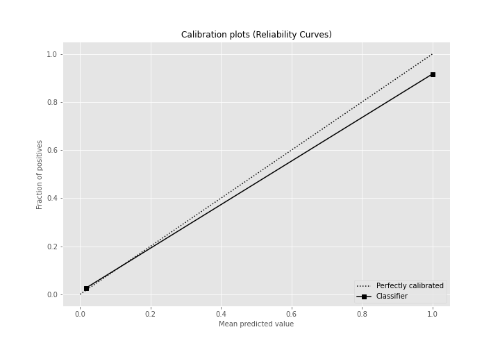

## Cumulative Gains Curve

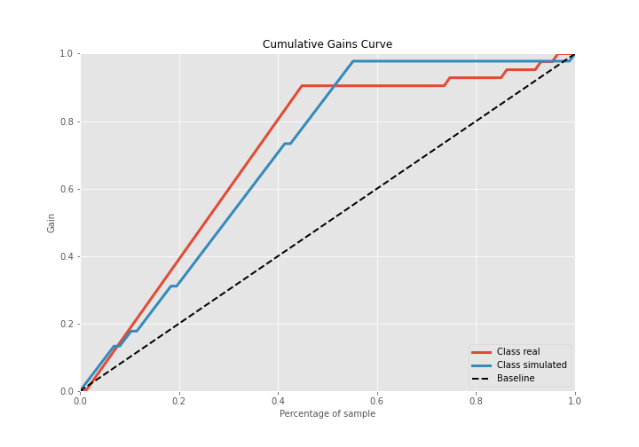

## Lift Curve

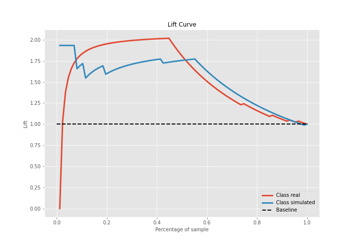

## SHAP Importance
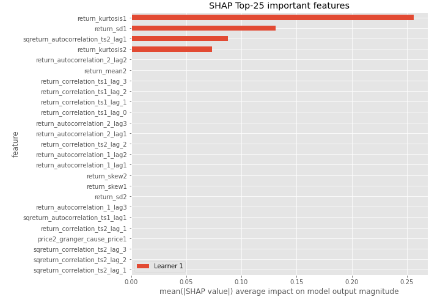

## SHAP Dependence plots

### Dependence (Fold 1)
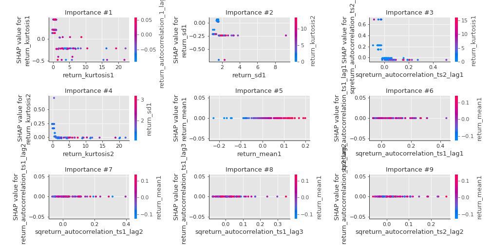

## SHAP Decision plots

### Top-10 Worst decisions for class 0 (Fold 1)
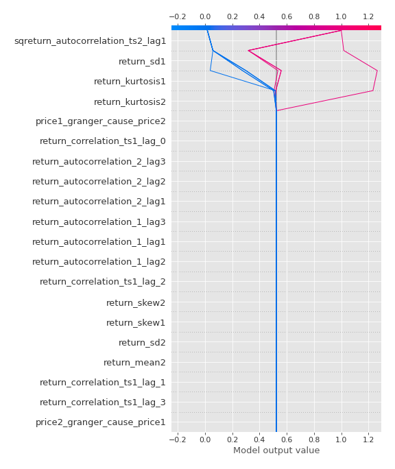
### Top-10 Best decisions for class 0 (Fold 1)
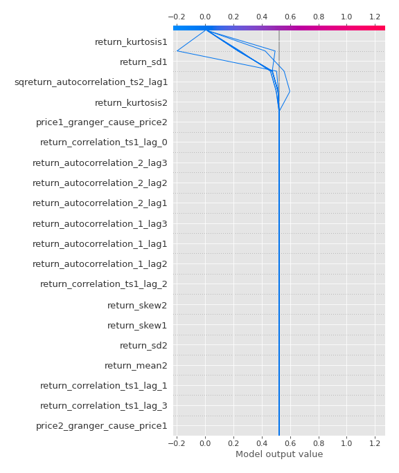
### Top-10 Worst decisions for class 1 (Fold 1)
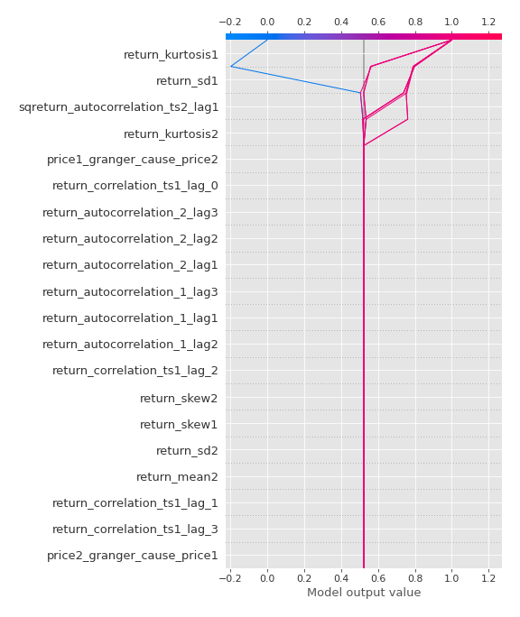
### Top-10 Best decisions for class 1 (Fold 1)
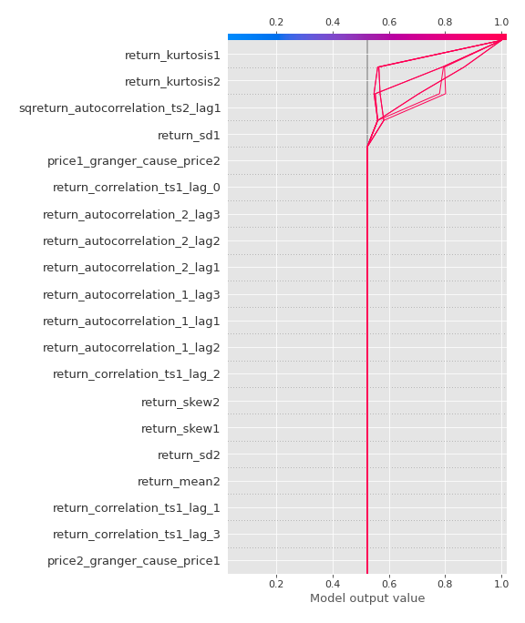

[<< Go back](../README.md)
