# Exploratory Data Analysis

[<< Go back](../README.md)
## Feature : target
- **Feature type** : categorical
- **Missing** : 0.0%
- **Unique** : 2
- **Count** :347
- **Unique** :2
- **Top** :simulated
- **Freq** :181

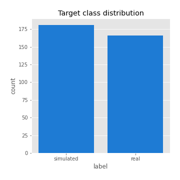
## Feature : return_mean1
- **Feature type** : continous
- **Missing** : 0.0%
- **Unique** : 347
- **Count** :347.0
- **Mean** :0.026255893214733927
- **Std** :0.07911199636828505
- **Min** :-0.22632637961920957
- **25%th Percentile** : -0.02068191094144481
- **50%th Percentile** : 0.0256419719772878
- **75%th Percentile** : 0.07193737643015516
- **Max** :0.37175100008111034

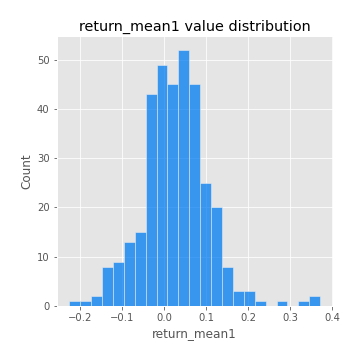
## Feature : return_mean2
- **Feature type** : continous
- **Missing** : 0.0%
- **Unique** : 347
- **Count** :347.0
- **Mean** :0.07021300644623657
- **Std** :0.08593357112138972
- **Min** :-0.24205418062825398
- **25%th Percentile** : 0.021732774120550406
- **50%th Percentile** : 0.06710522972558879
- **75%th Percentile** : 0.11704874158889696
- **Max** :0.4419306902570611

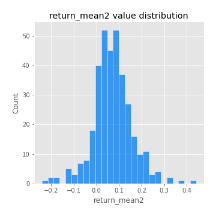
## Feature : return_sd1
- **Feature type** : continous
- **Missing** : 0.0%
- **Unique** : 347
- **Count** :347.0
- **Mean** :1.721201916036123
- **Std** :0.7953869060254426
- **Min** :0.7470080772831957
- **25%th Percentile** : 1.424201896396991
- **50%th Percentile** : 1.5039137468796695
- **75%th Percentile** : 1.6755231874636776
- **Max** :9.236766377527575

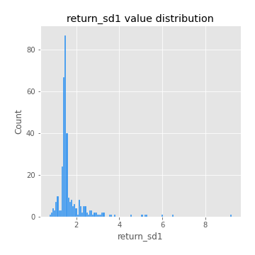
## Feature : return_sd2
- **Feature type** : continous
- **Missing** : 0.0%
- **Unique** : 347
- **Count** :347.0
- **Mean** :1.7680742860479113
- **Std** :0.7411236848225861
- **Min** :0.8455946193085045
- **25%th Percentile** : 1.4992780849832164
- **50%th Percentile** : 1.572166505553415
- **75%th Percentile** : 1.6821836387569469
- **Max** :6.737618636746393

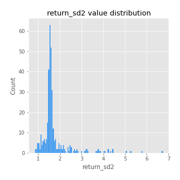
## Feature : return_skew1
- **Feature type** : continous
- **Missing** : 0.0%
- **Unique** : 347
- **Count** :347.0
- **Mean** :-0.1337960156510588
- **Std** :0.6114899116947979
- **Min** :-3.453087436558107
- **25%th Percentile** : -0.26125484527787046
- **50%th Percentile** : -0.08633277666545694
- **75%th Percentile** : 0.069060947231535
- **Max** :2.5845963767725557

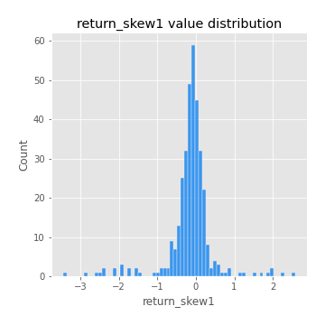
## Feature : return_skew2
- **Feature type** : continous
- **Missing** : 0.0%
- **Unique** : 347
- **Count** :347.0
- **Mean** :-0.20299224575417288
- **Std** :0.5872626028798691
- **Min** :-3.4392142944489743
- **25%th Percentile** : -0.35329413772254403
- **50%th Percentile** : -0.1505852369294483
- **75%th Percentile** : 0.024842900286903488
- **Max** :2.2606839051517187

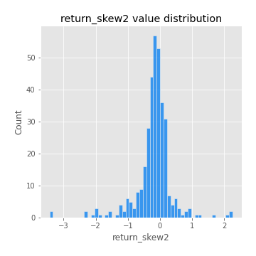
## Feature : return_kurtosis1
- **Feature type** : continous
- **Missing** : 0.0%
- **Unique** : 347
- **Count** :347.0
- **Mean** :3.2672222128047164
- **Std** :5.966239145344756
- **Min** :-0.3288153640467706
- **25%th Percentile** : 0.2573172184105752
- **50%th Percentile** : 0.9526663009767273
- **75%th Percentile** : 3.665814934210274
- **Max** :46.07507808162177

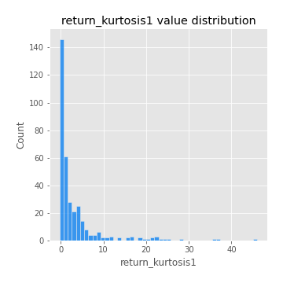
## Feature : return_kurtosis2
- **Feature type** : continous
- **Missing** : 0.0%
- **Unique** : 347
- **Count** :347.0
- **Mean** :3.7095711505886935
- **Std** :6.1969692108451735
- **Min** :-0.2988407438384315
- **25%th Percentile** : 0.5309976143829045
- **50%th Percentile** : 1.4493166967924442
- **75%th Percentile** : 4.202853905029984
- **Max** :57.31293005729889

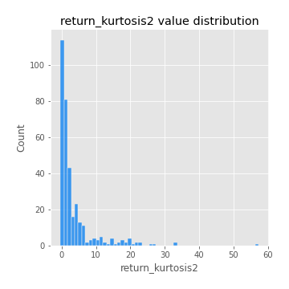
## Feature : return_autocorrelation_1_lag1
- **Feature type** : continous
- **Missing** : 0.0%
- **Unique** : 347
- **Count** :347.0
- **Mean** :-0.007067357113496571
- **Std** :0.06144493046178695
- **Min** :-0.2135576224968752
- **25%th Percentile** : -0.03946352342441188
- **50%th Percentile** : -0.0038203955790839317
- **75%th Percentile** : 0.0341722493923398
- **Max** :0.1600269897243586

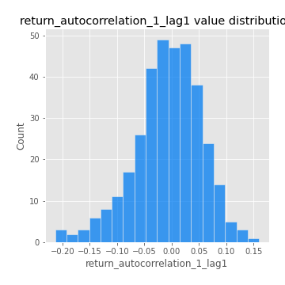
## Feature : return_autocorrelation_1_lag2
- **Feature type** : continous
- **Missing** : 0.0%
- **Unique** : 347
- **Count** :347.0
- **Mean** :-0.008946147648991605
- **Std** :0.04776901819267847
- **Min** :-0.1350566226854027
- **25%th Percentile** : -0.03812068869223399
- **50%th Percentile** : -0.005940674379237424
- **75%th Percentile** : 0.022026865129769584
- **Max** :0.1561488228015672

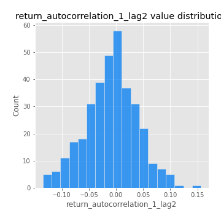
## Feature : return_autocorrelation_1_lag3
- **Feature type** : continous
- **Missing** : 0.0%
- **Unique** : 347
- **Count** :347.0
- **Mean** :-0.003685315699897845
- **Std** :0.050604014154738
- **Min** :-0.1940836867390813
- **25%th Percentile** : -0.03574924045323266
- **50%th Percentile** : -0.00219046174837161
- **75%th Percentile** : 0.029055966170572562
- **Max** :0.17805869530681923

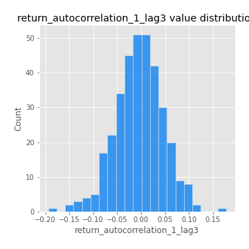
## Feature : return_autocorrelation_2_lag1
- **Feature type** : continous
- **Missing** : 0.0%
- **Unique** : 347
- **Count** :347.0
- **Mean** :-0.0014226633957954168
- **Std** :0.061235796609496296
- **Min** :-0.24590087874039124
- **25%th Percentile** : -0.03629836733920119
- **50%th Percentile** : 0.0015131510159630758
- **75%th Percentile** : 0.040813590441307494
- **Max** :0.1635282771704673

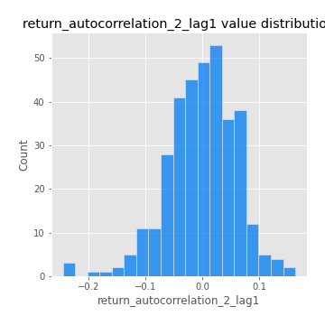
## Feature : return_autocorrelation_2_lag2
- **Feature type** : continous
- **Missing** : 0.0%
- **Unique** : 347
- **Count** :347.0
- **Mean** :0.004612094563841809
- **Std** :0.05306877331815516
- **Min** :-0.1495113937562178
- **25%th Percentile** : -0.03354504090835921
- **50%th Percentile** : 0.0019569070568863853
- **75%th Percentile** : 0.0395424487265105
- **Max** :0.1735398560230086

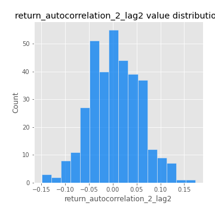
## Feature : return_autocorrelation_2_lag3
- **Feature type** : continous
- **Missing** : 0.0%
- **Unique** : 347
- **Count** :347.0
- **Mean** :0.006394693802840583
- **Std** :0.05180893398600172
- **Min** :-0.14200107169559698
- **25%th Percentile** : -0.025792271112387098
- **50%th Percentile** : 0.00915300817035177
- **75%th Percentile** : 0.038839049617112674
- **Max** :0.1419999376914021

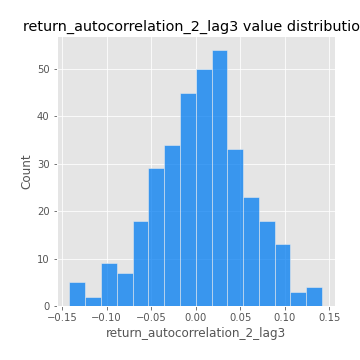
## Feature : return_correlation_ts1_lag_0
- **Feature type** : continous
- **Missing** : 0.0%
- **Unique** : 347
- **Count** :347.0
- **Mean** :0.3067349175558339
- **Std** :0.10997862366197027
- **Min** :-0.027089510445801036
- **25%th Percentile** : 0.24839807007462933
- **50%th Percentile** : 0.29500369092730705
- **75%th Percentile** : 0.35049210763132516
- **Max** :0.6949986865664105

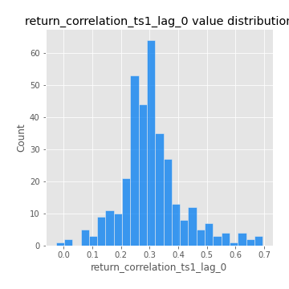
## Feature : return_correlation_ts1_lag_1
- **Feature type** : continous
- **Missing** : 0.0%
- **Unique** : 347
- **Count** :347.0
- **Mean** :-0.004314778161052085
- **Std** :0.051684472072417435
- **Min** :-0.16985510949917193
- **25%th Percentile** : -0.036797713070142346
- **50%th Percentile** : -0.0006259714753227789
- **75%th Percentile** : 0.03159637398614158
- **Max** :0.15499424718508623

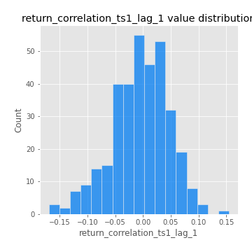
## Feature : return_correlation_ts1_lag_2
- **Feature type** : continous
- **Missing** : 0.0%
- **Unique** : 347
- **Count** :347.0
- **Mean** :-0.0020227485169414697
- **Std** :0.04805226428464685
- **Min** :-0.21653581047581763
- **25%th Percentile** : -0.03339479317768104
- **50%th Percentile** : -0.0037917112102554803
- **75%th Percentile** : 0.03190196287073034
- **Max** :0.18667690953481084

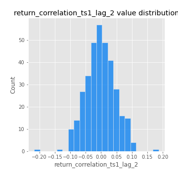
## Feature : return_correlation_ts1_lag_3
- **Feature type** : continous
- **Missing** : 0.0%
- **Unique** : 347
- **Count** :347.0
- **Mean** :0.001473777701018428
- **Std** :0.05107677102637911
- **Min** :-0.15349009935593283
- **25%th Percentile** : -0.033484238272945756
- **50%th Percentile** : -0.0011797960557162457
- **75%th Percentile** : 0.03515007236358275
- **Max** :0.1422809271770942

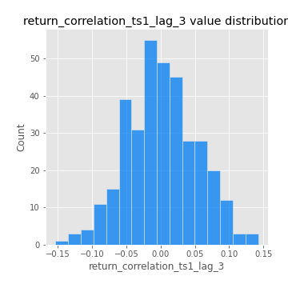
## Feature : return_correlation_ts2_lag_1
- **Feature type** : continous
- **Missing** : 0.0%
- **Unique** : 347
- **Count** :347.0
- **Mean** :-0.0017938729836621554
- **Std** :0.05100966101117403
- **Min** :-0.19671969155495325
- **25%th Percentile** : -0.031192549412347885
- **50%th Percentile** : 0.0003890490001213905
- **75%th Percentile** : 0.0284777928066521
- **Max** :0.17208763791364762

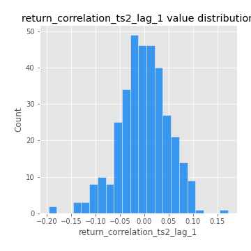
## Feature : return_correlation_ts2_lag_2
- **Feature type** : continous
- **Missing** : 0.0%
- **Unique** : 347
- **Count** :347.0
- **Mean** :0.002785758894169828
- **Std** :0.051128931573980525
- **Min** :-0.23751835475804678
- **25%th Percentile** : -0.02984439336270717
- **50%th Percentile** : 0.0022438124761268723
- **75%th Percentile** : 0.036207925519899986
- **Max** :0.20772887392904255

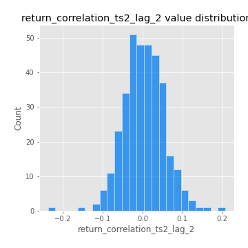
## Feature : return_correlation_ts2_lag_3
- **Feature type** : continous
- **Missing** : 0.0%
- **Unique** : 347
- **Count** :347.0
- **Mean** :0.0039430437203804005
- **Std** :0.05195774647999468
- **Min** :-0.17564076057312866
- **25%th Percentile** : -0.02541564902956496
- **50%th Percentile** : 0.0019087664851014457
- **75%th Percentile** : 0.036207669482122895
- **Max** :0.14786344217574862

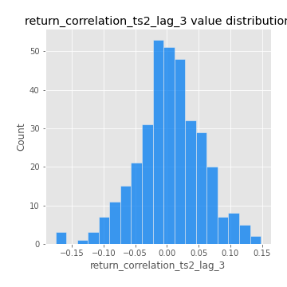
## Feature : sqreturn_autocorrelation_ts1_lag1
- **Feature type** : continous
- **Missing** : 0.0%
- **Unique** : 347
- **Count** :347.0
- **Mean** :0.04865647957852039
- **Std** :0.09250108518700523
- **Min** :-0.1365574081139565
- **25%th Percentile** : -0.01291364366654079
- **50%th Percentile** : 0.024672051494299494
- **75%th Percentile** : 0.08275441791374133
- **Max** :0.49414293176447355

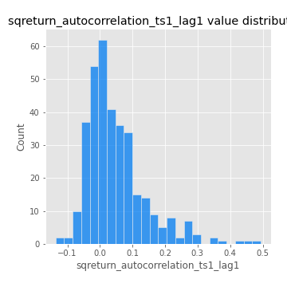
## Feature : sqreturn_autocorrelation_ts1_lag2
- **Feature type** : continous
- **Missing** : 0.0%
- **Unique** : 347
- **Count** :347.0
- **Mean** :0.03707872526511083
- **Std** :0.09109223573049799
- **Min** :-0.10748392189913747
- **25%th Percentile** : -0.016838829157733895
- **50%th Percentile** : 0.011828201307705363
- **75%th Percentile** : 0.06345437681927461
- **Max** :0.540735851444759

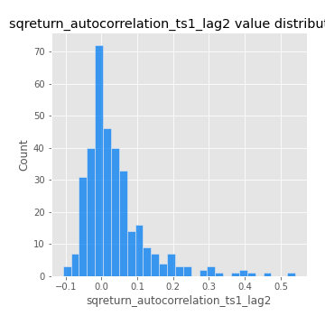
## Feature : sqreturn_autocorrelation_ts1_lag3
- **Feature type** : continous
- **Missing** : 0.0%
- **Unique** : 347
- **Count** :347.0
- **Mean** :0.028552934269785613
- **Std** :0.07803332205797202
- **Min** :-0.09934338534650729
- **25%th Percentile** : -0.020087204434254102
- **50%th Percentile** : 0.01101957142697562
- **75%th Percentile** : 0.0577572377738078
- **Max** :0.41030914918857014

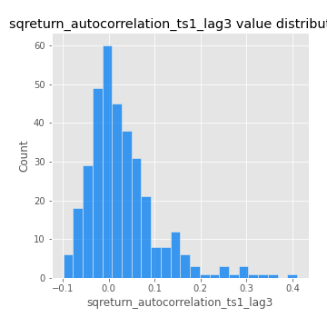
## Feature : sqreturn_autocorrelation_ts2_lag1
- **Feature type** : continous
- **Missing** : 0.0%
- **Unique** : 347
- **Count** :347.0
- **Mean** :0.042795067962516364
- **Std** :0.08838448700706357
- **Min** :-0.09361435014846729
- **25%th Percentile** : -0.015903443104593545
- **50%th Percentile** : 0.022297717058383494
- **75%th Percentile** : 0.07353819757056218
- **Max** :0.510085647437958

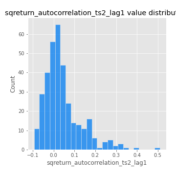
## Feature : sqreturn_autocorrelation_ts2_lag2
- **Feature type** : continous
- **Missing** : 0.0%
- **Unique** : 347
- **Count** :347.0
- **Mean** :0.039864910873717026
- **Std** :0.08794251891471551
- **Min** :-0.08030242759572197
- **25%th Percentile** : -0.015423776925563222
- **50%th Percentile** : 0.014690459213635845
- **75%th Percentile** : 0.06344978511346999
- **Max** :0.45676817892778204

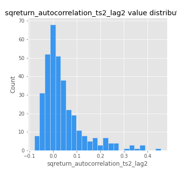
## Feature : sqreturn_autocorrelation_ts2_lag3
- **Feature type** : continous
- **Missing** : 0.0%
- **Unique** : 347
- **Count** :347.0
- **Mean** :0.025704735930901612
- **Std** :0.07099640569143054
- **Min** :-0.10635098042488793
- **25%th Percentile** : -0.01947556767865728
- **50%th Percentile** : 0.008697166087833361
- **75%th Percentile** : 0.04768407674055743
- **Max** :0.31225727797735664

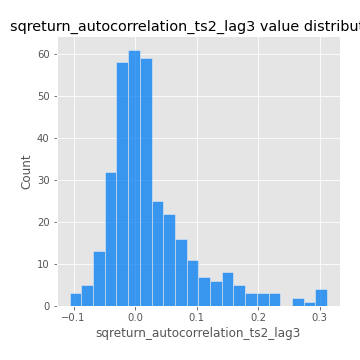
## Feature : sqreturn_correlation_ts1_lag_0
- **Feature type** : continous
- **Missing** : 0.0%
- **Unique** : 347
- **Count** :347.0
- **Mean** :0.3067349175558339
- **Std** :0.10997862366197027
- **Min** :-0.027089510445801036
- **25%th Percentile** : 0.24839807007462933
- **50%th Percentile** : 0.29500369092730705
- **75%th Percentile** : 0.35049210763132516
- **Max** :0.6949986865664105

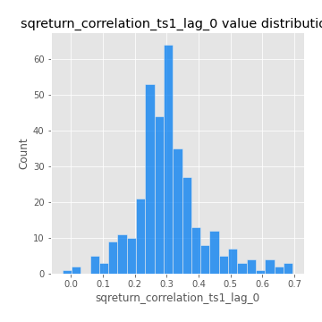
## Feature : sqreturn_correlation_ts1_lag_1
- **Feature type** : continous
- **Missing** : 0.0%
- **Unique** : 347
- **Count** :347.0
- **Mean** :-0.004314778161052085
- **Std** :0.051684472072417435
- **Min** :-0.16985510949917193
- **25%th Percentile** : -0.036797713070142346
- **50%th Percentile** : -0.0006259714753227789
- **75%th Percentile** : 0.03159637398614158
- **Max** :0.15499424718508623

## Feature : sqreturn_correlation_ts1_lag_2
- **Feature type** : continous
- **Missing** : 0.0%
- **Unique** : 347
- **Count** :347.0
- **Mean** :-0.0020227485169414697
- **Std** :0.04805226428464685
- **Min** :-0.21653581047581763
- **25%th Percentile** : -0.03339479317768104
- **50%th Percentile** : -0.0037917112102554803
- **75%th Percentile** : 0.03190196287073034
- **Max** :0.18667690953481084

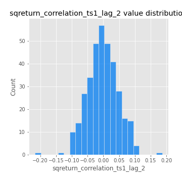
## Feature : sqreturn_correlation_ts1_lag_3
- **Feature type** : continous
- **Missing** : 0.0%
- **Unique** : 347
- **Count** :347.0
- **Mean** :0.001473777701018428
- **Std** :0.05107677102637911
- **Min** :-0.15349009935593283
- **25%th Percentile** : -0.033484238272945756
- **50%th Percentile** : -0.0011797960557162457
- **75%th Percentile** : 0.03515007236358275
- **Max** :0.1422809271770942

## Feature : sqreturn_correlation_ts2_lag_1
- **Feature type** : continous
- **Missing** : 0.0%
- **Unique** : 347
- **Count** :347.0
- **Mean** :-0.0017938729836621554
- **Std** :0.05100966101117403
- **Min** :-0.19671969155495325
- **25%th Percentile** : -0.031192549412347885
- **50%th Percentile** : 0.0003890490001213905
- **75%th Percentile** : 0.0284777928066521
- **Max** :0.17208763791364762

## Feature : sqreturn_correlation_ts2_lag_2
- **Feature type** : continous
- **Missing** : 0.0%
- **Unique** : 347
- **Count** :347.0
- **Mean** :0.002785758894169828
- **Std** :0.051128931573980525
- **Min** :-0.23751835475804678
- **25%th Percentile** : -0.02984439336270717
- **50%th Percentile** : 0.0022438124761268723
- **75%th Percentile** : 0.036207925519899986
- **Max** :0.20772887392904255

## Feature : sqreturn_correlation_ts2_lag_3
- **Feature type** : continous
- **Missing** : 0.0%
- **Unique** : 347
- **Count** :347.0
- **Mean** :0.0039430437203804005
- **Std** :0.05195774647999468
- **Min** :-0.17564076057312866
- **25%th Percentile** : -0.02541564902956496
- **50%th Percentile** : 0.0019087664851014457
- **75%th Percentile** : 0.036207669482122895
- **Max** :0.14786344217574862

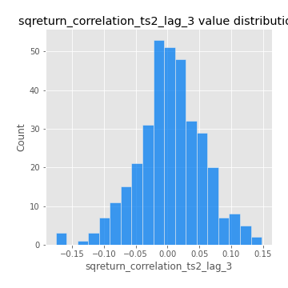
## Feature : price2_granger_cause_price1
- **Feature type** : continous
- **Missing** : 0.0%
- **Unique** : 347
- **Count** :347.0
- **Mean** :0.30213749956113
- **Std** :0.3017661248660839
- **Min** :1.1505642493585304e-05
- **25%th Percentile** : 0.035379133578929245
- **50%th Percentile** : 0.17758272551302354
- **75%th Percentile** : 0.52577615846594
- **Max** :0.9969436927402517

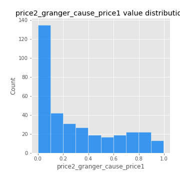
## Feature : price1_granger_cause_price2
- **Feature type** : continous
- **Missing** : 0.0%
- **Unique** : 347
- **Count** :347.0
- **Mean** :0.2577146156239901
- **Std** :0.27648185469553394
- **Min** :2.427753255846166e-10
- **25%th Percentile** : 0.02057057701998512
- **50%th Percentile** : 0.16288704441121643
- **75%th Percentile** : 0.4103418892868986
- **Max** :0.9951398266867577

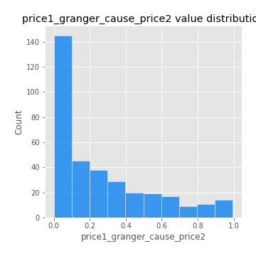

[<< Go back](../README.md)
