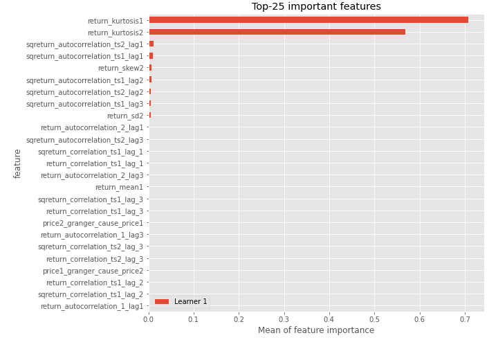
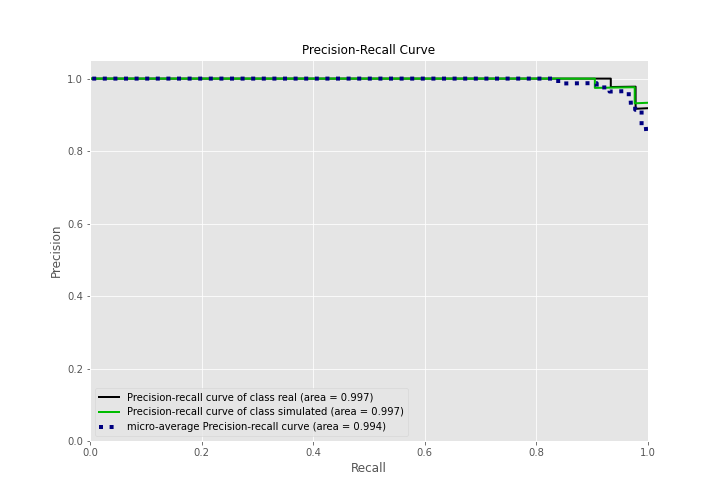

# Summary of 3_Linear

[<< Go back](../README.md)

## Logistic Regression (Linear)
- **n_jobs**: -1
- **explain_level**: 2

## Validation
 - **validation_type**: split
 - **train_ratio**: 0.75
 - **shuffle**: True
 - **stratify**: True

## Optimized metric
accuracy

## Training time

11.0 seconds

## Metric details
|           |    score |     threshold |
|:----------|---------:|--------------:|
| logloss   | 0.15578  | nan           |
| auc       | 0.996825 | nan           |
| f1        | 0.97619  |   0.657979    |
| accuracy  | 0.977011 |   0.657979    |
| precision | 1        |   0.899868    |
| recall    | 1        |   1.04618e-25 |
| mcc       | 0.953968 |   0.657979    |

## Confusion matrix (at threshold=0.657979)
|                      |   Predicted as real |   Predicted as simulated |
|:---------------------|--------------------:|-------------------------:|
| Labeled as real      |                  44 |                        1 |
| Labeled as simulated |                   1 |                       41 |

## Learning curves

## Coefficients
| feature                           |   Learner_1 |
|:----------------------------------|------------:|
| return_autocorrelation_2_lag2     |   0.703456  |
| return_autocorrelation_2_lag3     |   0.635442  |
| return_autocorrelation_2_lag1     |   0.63029   |
| return_autocorrelation_1_lag3     |   0.474909  |
| return_correlation_ts2_lag_1      |   0.416467  |
| sqreturn_correlation_ts2_lag_1    |   0.416467  |
| return_autocorrelation_1_lag1     |   0.403361  |
| sqreturn_correlation_ts1_lag_1    |   0.370904  |
| return_correlation_ts1_lag_1      |   0.370904  |
| sqreturn_correlation_ts1_lag_3    |   0.327472  |
| return_correlation_ts1_lag_3      |   0.327472  |
| sqreturn_correlation_ts2_lag_3    |   0.284487  |
| return_correlation_ts2_lag_3      |   0.284487  |
| return_correlation_ts1_lag_2      |   0.281713  |
| sqreturn_correlation_ts1_lag_2    |   0.281713  |
| return_skew2                      |   0.272097  |
| return_autocorrelation_1_lag2     |   0.195196  |
| sqreturn_correlation_ts2_lag_2    |   0.075523  |
| return_correlation_ts2_lag_2      |   0.075523  |
| return_skew1                      |   0.0467253 |
| return_mean2                      |   0.0139786 |
| return_sd1                        |  -0.0609755 |
| price2_granger_cause_price1       |  -0.0739564 |
| price1_granger_cause_price2       |  -0.154513  |
| return_sd2                        |  -0.239281  |
| sqreturn_correlation_ts1_lag_0    |  -0.260878  |
| return_correlation_ts1_lag_0      |  -0.260878  |
| return_mean1                      |  -0.610273  |
| sqreturn_autocorrelation_ts2_lag3 |  -0.665848  |
| sqreturn_autocorrelation_ts2_lag2 |  -0.867881  |
| sqreturn_autocorrelation_ts1_lag3 |  -0.918575  |
| sqreturn_autocorrelation_ts1_lag2 |  -1.26724   |
| intercept                         |  -1.30752   |
| sqreturn_autocorrelation_ts1_lag1 |  -1.3767    |
| sqreturn_autocorrelation_ts2_lag1 |  -1.55623   |
| return_kurtosis2                  |  -2.89297   |
| return_kurtosis1                  |  -3.94834   |

## Permutation-based Importance

## Confusion Matrix

## Normalized Confusion Matrix

## ROC Curve

## Kolmogorov-Smirnov Statistic

## Precision-Recall Curve

## Calibration Curve

## Cumulative Gains Curve

## Lift Curve

## SHAP Importance

## SHAP Dependence plots

### Dependence (Fold 1)

## SHAP Decision plots

### Top-10 Worst decisions for class 0 (Fold 1)

### Top-10 Best decisions for class 0 (Fold 1)

### Top-10 Worst decisions for class 1 (Fold 1)

### Top-10 Best decisions for class 1 (Fold 1)

[<< Go back](../README.md)
