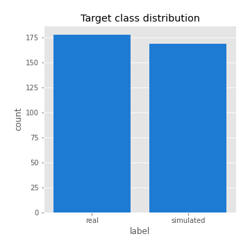
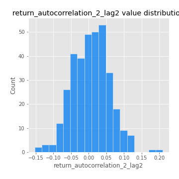
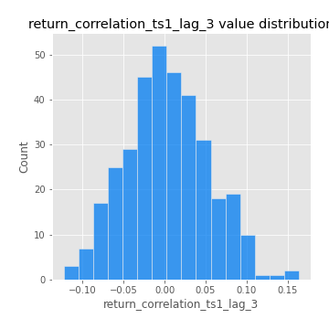
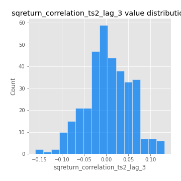

# Exploratory Data Analysis

[<< Go back](../README.md)
## Feature : target
- **Feature type** : categorical
- **Missing** : 0.0%
- **Unique** : 2
- **Count** :347
- **Unique** :2
- **Top** :real
- **Freq** :178

## Feature : return_mean1
- **Feature type** : continous
- **Missing** : 0.0%
- **Unique** : 347
- **Count** :347.0
- **Mean** :0.034942696845834044
- **Std** :0.07608028522378694
- **Min** :-0.22632637961920957
- **25%th Percentile** : -0.011436760881654698
- **50%th Percentile** : 0.038289859150597884
- **75%th Percentile** : 0.0825769060772969
- **Max** :0.37175100008111034

## Feature : return_mean2
- **Feature type** : continous
- **Missing** : 0.0%
- **Unique** : 347
- **Count** :347.0
- **Mean** :0.06953868541691458
- **Std** :0.09380334527943567
- **Min** :-0.21818165578778434
- **25%th Percentile** : 0.018395795902104897
- **50%th Percentile** : 0.064450311397576
- **75%th Percentile** : 0.12151929223918798
- **Max** :0.4507366625939755

## Feature : return_sd1
- **Feature type** : continous
- **Missing** : 0.0%
- **Unique** : 347
- **Count** :347.0
- **Mean** :1.6960372618067816
- **Std** :0.7845167388506274
- **Min** :0.7620831696941981
- **25%th Percentile** : 1.4096521008825564
- **50%th Percentile** : 1.4839471739666221
- **75%th Percentile** : 1.6279934750438578
- **Max** :9.236766377527575

## Feature : return_sd2
- **Feature type** : continous
- **Missing** : 0.0%
- **Unique** : 347
- **Count** :347.0
- **Mean** :1.7299227813355476
- **Std** :0.631803147290206
- **Min** :0.8455946193085045
- **25%th Percentile** : 1.4868763041112412
- **50%th Percentile** : 1.5622089217080786
- **75%th Percentile** : 1.6794732463902866
- **Max** :5.642692356880054

## Feature : return_skew1
- **Feature type** : continous
- **Missing** : 0.0%
- **Unique** : 347
- **Count** :347.0
- **Mean** :-0.1265587643409048
- **Std** :0.5900276746560214
- **Min** :-3.453087436558107
- **25%th Percentile** : -0.25893578663072214
- **50%th Percentile** : -0.07565353511381159
- **75%th Percentile** : 0.09441536163189707
- **Max** :2.5845963767725557

## Feature : return_skew2
- **Feature type** : continous
- **Missing** : 0.0%
- **Unique** : 347
- **Count** :347.0
- **Mean** :-0.21263459341790752
- **Std** :0.8517159595013449
- **Min** :-8.801502855292393
- **25%th Percentile** : -0.3141838035801744
- **50%th Percentile** : -0.10027383381882603
- **75%th Percentile** : 0.06531273392747322
- **Max** :2.242019525651531

## Feature : return_kurtosis1
- **Feature type** : continous
- **Missing** : 0.0%
- **Unique** : 347
- **Count** :347.0
- **Mean** :3.410595171253112
- **Std** :5.959501207141609
- **Min** :-0.4058061708846017
- **25%th Percentile** : 0.23637736503598084
- **50%th Percentile** : 0.9932921214361419
- **75%th Percentile** : 3.749242555655367
- **Max** :46.07507808162177

## Feature : return_kurtosis2
- **Feature type** : continous
- **Missing** : 0.0%
- **Unique** : 347
- **Count** :347.0
- **Mean** :4.552813547344886
- **Std** :10.510259258071134
- **Min** :-0.24395926959413128
- **25%th Percentile** : 0.5666017617155594
- **50%th Percentile** : 1.6004004004498182
- **75%th Percentile** : 4.414084267509514
- **Max** :143.10871011533666

## Feature : return_autocorrelation_1_lag1
- **Feature type** : continous
- **Missing** : 0.0%
- **Unique** : 347
- **Count** :347.0
- **Mean** :-0.013696151489912378
- **Std** :0.057858782014325094
- **Min** :-0.2135576224968752
- **25%th Percentile** : -0.04442694673879602
- **50%th Percentile** : -0.00781808521691053
- **75%th Percentile** : 0.023844838620944248
- **Max** :0.12810656890648087

## Feature : return_autocorrelation_1_lag2
- **Feature type** : continous
- **Missing** : 0.0%
- **Unique** : 347
- **Count** :347.0
- **Mean** :-0.004146543218413617
- **Std** :0.05040391005067067
- **Min** :-0.13832079347887766
- **25%th Percentile** : -0.03589930318154413
- **50%th Percentile** : -0.004161265657534505
- **75%th Percentile** : 0.02784729997984629
- **Max** :0.13553587149024285

## Feature : return_autocorrelation_1_lag3
- **Feature type** : continous
- **Missing** : 0.0%
- **Unique** : 347
- **Count** :347.0
- **Mean** :0.0002547911595930696
- **Std** :0.05195132184624891
- **Min** :-0.1940836867390813
- **25%th Percentile** : -0.03460613904858952
- **50%th Percentile** : 0.002315771126049012
- **75%th Percentile** : 0.034480531536619674
- **Max** :0.12562037222729094

## Feature : return_autocorrelation_2_lag1
- **Feature type** : continous
- **Missing** : 0.0%
- **Unique** : 347
- **Count** :347.0
- **Mean** :0.0007985237627438179
- **Std** :0.06336716595699368
- **Min** :-0.24265814531706406
- **25%th Percentile** : -0.034537402655781244
- **50%th Percentile** : 0.00921713081363506
- **75%th Percentile** : 0.04111683897538261
- **Max** :0.31863413537898483

## Feature : return_autocorrelation_2_lag2
- **Feature type** : continous
- **Missing** : 0.0%
- **Unique** : 347
- **Count** :347.0
- **Mean** :0.006015862448124006
- **Std** :0.053160509272140444
- **Min** :-0.15323211089747296
- **25%th Percentile** : -0.03229903147758964
- **50%th Percentile** : 0.005804242264434992
- **75%th Percentile** : 0.04119443236242194
- **Max** :0.20974504043791217

## Feature : return_autocorrelation_2_lag3
- **Feature type** : continous
- **Missing** : 0.0%
- **Unique** : 347
- **Count** :347.0
- **Mean** :0.005580940124531544
- **Std** :0.050604653359909456
- **Min** :-0.14200107169559698
- **25%th Percentile** : -0.028469291325671407
- **50%th Percentile** : 0.0056717809608835545
- **75%th Percentile** : 0.03821218867019743
- **Max** :0.1584823338120986

## Feature : return_correlation_ts1_lag_0
- **Feature type** : continous
- **Missing** : 0.0%
- **Unique** : 347
- **Count** :347.0
- **Mean** :0.29959484009254955
- **Std** :0.10472682859263095
- **Min** :-0.027089510445801036
- **25%th Percentile** : 0.2486732231923754
- **50%th Percentile** : 0.2911324584934892
- **75%th Percentile** : 0.34165259838609763
- **Max** :0.7028422087350163

## Feature : return_correlation_ts1_lag_1
- **Feature type** : continous
- **Missing** : 0.0%
- **Unique** : 347
- **Count** :347.0
- **Mean** :-0.003532209850392249
- **Std** :0.054887727350885346
- **Min** :-0.16985510949917193
- **25%th Percentile** : -0.03884371450054926
- **50%th Percentile** : 0.000401174020455929
- **75%th Percentile** : 0.0339101888572287
- **Max** :0.15499424718508623

## Feature : return_correlation_ts1_lag_2
- **Feature type** : continous
- **Missing** : 0.0%
- **Unique** : 347
- **Count** :347.0
- **Mean** :0.005291613320413874
- **Std** :0.05024184276068487
- **Min** :-0.21653581047581763
- **25%th Percentile** : -0.03126101149718206
- **50%th Percentile** : 0.008883116788328189
- **75%th Percentile** : 0.04128136000077239
- **Max** :0.1496811945849466

## Feature : return_correlation_ts1_lag_3
- **Feature type** : continous
- **Missing** : 0.0%
- **Unique** : 347
- **Count** :347.0
- **Mean** :0.0025189434403113256
- **Std** :0.05044290578184948
- **Min** :-0.12306593817498207
- **25%th Percentile** : -0.029502559956771576
- **50%th Percentile** : -0.0014573215147489639
- **75%th Percentile** : 0.03529366510220912
- **Max** :0.1636773216468148

## Feature : return_correlation_ts2_lag_1
- **Feature type** : continous
- **Missing** : 0.0%
- **Unique** : 347
- **Count** :347.0
- **Mean** :-0.006182156878396216
- **Std** :0.0543349280762978
- **Min** :-0.2081139431093261
- **25%th Percentile** : -0.03868255914944284
- **50%th Percentile** : -0.006374566986219646
- **75%th Percentile** : 0.03061651640190941
- **Max** :0.17208763791364762

## Feature : return_correlation_ts2_lag_2
- **Feature type** : continous
- **Missing** : 0.0%
- **Unique** : 347
- **Count** :347.0
- **Mean** :0.0037109737965604415
- **Std** :0.051600468093749595
- **Min** :-0.23751835475804678
- **25%th Percentile** : -0.030707199535674336
- **50%th Percentile** : 0.0033674644272991545
- **75%th Percentile** : 0.03801390624266706
- **Max** :0.15388933426238696

## Feature : return_correlation_ts2_lag_3
- **Feature type** : continous
- **Missing** : 0.0%
- **Unique** : 347
- **Count** :347.0
- **Mean** :0.0037648569901074383
- **Std** :0.05127737970543468
- **Min** :-0.1603001201932561
- **25%th Percentile** : -0.02708196756723281
- **50%th Percentile** : 0.0006576157053855357
- **75%th Percentile** : 0.04014031843948451
- **Max** :0.13128380114518473

## Feature : sqreturn_autocorrelation_ts1_lag1
- **Feature type** : continous
- **Missing** : 0.0%
- **Unique** : 347
- **Count** :347.0
- **Mean** :0.046985350255379636
- **Std** :0.08832581698598249
- **Min** :-0.10483546126742294
- **25%th Percentile** : -0.009600468612146706
- **50%th Percentile** : 0.024576227693308285
- **75%th Percentile** : 0.08389693547723884
- **Max** :0.49414293176447355

## Feature : sqreturn_autocorrelation_ts1_lag2
- **Feature type** : continous
- **Missing** : 0.0%
- **Unique** : 347
- **Count** :347.0
- **Mean** :0.040658103636914
- **Std** :0.08647037735340381
- **Min** :-0.10034664802701573
- **25%th Percentile** : -0.013748510984416071
- **50%th Percentile** : 0.018703641323639074
- **75%th Percentile** : 0.06572588147611967
- **Max** :0.42719220751700526

## Feature : sqreturn_autocorrelation_ts1_lag3
- **Feature type** : continous
- **Missing** : 0.0%
- **Unique** : 347
- **Count** :347.0
- **Mean** :0.03343361019335976
- **Std** :0.07579283799512807
- **Min** :-0.08910525642573566
- **25%th Percentile** : -0.013058764918648335
- **50%th Percentile** : 0.015316245804430995
- **75%th Percentile** : 0.0577572377738078
- **Max** :0.44755937369538146

## Feature : sqreturn_autocorrelation_ts2_lag1
- **Feature type** : continous
- **Missing** : 0.0%
- **Unique** : 347
- **Count** :347.0
- **Mean** :0.045411487683196694
- **Std** :0.08964632654892396
- **Min** :-0.08986237198216253
- **25%th Percentile** : -0.011902538477324252
- **50%th Percentile** : 0.025064663625994105
- **75%th Percentile** : 0.07738641367115157
- **Max** :0.510085647437958

## Feature : sqreturn_autocorrelation_ts2_lag2
- **Feature type** : continous
- **Missing** : 0.0%
- **Unique** : 347
- **Count** :347.0
- **Mean** :0.03497081228900712
- **Std** :0.08416932052289898
- **Min** :-0.09278853105265185
- **25%th Percentile** : -0.012660432790790915
- **50%th Percentile** : 0.012367098888812732
- **75%th Percentile** : 0.05517721998204757
- **Max** :0.5373432415582473

## Feature : sqreturn_autocorrelation_ts2_lag3
- **Feature type** : continous
- **Missing** : 0.0%
- **Unique** : 347
- **Count** :347.0
- **Mean** :0.027168181059194427
- **Std** :0.06818428338724997
- **Min** :-0.08473487767381851
- **25%th Percentile** : -0.01595969024705779
- **50%th Percentile** : 0.010674848682306184
- **75%th Percentile** : 0.049680039141085715
- **Max** :0.30256115637327263

## Feature : sqreturn_correlation_ts1_lag_0
- **Feature type** : continous
- **Missing** : 0.0%
- **Unique** : 347
- **Count** :347.0
- **Mean** :0.29959484009254955
- **Std** :0.10472682859263095
- **Min** :-0.027089510445801036
- **25%th Percentile** : 0.2486732231923754
- **50%th Percentile** : 0.2911324584934892
- **75%th Percentile** : 0.34165259838609763
- **Max** :0.7028422087350163

## Feature : sqreturn_correlation_ts1_lag_1
- **Feature type** : continous
- **Missing** : 0.0%
- **Unique** : 347
- **Count** :347.0
- **Mean** :-0.003532209850392249
- **Std** :0.054887727350885346
- **Min** :-0.16985510949917193
- **25%th Percentile** : -0.03884371450054926
- **50%th Percentile** : 0.000401174020455929
- **75%th Percentile** : 0.0339101888572287
- **Max** :0.15499424718508623

## Feature : sqreturn_correlation_ts1_lag_2
- **Feature type** : continous
- **Missing** : 0.0%
- **Unique** : 347
- **Count** :347.0
- **Mean** :0.005291613320413874
- **Std** :0.05024184276068487
- **Min** :-0.21653581047581763
- **25%th Percentile** : -0.03126101149718206
- **50%th Percentile** : 0.008883116788328189
- **75%th Percentile** : 0.04128136000077239
- **Max** :0.1496811945849466

## Feature : sqreturn_correlation_ts1_lag_3
- **Feature type** : continous
- **Missing** : 0.0%
- **Unique** : 347
- **Count** :347.0
- **Mean** :0.0025189434403113256
- **Std** :0.05044290578184948
- **Min** :-0.12306593817498207
- **25%th Percentile** : -0.029502559956771576
- **50%th Percentile** : -0.0014573215147489639
- **75%th Percentile** : 0.03529366510220912
- **Max** :0.1636773216468148

## Feature : sqreturn_correlation_ts2_lag_1
- **Feature type** : continous
- **Missing** : 0.0%
- **Unique** : 347
- **Count** :347.0
- **Mean** :-0.006182156878396216
- **Std** :0.0543349280762978
- **Min** :-0.2081139431093261
- **25%th Percentile** : -0.03868255914944284
- **50%th Percentile** : -0.006374566986219646
- **75%th Percentile** : 0.03061651640190941
- **Max** :0.17208763791364762

## Feature : sqreturn_correlation_ts2_lag_2
- **Feature type** : continous
- **Missing** : 0.0%
- **Unique** : 347
- **Count** :347.0
- **Mean** :0.0037109737965604415
- **Std** :0.051600468093749595
- **Min** :-0.23751835475804678
- **25%th Percentile** : -0.030707199535674336
- **50%th Percentile** : 0.0033674644272991545
- **75%th Percentile** : 0.03801390624266706
- **Max** :0.15388933426238696

## Feature : sqreturn_correlation_ts2_lag_3
- **Feature type** : continous
- **Missing** : 0.0%
- **Unique** : 347
- **Count** :347.0
- **Mean** :0.0037648569901074383
- **Std** :0.05127737970543468
- **Min** :-0.1603001201932561
- **25%th Percentile** : -0.02708196756723281
- **50%th Percentile** : 0.0006576157053855357
- **75%th Percentile** : 0.04014031843948451
- **Max** :0.13128380114518473

## Feature : price2_granger_cause_price1
- **Feature type** : continous
- **Missing** : 0.0%
- **Unique** : 347
- **Count** :347.0
- **Mean** :0.3067565589170984
- **Std** :0.30373516637408776
- **Min** :1.1505642493585304e-05
- **25%th Percentile** : 0.027166848091940803
- **50%th Percentile** : 0.21304524344450712
- **75%th Percentile** : 0.5435611588073075
- **Max** :0.9964084179953795

## Feature : price1_granger_cause_price2
- **Feature type** : continous
- **Missing** : 0.0%
- **Unique** : 347
- **Count** :347.0
- **Mean** :0.2768595274039175
- **Std** :0.27939097654290035
- **Min** :3.932431842699112e-08
- **25%th Percentile** : 0.033245192026455705
- **50%th Percentile** : 0.18343299492376408
- **75%th Percentile** : 0.4544268795012806
- **Max** :0.9951398266867577

[<< Go back](../README.md)
