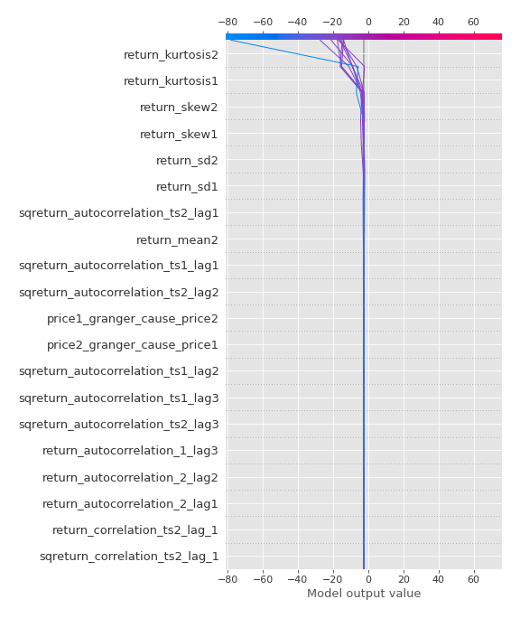

# Summary of 3_Linear

[<< Go back](../README.md)

## Logistic Regression (Linear)
- **n_jobs**: -1
- **explain_level**: 2

## Validation
 - **validation_type**: split
 - **train_ratio**: 0.75
 - **shuffle**: True
 - **stratify**: True

## Optimized metric
accuracy

## Training time

5.1 seconds

## Metric details
|           |   score |     threshold |
|:----------|--------:|--------------:|
| logloss   | 0.12005 | nan           |
| auc       | 1       | nan           |
| f1        | 1       |   0.796821    |
| accuracy  | 1       |   0.796821    |
| precision | 1       |   0.862927    |
| recall    | 1       |   1.01264e-34 |
| mcc       | 1       |   0.796821    |

## Confusion matrix (at threshold=0.796821)
|                      |   Predicted as real |   Predicted as simulated |
|:---------------------|--------------------:|-------------------------:|
| Labeled as real      |                  45 |                        0 |
| Labeled as simulated |                   0 |                       42 |

## Learning curves

## Coefficients
| feature                           |   Learner_1 |
|:----------------------------------|------------:|
| return_skew2                      |   0.477554  |
| sqreturn_correlation_ts2_lag_1    |   0.400037  |
| return_correlation_ts2_lag_1      |   0.400037  |
| return_autocorrelation_1_lag3     |   0.368193  |
| return_autocorrelation_2_lag1     |   0.366487  |
| return_autocorrelation_2_lag2     |   0.357907  |
| return_autocorrelation_2_lag3     |   0.338028  |
| return_skew1                      |   0.305323  |
| return_autocorrelation_1_lag1     |   0.232361  |
| sqreturn_correlation_ts2_lag_3    |   0.220229  |
| return_correlation_ts2_lag_3      |   0.220229  |
| return_sd1                        |   0.216951  |
| return_correlation_ts1_lag_2      |   0.179596  |
| sqreturn_correlation_ts1_lag_2    |   0.179596  |
| sqreturn_correlation_ts1_lag_3    |   0.177118  |
| return_correlation_ts1_lag_3      |   0.177118  |
| return_correlation_ts1_lag_1      |   0.170697  |
| sqreturn_correlation_ts1_lag_1    |   0.170697  |
| return_autocorrelation_1_lag2     |   0.153186  |
| price2_granger_cause_price1       |   0.149857  |
| return_correlation_ts2_lag_2      |   0.0393938 |
| sqreturn_correlation_ts2_lag_2    |   0.0393938 |
| return_correlation_ts1_lag_0      |  -0.0481996 |
| sqreturn_correlation_ts1_lag_0    |  -0.0481996 |
| return_mean1                      |  -0.238632  |
| price1_granger_cause_price2       |  -0.24235   |
| return_sd2                        |  -0.275054  |
| return_mean2                      |  -0.47554   |
| sqreturn_autocorrelation_ts2_lag3 |  -0.583979  |
| sqreturn_autocorrelation_ts1_lag3 |  -0.898338  |
| sqreturn_autocorrelation_ts2_lag2 |  -0.944534  |
| sqreturn_autocorrelation_ts1_lag2 |  -0.977475  |
| sqreturn_autocorrelation_ts1_lag1 |  -1.10082   |
| sqreturn_autocorrelation_ts2_lag1 |  -1.13975   |
| intercept                         |  -1.85702   |
| return_kurtosis2                  |  -3.92376   |
| return_kurtosis1                  |  -3.99327   |

## Permutation-based Importance

## Confusion Matrix

## Normalized Confusion Matrix

## ROC Curve

## Kolmogorov-Smirnov Statistic

## Precision-Recall Curve

## Calibration Curve

## Cumulative Gains Curve

## Lift Curve

## SHAP Importance

## SHAP Dependence plots

### Dependence (Fold 1)

## SHAP Decision plots

### Top-10 Worst decisions for class 0 (Fold 1)

### Top-10 Best decisions for class 0 (Fold 1)

### Top-10 Worst decisions for class 1 (Fold 1)

### Top-10 Best decisions for class 1 (Fold 1)

[<< Go back](../README.md)
