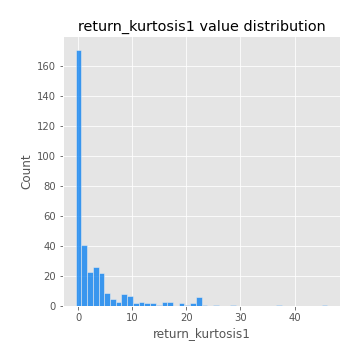
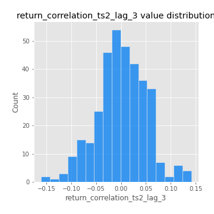

# Exploratory Data Analysis

[<< Go back](../README.md)
## Feature : target
- **Feature type** : categorical
- **Missing** : 0.0%
- **Unique** : 2
- **Count** :347
- **Unique** :2
- **Top** :real
- **Freq** :178

## Feature : return_mean1
- **Feature type** : continous
- **Missing** : 0.0%
- **Unique** : 347
- **Count** :347.0
- **Mean** :0.04330383783522497
- **Std** :0.0771831127550573
- **Min** :-0.22632637961920957
- **25%th Percentile** : -0.006513768547882556
- **50%th Percentile** : 0.04607495550948149
- **75%th Percentile** : 0.08496143487490335
- **Max** :0.37175100008111034

## Feature : return_mean2
- **Feature type** : continous
- **Missing** : 0.0%
- **Unique** : 347
- **Count** :347.0
- **Mean** :0.05107105278686418
- **Std** :0.09105630050421701
- **Min** :-0.21818165578778434
- **25%th Percentile** : -0.00026029485251045264
- **50%th Percentile** : 0.05400363030829556
- **75%th Percentile** : 0.09725550353662826
- **Max** :0.3949612452243691

## Feature : return_sd1
- **Feature type** : continous
- **Missing** : 0.0%
- **Unique** : 347
- **Count** :347.0
- **Mean** :1.756822590418459
- **Std** :0.769297288128807
- **Min** :0.7620831696941981
- **25%th Percentile** : 1.523016587157214
- **50%th Percentile** : 1.5946593583910935
- **75%th Percentile** : 1.6831403265472988
- **Max** :9.236766377527575

## Feature : return_sd2
- **Feature type** : continous
- **Missing** : 0.0%
- **Unique** : 347
- **Count** :347.0
- **Mean** :1.7469765799958548
- **Std** :0.6270062050837947
- **Min** :0.8455946193085045
- **25%th Percentile** : 1.5154484994027198
- **50%th Percentile** : 1.5942697669989783
- **75%th Percentile** : 1.6849014671492126
- **Max** :5.642692356880054

## Feature : return_skew1
- **Feature type** : continous
- **Missing** : 0.0%
- **Unique** : 347
- **Count** :347.0
- **Mean** :-0.09961642831316564
- **Std** :0.5894837416568484
- **Min** :-3.453087436558107
- **25%th Percentile** : -0.17969228745743965
- **50%th Percentile** : -0.03119892782271134
- **75%th Percentile** : 0.1016894364462726
- **Max** :2.5845963767725557

## Feature : return_skew2
- **Feature type** : continous
- **Missing** : 0.0%
- **Unique** : 347
- **Count** :347.0
- **Mean** :-0.19025965632373742
- **Std** :0.8467569173008823
- **Min** :-8.801502855292393
- **25%th Percentile** : -0.24997546702811635
- **50%th Percentile** : -0.05054498088446917
- **75%th Percentile** : 0.07147305637208502
- **Max** :2.242019525651531

## Feature : return_kurtosis1
- **Feature type** : continous
- **Missing** : 0.0%
- **Unique** : 347
- **Count** :347.0
- **Mean** :3.2688066248328678
- **Std** :6.0295797113244145
- **Min** :-0.4422273381036761
- **25%th Percentile** : 0.00811207767227784
- **50%th Percentile** : 0.6794378843447575
- **75%th Percentile** : 3.749242555655367
- **Max** :46.07507808162177

## Feature : return_kurtosis2
- **Feature type** : continous
- **Missing** : 0.0%
- **Unique** : 347
- **Count** :347.0
- **Mean** :4.181238092030892
- **Std** :10.638346107833506
- **Min** :-0.47558579610476404
- **25%th Percentile** : -0.04396210836147185
- **50%th Percentile** : 0.6208695975279284
- **75%th Percentile** : 4.393039424201936
- **Max** :143.10871011533666

## Feature : return_autocorrelation_1_lag1
- **Feature type** : continous
- **Missing** : 0.0%
- **Unique** : 347
- **Count** :347.0
- **Mean** :-0.014018355235874365
- **Std** :0.05720245721774772
- **Min** :-0.2135576224968752
- **25%th Percentile** : -0.04008020516183414
- **50%th Percentile** : -0.007189735421780038
- **75%th Percentile** : 0.021951560238742437
- **Max** :0.12810656890648087

## Feature : return_autocorrelation_1_lag2
- **Feature type** : continous
- **Missing** : 0.0%
- **Unique** : 347
- **Count** :347.0
- **Mean** :-0.004898998015436655
- **Std** :0.050209493283561314
- **Min** :-0.12172858720259
- **25%th Percentile** : -0.036890448744505186
- **50%th Percentile** : -0.006619091921571229
- **75%th Percentile** : 0.029177853059659267
- **Max** :0.13553587149024285

## Feature : return_autocorrelation_1_lag3
- **Feature type** : continous
- **Missing** : 0.0%
- **Unique** : 347
- **Count** :347.0
- **Mean** :-0.0016233077013720375
- **Std** :0.05193814836055836
- **Min** :-0.1940836867390813
- **25%th Percentile** : -0.03564888149764854
- **50%th Percentile** : -0.0006017800023255181
- **75%th Percentile** : 0.03571680273346087
- **Max** :0.12303557809998283

## Feature : return_autocorrelation_2_lag1
- **Feature type** : continous
- **Missing** : 0.0%
- **Unique** : 347
- **Count** :347.0
- **Mean** :-0.008506787335321165
- **Std** :0.059888314236598295
- **Min** :-0.24265814531706406
- **25%th Percentile** : -0.04320423253450835
- **50%th Percentile** : -0.006446843573942762
- **75%th Percentile** : 0.027866129706058593
- **Max** :0.31863413537898483

## Feature : return_autocorrelation_2_lag2
- **Feature type** : continous
- **Missing** : 0.0%
- **Unique** : 347
- **Count** :347.0
- **Mean** :-0.00019803897581358376
- **Std** :0.050585888419255175
- **Min** :-0.15323211089747296
- **25%th Percentile** : -0.03459042868748592
- **50%th Percentile** : -0.0019786601520114383
- **75%th Percentile** : 0.03150267159385154
- **Max** :0.20974504043791217

## Feature : return_autocorrelation_2_lag3
- **Feature type** : continous
- **Missing** : 0.0%
- **Unique** : 347
- **Count** :347.0
- **Mean** :-0.0008261548759511936
- **Std** :0.04733948719316491
- **Min** :-0.14200107169559698
- **25%th Percentile** : -0.031028360779678153
- **50%th Percentile** : -0.0003904222372115092
- **75%th Percentile** : 0.03076980129708376
- **Max** :0.1419999376914021

## Feature : return_correlation_ts1_lag_0
- **Feature type** : continous
- **Missing** : 0.0%
- **Unique** : 347
- **Count** :347.0
- **Mean** :0.3161182166139951
- **Std** :0.10522129445935303
- **Min** :-0.027089510445801036
- **25%th Percentile** : 0.2627078156019796
- **50%th Percentile** : 0.3220387483398538
- **75%th Percentile** : 0.362093181336711
- **Max** :0.7028422087350163

## Feature : return_correlation_ts1_lag_1
- **Feature type** : continous
- **Missing** : 0.0%
- **Unique** : 347
- **Count** :347.0
- **Mean** :-0.009047953223230529
- **Std** :0.05085392126376354
- **Min** :-0.16985510949917193
- **25%th Percentile** : -0.03853611362034812
- **50%th Percentile** : -0.004902052753142282
- **75%th Percentile** : 0.025236179648558538
- **Max** :0.15499424718508623

## Feature : return_correlation_ts1_lag_2
- **Feature type** : continous
- **Missing** : 0.0%
- **Unique** : 347
- **Count** :347.0
- **Mean** :0.001380171873568163
- **Std** :0.04844167252823515
- **Min** :-0.21653581047581763
- **25%th Percentile** : -0.03080070751589464
- **50%th Percentile** : -0.0020126584596116674
- **75%th Percentile** : 0.03405741987141793
- **Max** :0.14092088244379827

## Feature : return_correlation_ts1_lag_3
- **Feature type** : continous
- **Missing** : 0.0%
- **Unique** : 347
- **Count** :347.0
- **Mean** :-0.0011502972385038913
- **Std** :0.05145528450869321
- **Min** :-0.12306593817498207
- **25%th Percentile** : -0.03842248638179764
- **50%th Percentile** : -0.0009707008985956755
- **75%th Percentile** : 0.03177320837637864
- **Max** :0.1636773216468148

## Feature : return_correlation_ts2_lag_1
- **Feature type** : continous
- **Missing** : 0.0%
- **Unique** : 347
- **Count** :347.0
- **Mean** :-0.005150531576393837
- **Std** :0.055072608695929066
- **Min** :-0.2081139431093261
- **25%th Percentile** : -0.0388676987487943
- **50%th Percentile** : -0.0033906540814499808
- **75%th Percentile** : 0.032940951028369705
- **Max** :0.17208763791364762

## Feature : return_correlation_ts2_lag_2
- **Feature type** : continous
- **Missing** : 0.0%
- **Unique** : 347
- **Count** :347.0
- **Mean** :0.0011543804436882038
- **Std** :0.04834609242470679
- **Min** :-0.23751835475804678
- **25%th Percentile** : -0.027923084337622837
- **50%th Percentile** : 0.00022743531080699148
- **75%th Percentile** : 0.02772836665373469
- **Max** :0.15388933426238696

## Feature : return_correlation_ts2_lag_3
- **Feature type** : continous
- **Missing** : 0.0%
- **Unique** : 347
- **Count** :347.0
- **Mean** :0.00140710797559916
- **Std** :0.05001021450453466
- **Min** :-0.1603001201932561
- **25%th Percentile** : -0.02769947618674401
- **50%th Percentile** : 0.0001855608294825282
- **75%th Percentile** : 0.035345804556747684
- **Max** :0.1409585374195181

## Feature : sqreturn_autocorrelation_ts1_lag1
- **Feature type** : continous
- **Missing** : 0.0%
- **Unique** : 347
- **Count** :347.0
- **Mean** :0.04980660584334606
- **Std** :0.087406316942433
- **Min** :-0.11118173533265477
- **25%th Percentile** : -0.008837718707857146
- **50%th Percentile** : 0.027555050005609216
- **75%th Percentile** : 0.08591334130031542
- **Max** :0.49414293176447355

## Feature : sqreturn_autocorrelation_ts1_lag2
- **Feature type** : continous
- **Missing** : 0.0%
- **Unique** : 347
- **Count** :347.0
- **Mean** :0.039506774122933755
- **Std** :0.08611006880418938
- **Min** :-0.08725668654881964
- **25%th Percentile** : -0.010962580617697445
- **50%th Percentile** : 0.015588926331255913
- **75%th Percentile** : 0.06189284655123456
- **Max** :0.42719220751700526

## Feature : sqreturn_autocorrelation_ts1_lag3
- **Feature type** : continous
- **Missing** : 0.0%
- **Unique** : 347
- **Count** :347.0
- **Mean** :0.030968033699498763
- **Std** :0.07533057393575761
- **Min** :-0.10583308504097277
- **25%th Percentile** : -0.01352434431690289
- **50%th Percentile** : 0.013508845182406243
- **75%th Percentile** : 0.05480452586907229
- **Max** :0.44755937369538146

## Feature : sqreturn_autocorrelation_ts2_lag1
- **Feature type** : continous
- **Missing** : 0.0%
- **Unique** : 347
- **Count** :347.0
- **Mean** :0.04936156452153603
- **Std** :0.08709782420271235
- **Min** :-0.09064223325265974
- **25%th Percentile** : -0.007158909429048438
- **50%th Percentile** : 0.027520139397595855
- **75%th Percentile** : 0.08002795202281471
- **Max** :0.510085647437958

## Feature : sqreturn_autocorrelation_ts2_lag2
- **Feature type** : continous
- **Missing** : 0.0%
- **Unique** : 347
- **Count** :347.0
- **Mean** :0.03238243904033633
- **Std** :0.08539419626373008
- **Min** :-0.10036271427758431
- **25%th Percentile** : -0.021602991126426843
- **50%th Percentile** : 0.012728648183241015
- **75%th Percentile** : 0.054825960763365086
- **Max** :0.5373432415582473

## Feature : sqreturn_autocorrelation_ts2_lag3
- **Feature type** : continous
- **Missing** : 0.0%
- **Unique** : 347
- **Count** :347.0
- **Mean** :0.027152194764500613
- **Std** :0.06894678358609684
- **Min** :-0.11646829659059248
- **25%th Percentile** : -0.01410539374282658
- **50%th Percentile** : 0.01369761785042116
- **75%th Percentile** : 0.05599317698637528
- **Max** :0.30256115637327263

## Feature : sqreturn_correlation_ts1_lag_0
- **Feature type** : continous
- **Missing** : 0.0%
- **Unique** : 347
- **Count** :347.0
- **Mean** :0.3161182166139951
- **Std** :0.10522129445935303
- **Min** :-0.027089510445801036
- **25%th Percentile** : 0.2627078156019796
- **50%th Percentile** : 0.3220387483398538
- **75%th Percentile** : 0.362093181336711
- **Max** :0.7028422087350163

## Feature : sqreturn_correlation_ts1_lag_1
- **Feature type** : continous
- **Missing** : 0.0%
- **Unique** : 347
- **Count** :347.0
- **Mean** :-0.009047953223230529
- **Std** :0.05085392126376354
- **Min** :-0.16985510949917193
- **25%th Percentile** : -0.03853611362034812
- **50%th Percentile** : -0.004902052753142282
- **75%th Percentile** : 0.025236179648558538
- **Max** :0.15499424718508623

## Feature : sqreturn_correlation_ts1_lag_2
- **Feature type** : continous
- **Missing** : 0.0%
- **Unique** : 347
- **Count** :347.0
- **Mean** :0.001380171873568163
- **Std** :0.04844167252823515
- **Min** :-0.21653581047581763
- **25%th Percentile** : -0.03080070751589464
- **50%th Percentile** : -0.0020126584596116674
- **75%th Percentile** : 0.03405741987141793
- **Max** :0.14092088244379827

## Feature : sqreturn_correlation_ts1_lag_3
- **Feature type** : continous
- **Missing** : 0.0%
- **Unique** : 347
- **Count** :347.0
- **Mean** :-0.0011502972385038913
- **Std** :0.05145528450869321
- **Min** :-0.12306593817498207
- **25%th Percentile** : -0.03842248638179764
- **50%th Percentile** : -0.0009707008985956755
- **75%th Percentile** : 0.03177320837637864
- **Max** :0.1636773216468148

## Feature : sqreturn_correlation_ts2_lag_1
- **Feature type** : continous
- **Missing** : 0.0%
- **Unique** : 347
- **Count** :347.0
- **Mean** :-0.005150531576393837
- **Std** :0.055072608695929066
- **Min** :-0.2081139431093261
- **25%th Percentile** : -0.0388676987487943
- **50%th Percentile** : -0.0033906540814499808
- **75%th Percentile** : 0.032940951028369705
- **Max** :0.17208763791364762

## Feature : sqreturn_correlation_ts2_lag_2
- **Feature type** : continous
- **Missing** : 0.0%
- **Unique** : 347
- **Count** :347.0
- **Mean** :0.0011543804436882038
- **Std** :0.04834609242470679
- **Min** :-0.23751835475804678
- **25%th Percentile** : -0.027923084337622837
- **50%th Percentile** : 0.00022743531080699148
- **75%th Percentile** : 0.02772836665373469
- **Max** :0.15388933426238696

## Feature : sqreturn_correlation_ts2_lag_3
- **Feature type** : continous
- **Missing** : 0.0%
- **Unique** : 347
- **Count** :347.0
- **Mean** :0.00140710797559916
- **Std** :0.05001021450453466
- **Min** :-0.1603001201932561
- **25%th Percentile** : -0.02769947618674401
- **50%th Percentile** : 0.0001855608294825282
- **75%th Percentile** : 0.035345804556747684
- **Max** :0.1409585374195181

## Feature : price2_granger_cause_price1
- **Feature type** : continous
- **Missing** : 0.0%
- **Unique** : 347
- **Count** :347.0
- **Mean** :0.33113237480073826
- **Std** :0.3044952851362385
- **Min** :1.1505642493585304e-05
- **25%th Percentile** : 0.05025766804380363
- **50%th Percentile** : 0.25104108761601035
- **75%th Percentile** : 0.5736765375328092
- **Max** :0.9898786847872342

## Feature : price1_granger_cause_price2
- **Feature type** : continous
- **Missing** : 0.0%
- **Unique** : 347
- **Count** :347.0
- **Mean** :0.2799939769226979
- **Std** :0.2802612468851063
- **Min** :1.966136303857785e-06
- **25%th Percentile** : 0.035019557932361736
- **50%th Percentile** : 0.18042368625795935
- **75%th Percentile** : 0.4680268238564573
- **Max** :0.9951398266867577

[<< Go back](../README.md)
