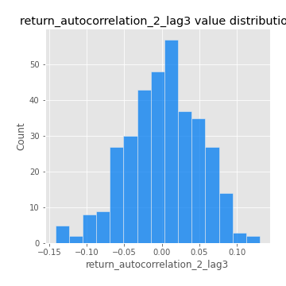

# Exploratory Data Analysis

[<< Go back](../README.md)
## Feature : target
- **Feature type** : categorical
- **Missing** : 0.0%
- **Unique** : 2
- **Count** :347
- **Unique** :2
- **Top** :real
- **Freq** :178

## Feature : return_mean1
- **Feature type** : continous
- **Missing** : 0.0%
- **Unique** : 347
- **Count** :347.0
- **Mean** :0.027036779604619393
- **Std** :0.07749847630571828
- **Min** :-0.22632637961920957
- **25%th Percentile** : -0.016566144098183556
- **50%th Percentile** : 0.029444111584613887
- **75%th Percentile** : 0.07794469969709604
- **Max** :0.3612366374600757

## Feature : return_mean2
- **Feature type** : continous
- **Missing** : 0.0%
- **Unique** : 347
- **Count** :347.0
- **Mean** :0.06897262792344148
- **Std** :0.09666639758260956
- **Min** :-0.24205418062825398
- **25%th Percentile** : 0.018071981657533685
- **50%th Percentile** : 0.06880888541707969
- **75%th Percentile** : 0.11913929608632712
- **Max** :0.4819161143427805

## Feature : return_sd1
- **Feature type** : continous
- **Missing** : 0.0%
- **Unique** : 347
- **Count** :347.0
- **Mean** :1.7126178977133186
- **Std** :0.7630075448373299
- **Min** :0.7470080772831957
- **25%th Percentile** : 1.4261629498561244
- **50%th Percentile** : 1.5020052233814896
- **75%th Percentile** : 1.7152907295492366
- **Max** :9.236766377527575

## Feature : return_sd2
- **Feature type** : continous
- **Missing** : 0.0%
- **Unique** : 347
- **Count** :347.0
- **Mean** :1.787383058256591
- **Std** :0.7320386810131192
- **Min** :0.8592887433004143
- **25%th Percentile** : 1.495961822197735
- **50%th Percentile** : 1.5792079444927862
- **75%th Percentile** : 1.7175068339328736
- **Max** :6.737618636746393

## Feature : return_skew1
- **Feature type** : continous
- **Missing** : 0.0%
- **Unique** : 347
- **Count** :347.0
- **Mean** :-0.11699658544115661
- **Std** :0.551159139137751
- **Min** :-2.817259764925239
- **25%th Percentile** : -0.24407226913603242
- **50%th Percentile** : -0.07234858059748726
- **75%th Percentile** : 0.07877423536283015
- **Max** :2.5845963767725557

## Feature : return_skew2
- **Feature type** : continous
- **Missing** : 0.0%
- **Unique** : 347
- **Count** :347.0
- **Mean** :-0.2120753006086268
- **Std** :0.7981182941756352
- **Min** :-8.801502855292393
- **25%th Percentile** : -0.36985669780090147
- **50%th Percentile** : -0.13097544168132694
- **75%th Percentile** : 0.04611371306584121
- **Max** :2.2606839051517187

## Feature : return_kurtosis1
- **Feature type** : continous
- **Missing** : 0.0%
- **Unique** : 347
- **Count** :347.0
- **Mean** :3.26242555080098
- **Std** :5.5809559206640555
- **Min** :-0.22578155861727334
- **25%th Percentile** : 0.303595649432431
- **50%th Percentile** : 1.1390294164285337
- **75%th Percentile** : 3.601784904080982
- **Max** :36.91113889081053

## Feature : return_kurtosis2
- **Feature type** : continous
- **Missing** : 0.0%
- **Unique** : 347
- **Count** :347.0
- **Mean** :4.24879013183941
- **Std** :10.08171700157554
- **Min** :-0.1633992074438071
- **25%th Percentile** : 0.6388470302882969
- **50%th Percentile** : 1.625110721116878
- **75%th Percentile** : 4.087838595779396
- **Max** :143.10871011533666

## Feature : return_autocorrelation_1_lag1
- **Feature type** : continous
- **Missing** : 0.0%
- **Unique** : 347
- **Count** :347.0
- **Mean** :-0.011228944228496122
- **Std** :0.05913870679024895
- **Min** :-0.2135576224968752
- **25%th Percentile** : -0.04277766114006612
- **50%th Percentile** : -0.0074647847787746215
- **75%th Percentile** : 0.02684179426352298
- **Max** :0.12810656890648087

## Feature : return_autocorrelation_1_lag2
- **Feature type** : continous
- **Missing** : 0.0%
- **Unique** : 347
- **Count** :347.0
- **Mean** :-0.007591624450001193
- **Std** :0.04874091396215845
- **Min** :-0.13309283796645122
- **25%th Percentile** : -0.03668629797316794
- **50%th Percentile** : -0.006619091921571229
- **75%th Percentile** : 0.02409668785025989
- **Max** :0.1561488228015672

## Feature : return_autocorrelation_1_lag3
- **Feature type** : continous
- **Missing** : 0.0%
- **Unique** : 347
- **Count** :347.0
- **Mean** :-0.004138644463705002
- **Std** :0.0523200121518231
- **Min** :-0.1940836867390813
- **25%th Percentile** : -0.03822807521210238
- **50%th Percentile** : -0.0037834462111670545
- **75%th Percentile** : 0.03234920003243519
- **Max** :0.17805869530681923

## Feature : return_autocorrelation_2_lag1
- **Feature type** : continous
- **Missing** : 0.0%
- **Unique** : 347
- **Count** :347.0
- **Mean** :0.002333848356762158
- **Std** :0.06310744454314197
- **Min** :-0.24590087874039124
- **25%th Percentile** : -0.03138363226124667
- **50%th Percentile** : 0.008442299935263154
- **75%th Percentile** : 0.04449267540500218
- **Max** :0.31863413537898483

## Feature : return_autocorrelation_2_lag2
- **Feature type** : continous
- **Missing** : 0.0%
- **Unique** : 347
- **Count** :347.0
- **Mean** :0.003653095374724982
- **Std** :0.053014820909732606
- **Min** :-0.15323211089747296
- **25%th Percentile** : -0.031934426893825446
- **50%th Percentile** : 0.0004615917374776275
- **75%th Percentile** : 0.03935138180017365
- **Max** :0.20974504043791217

## Feature : return_autocorrelation_2_lag3
- **Feature type** : continous
- **Missing** : 0.0%
- **Unique** : 347
- **Count** :347.0
- **Mean** :0.001556294560759249
- **Std** :0.04918134992079712
- **Min** :-0.14200107169559698
- **25%th Percentile** : -0.02910956718129768
- **50%th Percentile** : 0.004049763585579844
- **75%th Percentile** : 0.038476724659645495
- **Max** :0.1307152372198116

## Feature : return_correlation_ts1_lag_0
- **Feature type** : continous
- **Missing** : 0.0%
- **Unique** : 347
- **Count** :347.0
- **Mean** :0.3126782495664775
- **Std** :0.11223320105365259
- **Min** :-0.027089510445801036
- **25%th Percentile** : 0.25009697396802216
- **50%th Percentile** : 0.29500369092730705
- **75%th Percentile** : 0.3566204478248305
- **Max** :0.7028422087350163

## Feature : return_correlation_ts1_lag_1
- **Feature type** : continous
- **Missing** : 0.0%
- **Unique** : 347
- **Count** :347.0
- **Mean** :-0.0029376861283947264
- **Std** :0.05282511887943488
- **Min** :-0.16985510949917193
- **25%th Percentile** : -0.037662363299342735
- **50%th Percentile** : 0.003691817665947866
- **75%th Percentile** : 0.03646221808570741
- **Max** :0.15499424718508623

## Feature : return_correlation_ts1_lag_2
- **Feature type** : continous
- **Missing** : 0.0%
- **Unique** : 347
- **Count** :347.0
- **Mean** :0.003369021486367801
- **Std** :0.049976477332571226
- **Min** :-0.21653581047581763
- **25%th Percentile** : -0.027524189429893788
- **50%th Percentile** : 0.0009685707217309875
- **75%th Percentile** : 0.03633470127407021
- **Max** :0.13766654568583458

## Feature : return_correlation_ts1_lag_3
- **Feature type** : continous
- **Missing** : 0.0%
- **Unique** : 347
- **Count** :347.0
- **Mean** :0.002892089898935863
- **Std** :0.05221357906612685
- **Min** :-0.1270218498974763
- **25%th Percentile** : -0.03312911319463009
- **50%th Percentile** : -0.0011499786701127388
- **75%th Percentile** : 0.037902562960658914
- **Max** :0.1636773216468148

## Feature : return_correlation_ts2_lag_1
- **Feature type** : continous
- **Missing** : 0.0%
- **Unique** : 347
- **Count** :347.0
- **Mean** :-0.002748136576841425
- **Std** :0.05614651800046906
- **Min** :-0.2081139431093261
- **25%th Percentile** : -0.03517466810568697
- **50%th Percentile** : -0.007142589640568393
- **75%th Percentile** : 0.036864104850400474
- **Max** :0.19012138943127835

## Feature : return_correlation_ts2_lag_2
- **Feature type** : continous
- **Missing** : 0.0%
- **Unique** : 347
- **Count** :347.0
- **Mean** :0.0005410408167533521
- **Std** :0.051036369821820984
- **Min** :-0.23751835475804678
- **25%th Percentile** : -0.031269410863642225
- **50%th Percentile** : 0.0008310427597320576
- **75%th Percentile** : 0.032797804402250164
- **Max** :0.20772887392904255

## Feature : return_correlation_ts2_lag_3
- **Feature type** : continous
- **Missing** : 0.0%
- **Unique** : 347
- **Count** :347.0
- **Mean** :-0.001779207028567837
- **Std** :0.05374109214866604
- **Min** :-0.17564076057312866
- **25%th Percentile** : -0.031056152032076564
- **50%th Percentile** : -0.0031696992515712744
- **75%th Percentile** : 0.03695047041762995
- **Max** :0.12925527748088447

## Feature : sqreturn_autocorrelation_ts1_lag1
- **Feature type** : continous
- **Missing** : 0.0%
- **Unique** : 347
- **Count** :347.0
- **Mean** :0.05099328761030319
- **Std** :0.09702312716730009
- **Min** :-0.12019264352901199
- **25%th Percentile** : -0.013811707457405722
- **50%th Percentile** : 0.02422121892199589
- **75%th Percentile** : 0.08838670726689835
- **Max** :0.49414293176447355

## Feature : sqreturn_autocorrelation_ts1_lag2
- **Feature type** : continous
- **Missing** : 0.0%
- **Unique** : 347
- **Count** :347.0
- **Mean** :0.044695827393286515
- **Std** :0.09968451059685973
- **Min** :-0.10416703144374811
- **25%th Percentile** : -0.018441221988900698
- **50%th Percentile** : 0.016072630923868826
- **75%th Percentile** : 0.07576362626472395
- **Max** :0.540735851444759

## Feature : sqreturn_autocorrelation_ts1_lag3
- **Feature type** : continous
- **Missing** : 0.0%
- **Unique** : 347
- **Count** :347.0
- **Mean** :0.03626385198920807
- **Std** :0.07982392705841404
- **Min** :-0.09508474335249491
- **25%th Percentile** : -0.014060219078153833
- **50%th Percentile** : 0.015055193737716006
- **75%th Percentile** : 0.06443958159987034
- **Max** :0.41030914918857014

## Feature : sqreturn_autocorrelation_ts2_lag1
- **Feature type** : continous
- **Missing** : 0.0%
- **Unique** : 347
- **Count** :347.0
- **Mean** :0.05044447468258109
- **Std** :0.09092743210770683
- **Min** :-0.10411707420804936
- **25%th Percentile** : -0.010129218571615563
- **50%th Percentile** : 0.02982522024063108
- **75%th Percentile** : 0.08701533582369264
- **Max** :0.510085647437958

## Feature : sqreturn_autocorrelation_ts2_lag2
- **Feature type** : continous
- **Missing** : 0.0%
- **Unique** : 347
- **Count** :347.0
- **Mean** :0.041028963640060916
- **Std** :0.09435833390045735
- **Min** :-0.11659571223477987
- **25%th Percentile** : -0.014798665410588635
- **50%th Percentile** : 0.01466548531025916
- **75%th Percentile** : 0.06359273630213877
- **Max** :0.5373432415582473

## Feature : sqreturn_autocorrelation_ts2_lag3
- **Feature type** : continous
- **Missing** : 0.0%
- **Unique** : 347
- **Count** :347.0
- **Mean** :0.028124330642736176
- **Std** :0.07195223925157661
- **Min** :-0.13316247295669648
- **25%th Percentile** : -0.016644601399638637
- **50%th Percentile** : 0.010183227334158442
- **75%th Percentile** : 0.05565131203003554
- **Max** :0.31225727797735664

## Feature : sqreturn_correlation_ts1_lag_0
- **Feature type** : continous
- **Missing** : 0.0%
- **Unique** : 347
- **Count** :347.0
- **Mean** :0.3126782495664775
- **Std** :0.11223320105365259
- **Min** :-0.027089510445801036
- **25%th Percentile** : 0.25009697396802216
- **50%th Percentile** : 0.29500369092730705
- **75%th Percentile** : 0.3566204478248305
- **Max** :0.7028422087350163

## Feature : sqreturn_correlation_ts1_lag_1
- **Feature type** : continous
- **Missing** : 0.0%
- **Unique** : 347
- **Count** :347.0
- **Mean** :-0.0029376861283947264
- **Std** :0.05282511887943488
- **Min** :-0.16985510949917193
- **25%th Percentile** : -0.037662363299342735
- **50%th Percentile** : 0.003691817665947866
- **75%th Percentile** : 0.03646221808570741
- **Max** :0.15499424718508623

## Feature : sqreturn_correlation_ts1_lag_2
- **Feature type** : continous
- **Missing** : 0.0%
- **Unique** : 347
- **Count** :347.0
- **Mean** :0.003369021486367801
- **Std** :0.049976477332571226
- **Min** :-0.21653581047581763
- **25%th Percentile** : -0.027524189429893788
- **50%th Percentile** : 0.0009685707217309875
- **75%th Percentile** : 0.03633470127407021
- **Max** :0.13766654568583458

## Feature : sqreturn_correlation_ts1_lag_3
- **Feature type** : continous
- **Missing** : 0.0%
- **Unique** : 347
- **Count** :347.0
- **Mean** :0.002892089898935863
- **Std** :0.05221357906612685
- **Min** :-0.1270218498974763
- **25%th Percentile** : -0.03312911319463009
- **50%th Percentile** : -0.0011499786701127388
- **75%th Percentile** : 0.037902562960658914
- **Max** :0.1636773216468148

## Feature : sqreturn_correlation_ts2_lag_1
- **Feature type** : continous
- **Missing** : 0.0%
- **Unique** : 347
- **Count** :347.0
- **Mean** :-0.002748136576841425
- **Std** :0.05614651800046906
- **Min** :-0.2081139431093261
- **25%th Percentile** : -0.03517466810568697
- **50%th Percentile** : -0.007142589640568393
- **75%th Percentile** : 0.036864104850400474
- **Max** :0.19012138943127835

## Feature : sqreturn_correlation_ts2_lag_2
- **Feature type** : continous
- **Missing** : 0.0%
- **Unique** : 347
- **Count** :347.0
- **Mean** :0.0005410408167533521
- **Std** :0.051036369821820984
- **Min** :-0.23751835475804678
- **25%th Percentile** : -0.031269410863642225
- **50%th Percentile** : 0.0008310427597320576
- **75%th Percentile** : 0.032797804402250164
- **Max** :0.20772887392904255

## Feature : sqreturn_correlation_ts2_lag_3
- **Feature type** : continous
- **Missing** : 0.0%
- **Unique** : 347
- **Count** :347.0
- **Mean** :-0.001779207028567837
- **Std** :0.05374109214866604
- **Min** :-0.17564076057312866
- **25%th Percentile** : -0.031056152032076564
- **50%th Percentile** : -0.0031696992515712744
- **75%th Percentile** : 0.03695047041762995
- **Max** :0.12925527748088447

## Feature : price2_granger_cause_price1
- **Feature type** : continous
- **Missing** : 0.0%
- **Unique** : 347
- **Count** :347.0
- **Mean** :0.32237137965057844
- **Std** :0.29900947219287033
- **Min** :1.1505642493585304e-05
- **25%th Percentile** : 0.04467064245455458
- **50%th Percentile** : 0.24101952106559943
- **75%th Percentile** : 0.550263593470958
- **Max** :0.9885712803689185

## Feature : price1_granger_cause_price2
- **Feature type** : continous
- **Missing** : 0.0%
- **Unique** : 347
- **Count** :347.0
- **Mean** :0.28030228359992415
- **Std** :0.27635124718791876
- **Min** :2.628760573194065e-09
- **25%th Percentile** : 0.03580141931386602
- **50%th Percentile** : 0.19280189289399474
- **75%th Percentile** : 0.4673166766947241
- **Max** :0.999096881874562

[<< Go back](../README.md)
