# Summary of 3_Linear

[<< Go back](../README.md)

## Logistic Regression (Linear)
- **n_jobs**: -1
- **explain_level**: 2

## Validation
 - **validation_type**: split
 - **train_ratio**: 0.75
 - **shuffle**: True
 - **stratify**: True

## Optimized metric
accuracy

## Training time

11.8 seconds

## Metric details
|           |    score |    threshold |
|:----------|---------:|-------------:|
| logloss   | 0.185218 | nan          |
| auc       | 0.989362 | nan          |
| f1        | 0.958333 |   0.529012   |
| accuracy  | 0.954023 |   0.529012   |
| precision | 1        |   0.80333    |
| recall    | 1        |   3.6953e-22 |
| mcc       | 0.908081 |   0.529012   |

## Confusion matrix (at threshold=0.529012)
|                      |   Predicted as real |   Predicted as simulated |
|:---------------------|--------------------:|-------------------------:|
| Labeled as real      |                  37 |                        3 |
| Labeled as simulated |                   1 |                       46 |

## Learning curves
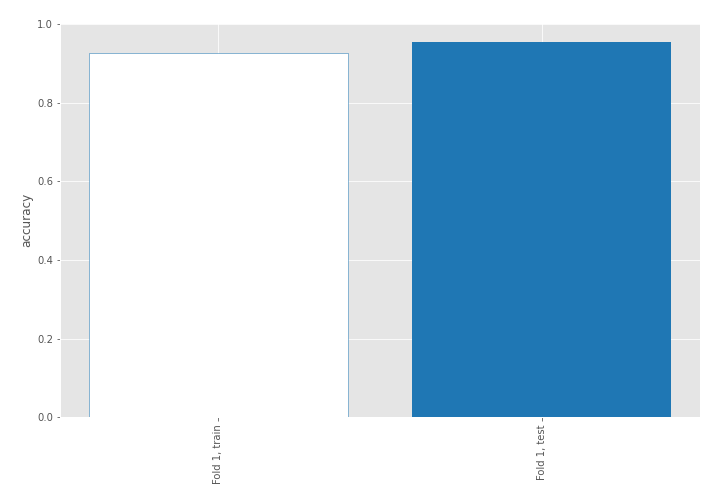

## Coefficients
| feature                           |   Learner_1 |
|:----------------------------------|------------:|
| return_autocorrelation_2_lag1     |   0.674461  |
| return_autocorrelation_2_lag2     |   0.534746  |
| return_autocorrelation_2_lag3     |   0.522526  |
| return_correlation_ts1_lag_1      |   0.470187  |
| sqreturn_correlation_ts1_lag_1    |   0.470187  |
| sqreturn_correlation_ts1_lag_2    |   0.426184  |
| return_correlation_ts1_lag_2      |   0.426184  |
| sqreturn_correlation_ts2_lag_1    |   0.397476  |
| return_correlation_ts2_lag_1      |   0.397476  |
| return_autocorrelation_1_lag2     |   0.314174  |
| return_autocorrelation_1_lag1     |   0.231229  |
| return_correlation_ts1_lag_3      |   0.192216  |
| sqreturn_correlation_ts1_lag_3    |   0.192216  |
| sqreturn_correlation_ts2_lag_3    |   0.143031  |
| return_correlation_ts2_lag_3      |   0.143031  |
| sqreturn_correlation_ts2_lag_2    |   0.124845  |
| return_correlation_ts2_lag_2      |   0.124845  |
| return_autocorrelation_1_lag3     |   0.0976494 |
| return_correlation_ts1_lag_0      |   0.0597638 |
| sqreturn_correlation_ts1_lag_0    |   0.0597638 |
| return_mean2                      |   0.0488405 |
| return_skew1                      |  -0.107888  |
| return_sd1                        |  -0.216196  |
| return_sd2                        |  -0.302416  |
| price2_granger_cause_price1       |  -0.498296  |
| return_skew2                      |  -0.559824  |
| intercept                         |  -0.63189   |
| price1_granger_cause_price2       |  -0.672643  |
| return_mean1                      |  -0.744416  |
| sqreturn_autocorrelation_ts2_lag3 |  -0.747206  |
| sqreturn_autocorrelation_ts1_lag3 |  -1.18263   |
| sqreturn_autocorrelation_ts1_lag2 |  -1.21721   |
| sqreturn_autocorrelation_ts2_lag2 |  -1.2367    |
| sqreturn_autocorrelation_ts1_lag1 |  -1.45588   |
| sqreturn_autocorrelation_ts2_lag1 |  -1.73113   |
| return_kurtosis2                  |  -2.14218   |
| return_kurtosis1                  |  -3.33796   |

## Permutation-based Importance
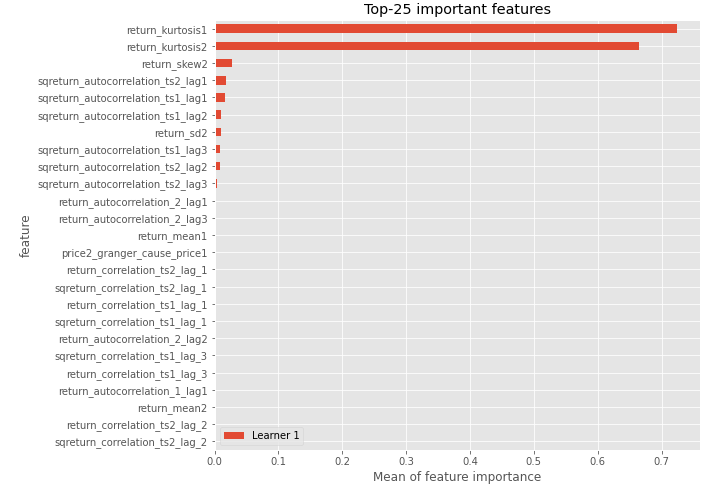
## Confusion Matrix

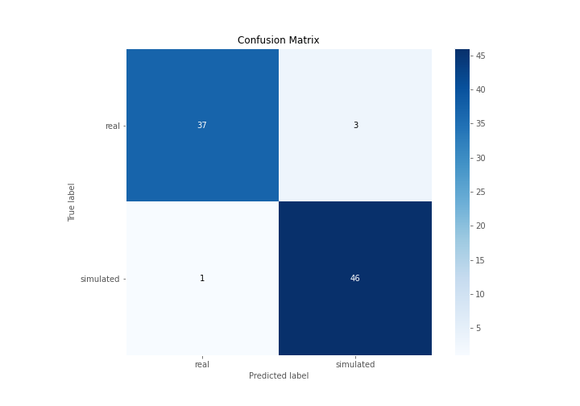

## Normalized Confusion Matrix

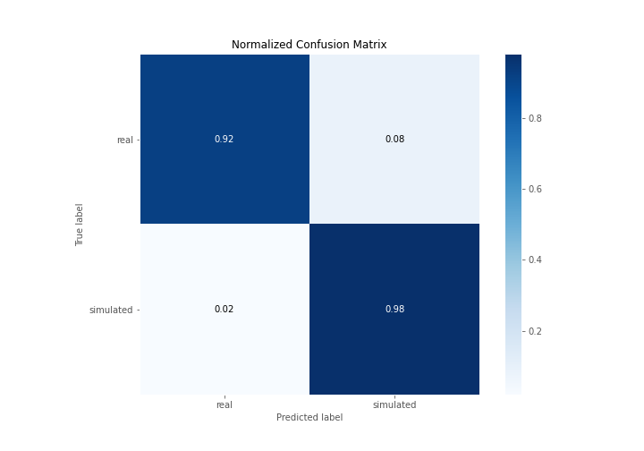

## ROC Curve

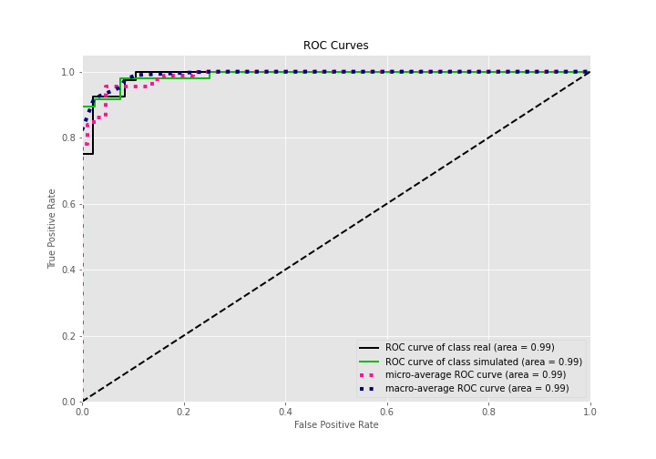

## Kolmogorov-Smirnov Statistic

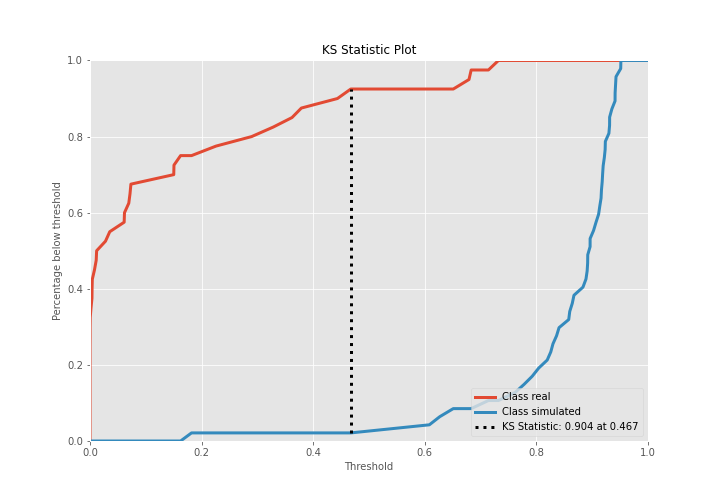

## Precision-Recall Curve

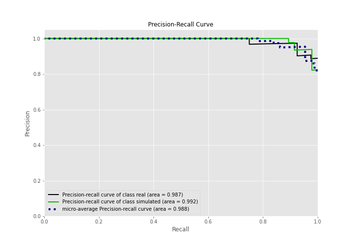

## Calibration Curve

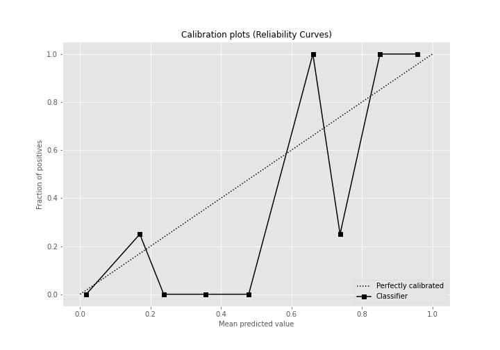

## Cumulative Gains Curve

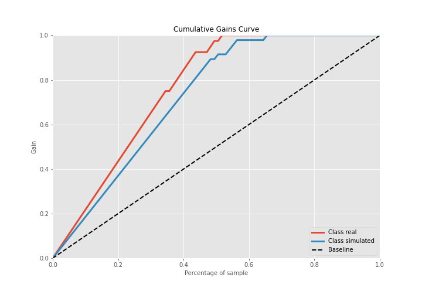

## Lift Curve

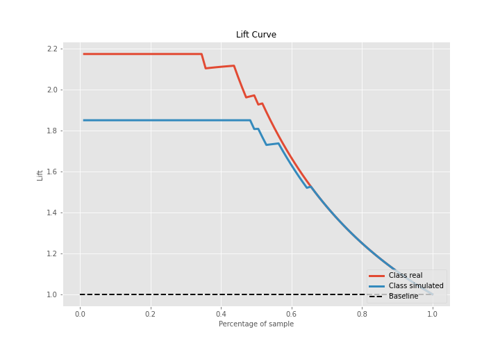

## SHAP Importance
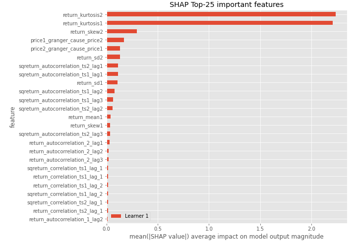

## SHAP Dependence plots

### Dependence (Fold 1)
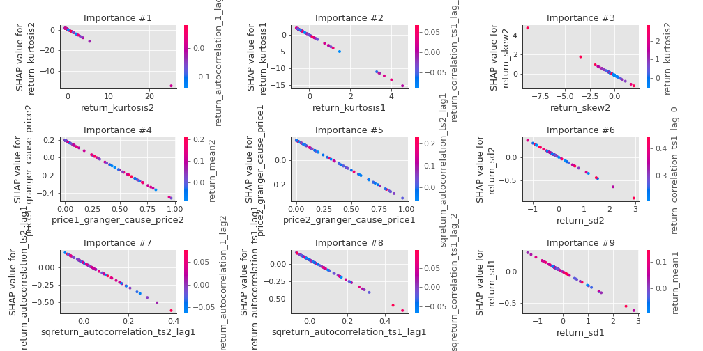

## SHAP Decision plots

### Top-10 Worst decisions for class 0 (Fold 1)
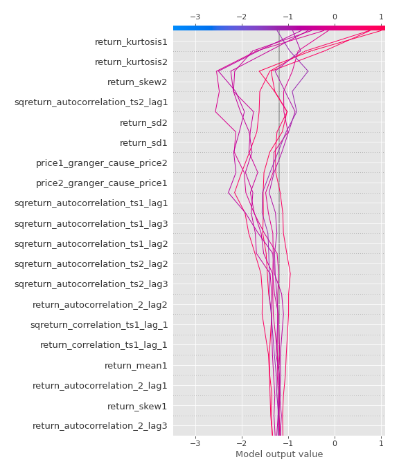
### Top-10 Best decisions for class 0 (Fold 1)
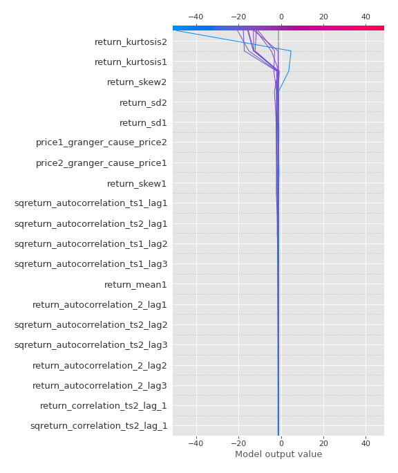
### Top-10 Worst decisions for class 1 (Fold 1)
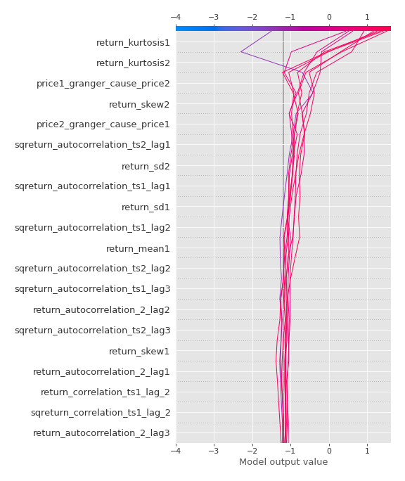
### Top-10 Best decisions for class 1 (Fold 1)
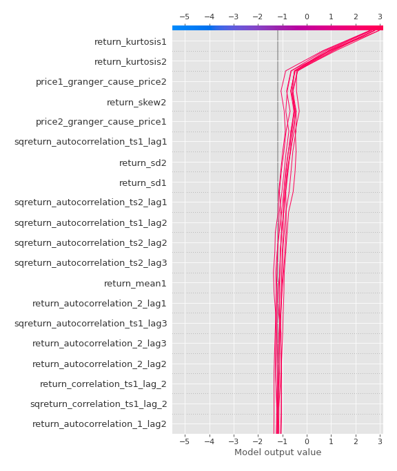

[<< Go back](../README.md)
