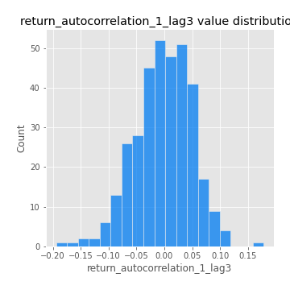

# Exploratory Data Analysis

[<< Go back](../README.md)
## Feature : target
- **Feature type** : categorical
- **Missing** : 0.0%
- **Unique** : 2
- **Count** :347
- **Unique** :2
- **Top** :simulated
- **Freq** :186

## Feature : return_mean1
- **Feature type** : continous
- **Missing** : 0.0%
- **Unique** : 347
- **Count** :347.0
- **Mean** :0.0331893579704266
- **Std** :0.07856489057065318
- **Min** :-0.17686457077756634
- **25%th Percentile** : -0.01679464954140552
- **50%th Percentile** : 0.03215070927179013
- **75%th Percentile** : 0.08188633395391876
- **Max** :0.37175100008111034

## Feature : return_mean2
- **Feature type** : continous
- **Missing** : 0.0%
- **Unique** : 347
- **Count** :347.0
- **Mean** :0.06579515245175623
- **Std** :0.09262626189343758
- **Min** :-0.24205418062825398
- **25%th Percentile** : 0.01573126030451164
- **50%th Percentile** : 0.05951892812262144
- **75%th Percentile** : 0.11582198709248834
- **Max** :0.5042390537447746

## Feature : return_sd1
- **Feature type** : continous
- **Missing** : 0.0%
- **Unique** : 347
- **Count** :347.0
- **Mean** :1.6733762677948891
- **Std** :0.6321917418747943
- **Min** :0.7470080772831957
- **25%th Percentile** : 1.425732467702454
- **50%th Percentile** : 1.492354148039351
- **75%th Percentile** : 1.6153521592508804
- **Max** :6.495661311240861

## Feature : return_sd2
- **Feature type** : continous
- **Missing** : 0.0%
- **Unique** : 347
- **Count** :347.0
- **Mean** :1.7077612747193343
- **Std** :0.6313265973612538
- **Min** :0.8592887433004143
- **25%th Percentile** : 1.4871254043728426
- **50%th Percentile** : 1.5651779779459023
- **75%th Percentile** : 1.6419359587218163
- **Max** :5.762808157208253

## Feature : return_skew1
- **Feature type** : continous
- **Missing** : 0.0%
- **Unique** : 347
- **Count** :347.0
- **Mean** :-0.11004828202802241
- **Std** :0.5794707881639289
- **Min** :-2.817259764925239
- **25%th Percentile** : -0.25019604425620734
- **50%th Percentile** : -0.07152046950841208
- **75%th Percentile** : 0.09445818442483936
- **Max** :2.5845963767725557

## Feature : return_skew2
- **Feature type** : continous
- **Missing** : 0.0%
- **Unique** : 347
- **Count** :347.0
- **Mean** :-0.22645761737422498
- **Std** :0.7607448765933544
- **Min** :-8.801502855292393
- **25%th Percentile** : -0.35551952327175307
- **50%th Percentile** : -0.13144581622269141
- **75%th Percentile** : 0.03997403199661069
- **Max** :2.123597625075353

## Feature : return_kurtosis1
- **Feature type** : continous
- **Missing** : 0.0%
- **Unique** : 347
- **Count** :347.0
- **Mean** :3.2080489871280142
- **Std** :5.663297157408427
- **Min** :-0.3078182832863807
- **25%th Percentile** : 0.26858301401518947
- **50%th Percentile** : 0.9526663009767273
- **75%th Percentile** : 3.435368886158079
- **Max** :36.91113889081053

## Feature : return_kurtosis2
- **Feature type** : continous
- **Missing** : 0.0%
- **Unique** : 347
- **Count** :347.0
- **Mean** :3.961485310728329
- **Std** :9.407173409972724
- **Min** :-0.34267321703159803
- **25%th Percentile** : 0.5084467488801665
- **50%th Percentile** : 1.4521618643664609
- **75%th Percentile** : 4.063516554723738
- **Max** :143.10871011533666

## Feature : return_autocorrelation_1_lag1
- **Feature type** : continous
- **Missing** : 0.0%
- **Unique** : 347
- **Count** :347.0
- **Mean** :-0.009094656908476544
- **Std** :0.05693299060466602
- **Min** :-0.2135576224968752
- **25%th Percentile** : -0.040346084211168
- **50%th Percentile** : -0.00284813048647083
- **75%th Percentile** : 0.0262130837759627
- **Max** :0.12810656890648087

## Feature : return_autocorrelation_1_lag2
- **Feature type** : continous
- **Missing** : 0.0%
- **Unique** : 347
- **Count** :347.0
- **Mean** :-0.005529620581674979
- **Std** :0.04767161455424922
- **Min** :-0.13309283796645122
- **25%th Percentile** : -0.03589930318154413
- **50%th Percentile** : -0.004966566348356404
- **75%th Percentile** : 0.028052052619289846
- **Max** :0.1561488228015672

## Feature : return_autocorrelation_1_lag3
- **Feature type** : continous
- **Missing** : 0.0%
- **Unique** : 347
- **Count** :347.0
- **Mean** :-0.0012095594340400379
- **Std** :0.051308603800970874
- **Min** :-0.1940836867390813
- **25%th Percentile** : -0.033807355445794086
- **50%th Percentile** : 0.0007298140584707114
- **75%th Percentile** : 0.03623298925468783
- **Max** :0.17805869530681923

## Feature : return_autocorrelation_2_lag1
- **Feature type** : continous
- **Missing** : 0.0%
- **Unique** : 347
- **Count** :347.0
- **Mean** :-0.00032727510827962667
- **Std** :0.06164596026496238
- **Min** :-0.25075531010123286
- **25%th Percentile** : -0.03249300316206499
- **50%th Percentile** : 0.005528261130884281
- **75%th Percentile** : 0.03572779317375703
- **Max** :0.16537744263607387

## Feature : return_autocorrelation_2_lag2
- **Feature type** : continous
- **Missing** : 0.0%
- **Unique** : 347
- **Count** :347.0
- **Mean** :0.00835160468958189
- **Std** :0.05192516077366205
- **Min** :-0.15323211089747296
- **25%th Percentile** : -0.027850074911192443
- **50%th Percentile** : 0.00810222957203057
- **75%th Percentile** : 0.04196464453091103
- **Max** :0.1735398560230086

## Feature : return_autocorrelation_2_lag3
- **Feature type** : continous
- **Missing** : 0.0%
- **Unique** : 347
- **Count** :347.0
- **Mean** :0.005650566101922415
- **Std** :0.05225081602609385
- **Min** :-0.14200107169559698
- **25%th Percentile** : -0.027427761634105492
- **50%th Percentile** : 0.006745376261678889
- **75%th Percentile** : 0.04467283423426742
- **Max** :0.1419999376914021

## Feature : return_correlation_ts1_lag_0
- **Feature type** : continous
- **Missing** : 0.0%
- **Unique** : 347
- **Count** :347.0
- **Mean** :0.2977811800226106
- **Std** :0.10348471091032589
- **Min** :-0.027089510445801036
- **25%th Percentile** : 0.24574409144097958
- **50%th Percentile** : 0.2939392714210903
- **75%th Percentile** : 0.34290089200574936
- **Max** :0.7041861626832071

## Feature : return_correlation_ts1_lag_1
- **Feature type** : continous
- **Missing** : 0.0%
- **Unique** : 347
- **Count** :347.0
- **Mean** :-0.004242767714509976
- **Std** :0.04899396976087179
- **Min** :-0.16985510949917193
- **25%th Percentile** : -0.03686730985233212
- **50%th Percentile** : 0.0002949807608222008
- **75%th Percentile** : 0.02942345059888979
- **Max** :0.11819480385322509

## Feature : return_correlation_ts1_lag_2
- **Feature type** : continous
- **Missing** : 0.0%
- **Unique** : 347
- **Count** :347.0
- **Mean** :0.002978535140105412
- **Std** :0.051172619764316404
- **Min** :-0.21653581047581763
- **25%th Percentile** : -0.0328807842679725
- **50%th Percentile** : 0.00407588990471858
- **75%th Percentile** : 0.03868726165698197
- **Max** :0.13931161445127618

## Feature : return_correlation_ts1_lag_3
- **Feature type** : continous
- **Missing** : 0.0%
- **Unique** : 347
- **Count** :347.0
- **Mean** :-0.00040676813926588545
- **Std** :0.05212870187862458
- **Min** :-0.1270218498974763
- **25%th Percentile** : -0.033400366567022506
- **50%th Percentile** : -0.00468077505976925
- **75%th Percentile** : 0.032963750069705075
- **Max** :0.1636773216468148

## Feature : return_correlation_ts2_lag_1
- **Feature type** : continous
- **Missing** : 0.0%
- **Unique** : 347
- **Count** :347.0
- **Mean** :-0.0004301908372829604
- **Std** :0.05198900116913483
- **Min** :-0.20093919236581337
- **25%th Percentile** : -0.029506011878126844
- **50%th Percentile** : 0.0010661520307641559
- **75%th Percentile** : 0.034904752884661404
- **Max** :0.17208763791364762

## Feature : return_correlation_ts2_lag_2
- **Feature type** : continous
- **Missing** : 0.0%
- **Unique** : 347
- **Count** :347.0
- **Mean** :0.005157038600112432
- **Std** :0.04781123010725725
- **Min** :-0.11701735111763815
- **25%th Percentile** : -0.029879768201370678
- **50%th Percentile** : 0.001125433184533144
- **75%th Percentile** : 0.036967292907415156
- **Max** :0.20772887392904255

## Feature : return_correlation_ts2_lag_3
- **Feature type** : continous
- **Missing** : 0.0%
- **Unique** : 347
- **Count** :347.0
- **Mean** :-0.0007105071248936036
- **Std** :0.05072645805226833
- **Min** :-0.17564076057312866
- **25%th Percentile** : -0.027524650780760544
- **50%th Percentile** : 0.0017062306092014044
- **75%th Percentile** : 0.03315699108876796
- **Max** :0.12578577770423086

## Feature : sqreturn_autocorrelation_ts1_lag1
- **Feature type** : continous
- **Missing** : 0.0%
- **Unique** : 347
- **Count** :347.0
- **Mean** :0.04713176936482571
- **Std** :0.09528197334925642
- **Min** :-0.10628916505960237
- **25%th Percentile** : -0.01546975426117794
- **50%th Percentile** : 0.021155311489825048
- **75%th Percentile** : 0.08228098637191111
- **Max** :0.49414293176447355

## Feature : sqreturn_autocorrelation_ts1_lag2
- **Feature type** : continous
- **Missing** : 0.0%
- **Unique** : 347
- **Count** :347.0
- **Mean** :0.03836572612186982
- **Std** :0.08878899193607978
- **Min** :-0.10976157923120723
- **25%th Percentile** : -0.014579779314513451
- **50%th Percentile** : 0.014540561223267912
- **75%th Percentile** : 0.06228865980771672
- **Max** :0.4522162366773919

## Feature : sqreturn_autocorrelation_ts1_lag3
- **Feature type** : continous
- **Missing** : 0.0%
- **Unique** : 347
- **Count** :347.0
- **Mean** :0.03114439213392042
- **Std** :0.08087421405777086
- **Min** :-0.11022127868274764
- **25%th Percentile** : -0.017332312055765117
- **50%th Percentile** : 0.01106203088400828
- **75%th Percentile** : 0.05779884315816411
- **Max** :0.41030914918857014

## Feature : sqreturn_autocorrelation_ts2_lag1
- **Feature type** : continous
- **Missing** : 0.0%
- **Unique** : 347
- **Count** :347.0
- **Mean** :0.042959662797794555
- **Std** :0.08834035021937416
- **Min** :-0.08864469063201734
- **25%th Percentile** : -0.014040761829360236
- **50%th Percentile** : 0.02165979816980803
- **75%th Percentile** : 0.07847234559766504
- **Max** :0.510085647437958

## Feature : sqreturn_autocorrelation_ts2_lag2
- **Feature type** : continous
- **Missing** : 0.0%
- **Unique** : 347
- **Count** :347.0
- **Mean** :0.030888281554885155
- **Std** :0.08485468051021422
- **Min** :-0.10153632894397713
- **25%th Percentile** : -0.020674654817980496
- **50%th Percentile** : 0.01162085636483385
- **75%th Percentile** : 0.04865362430656926
- **Max** :0.45676817892778204

## Feature : sqreturn_autocorrelation_ts2_lag3
- **Feature type** : continous
- **Missing** : 0.0%
- **Unique** : 347
- **Count** :347.0
- **Mean** :0.021830380473089286
- **Std** :0.06866663103083372
- **Min** :-0.09794291947571741
- **25%th Percentile** : -0.01740000818551058
- **50%th Percentile** : 0.005757775395770999
- **75%th Percentile** : 0.045360433908798764
- **Max** :0.31225727797735664

## Feature : sqreturn_correlation_ts1_lag_0
- **Feature type** : continous
- **Missing** : 0.0%
- **Unique** : 347
- **Count** :347.0
- **Mean** :0.2977811800226106
- **Std** :0.10348471091032589
- **Min** :-0.027089510445801036
- **25%th Percentile** : 0.24574409144097958
- **50%th Percentile** : 0.2939392714210903
- **75%th Percentile** : 0.34290089200574936
- **Max** :0.7041861626832071

## Feature : sqreturn_correlation_ts1_lag_1
- **Feature type** : continous
- **Missing** : 0.0%
- **Unique** : 347
- **Count** :347.0
- **Mean** :-0.004242767714509976
- **Std** :0.04899396976087179
- **Min** :-0.16985510949917193
- **25%th Percentile** : -0.03686730985233212
- **50%th Percentile** : 0.0002949807608222008
- **75%th Percentile** : 0.02942345059888979
- **Max** :0.11819480385322509

## Feature : sqreturn_correlation_ts1_lag_2
- **Feature type** : continous
- **Missing** : 0.0%
- **Unique** : 347
- **Count** :347.0
- **Mean** :0.002978535140105412
- **Std** :0.051172619764316404
- **Min** :-0.21653581047581763
- **25%th Percentile** : -0.0328807842679725
- **50%th Percentile** : 0.00407588990471858
- **75%th Percentile** : 0.03868726165698197
- **Max** :0.13931161445127618

## Feature : sqreturn_correlation_ts1_lag_3
- **Feature type** : continous
- **Missing** : 0.0%
- **Unique** : 347
- **Count** :347.0
- **Mean** :-0.00040676813926588545
- **Std** :0.05212870187862458
- **Min** :-0.1270218498974763
- **25%th Percentile** : -0.033400366567022506
- **50%th Percentile** : -0.00468077505976925
- **75%th Percentile** : 0.032963750069705075
- **Max** :0.1636773216468148

## Feature : sqreturn_correlation_ts2_lag_1
- **Feature type** : continous
- **Missing** : 0.0%
- **Unique** : 347
- **Count** :347.0
- **Mean** :-0.0004301908372829604
- **Std** :0.05198900116913483
- **Min** :-0.20093919236581337
- **25%th Percentile** : -0.029506011878126844
- **50%th Percentile** : 0.0010661520307641559
- **75%th Percentile** : 0.034904752884661404
- **Max** :0.17208763791364762

## Feature : sqreturn_correlation_ts2_lag_2
- **Feature type** : continous
- **Missing** : 0.0%
- **Unique** : 347
- **Count** :347.0
- **Mean** :0.005157038600112432
- **Std** :0.04781123010725725
- **Min** :-0.11701735111763815
- **25%th Percentile** : -0.029879768201370678
- **50%th Percentile** : 0.001125433184533144
- **75%th Percentile** : 0.036967292907415156
- **Max** :0.20772887392904255

## Feature : sqreturn_correlation_ts2_lag_3
- **Feature type** : continous
- **Missing** : 0.0%
- **Unique** : 347
- **Count** :347.0
- **Mean** :-0.0007105071248936036
- **Std** :0.05072645805226833
- **Min** :-0.17564076057312866
- **25%th Percentile** : -0.027524650780760544
- **50%th Percentile** : 0.0017062306092014044
- **75%th Percentile** : 0.03315699108876796
- **Max** :0.12578577770423086

## Feature : price2_granger_cause_price1
- **Feature type** : continous
- **Missing** : 0.0%
- **Unique** : 347
- **Count** :347.0
- **Mean** :0.3053899324717246
- **Std** :0.303363567072257
- **Min** :1.8325929358437313e-07
- **25%th Percentile** : 0.042826754663826606
- **50%th Percentile** : 0.1785124055782981
- **75%th Percentile** : 0.5215323512877488
- **Max** :0.9885712803689185

## Feature : price1_granger_cause_price2
- **Feature type** : continous
- **Missing** : 0.0%
- **Unique** : 347
- **Count** :347.0
- **Mean** :0.28976881008544625
- **Std** :0.29606001102710794
- **Min** :1.0772736680868166e-07
- **25%th Percentile** : 0.018659522651274747
- **50%th Percentile** : 0.1943325537968967
- **75%th Percentile** : 0.5068906353402065
- **Max** :0.9963982041355174

[<< Go back](../README.md)
