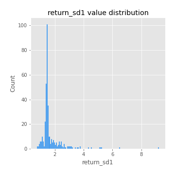
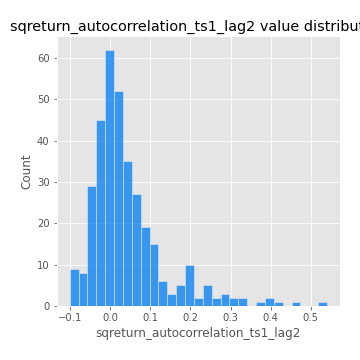

# Exploratory Data Analysis

[<< Go back](../README.md)
## Feature : target
- **Feature type** : categorical
- **Missing** : 0.0%
- **Unique** : 2
- **Count** :347
- **Unique** :2
- **Top** :simulated
- **Freq** :177

## Feature : return_mean1
- **Feature type** : continous
- **Missing** : 0.0%
- **Unique** : 347
- **Count** :347.0
- **Mean** :0.03908086766209528
- **Std** :0.07467297219732875
- **Min** :-0.22632637961920957
- **25%th Percentile** : -0.007348057567685938
- **50%th Percentile** : 0.04442371724250041
- **75%th Percentile** : 0.08328392610494616
- **Max** :0.37175100008111034

## Feature : return_mean2
- **Feature type** : continous
- **Missing** : 0.0%
- **Unique** : 347
- **Count** :347.0
- **Mean** :0.06519779676211651
- **Std** :0.09127914990605042
- **Min** :-0.24205418062825398
- **25%th Percentile** : 0.015501557407342846
- **50%th Percentile** : 0.06371982250616907
- **75%th Percentile** : 0.12127032191470641
- **Max** :0.4001484894490442

## Feature : return_sd1
- **Feature type** : continous
- **Missing** : 0.0%
- **Unique** : 347
- **Count** :347.0
- **Mean** :1.7073891253081543
- **Std** :0.7895024389658312
- **Min** :0.7470080772831957
- **25%th Percentile** : 1.416116127968734
- **50%th Percentile** : 1.4845244078440645
- **75%th Percentile** : 1.661954700498895
- **Max** :9.236766377527575

## Feature : return_sd2
- **Feature type** : continous
- **Missing** : 0.0%
- **Unique** : 347
- **Count** :347.0
- **Mean** :1.7615447638352926
- **Std** :0.7799249392523896
- **Min** :0.8455946193085045
- **25%th Percentile** : 1.4855820685017895
- **50%th Percentile** : 1.5669469462400596
- **75%th Percentile** : 1.6772957114502813
- **Max** :6.737618636746393

## Feature : return_skew1
- **Feature type** : continous
- **Missing** : 0.0%
- **Unique** : 347
- **Count** :347.0
- **Mean** :-0.14676423103458378
- **Std** :0.6038231884117593
- **Min** :-3.530116233761814
- **25%th Percentile** : -0.2409639259947794
- **50%th Percentile** : -0.07159201976945345
- **75%th Percentile** : 0.061870339584804715
- **Max** :2.5845963767725557

## Feature : return_skew2
- **Feature type** : continous
- **Missing** : 0.0%
- **Unique** : 347
- **Count** :347.0
- **Mean** :-0.23865098472153193
- **Std** :0.810329842869969
- **Min** :-8.801502855292393
- **25%th Percentile** : -0.3609501315648677
- **50%th Percentile** : -0.15031955117815285
- **75%th Percentile** : 0.05584868262382646
- **Max** :1.9492855042693131

## Feature : return_kurtosis1
- **Feature type** : continous
- **Missing** : 0.0%
- **Unique** : 347
- **Count** :347.0
- **Mean** :3.497347340863936
- **Std** :6.485226125615633
- **Min** :-0.37011219197811984
- **25%th Percentile** : 0.2673594137673907
- **50%th Percentile** : 1.036885937644493
- **75%th Percentile** : 3.528701256114429
- **Max** :46.07507808162177

## Feature : return_kurtosis2
- **Feature type** : continous
- **Missing** : 0.0%
- **Unique** : 347
- **Count** :347.0
- **Mean** :4.364006389878916
- **Std** :10.363828739063065
- **Min** :-0.318158908796065
- **25%th Percentile** : 0.48607592619845663
- **50%th Percentile** : 1.4601274279393972
- **75%th Percentile** : 4.428740505064327
- **Max** :143.10871011533666

## Feature : return_autocorrelation_1_lag1
- **Feature type** : continous
- **Missing** : 0.0%
- **Unique** : 347
- **Count** :347.0
- **Mean** :-0.007418480351149823
- **Std** :0.05817499919241471
- **Min** :-0.2135576224968752
- **25%th Percentile** : -0.04128346943171672
- **50%th Percentile** : -0.0019358903067681434
- **75%th Percentile** : 0.02941442396753926
- **Max** :0.12810656890648087

## Feature : return_autocorrelation_1_lag2
- **Feature type** : continous
- **Missing** : 0.0%
- **Unique** : 347
- **Count** :347.0
- **Mean** :-0.003887611599616269
- **Std** :0.049708604627647326
- **Min** :-0.13309283796645122
- **25%th Percentile** : -0.034010294891274294
- **50%th Percentile** : -0.0046343128300077065
- **75%th Percentile** : 0.026600836863370485
- **Max** :0.1561488228015672

## Feature : return_autocorrelation_1_lag3
- **Feature type** : continous
- **Missing** : 0.0%
- **Unique** : 347
- **Count** :347.0
- **Mean** :-0.0019213047653417522
- **Std** :0.051038093261366164
- **Min** :-0.1940836867390813
- **25%th Percentile** : -0.03205830707684755
- **50%th Percentile** : -0.0037399346828342773
- **75%th Percentile** : 0.032882636020726136
- **Max** :0.17805869530681923

## Feature : return_autocorrelation_2_lag1
- **Feature type** : continous
- **Missing** : 0.0%
- **Unique** : 347
- **Count** :347.0
- **Mean** :-5.4853951927804674e-05
- **Std** :0.0622906655676115
- **Min** :-0.24590087874039124
- **25%th Percentile** : -0.03422427534129792
- **50%th Percentile** : 0.004119049053509336
- **75%th Percentile** : 0.03986025437466455
- **Max** :0.31863413537898483

## Feature : return_autocorrelation_2_lag2
- **Feature type** : continous
- **Missing** : 0.0%
- **Unique** : 347
- **Count** :347.0
- **Mean** :0.006768192610122182
- **Std** :0.051441473627718906
- **Min** :-0.15323211089747296
- **25%th Percentile** : -0.02862690722505299
- **50%th Percentile** : 0.004321484652399331
- **75%th Percentile** : 0.039504066340410066
- **Max** :0.20974504043791217

## Feature : return_autocorrelation_2_lag3
- **Feature type** : continous
- **Missing** : 0.0%
- **Unique** : 347
- **Count** :347.0
- **Mean** :0.0037612165689284716
- **Std** :0.05072057442329882
- **Min** :-0.1702899617784094
- **25%th Percentile** : -0.03091547107787924
- **50%th Percentile** : 0.004101536625654774
- **75%th Percentile** : 0.04087369697379626
- **Max** :0.1419999376914021

## Feature : return_correlation_ts1_lag_0
- **Feature type** : continous
- **Missing** : 0.0%
- **Unique** : 347
- **Count** :347.0
- **Mean** :0.303545609909602
- **Std** :0.11194927021480948
- **Min** :-0.027089510445801036
- **25%th Percentile** : 0.2454374171284966
- **50%th Percentile** : 0.29618733088899313
- **75%th Percentile** : 0.3457687434172885
- **Max** :0.7041861626832071

## Feature : return_correlation_ts1_lag_1
- **Feature type** : continous
- **Missing** : 0.0%
- **Unique** : 347
- **Count** :347.0
- **Mean** :-0.0018653618179279628
- **Std** :0.05274369517506674
- **Min** :-0.16985510949917193
- **25%th Percentile** : -0.037947553065856364
- **50%th Percentile** : 0.0014855754062759131
- **75%th Percentile** : 0.03463744107742885
- **Max** :0.15499424718508623

## Feature : return_correlation_ts1_lag_2
- **Feature type** : continous
- **Missing** : 0.0%
- **Unique** : 347
- **Count** :347.0
- **Mean** :0.000937689318929463
- **Std** :0.04868955214241406
- **Min** :-0.21653581047581763
- **25%th Percentile** : -0.03027389670819215
- **50%th Percentile** : -0.00018333386598916331
- **75%th Percentile** : 0.03628710897753807
- **Max** :0.12902026909435912

## Feature : return_correlation_ts1_lag_3
- **Feature type** : continous
- **Missing** : 0.0%
- **Unique** : 347
- **Count** :347.0
- **Mean** :0.003209953738677803
- **Std** :0.05140854682846934
- **Min** :-0.1270218498974763
- **25%th Percentile** : -0.031220280071672258
- **50%th Percentile** : 0.004649131972092178
- **75%th Percentile** : 0.040239878623231154
- **Max** :0.1636773216468148

## Feature : return_correlation_ts2_lag_1
- **Feature type** : continous
- **Missing** : 0.0%
- **Unique** : 347
- **Count** :347.0
- **Mean** :-0.0036565531667610823
- **Std** :0.051553688078504585
- **Min** :-0.2081139431093261
- **25%th Percentile** : -0.032612417110765665
- **50%th Percentile** : -0.001052307586426952
- **75%th Percentile** : 0.028746989879252522
- **Max** :0.17208763791364762

## Feature : return_correlation_ts2_lag_2
- **Feature type** : continous
- **Missing** : 0.0%
- **Unique** : 347
- **Count** :347.0
- **Mean** :0.0017064805937367419
- **Std** :0.046995057127230594
- **Min** :-0.16618985359463798
- **25%th Percentile** : -0.02923780130616184
- **50%th Percentile** : 0.0029608310614670607
- **75%th Percentile** : 0.02813596982306358
- **Max** :0.20772887392904255

## Feature : return_correlation_ts2_lag_3
- **Feature type** : continous
- **Missing** : 0.0%
- **Unique** : 347
- **Count** :347.0
- **Mean** :-0.0018585201846102418
- **Std** :0.05207940166936367
- **Min** :-0.17564076057312866
- **25%th Percentile** : -0.0299242029044355
- **50%th Percentile** : -0.0037160237946184207
- **75%th Percentile** : 0.0341990233789024
- **Max** :0.12502781355851633

## Feature : sqreturn_autocorrelation_ts1_lag1
- **Feature type** : continous
- **Missing** : 0.0%
- **Unique** : 347
- **Count** :347.0
- **Mean** :0.049521301382214805
- **Std** :0.09275440015130597
- **Min** :-0.09162437343222074
- **25%th Percentile** : -0.011661180747110561
- **50%th Percentile** : 0.02646910530292259
- **75%th Percentile** : 0.08155881368267934
- **Max** :0.4439086285737898

## Feature : sqreturn_autocorrelation_ts1_lag2
- **Feature type** : continous
- **Missing** : 0.0%
- **Unique** : 347
- **Count** :347.0
- **Mean** :0.04288182880716036
- **Std** :0.094544780001975
- **Min** :-0.10106827108264697
- **25%th Percentile** : -0.013503379124711858
- **50%th Percentile** : 0.019716780597215693
- **75%th Percentile** : 0.06664839168202533
- **Max** :0.540735851444759

## Feature : sqreturn_autocorrelation_ts1_lag3
- **Feature type** : continous
- **Missing** : 0.0%
- **Unique** : 347
- **Count** :347.0
- **Mean** :0.03584205330741941
- **Std** :0.0820929998402304
- **Min** :-0.08953141816826964
- **25%th Percentile** : -0.016247115648483246
- **50%th Percentile** : 0.016109242844576273
- **75%th Percentile** : 0.06275470446909578
- **Max** :0.44755937369538146

## Feature : sqreturn_autocorrelation_ts2_lag1
- **Feature type** : continous
- **Missing** : 0.0%
- **Unique** : 347
- **Count** :347.0
- **Mean** :0.039893535865847096
- **Std** :0.08785408114544345
- **Min** :-0.10560645945547566
- **25%th Percentile** : -0.015904785050894654
- **50%th Percentile** : 0.018082653400032875
- **75%th Percentile** : 0.07280529222615949
- **Max** :0.4190090519891419

## Feature : sqreturn_autocorrelation_ts2_lag2
- **Feature type** : continous
- **Missing** : 0.0%
- **Unique** : 347
- **Count** :347.0
- **Mean** :0.03453361906611342
- **Std** :0.08561784267690489
- **Min** :-0.0827922401632164
- **25%th Percentile** : -0.01613209155996009
- **50%th Percentile** : 0.010274387485240816
- **75%th Percentile** : 0.05377376120522709
- **Max** :0.45676817892778204

## Feature : sqreturn_autocorrelation_ts2_lag3
- **Feature type** : continous
- **Missing** : 0.0%
- **Unique** : 347
- **Count** :347.0
- **Mean** :0.025755505289307458
- **Std** :0.06915301121804181
- **Min** :-0.08835442250181144
- **25%th Percentile** : -0.01808580464330914
- **50%th Percentile** : 0.011324429403567163
- **75%th Percentile** : 0.05123535407506344
- **Max** :0.31225727797735664

## Feature : sqreturn_correlation_ts1_lag_0
- **Feature type** : continous
- **Missing** : 0.0%
- **Unique** : 347
- **Count** :347.0
- **Mean** :0.303545609909602
- **Std** :0.11194927021480948
- **Min** :-0.027089510445801036
- **25%th Percentile** : 0.2454374171284966
- **50%th Percentile** : 0.29618733088899313
- **75%th Percentile** : 0.3457687434172885
- **Max** :0.7041861626832071

## Feature : sqreturn_correlation_ts1_lag_1
- **Feature type** : continous
- **Missing** : 0.0%
- **Unique** : 347
- **Count** :347.0
- **Mean** :-0.0018653618179279628
- **Std** :0.05274369517506674
- **Min** :-0.16985510949917193
- **25%th Percentile** : -0.037947553065856364
- **50%th Percentile** : 0.0014855754062759131
- **75%th Percentile** : 0.03463744107742885
- **Max** :0.15499424718508623

## Feature : sqreturn_correlation_ts1_lag_2
- **Feature type** : continous
- **Missing** : 0.0%
- **Unique** : 347
- **Count** :347.0
- **Mean** :0.000937689318929463
- **Std** :0.04868955214241406
- **Min** :-0.21653581047581763
- **25%th Percentile** : -0.03027389670819215
- **50%th Percentile** : -0.00018333386598916331
- **75%th Percentile** : 0.03628710897753807
- **Max** :0.12902026909435912

## Feature : sqreturn_correlation_ts1_lag_3
- **Feature type** : continous
- **Missing** : 0.0%
- **Unique** : 347
- **Count** :347.0
- **Mean** :0.003209953738677803
- **Std** :0.05140854682846934
- **Min** :-0.1270218498974763
- **25%th Percentile** : -0.031220280071672258
- **50%th Percentile** : 0.004649131972092178
- **75%th Percentile** : 0.040239878623231154
- **Max** :0.1636773216468148

## Feature : sqreturn_correlation_ts2_lag_1
- **Feature type** : continous
- **Missing** : 0.0%
- **Unique** : 347
- **Count** :347.0
- **Mean** :-0.0036565531667610823
- **Std** :0.051553688078504585
- **Min** :-0.2081139431093261
- **25%th Percentile** : -0.032612417110765665
- **50%th Percentile** : -0.001052307586426952
- **75%th Percentile** : 0.028746989879252522
- **Max** :0.17208763791364762

## Feature : sqreturn_correlation_ts2_lag_2
- **Feature type** : continous
- **Missing** : 0.0%
- **Unique** : 347
- **Count** :347.0
- **Mean** :0.0017064805937367419
- **Std** :0.046995057127230594
- **Min** :-0.16618985359463798
- **25%th Percentile** : -0.02923780130616184
- **50%th Percentile** : 0.0029608310614670607
- **75%th Percentile** : 0.02813596982306358
- **Max** :0.20772887392904255

## Feature : sqreturn_correlation_ts2_lag_3
- **Feature type** : continous
- **Missing** : 0.0%
- **Unique** : 347
- **Count** :347.0
- **Mean** :-0.0018585201846102418
- **Std** :0.05207940166936367
- **Min** :-0.17564076057312866
- **25%th Percentile** : -0.0299242029044355
- **50%th Percentile** : -0.0037160237946184207
- **75%th Percentile** : 0.0341990233789024
- **Max** :0.12502781355851633

## Feature : price2_granger_cause_price1
- **Feature type** : continous
- **Missing** : 0.0%
- **Unique** : 347
- **Count** :347.0
- **Mean** :0.29129597409333263
- **Std** :0.2921777316199459
- **Min** :6.738478066142887e-06
- **25%th Percentile** : 0.023676831864883438
- **50%th Percentile** : 0.19064920058774415
- **75%th Percentile** : 0.4931049091861969
- **Max** :0.9885712803689185

## Feature : price1_granger_cause_price2
- **Feature type** : continous
- **Missing** : 0.0%
- **Unique** : 347
- **Count** :347.0
- **Mean** :0.27457209868892335
- **Std** :0.2872877426376938
- **Min** :2.276803499450904e-10
- **25%th Percentile** : 0.01759614715971367
- **50%th Percentile** : 0.17879771014218032
- **75%th Percentile** : 0.483557026128654
- **Max** :0.9851004359567591

[<< Go back](../README.md)
