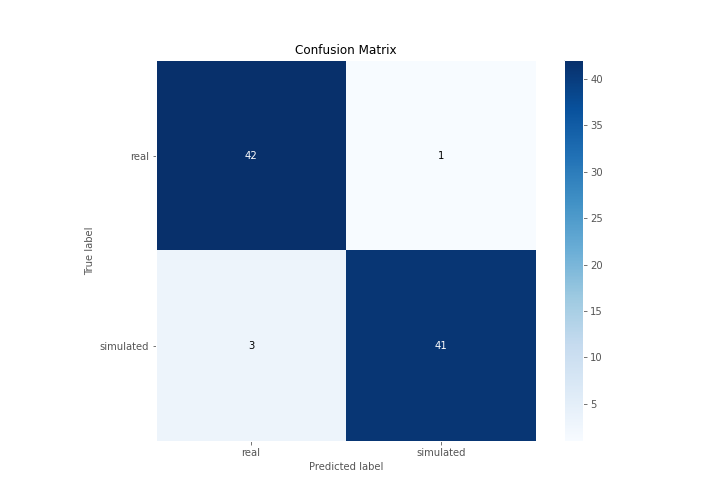

# Summary of 3_Linear

[<< Go back](../README.md)

## Logistic Regression (Linear)
- **n_jobs**: -1
- **explain_level**: 2

## Validation
 - **validation_type**: split
 - **train_ratio**: 0.75
 - **shuffle**: True
 - **stratify**: True

## Optimized metric
accuracy

## Training time

14.2 seconds

## Metric details
|           |    score |     threshold |
|:----------|---------:|--------------:|
| logloss   | 0.264308 | nan           |
| auc       | 0.97093  | nan           |
| f1        | 0.953488 |   0.803273    |
| accuracy  | 0.954023 |   0.803273    |
| precision | 1        |   0.932167    |
| recall    | 1        |   5.11012e-07 |
| mcc       | 0.909043 |   0.803273    |

## Confusion matrix (at threshold=0.803273)
|                      |   Predicted as real |   Predicted as simulated |
|:---------------------|--------------------:|-------------------------:|
| Labeled as real      |                  42 |                        1 |
| Labeled as simulated |                   3 |                       41 |

## Learning curves

## Coefficients
| feature                           |   Learner_1 |
|:----------------------------------|------------:|
| return_autocorrelation_1_lag1     |   0.672715  |
| return_autocorrelation_2_lag2     |   0.671314  |
| return_autocorrelation_2_lag1     |   0.595777  |
| sqreturn_correlation_ts1_lag_1    |   0.577584  |
| return_correlation_ts1_lag_1      |   0.577584  |
| return_autocorrelation_2_lag3     |   0.564781  |
| sqreturn_correlation_ts2_lag_1    |   0.470404  |
| return_correlation_ts2_lag_1      |   0.470404  |
| return_correlation_ts2_lag_3      |   0.348176  |
| sqreturn_correlation_ts2_lag_3    |   0.348176  |
| sqreturn_correlation_ts1_lag_3    |   0.286752  |
| return_correlation_ts1_lag_3      |   0.286752  |
| return_correlation_ts1_lag_2      |   0.201825  |
| sqreturn_correlation_ts1_lag_2    |   0.201825  |
| return_autocorrelation_1_lag3     |   0.189957  |
| sqreturn_correlation_ts2_lag_2    |   0.171251  |
| return_correlation_ts2_lag_2      |   0.171251  |
| return_autocorrelation_1_lag2     |   0.115327  |
| return_skew2                      |   0.0593865 |
| price2_granger_cause_price1       |  -0.0749995 |
| return_mean2                      |  -0.164489  |
| return_sd2                        |  -0.373447  |
| return_sd1                        |  -0.41528   |
| return_correlation_ts1_lag_0      |  -0.454673  |
| sqreturn_correlation_ts1_lag_0    |  -0.454673  |
| return_skew1                      |  -0.52443   |
| sqreturn_autocorrelation_ts2_lag3 |  -0.736487  |
| intercept                         |  -0.773478  |
| return_mean1                      |  -0.798937  |
| price1_granger_cause_price2       |  -0.805228  |
| sqreturn_autocorrelation_ts1_lag3 |  -0.869589  |
| sqreturn_autocorrelation_ts2_lag2 |  -0.875189  |
| sqreturn_autocorrelation_ts2_lag1 |  -1.28789   |
| sqreturn_autocorrelation_ts1_lag1 |  -1.34536   |
| sqreturn_autocorrelation_ts1_lag2 |  -1.37067   |
| return_kurtosis2                  |  -2.69913   |
| return_kurtosis1                  |  -3.99198   |

## Permutation-based Importance

## Confusion Matrix

## Normalized Confusion Matrix

## ROC Curve

## Kolmogorov-Smirnov Statistic

## Precision-Recall Curve

## Calibration Curve

## Cumulative Gains Curve

## Lift Curve

## SHAP Importance

## SHAP Dependence plots

### Dependence (Fold 1)

## SHAP Decision plots

### Top-10 Worst decisions for class 0 (Fold 1)

### Top-10 Best decisions for class 0 (Fold 1)

### Top-10 Worst decisions for class 1 (Fold 1)

### Top-10 Best decisions for class 1 (Fold 1)

[<< Go back](../README.md)
