# Exploratory Data Analysis

[<< Go back](../README.md)
## Feature : target
- **Feature type** : categorical
- **Missing** : 0.0%
- **Unique** : 2
- **Count** :347
- **Unique** :2
- **Top** :simulated
- **Freq** :176

## Feature : return_mean1
- **Feature type** : continous
- **Missing** : 0.0%
- **Unique** : 347
- **Count** :347.0
- **Mean** :0.032136631463871544
- **Std** :0.07489112111670457
- **Min** :-0.17686457077756634
- **25%th Percentile** : -0.012390287757511137
- **50%th Percentile** : 0.032617864555617715
- **75%th Percentile** : 0.07781774882833013
- **Max** :0.3612366374600757

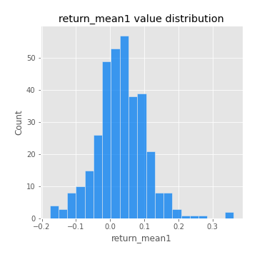
## Feature : return_mean2
- **Feature type** : continous
- **Missing** : 0.0%
- **Unique** : 347
- **Count** :347.0
- **Mean** :0.06632069802390311
- **Std** :0.09139083325147171
- **Min** :-0.24205418062825398
- **25%th Percentile** : 0.016470085597179242
- **50%th Percentile** : 0.06805661259283093
- **75%th Percentile** : 0.11706462859226915
- **Max** :0.57608909083056

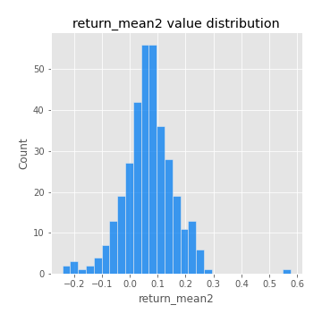
## Feature : return_sd1
- **Feature type** : continous
- **Missing** : 0.0%
- **Unique** : 347
- **Count** :347.0
- **Mean** :1.657401246501386
- **Std** :0.5699972870862489
- **Min** :0.7620831696941981
- **25%th Percentile** : 1.4256472534446099
- **50%th Percentile** : 1.4850352050041513
- **75%th Percentile** : 1.6681739054148195
- **Max** :5.996244884956102

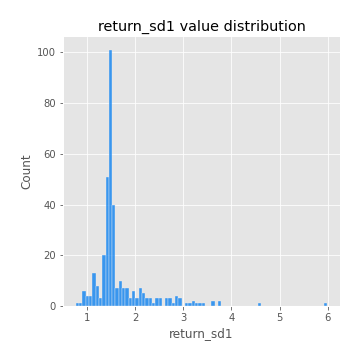
## Feature : return_sd2
- **Feature type** : continous
- **Missing** : 0.0%
- **Unique** : 347
- **Count** :347.0
- **Mean** :1.7043081400760258
- **Std** :0.6226519542254767
- **Min** :0.8455946193085045
- **25%th Percentile** : 1.481404698520957
- **50%th Percentile** : 1.56660122939835
- **75%th Percentile** : 1.6447348121570786
- **Max** :5.762808157208253

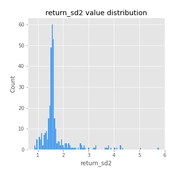
## Feature : return_skew1
- **Feature type** : continous
- **Missing** : 0.0%
- **Unique** : 347
- **Count** :347.0
- **Mean** :-0.1059174062792092
- **Std** :0.5625690448509875
- **Min** :-3.530116233761814
- **25%th Percentile** : -0.2323206824571274
- **50%th Percentile** : -0.05817578880863406
- **75%th Percentile** : 0.0812835306647837
- **Max** :2.5845963767725557

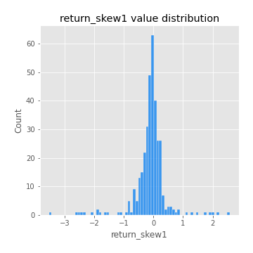
## Feature : return_skew2
- **Feature type** : continous
- **Missing** : 0.0%
- **Unique** : 347
- **Count** :347.0
- **Mean** :-0.24016272728540175
- **Std** :0.7904130848485474
- **Min** :-8.801502855292393
- **25%th Percentile** : -0.3738373353462711
- **50%th Percentile** : -0.13941178058423134
- **75%th Percentile** : 0.04116867110401186
- **Max** :2.123597625075353

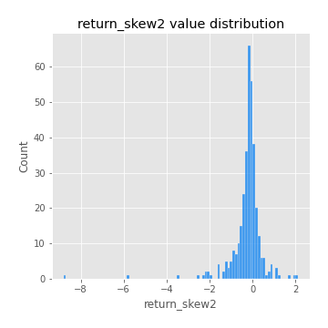
## Feature : return_kurtosis1
- **Feature type** : continous
- **Missing** : 0.0%
- **Unique** : 347
- **Count** :347.0
- **Mean** :3.094473118908412
- **Std** :5.272612348933285
- **Min** :-0.5315862160280829
- **25%th Percentile** : 0.2591565611418214
- **50%th Percentile** : 1.1288324810375587
- **75%th Percentile** : 3.5326987255989466
- **Max** :31.614652972751188

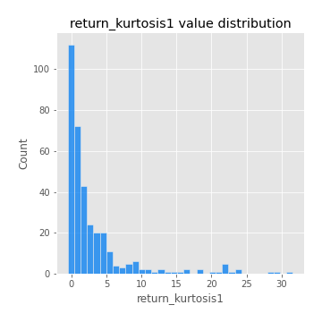
## Feature : return_kurtosis2
- **Feature type** : continous
- **Missing** : 0.0%
- **Unique** : 347
- **Count** :347.0
- **Mean** :4.253878157934092
- **Std** :9.966262503282579
- **Min** :-0.2271589047075624
- **25%th Percentile** : 0.4879398310595138
- **50%th Percentile** : 1.4601274279393972
- **75%th Percentile** : 4.49631400753587
- **Max** :143.10871011533666

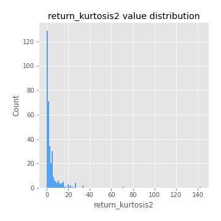
## Feature : return_autocorrelation_1_lag1
- **Feature type** : continous
- **Missing** : 0.0%
- **Unique** : 347
- **Count** :347.0
- **Mean** :-0.011539596797195661
- **Std** :0.058523198684548965
- **Min** :-0.2135576224968752
- **25%th Percentile** : -0.04156368914350424
- **50%th Percentile** : -0.0069089598187218
- **75%th Percentile** : 0.025041944926194534
- **Max** :0.13194694991298028

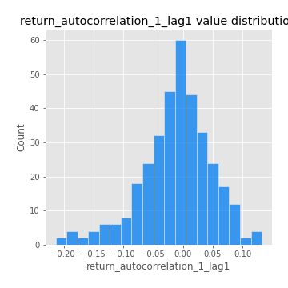
## Feature : return_autocorrelation_1_lag2
- **Feature type** : continous
- **Missing** : 0.0%
- **Unique** : 347
- **Count** :347.0
- **Mean** :-0.004406847132900038
- **Std** :0.0504377093256862
- **Min** :-0.13309283796645122
- **25%th Percentile** : -0.03733367077534049
- **50%th Percentile** : -0.0049484281545922135
- **75%th Percentile** : 0.02768270123928667
- **Max** :0.1561488228015672

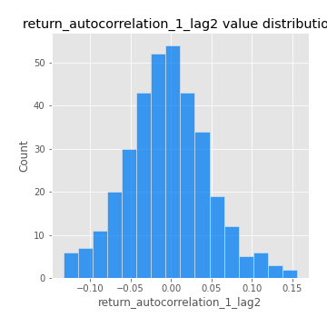
## Feature : return_autocorrelation_1_lag3
- **Feature type** : continous
- **Missing** : 0.0%
- **Unique** : 347
- **Count** :347.0
- **Mean** :-0.001397803845955246
- **Std** :0.05050307495371122
- **Min** :-0.15806635192103805
- **25%th Percentile** : -0.03330886467677123
- **50%th Percentile** : 0.0004661836645243613
- **75%th Percentile** : 0.03251044345650457
- **Max** :0.11028973727744579

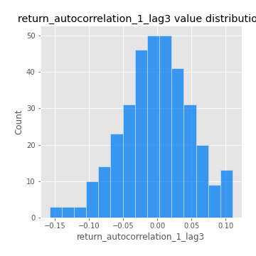
## Feature : return_autocorrelation_2_lag1
- **Feature type** : continous
- **Missing** : 0.0%
- **Unique** : 347
- **Count** :347.0
- **Mean** :-0.0022941922383645235
- **Std** :0.06423696291592867
- **Min** :-0.25075531010123286
- **25%th Percentile** : -0.03536964673702732
- **50%th Percentile** : 8.595759210351794e-05
- **75%th Percentile** : 0.03593637294725418
- **Max** :0.31863413537898483

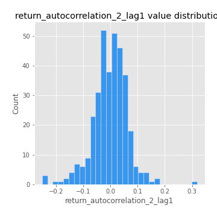
## Feature : return_autocorrelation_2_lag2
- **Feature type** : continous
- **Missing** : 0.0%
- **Unique** : 347
- **Count** :347.0
- **Mean** :0.006173895422329184
- **Std** :0.05161866758032632
- **Min** :-0.15323211089747296
- **25%th Percentile** : -0.028690447125173414
- **50%th Percentile** : 0.00315947754301092
- **75%th Percentile** : 0.04093479034166044
- **Max** :0.20974504043791217

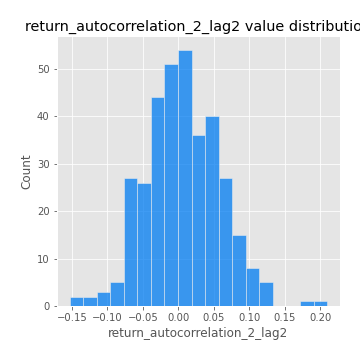
## Feature : return_autocorrelation_2_lag3
- **Feature type** : continous
- **Missing** : 0.0%
- **Unique** : 347
- **Count** :347.0
- **Mean** :0.006276560020967022
- **Std** :0.04992356987349976
- **Min** :-0.14200107169559698
- **25%th Percentile** : -0.025298262747671045
- **50%th Percentile** : 0.007624103856956337
- **75%th Percentile** : 0.03839470148546604
- **Max** :0.1419999376914021

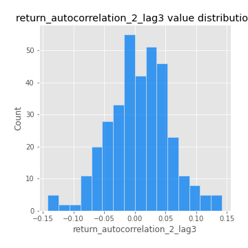
## Feature : return_correlation_ts1_lag_0
- **Feature type** : continous
- **Missing** : 0.0%
- **Unique** : 347
- **Count** :347.0
- **Mean** :0.301572892594889
- **Std** :0.10586650198064486
- **Min** :-0.027089510445801036
- **25%th Percentile** : 0.24890835592891875
- **50%th Percentile** : 0.29500369092730705
- **75%th Percentile** : 0.34263802734150467
- **Max** :0.7041861626832071

## Feature : return_correlation_ts1_lag_1
- **Feature type** : continous
- **Missing** : 0.0%
- **Unique** : 347
- **Count** :347.0
- **Mean** :-0.004662366562029279
- **Std** :0.05014446757277363
- **Min** :-0.16985510949917193
- **25%th Percentile** : -0.03577760168454157
- **50%th Percentile** : 0.0005655201638094093
- **75%th Percentile** : 0.025718962749105966
- **Max** :0.1276603638437794

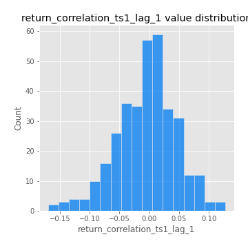
## Feature : return_correlation_ts1_lag_2
- **Feature type** : continous
- **Missing** : 0.0%
- **Unique** : 347
- **Count** :347.0
- **Mean** :0.003172753171711562
- **Std** :0.05169446883588853
- **Min** :-0.21653581047581763
- **25%th Percentile** : -0.026396429155852476
- **50%th Percentile** : 0.0017440570037897262
- **75%th Percentile** : 0.038770139964563605
- **Max** :0.1604133756740899

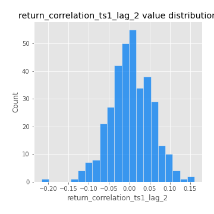
## Feature : return_correlation_ts1_lag_3
- **Feature type** : continous
- **Missing** : 0.0%
- **Unique** : 347
- **Count** :347.0
- **Mean** :0.003978211529384434
- **Std** :0.04892244685789602
- **Min** :-0.1270218498974763
- **25%th Percentile** : -0.02610238231565149
- **50%th Percentile** : 0.005148581441872404
- **75%th Percentile** : 0.03849152362515537
- **Max** :0.1636773216468148

## Feature : return_correlation_ts2_lag_1
- **Feature type** : continous
- **Missing** : 0.0%
- **Unique** : 347
- **Count** :347.0
- **Mean** :-0.0038223166957932152
- **Std** :0.053680276502433684
- **Min** :-0.2081139431093261
- **25%th Percentile** : -0.03607262425525477
- **50%th Percentile** : -0.004748320710641742
- **75%th Percentile** : 0.032687813110969126
- **Max** :0.15094739847740699

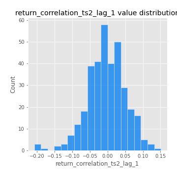
## Feature : return_correlation_ts2_lag_2
- **Feature type** : continous
- **Missing** : 0.0%
- **Unique** : 347
- **Count** :347.0
- **Mean** :0.0009441706833849104
- **Std** :0.05081764625338488
- **Min** :-0.23751835475804678
- **25%th Percentile** : -0.031207810417336355
- **50%th Percentile** : 0.0014973534311158818
- **75%th Percentile** : 0.031084502658678417
- **Max** :0.20772887392904255

## Feature : return_correlation_ts2_lag_3
- **Feature type** : continous
- **Missing** : 0.0%
- **Unique** : 347
- **Count** :347.0
- **Mean** :0.0033372405287378937
- **Std** :0.053260015017565984
- **Min** :-0.17564076057312866
- **25%th Percentile** : -0.02547649602556737
- **50%th Percentile** : 0.0001855608294825282
- **75%th Percentile** : 0.04173117590316934
- **Max** :0.13544475888643778

## Feature : sqreturn_autocorrelation_ts1_lag1
- **Feature type** : continous
- **Missing** : 0.0%
- **Unique** : 347
- **Count** :347.0
- **Mean** :0.050251165838449526
- **Std** :0.09058814195674994
- **Min** :-0.0870230346407592
- **25%th Percentile** : -0.009420920593742138
- **50%th Percentile** : 0.027732406689210256
- **75%th Percentile** : 0.0879243935161117
- **Max** :0.49414293176447355

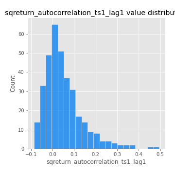
## Feature : sqreturn_autocorrelation_ts1_lag2
- **Feature type** : continous
- **Missing** : 0.0%
- **Unique** : 347
- **Count** :347.0
- **Mean** :0.03899391774398
- **Std** :0.09029323563290959
- **Min** :-0.12655295928812846
- **25%th Percentile** : -0.012545626021723075
- **50%th Percentile** : 0.014380362303649271
- **75%th Percentile** : 0.061949495195347995
- **Max** :0.540735851444759

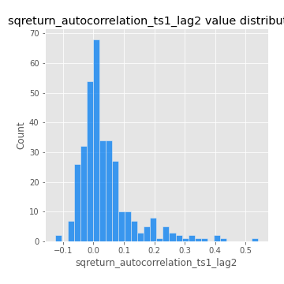
## Feature : sqreturn_autocorrelation_ts1_lag3
- **Feature type** : continous
- **Missing** : 0.0%
- **Unique** : 347
- **Count** :347.0
- **Mean** :0.028834277225311955
- **Std** :0.0743892759712437
- **Min** :-0.10142541449915922
- **25%th Percentile** : -0.016958850745120373
- **50%th Percentile** : 0.010635001577018357
- **75%th Percentile** : 0.05606983267386223
- **Max** :0.3457940197475473

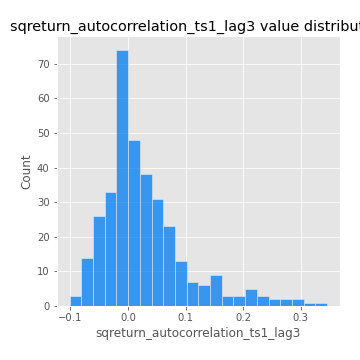
## Feature : sqreturn_autocorrelation_ts2_lag1
- **Feature type** : continous
- **Missing** : 0.0%
- **Unique** : 347
- **Count** :347.0
- **Mean** :0.04381438667581349
- **Std** :0.08760277764179415
- **Min** :-0.1126351242379362
- **25%th Percentile** : -0.011929441547537696
- **50%th Percentile** : 0.020681759813863734
- **75%th Percentile** : 0.07317653774074089
- **Max** :0.510085647437958

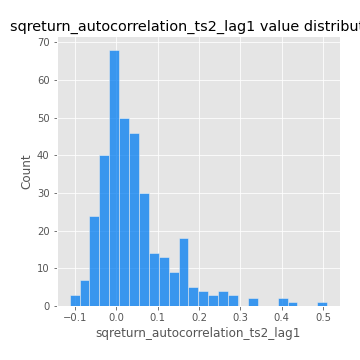
## Feature : sqreturn_autocorrelation_ts2_lag2
- **Feature type** : continous
- **Missing** : 0.0%
- **Unique** : 347
- **Count** :347.0
- **Mean** :0.039374429358234285
- **Std** :0.08297456739366862
- **Min** :-0.10357275523149592
- **25%th Percentile** : -0.008535713074177841
- **50%th Percentile** : 0.01814012081111259
- **75%th Percentile** : 0.057620366262740315
- **Max** :0.5373432415582473

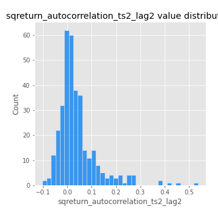
## Feature : sqreturn_autocorrelation_ts2_lag3
- **Feature type** : continous
- **Missing** : 0.0%
- **Unique** : 347
- **Count** :347.0
- **Mean** :0.02910050992166778
- **Std** :0.06776113578567035
- **Min** :-0.08480215571732319
- **25%th Percentile** : -0.018892355527149587
- **50%th Percentile** : 0.016228865068354584
- **75%th Percentile** : 0.05788840885463428
- **Max** :0.31225727797735664

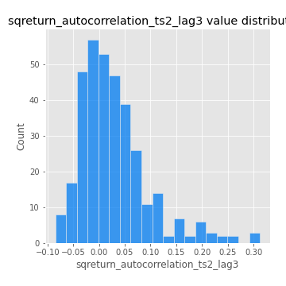
## Feature : sqreturn_correlation_ts1_lag_0
- **Feature type** : continous
- **Missing** : 0.0%
- **Unique** : 347
- **Count** :347.0
- **Mean** :0.301572892594889
- **Std** :0.10586650198064486
- **Min** :-0.027089510445801036
- **25%th Percentile** : 0.24890835592891875
- **50%th Percentile** : 0.29500369092730705
- **75%th Percentile** : 0.34263802734150467
- **Max** :0.7041861626832071

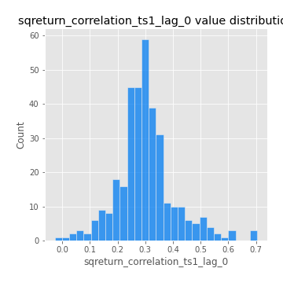
## Feature : sqreturn_correlation_ts1_lag_1
- **Feature type** : continous
- **Missing** : 0.0%
- **Unique** : 347
- **Count** :347.0
- **Mean** :-0.004662366562029279
- **Std** :0.05014446757277363
- **Min** :-0.16985510949917193
- **25%th Percentile** : -0.03577760168454157
- **50%th Percentile** : 0.0005655201638094093
- **75%th Percentile** : 0.025718962749105966
- **Max** :0.1276603638437794

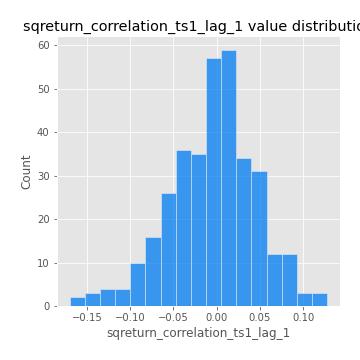
## Feature : sqreturn_correlation_ts1_lag_2
- **Feature type** : continous
- **Missing** : 0.0%
- **Unique** : 347
- **Count** :347.0
- **Mean** :0.003172753171711562
- **Std** :0.05169446883588853
- **Min** :-0.21653581047581763
- **25%th Percentile** : -0.026396429155852476
- **50%th Percentile** : 0.0017440570037897262
- **75%th Percentile** : 0.038770139964563605
- **Max** :0.1604133756740899

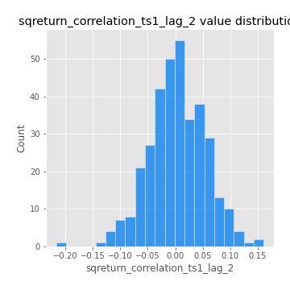
## Feature : sqreturn_correlation_ts1_lag_3
- **Feature type** : continous
- **Missing** : 0.0%
- **Unique** : 347
- **Count** :347.0
- **Mean** :0.003978211529384434
- **Std** :0.04892244685789602
- **Min** :-0.1270218498974763
- **25%th Percentile** : -0.02610238231565149
- **50%th Percentile** : 0.005148581441872404
- **75%th Percentile** : 0.03849152362515537
- **Max** :0.1636773216468148

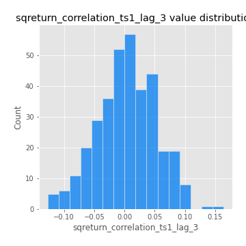
## Feature : sqreturn_correlation_ts2_lag_1
- **Feature type** : continous
- **Missing** : 0.0%
- **Unique** : 347
- **Count** :347.0
- **Mean** :-0.0038223166957932152
- **Std** :0.053680276502433684
- **Min** :-0.2081139431093261
- **25%th Percentile** : -0.03607262425525477
- **50%th Percentile** : -0.004748320710641742
- **75%th Percentile** : 0.032687813110969126
- **Max** :0.15094739847740699

## Feature : sqreturn_correlation_ts2_lag_2
- **Feature type** : continous
- **Missing** : 0.0%
- **Unique** : 347
- **Count** :347.0
- **Mean** :0.0009441706833849104
- **Std** :0.05081764625338488
- **Min** :-0.23751835475804678
- **25%th Percentile** : -0.031207810417336355
- **50%th Percentile** : 0.0014973534311158818
- **75%th Percentile** : 0.031084502658678417
- **Max** :0.20772887392904255

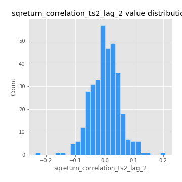
## Feature : sqreturn_correlation_ts2_lag_3
- **Feature type** : continous
- **Missing** : 0.0%
- **Unique** : 347
- **Count** :347.0
- **Mean** :0.0033372405287378937
- **Std** :0.053260015017565984
- **Min** :-0.17564076057312866
- **25%th Percentile** : -0.02547649602556737
- **50%th Percentile** : 0.0001855608294825282
- **75%th Percentile** : 0.04173117590316934
- **Max** :0.13544475888643778

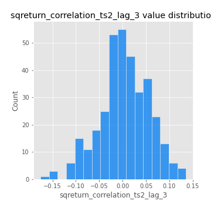
## Feature : price2_granger_cause_price1
- **Feature type** : continous
- **Missing** : 0.0%
- **Unique** : 347
- **Count** :347.0
- **Mean** :0.3230983410881687
- **Std** :0.3017103600897957
- **Min** :2.3819542737145513e-06
- **25%th Percentile** : 0.04384542834959415
- **50%th Percentile** : 0.23992031010262657
- **75%th Percentile** : 0.5646884810278815
- **Max** :0.9909790457463727

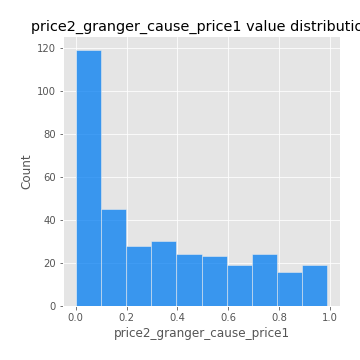
## Feature : price1_granger_cause_price2
- **Feature type** : continous
- **Missing** : 0.0%
- **Unique** : 347
- **Count** :347.0
- **Mean** :0.2810880827200668
- **Std** :0.2813658134251491
- **Min** :4.71242454239308e-12
- **25%th Percentile** : 0.024730333472188934
- **50%th Percentile** : 0.1943481954895575
- **75%th Percentile** : 0.48561533662077633
- **Max** :0.9951398266867577

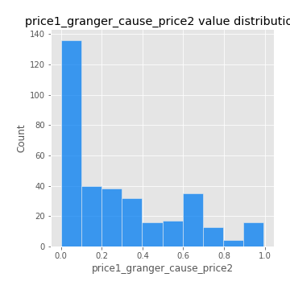

[<< Go back](../README.md)
