# Exploratory Data Analysis

[<< Go back](../README.md)
## Feature : target
- **Feature type** : categorical
- **Missing** : 0.0%
- **Unique** : 2
- **Count** :347
- **Unique** :2
- **Top** :simulated
- **Freq** :174

## Feature : return_mean1
- **Feature type** : continous
- **Missing** : 0.0%
- **Unique** : 347
- **Count** :347.0
- **Mean** :0.03437707559165589
- **Std** :0.07639593088366804
- **Min** :-0.22632637961920957
- **25%th Percentile** : -0.013504916482264737
- **50%th Percentile** : 0.038289859150597884
- **75%th Percentile** : 0.08177998705214462
- **Max** :0.37175100008111034

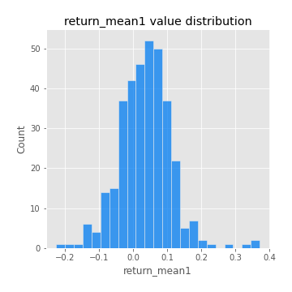
## Feature : return_mean2
- **Feature type** : continous
- **Missing** : 0.0%
- **Unique** : 347
- **Count** :347.0
- **Mean** :0.070273948395106
- **Std** :0.09122247008135231
- **Min** :-0.24205418062825398
- **25%th Percentile** : 0.015453294527313926
- **50%th Percentile** : 0.07184066115911249
- **75%th Percentile** : 0.12724515435137113
- **Max** :0.37616608147096464

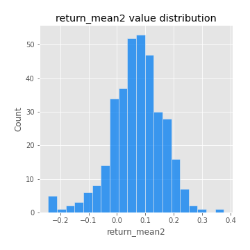
## Feature : return_sd1
- **Feature type** : continous
- **Missing** : 0.0%
- **Unique** : 347
- **Count** :347.0
- **Mean** :1.704024608920151
- **Std** :0.7698556864409178
- **Min** :0.7470080772831957
- **25%th Percentile** : 1.4126136558325881
- **50%th Percentile** : 1.4931063662339061
- **75%th Percentile** : 1.6603533938685944
- **Max** :9.236766377527575

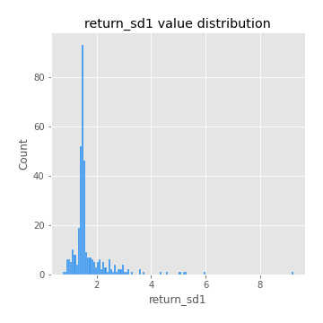
## Feature : return_sd2
- **Feature type** : continous
- **Missing** : 0.0%
- **Unique** : 347
- **Count** :347.0
- **Mean** :1.7436249652150035
- **Std** :0.6695353631716563
- **Min** :0.8455946193085045
- **25%th Percentile** : 1.4916624849098543
- **50%th Percentile** : 1.5592251839956146
- **75%th Percentile** : 1.6568701162776762
- **Max** :5.872800253666788

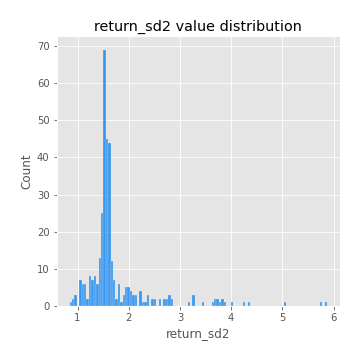
## Feature : return_skew1
- **Feature type** : continous
- **Missing** : 0.0%
- **Unique** : 347
- **Count** :347.0
- **Mean** :-0.09317970359622905
- **Std** :0.5839461548180079
- **Min** :-3.453087436558107
- **25%th Percentile** : -0.23933790180027237
- **50%th Percentile** : -0.061041326381368666
- **75%th Percentile** : 0.09416027319253192
- **Max** :2.5845963767725557

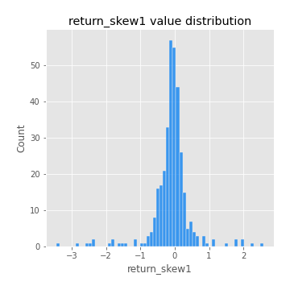
## Feature : return_skew2
- **Feature type** : continous
- **Missing** : 0.0%
- **Unique** : 347
- **Count** :347.0
- **Mean** :-0.22823311537311564
- **Std** :0.8113217525569362
- **Min** :-8.801502855292393
- **25%th Percentile** : -0.34837144935524356
- **50%th Percentile** : -0.14208881419147903
- **75%th Percentile** : 0.036766866427318703
- **Max** :2.2606839051517187

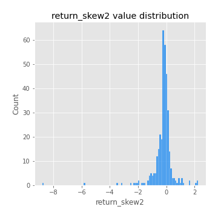
## Feature : return_kurtosis1
- **Feature type** : continous
- **Missing** : 0.0%
- **Unique** : 347
- **Count** :347.0
- **Mean** :3.3253566210363856
- **Std** :6.013521462165516
- **Min** :-0.3653062917477943
- **25%th Percentile** : 0.246340834989889
- **50%th Percentile** : 1.1311406423292962
- **75%th Percentile** : 3.601784904080982
- **Max** :46.07507808162177

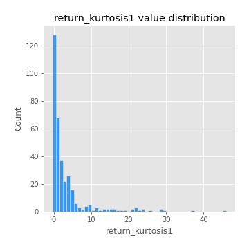
## Feature : return_kurtosis2
- **Feature type** : continous
- **Missing** : 0.0%
- **Unique** : 347
- **Count** :347.0
- **Mean** :4.182834480812468
- **Std** :10.254888603731521
- **Min** :-0.38903733358592296
- **25%th Percentile** : 0.4488446458384916
- **50%th Percentile** : 1.495181828389176
- **75%th Percentile** : 4.063516554723738
- **Max** :143.10871011533666

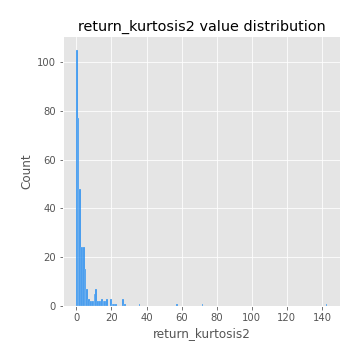
## Feature : return_autocorrelation_1_lag1
- **Feature type** : continous
- **Missing** : 0.0%
- **Unique** : 347
- **Count** :347.0
- **Mean** :-0.009759405038927695
- **Std** :0.05642430248094503
- **Min** :-0.2135576224968752
- **25%th Percentile** : -0.03987518388281227
- **50%th Percentile** : -0.004456277573547255
- **75%th Percentile** : 0.0272210472994283
- **Max** :0.1253959753011446

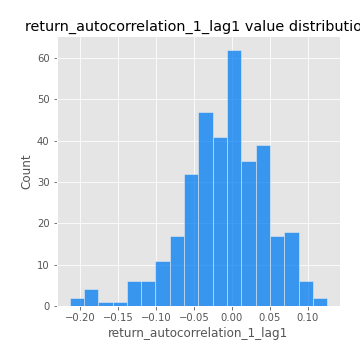
## Feature : return_autocorrelation_1_lag2
- **Feature type** : continous
- **Missing** : 0.0%
- **Unique** : 347
- **Count** :347.0
- **Mean** :-0.004106075239522012
- **Std** :0.04941213421176796
- **Min** :-0.13309283796645122
- **25%th Percentile** : -0.03609975619627068
- **50%th Percentile** : -0.0016392323698294076
- **75%th Percentile** : 0.025866197534084784
- **Max** :0.1561488228015672

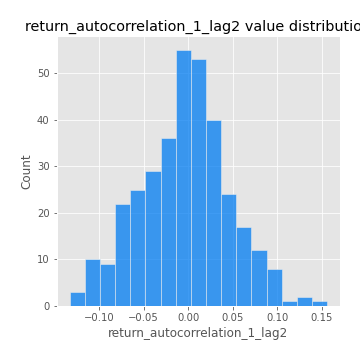
## Feature : return_autocorrelation_1_lag3
- **Feature type** : continous
- **Missing** : 0.0%
- **Unique** : 347
- **Count** :347.0
- **Mean** :-9.530142326214171e-05
- **Std** :0.04859001400161697
- **Min** :-0.15806635192103805
- **25%th Percentile** : -0.028434954744011705
- **50%th Percentile** : -0.001593208013365921
- **75%th Percentile** : 0.03442332029651173
- **Max** :0.11028973727744579

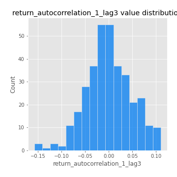
## Feature : return_autocorrelation_2_lag1
- **Feature type** : continous
- **Missing** : 0.0%
- **Unique** : 347
- **Count** :347.0
- **Mean** :0.0010287500131868192
- **Std** :0.0625168479588126
- **Min** :-0.25075531010123286
- **25%th Percentile** : -0.03332149697852948
- **50%th Percentile** : 0.0041530778468522635
- **75%th Percentile** : 0.037276385732258374
- **Max** :0.31863413537898483

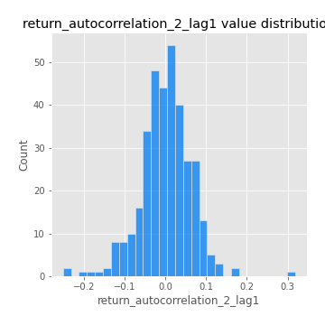
## Feature : return_autocorrelation_2_lag2
- **Feature type** : continous
- **Missing** : 0.0%
- **Unique** : 347
- **Count** :347.0
- **Mean** :0.006270275060256777
- **Std** :0.05352469598910227
- **Min** :-0.1495113937562178
- **25%th Percentile** : -0.03157731268115359
- **50%th Percentile** : 0.0030236852298292133
- **75%th Percentile** : 0.041459250095632394
- **Max** :0.20974504043791217

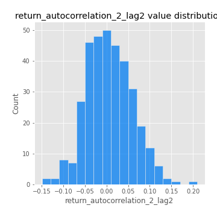
## Feature : return_autocorrelation_2_lag3
- **Feature type** : continous
- **Missing** : 0.0%
- **Unique** : 347
- **Count** :347.0
- **Mean** :0.005673682214737682
- **Std** :0.04936483635193588
- **Min** :-0.14200107169559698
- **25%th Percentile** : -0.02499352450346152
- **50%th Percentile** : 0.008730277904844664
- **75%th Percentile** : 0.04078198185162994
- **Max** :0.1419999376914021

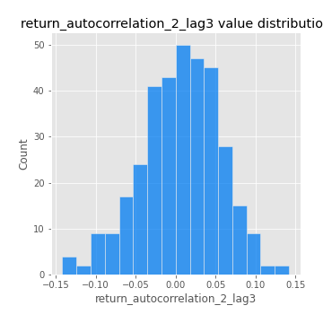
## Feature : return_correlation_ts1_lag_0
- **Feature type** : continous
- **Missing** : 0.0%
- **Unique** : 347
- **Count** :347.0
- **Mean** :0.3036691118635772
- **Std** :0.11103256993182532
- **Min** :-0.027089510445801036
- **25%th Percentile** : 0.2456105187419913
- **50%th Percentile** : 0.2958360320274376
- **75%th Percentile** : 0.3456255591519386
- **Max** :0.7041861626832071

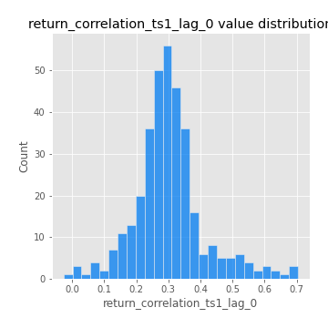
## Feature : return_correlation_ts1_lag_1
- **Feature type** : continous
- **Missing** : 0.0%
- **Unique** : 347
- **Count** :347.0
- **Mean** :-0.003319563979783254
- **Std** :0.05124479567101426
- **Min** :-0.16985510949917193
- **25%th Percentile** : -0.03614233149943449
- **50%th Percentile** : 0.0005310182185618581
- **75%th Percentile** : 0.031663994901121484
- **Max** :0.15499424718508623

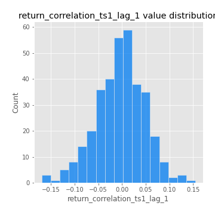
## Feature : return_correlation_ts1_lag_2
- **Feature type** : continous
- **Missing** : 0.0%
- **Unique** : 347
- **Count** :347.0
- **Mean** :0.0009326037588975119
- **Std** :0.048764836809291785
- **Min** :-0.21653581047581763
- **25%th Percentile** : -0.03153112807390496
- **50%th Percentile** : 0.00038040690802629284
- **75%th Percentile** : 0.03375729248135698
- **Max** :0.1428075966022225

## Feature : return_correlation_ts1_lag_3
- **Feature type** : continous
- **Missing** : 0.0%
- **Unique** : 347
- **Count** :347.0
- **Mean** :0.00044046281209184616
- **Std** :0.050029793501104675
- **Min** :-0.1270218498974763
- **25%th Percentile** : -0.029264705275287343
- **50%th Percentile** : -0.001683012959255012
- **75%th Percentile** : 0.035772782490547286
- **Max** :0.1422809271770942

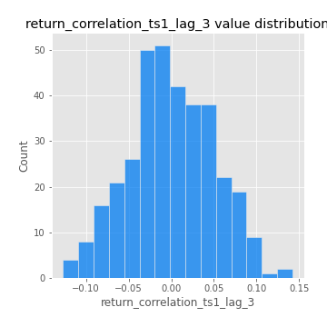
## Feature : return_correlation_ts2_lag_1
- **Feature type** : continous
- **Missing** : 0.0%
- **Unique** : 347
- **Count** :347.0
- **Mean** :-0.002336621754193891
- **Std** :0.051578344354061126
- **Min** :-0.2081139431093261
- **25%th Percentile** : -0.03607262425525477
- **50%th Percentile** : -0.0006092728712045001
- **75%th Percentile** : 0.03307954543242908
- **Max** :0.17208763791364762

## Feature : return_correlation_ts2_lag_2
- **Feature type** : continous
- **Missing** : 0.0%
- **Unique** : 347
- **Count** :347.0
- **Mean** :0.002239589585207881
- **Std** :0.04943989191930778
- **Min** :-0.23751835475804678
- **25%th Percentile** : -0.03086244277013532
- **50%th Percentile** : 0.0007157845891024112
- **75%th Percentile** : 0.03459956427794636
- **Max** :0.20772887392904255

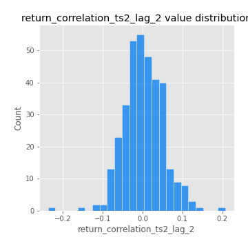
## Feature : return_correlation_ts2_lag_3
- **Feature type** : continous
- **Missing** : 0.0%
- **Unique** : 347
- **Count** :347.0
- **Mean** :-0.0006327544199060476
- **Std** :0.051104818083704324
- **Min** :-0.17564076057312866
- **25%th Percentile** : -0.0280203041583187
- **50%th Percentile** : -0.0016874913516673263
- **75%th Percentile** : 0.03393817548390328
- **Max** :0.14108155832909527

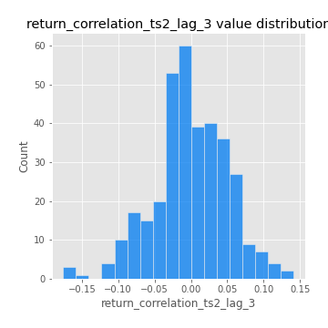
## Feature : sqreturn_autocorrelation_ts1_lag1
- **Feature type** : continous
- **Missing** : 0.0%
- **Unique** : 347
- **Count** :347.0
- **Mean** :0.04595830417493151
- **Std** :0.09066551684316017
- **Min** :-0.09928021332546044
- **25%th Percentile** : -0.010242175155184946
- **50%th Percentile** : 0.027669307176337657
- **75%th Percentile** : 0.08200127571238136
- **Max** :0.49414293176447355

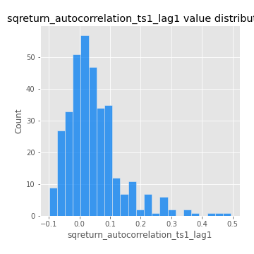
## Feature : sqreturn_autocorrelation_ts1_lag2
- **Feature type** : continous
- **Missing** : 0.0%
- **Unique** : 347
- **Count** :347.0
- **Mean** :0.040875101419099794
- **Std** :0.08971058002331134
- **Min** :-0.12141173101015199
- **25%th Percentile** : -0.014544876568116394
- **50%th Percentile** : 0.01742381197615294
- **75%th Percentile** : 0.0696559184508685
- **Max** :0.540735851444759

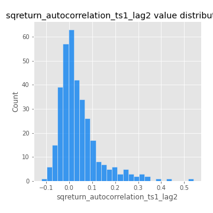
## Feature : sqreturn_autocorrelation_ts1_lag3
- **Feature type** : continous
- **Missing** : 0.0%
- **Unique** : 347
- **Count** :347.0
- **Mean** :0.03579552457817253
- **Std** :0.07489832680249411
- **Min** :-0.09360771208696489
- **25%th Percentile** : -0.011771008615243373
- **50%th Percentile** : 0.017114069839606446
- **75%th Percentile** : 0.06333799669581507
- **Max** :0.3457940197475473

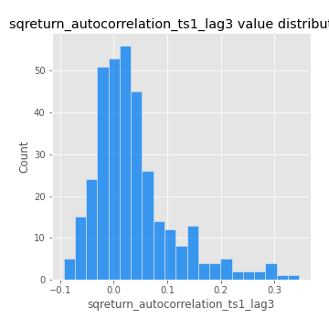
## Feature : sqreturn_autocorrelation_ts2_lag1
- **Feature type** : continous
- **Missing** : 0.0%
- **Unique** : 347
- **Count** :347.0
- **Mean** :0.05298638961680651
- **Std** :0.08721381848667169
- **Min** :-0.09321232014116258
- **25%th Percentile** : -0.0033247460821855084
- **50%th Percentile** : 0.027439035955657734
- **75%th Percentile** : 0.08904466683541362
- **Max** :0.510085647437958

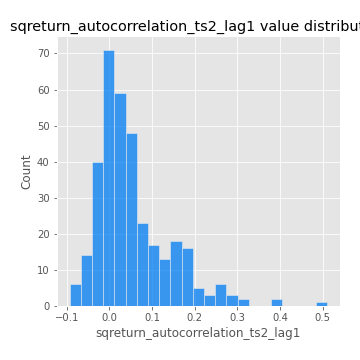
## Feature : sqreturn_autocorrelation_ts2_lag2
- **Feature type** : continous
- **Missing** : 0.0%
- **Unique** : 347
- **Count** :347.0
- **Mean** :0.037837338363916236
- **Std** :0.08453601424339054
- **Min** :-0.08852848301857603
- **25%th Percentile** : -0.012320669569373976
- **50%th Percentile** : 0.0172102814136282
- **75%th Percentile** : 0.05826215064567235
- **Max** :0.5373432415582473

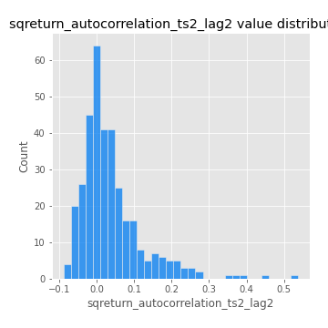
## Feature : sqreturn_autocorrelation_ts2_lag3
- **Feature type** : continous
- **Missing** : 0.0%
- **Unique** : 347
- **Count** :347.0
- **Mean** :0.026313065373810802
- **Std** :0.06774740186962117
- **Min** :-0.0921978462355466
- **25%th Percentile** : -0.015522682452251704
- **50%th Percentile** : 0.01362892958588456
- **75%th Percentile** : 0.05072551628207648
- **Max** :0.31225727797735664

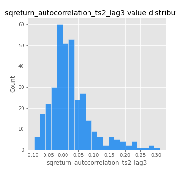
## Feature : sqreturn_correlation_ts1_lag_0
- **Feature type** : continous
- **Missing** : 0.0%
- **Unique** : 347
- **Count** :347.0
- **Mean** :0.3036691118635772
- **Std** :0.11103256993182532
- **Min** :-0.027089510445801036
- **25%th Percentile** : 0.2456105187419913
- **50%th Percentile** : 0.2958360320274376
- **75%th Percentile** : 0.3456255591519386
- **Max** :0.7041861626832071

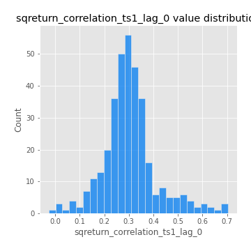
## Feature : sqreturn_correlation_ts1_lag_1
- **Feature type** : continous
- **Missing** : 0.0%
- **Unique** : 347
- **Count** :347.0
- **Mean** :-0.003319563979783254
- **Std** :0.05124479567101426
- **Min** :-0.16985510949917193
- **25%th Percentile** : -0.03614233149943449
- **50%th Percentile** : 0.0005310182185618581
- **75%th Percentile** : 0.031663994901121484
- **Max** :0.15499424718508623

## Feature : sqreturn_correlation_ts1_lag_2
- **Feature type** : continous
- **Missing** : 0.0%
- **Unique** : 347
- **Count** :347.0
- **Mean** :0.0009326037588975119
- **Std** :0.048764836809291785
- **Min** :-0.21653581047581763
- **25%th Percentile** : -0.03153112807390496
- **50%th Percentile** : 0.00038040690802629284
- **75%th Percentile** : 0.03375729248135698
- **Max** :0.1428075966022225

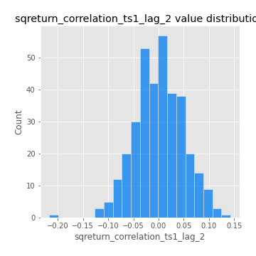
## Feature : sqreturn_correlation_ts1_lag_3
- **Feature type** : continous
- **Missing** : 0.0%
- **Unique** : 347
- **Count** :347.0
- **Mean** :0.00044046281209184616
- **Std** :0.050029793501104675
- **Min** :-0.1270218498974763
- **25%th Percentile** : -0.029264705275287343
- **50%th Percentile** : -0.001683012959255012
- **75%th Percentile** : 0.035772782490547286
- **Max** :0.1422809271770942

## Feature : sqreturn_correlation_ts2_lag_1
- **Feature type** : continous
- **Missing** : 0.0%
- **Unique** : 347
- **Count** :347.0
- **Mean** :-0.002336621754193891
- **Std** :0.051578344354061126
- **Min** :-0.2081139431093261
- **25%th Percentile** : -0.03607262425525477
- **50%th Percentile** : -0.0006092728712045001
- **75%th Percentile** : 0.03307954543242908
- **Max** :0.17208763791364762

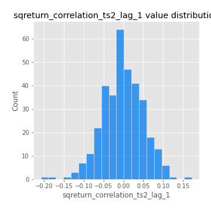
## Feature : sqreturn_correlation_ts2_lag_2
- **Feature type** : continous
- **Missing** : 0.0%
- **Unique** : 347
- **Count** :347.0
- **Mean** :0.002239589585207881
- **Std** :0.04943989191930778
- **Min** :-0.23751835475804678
- **25%th Percentile** : -0.03086244277013532
- **50%th Percentile** : 0.0007157845891024112
- **75%th Percentile** : 0.03459956427794636
- **Max** :0.20772887392904255

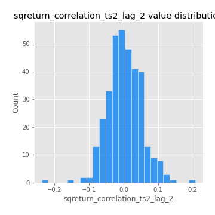
## Feature : sqreturn_correlation_ts2_lag_3
- **Feature type** : continous
- **Missing** : 0.0%
- **Unique** : 347
- **Count** :347.0
- **Mean** :-0.0006327544199060476
- **Std** :0.051104818083704324
- **Min** :-0.17564076057312866
- **25%th Percentile** : -0.0280203041583187
- **50%th Percentile** : -0.0016874913516673263
- **75%th Percentile** : 0.03393817548390328
- **Max** :0.14108155832909527

## Feature : price2_granger_cause_price1
- **Feature type** : continous
- **Missing** : 0.0%
- **Unique** : 347
- **Count** :347.0
- **Mean** :0.2975136812615583
- **Std** :0.2826567771082292
- **Min** :1.1505642493585304e-05
- **25%th Percentile** : 0.04338069803549434
- **50%th Percentile** : 0.21454850914514875
- **75%th Percentile** : 0.4882233622144242
- **Max** :0.9985079073459048

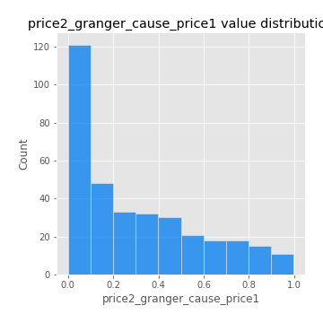
## Feature : price1_granger_cause_price2
- **Feature type** : continous
- **Missing** : 0.0%
- **Unique** : 347
- **Count** :347.0
- **Mean** :0.27865608833098965
- **Std** :0.2880170270094982
- **Min** :8.766948302798326e-09
- **25%th Percentile** : 0.025468595380320806
- **50%th Percentile** : 0.17536374690036427
- **75%th Percentile** : 0.45729358612745963
- **Max** :0.9977524166743601

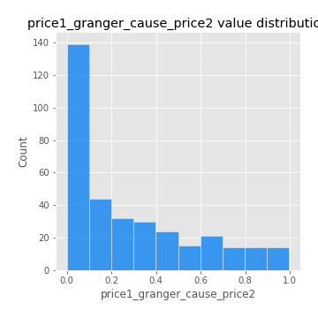

[<< Go back](../README.md)
