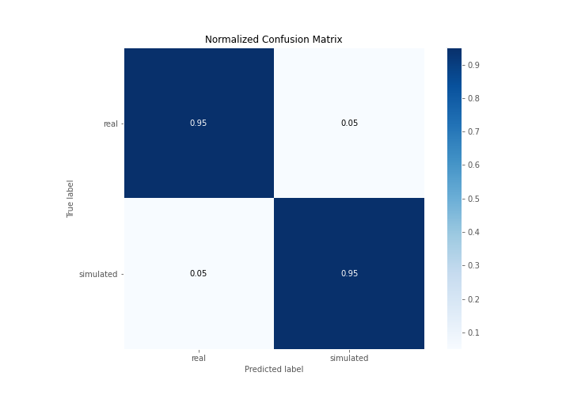

# Summary of 3_Linear

[<< Go back](../README.md)

## Logistic Regression (Linear)
- **n_jobs**: -1
- **explain_level**: 2

## Validation
 - **validation_type**: split
 - **train_ratio**: 0.75
 - **shuffle**: True
 - **stratify**: True

## Optimized metric
accuracy

## Training time

15.4 seconds

## Metric details
|           |    score |     threshold |
|:----------|---------:|--------------:|
| logloss   | 0.258359 | nan           |
| auc       | 0.968816 | nan           |
| f1        | 0.954545 |   0.495774    |
| accuracy  | 0.954023 |   0.495774    |
| precision | 1        |   0.903374    |
| recall    | 1        |   1.15435e-09 |
| mcc       | 0.909043 |   0.613474    |

## Confusion matrix (at threshold=0.495774)
|                      |   Predicted as real |   Predicted as simulated |
|:---------------------|--------------------:|-------------------------:|
| Labeled as real      |                  41 |                        2 |
| Labeled as simulated |                   2 |                       42 |

## Learning curves

## Coefficients
| feature                           |   Learner_1 |
|:----------------------------------|------------:|
| return_autocorrelation_2_lag1     |   0.646862  |
| return_autocorrelation_2_lag3     |   0.48827   |
| return_autocorrelation_2_lag2     |   0.412717  |
| sqreturn_correlation_ts2_lag_3    |   0.318016  |
| return_correlation_ts2_lag_3      |   0.318016  |
| return_correlation_ts1_lag_1      |   0.312284  |
| sqreturn_correlation_ts1_lag_1    |   0.312284  |
| sqreturn_correlation_ts2_lag_1    |   0.299176  |
| return_correlation_ts2_lag_1      |   0.299176  |
| return_autocorrelation_1_lag1     |   0.263469  |
| return_mean2                      |   0.212437  |
| return_correlation_ts1_lag_2      |   0.16872   |
| sqreturn_correlation_ts1_lag_2    |   0.16872   |
| return_correlation_ts1_lag_3      |   0.166132  |
| sqreturn_correlation_ts1_lag_3    |   0.166132  |
| return_autocorrelation_1_lag2     |   0.157442  |
| return_skew2                      |   0.0838865 |
| sqreturn_correlation_ts2_lag_2    |   0.052757  |
| return_correlation_ts2_lag_2      |   0.052757  |
| return_autocorrelation_1_lag3     |  -0.0363535 |
| price2_granger_cause_price1       |  -0.214034  |
| return_sd1                        |  -0.305616  |
| return_correlation_ts1_lag_0      |  -0.389206  |
| sqreturn_correlation_ts1_lag_0    |  -0.389206  |
| return_sd2                        |  -0.492524  |
| return_mean1                      |  -0.575351  |
| price1_granger_cause_price2       |  -0.581855  |
| return_skew1                      |  -0.609859  |
| sqreturn_autocorrelation_ts2_lag3 |  -0.65021   |
| sqreturn_autocorrelation_ts2_lag2 |  -0.869345  |
| sqreturn_autocorrelation_ts1_lag3 |  -0.965284  |
| intercept                         |  -1.02991   |
| sqreturn_autocorrelation_ts2_lag1 |  -1.09606   |
| sqreturn_autocorrelation_ts1_lag2 |  -1.27774   |
| sqreturn_autocorrelation_ts1_lag1 |  -1.381     |
| return_kurtosis2                  |  -2.98221   |
| return_kurtosis1                  |  -4.139     |

## Permutation-based Importance

## Confusion Matrix

## Normalized Confusion Matrix

## ROC Curve

## Kolmogorov-Smirnov Statistic

## Precision-Recall Curve

## Calibration Curve

## Cumulative Gains Curve

## Lift Curve

## SHAP Importance

## SHAP Dependence plots

### Dependence (Fold 1)

## SHAP Decision plots

### Top-10 Worst decisions for class 0 (Fold 1)

### Top-10 Best decisions for class 0 (Fold 1)

### Top-10 Worst decisions for class 1 (Fold 1)

### Top-10 Best decisions for class 1 (Fold 1)

[<< Go back](../README.md)
