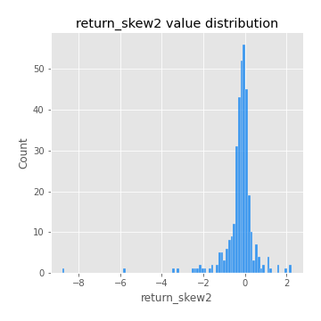
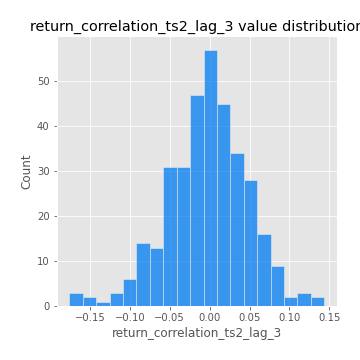

# Exploratory Data Analysis

[<< Go back](../README.md)
## Feature : target
- **Feature type** : categorical
- **Missing** : 0.0%
- **Unique** : 2
- **Count** :347
- **Unique** :2
- **Top** :simulated
- **Freq** :174

## Feature : return_mean1
- **Feature type** : continous
- **Missing** : 0.0%
- **Unique** : 347
- **Count** :347.0
- **Mean** :0.033017141361218895
- **Std** :0.07864505131326857
- **Min** :-0.22632637961920957
- **25%th Percentile** : -0.013504916482264737
- **50%th Percentile** : 0.03421584190676087
- **75%th Percentile** : 0.08341091638887793
- **Max** :0.37175100008111034

## Feature : return_mean2
- **Feature type** : continous
- **Missing** : 0.0%
- **Unique** : 347
- **Count** :347.0
- **Mean** :0.06786581914659869
- **Std** :0.0939417668824391
- **Min** :-0.24205418062825398
- **25%th Percentile** : 0.018573938088724574
- **50%th Percentile** : 0.06495753998891357
- **75%th Percentile** : 0.1195739407994777
- **Max** :0.44213088847164844

## Feature : return_sd1
- **Feature type** : continous
- **Missing** : 0.0%
- **Unique** : 347
- **Count** :347.0
- **Mean** :1.7001920326319564
- **Std** :0.7476618558392077
- **Min** :0.7470080772831957
- **25%th Percentile** : 1.4146687555084878
- **50%th Percentile** : 1.4896723785706854
- **75%th Percentile** : 1.6761094071152032
- **Max** :9.236766377527575

## Feature : return_sd2
- **Feature type** : continous
- **Missing** : 0.0%
- **Unique** : 347
- **Count** :347.0
- **Mean** :1.7865376530704493
- **Std** :0.7570303806608367
- **Min** :0.8455946193085045
- **25%th Percentile** : 1.4976229496645637
- **50%th Percentile** : 1.5702570917718475
- **75%th Percentile** : 1.7188535719246139
- **Max** :6.737618636746393

## Feature : return_skew1
- **Feature type** : continous
- **Missing** : 0.0%
- **Unique** : 347
- **Count** :347.0
- **Mean** :-0.12449906218795298
- **Std** :0.5921508732070055
- **Min** :-3.530116233761814
- **25%th Percentile** : -0.2547685871030506
- **50%th Percentile** : -0.06458656373723669
- **75%th Percentile** : 0.06803901341876019
- **Max** :2.5845963767725557

## Feature : return_skew2
- **Feature type** : continous
- **Missing** : 0.0%
- **Unique** : 347
- **Count** :347.0
- **Mean** :-0.22471637109164844
- **Std** :0.8241080600195024
- **Min** :-8.801502855292393
- **25%th Percentile** : -0.3637767961712771
- **50%th Percentile** : -0.1403936350482523
- **75%th Percentile** : 0.052718164717399
- **Max** :2.2606839051517187

## Feature : return_kurtosis1
- **Feature type** : continous
- **Missing** : 0.0%
- **Unique** : 347
- **Count** :347.0
- **Mean** :3.3537060754217136
- **Std** :5.878873800706194
- **Min** :-0.36244183301751587
- **25%th Percentile** : 0.24478456050513864
- **50%th Percentile** : 0.9357519104937664
- **75%th Percentile** : 3.856813392294692
- **Max** :36.91113889081053

## Feature : return_kurtosis2
- **Feature type** : continous
- **Missing** : 0.0%
- **Unique** : 347
- **Count** :347.0
- **Mean** :4.305650914949279
- **Std** :10.024835180984407
- **Min** :-0.39444192396411815
- **25%th Percentile** : 0.4507278099259304
- **50%th Percentile** : 1.463493437276878
- **75%th Percentile** : 4.58402629538977
- **Max** :143.10871011533666

## Feature : return_autocorrelation_1_lag1
- **Feature type** : continous
- **Missing** : 0.0%
- **Unique** : 347
- **Count** :347.0
- **Mean** :-0.009607791092759657
- **Std** :0.05937259627795733
- **Min** :-0.2135576224968752
- **25%th Percentile** : -0.042055627407426646
- **50%th Percentile** : -0.003323276418934306
- **75%th Percentile** : 0.0272210472994283
- **Max** :0.12810656890648087

## Feature : return_autocorrelation_1_lag2
- **Feature type** : continous
- **Missing** : 0.0%
- **Unique** : 347
- **Count** :347.0
- **Mean** :-0.007295226690587173
- **Std** :0.04957597066180248
- **Min** :-0.13309283796645122
- **25%th Percentile** : -0.04061009440648755
- **50%th Percentile** : -0.006407172740631561
- **75%th Percentile** : 0.02048155948594111
- **Max** :0.1561488228015672

## Feature : return_autocorrelation_1_lag3
- **Feature type** : continous
- **Missing** : 0.0%
- **Unique** : 347
- **Count** :347.0
- **Mean** :-0.005780845425364064
- **Std** :0.05294904534792381
- **Min** :-0.1940836867390813
- **25%th Percentile** : -0.039686346357936504
- **50%th Percentile** : -0.00502637606969931
- **75%th Percentile** : 0.031226175609382963
- **Max** :0.17805869530681923

## Feature : return_autocorrelation_2_lag1
- **Feature type** : continous
- **Missing** : 0.0%
- **Unique** : 347
- **Count** :347.0
- **Mean** :-0.001804149156438236
- **Std** :0.061029005787927415
- **Min** :-0.25075531010123286
- **25%th Percentile** : -0.033039811557281806
- **50%th Percentile** : 0.005004511272332473
- **75%th Percentile** : 0.03420063204829012
- **Max** :0.31863413537898483

## Feature : return_autocorrelation_2_lag2
- **Feature type** : continous
- **Missing** : 0.0%
- **Unique** : 347
- **Count** :347.0
- **Mean** :0.006903288956981803
- **Std** :0.05223394427978155
- **Min** :-0.15323211089747296
- **25%th Percentile** : -0.026667239177784255
- **50%th Percentile** : 0.005804242264434992
- **75%th Percentile** : 0.04119443236242194
- **Max** :0.20974504043791217

## Feature : return_autocorrelation_2_lag3
- **Feature type** : continous
- **Missing** : 0.0%
- **Unique** : 347
- **Count** :347.0
- **Mean** :0.0020102120151130995
- **Std** :0.05073162711438952
- **Min** :-0.14200107169559698
- **25%th Percentile** : -0.028408102037505586
- **50%th Percentile** : 0.0032902480357092532
- **75%th Percentile** : 0.03585406716950914
- **Max** :0.1419999376914021

## Feature : return_correlation_ts1_lag_0
- **Feature type** : continous
- **Missing** : 0.0%
- **Unique** : 347
- **Count** :347.0
- **Mean** :0.30555692525656364
- **Std** :0.11236686905731874
- **Min** :0.005136598099876001
- **25%th Percentile** : 0.24766046212021559
- **50%th Percentile** : 0.29500369092730705
- **75%th Percentile** : 0.3546054154009417
- **Max** :0.7041861626832071

## Feature : return_correlation_ts1_lag_1
- **Feature type** : continous
- **Missing** : 0.0%
- **Unique** : 347
- **Count** :347.0
- **Mean** :-0.0020848676904295076
- **Std** :0.05267795449230856
- **Min** :-0.16985510949917193
- **25%th Percentile** : -0.034595870657867095
- **50%th Percentile** : 0.0018412252250082036
- **75%th Percentile** : 0.03490581839882548
- **Max** :0.15499424718508623

## Feature : return_correlation_ts1_lag_2
- **Feature type** : continous
- **Missing** : 0.0%
- **Unique** : 347
- **Count** :347.0
- **Mean** :-0.0008736259304661655
- **Std** :0.04878326266144246
- **Min** :-0.21653581047581763
- **25%th Percentile** : -0.033034296034658364
- **50%th Percentile** : -0.001090739318445261
- **75%th Percentile** : 0.03445801818118059
- **Max** :0.15013187620763677

## Feature : return_correlation_ts1_lag_3
- **Feature type** : continous
- **Missing** : 0.0%
- **Unique** : 347
- **Count** :347.0
- **Mean** :-0.0006158465029317332
- **Std** :0.051888785386831296
- **Min** :-0.1270218498974763
- **25%th Percentile** : -0.034806003417778855
- **50%th Percentile** : -0.0014573215147489639
- **75%th Percentile** : 0.03579845126817356
- **Max** :0.1636773216468148

## Feature : return_correlation_ts2_lag_1
- **Feature type** : continous
- **Missing** : 0.0%
- **Unique** : 347
- **Count** :347.0
- **Mean** :-0.0030759240123731228
- **Std** :0.05391363768729523
- **Min** :-0.20093919236581337
- **25%th Percentile** : -0.03759043052256726
- **50%th Percentile** : -0.001802321117857374
- **75%th Percentile** : 0.030758039676699392
- **Max** :0.17208763791364762

## Feature : return_correlation_ts2_lag_2
- **Feature type** : continous
- **Missing** : 0.0%
- **Unique** : 347
- **Count** :347.0
- **Mean** :0.0017556504947690466
- **Std** :0.049959494087298016
- **Min** :-0.23751835475804678
- **25%th Percentile** : -0.03230873787652518
- **50%th Percentile** : 0.00030247407348457363
- **75%th Percentile** : 0.03148947960675402
- **Max** :0.20772887392904255

## Feature : return_correlation_ts2_lag_3
- **Feature type** : continous
- **Missing** : 0.0%
- **Unique** : 347
- **Count** :347.0
- **Mean** :-0.0034377754120019782
- **Std** :0.05053272766078888
- **Min** :-0.17564076057312866
- **25%th Percentile** : -0.031108724848784425
- **50%th Percentile** : -0.002432267998720326
- **75%th Percentile** : 0.029283438056171753
- **Max** :0.143498884515344

## Feature : sqreturn_autocorrelation_ts1_lag1
- **Feature type** : continous
- **Missing** : 0.0%
- **Unique** : 347
- **Count** :347.0
- **Mean** :0.05312415200348303
- **Std** :0.09484824489397994
- **Min** :-0.08820306711797875
- **25%th Percentile** : -0.00970493708907209
- **50%th Percentile** : 0.02863703019929952
- **75%th Percentile** : 0.08808965261429583
- **Max** :0.4439086285737898

## Feature : sqreturn_autocorrelation_ts1_lag2
- **Feature type** : continous
- **Missing** : 0.0%
- **Unique** : 347
- **Count** :347.0
- **Mean** :0.04801618692222826
- **Std** :0.09759814824705337
- **Min** :-0.13182106688514034
- **25%th Percentile** : -0.012198224825458095
- **50%th Percentile** : 0.017453731622596457
- **75%th Percentile** : 0.07767733956874293
- **Max** :0.540735851444759

## Feature : sqreturn_autocorrelation_ts1_lag3
- **Feature type** : continous
- **Missing** : 0.0%
- **Unique** : 347
- **Count** :347.0
- **Mean** :0.035692445141511216
- **Std** :0.08308771535874221
- **Min** :-0.09676948317577522
- **25%th Percentile** : -0.016872612403474048
- **50%th Percentile** : 0.012885014751173963
- **75%th Percentile** : 0.06346792641433982
- **Max** :0.44755937369538146

## Feature : sqreturn_autocorrelation_ts2_lag1
- **Feature type** : continous
- **Missing** : 0.0%
- **Unique** : 347
- **Count** :347.0
- **Mean** :0.04789607635703923
- **Std** :0.08389083779768576
- **Min** :-0.11865220710503614
- **25%th Percentile** : -0.004403041197507222
- **50%th Percentile** : 0.028799284522873014
- **75%th Percentile** : 0.07975545245378848
- **Max** :0.4190090519891419

## Feature : sqreturn_autocorrelation_ts2_lag2
- **Feature type** : continous
- **Missing** : 0.0%
- **Unique** : 347
- **Count** :347.0
- **Mean** :0.04101465996648877
- **Std** :0.09084944584743404
- **Min** :-0.0848789250901602
- **25%th Percentile** : -0.01280977309339185
- **50%th Percentile** : 0.015140871358943798
- **75%th Percentile** : 0.059446160276836885
- **Max** :0.5373432415582473

## Feature : sqreturn_autocorrelation_ts2_lag3
- **Feature type** : continous
- **Missing** : 0.0%
- **Unique** : 347
- **Count** :347.0
- **Mean** :0.031085033447892187
- **Std** :0.06835121151391235
- **Min** :-0.1027421412202704
- **25%th Percentile** : -0.011317656370213418
- **50%th Percentile** : 0.013933933753167779
- **75%th Percentile** : 0.05726741503238611
- **Max** :0.31225727797735664

## Feature : sqreturn_correlation_ts1_lag_0
- **Feature type** : continous
- **Missing** : 0.0%
- **Unique** : 347
- **Count** :347.0
- **Mean** :0.30555692525656364
- **Std** :0.11236686905731874
- **Min** :0.005136598099876001
- **25%th Percentile** : 0.24766046212021559
- **50%th Percentile** : 0.29500369092730705
- **75%th Percentile** : 0.3546054154009417
- **Max** :0.7041861626832071

## Feature : sqreturn_correlation_ts1_lag_1
- **Feature type** : continous
- **Missing** : 0.0%
- **Unique** : 347
- **Count** :347.0
- **Mean** :-0.0020848676904295076
- **Std** :0.05267795449230856
- **Min** :-0.16985510949917193
- **25%th Percentile** : -0.034595870657867095
- **50%th Percentile** : 0.0018412252250082036
- **75%th Percentile** : 0.03490581839882548
- **Max** :0.15499424718508623

## Feature : sqreturn_correlation_ts1_lag_2
- **Feature type** : continous
- **Missing** : 0.0%
- **Unique** : 347
- **Count** :347.0
- **Mean** :-0.0008736259304661655
- **Std** :0.04878326266144246
- **Min** :-0.21653581047581763
- **25%th Percentile** : -0.033034296034658364
- **50%th Percentile** : -0.001090739318445261
- **75%th Percentile** : 0.03445801818118059
- **Max** :0.15013187620763677

## Feature : sqreturn_correlation_ts1_lag_3
- **Feature type** : continous
- **Missing** : 0.0%
- **Unique** : 347
- **Count** :347.0
- **Mean** :-0.0006158465029317332
- **Std** :0.051888785386831296
- **Min** :-0.1270218498974763
- **25%th Percentile** : -0.034806003417778855
- **50%th Percentile** : -0.0014573215147489639
- **75%th Percentile** : 0.03579845126817356
- **Max** :0.1636773216468148

## Feature : sqreturn_correlation_ts2_lag_1
- **Feature type** : continous
- **Missing** : 0.0%
- **Unique** : 347
- **Count** :347.0
- **Mean** :-0.0030759240123731228
- **Std** :0.05391363768729523
- **Min** :-0.20093919236581337
- **25%th Percentile** : -0.03759043052256726
- **50%th Percentile** : -0.001802321117857374
- **75%th Percentile** : 0.030758039676699392
- **Max** :0.17208763791364762

## Feature : sqreturn_correlation_ts2_lag_2
- **Feature type** : continous
- **Missing** : 0.0%
- **Unique** : 347
- **Count** :347.0
- **Mean** :0.0017556504947690466
- **Std** :0.049959494087298016
- **Min** :-0.23751835475804678
- **25%th Percentile** : -0.03230873787652518
- **50%th Percentile** : 0.00030247407348457363
- **75%th Percentile** : 0.03148947960675402
- **Max** :0.20772887392904255

## Feature : sqreturn_correlation_ts2_lag_3
- **Feature type** : continous
- **Missing** : 0.0%
- **Unique** : 347
- **Count** :347.0
- **Mean** :-0.0034377754120019782
- **Std** :0.05053272766078888
- **Min** :-0.17564076057312866
- **25%th Percentile** : -0.031108724848784425
- **50%th Percentile** : -0.002432267998720326
- **75%th Percentile** : 0.029283438056171753
- **Max** :0.143498884515344

## Feature : price2_granger_cause_price1
- **Feature type** : continous
- **Missing** : 0.0%
- **Unique** : 347
- **Count** :347.0
- **Mean** :0.32913693729538596
- **Std** :0.301026509404842
- **Min** :1.1505642493585304e-05
- **25%th Percentile** : 0.06935459017063231
- **50%th Percentile** : 0.2263259877257201
- **75%th Percentile** : 0.5768638206223513
- **Max** :0.9952639918749089

## Feature : price1_granger_cause_price2
- **Feature type** : continous
- **Missing** : 0.0%
- **Unique** : 347
- **Count** :347.0
- **Mean** :0.25922275354750435
- **Std** :0.2765580836277433
- **Min** :2.698701667943617e-07
- **25%th Percentile** : 0.02432245353286315
- **50%th Percentile** : 0.15356317875435443
- **75%th Percentile** : 0.4248660105724071
- **Max** :0.9921701421667573

[<< Go back](../README.md)
