# Summary of 3_Linear

[<< Go back](../README.md)

## Logistic Regression (Linear)
- **n_jobs**: -1
- **explain_level**: 2

## Validation
 - **validation_type**: split
 - **train_ratio**: 0.75
 - **shuffle**: True
 - **stratify**: True

## Optimized metric
accuracy

## Training time

18.0 seconds

## Metric details
|           |    score |    threshold |
|:----------|---------:|-------------:|
| logloss   | 0.149804 | nan          |
| auc       | 0.996829 | nan          |
| f1        | 0.988235 |   0.706401   |
| accuracy  | 0.988506 |   0.706401   |
| precision | 1        |   0.879989   |
| recall    | 1        |   2.3592e-09 |
| mcc       | 0.977261 |   0.706401   |

## Confusion matrix (at threshold=0.706401)
|                      |   Predicted as real |   Predicted as simulated |
|:---------------------|--------------------:|-------------------------:|
| Labeled as real      |                  44 |                        0 |
| Labeled as simulated |                   1 |                       42 |

## Learning curves
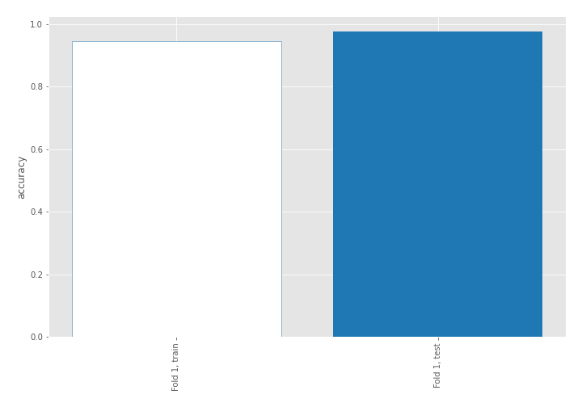

## Coefficients
| feature                           |   Learner_1 |
|:----------------------------------|------------:|
| return_autocorrelation_2_lag1     |   0.845705  |
| return_autocorrelation_2_lag3     |   0.755877  |
| sqreturn_correlation_ts2_lag_3    |   0.617957  |
| return_correlation_ts2_lag_3      |   0.617957  |
| return_correlation_ts1_lag_1      |   0.607632  |
| sqreturn_correlation_ts1_lag_1    |   0.607632  |
| return_autocorrelation_2_lag2     |   0.443627  |
| sqreturn_correlation_ts2_lag_1    |   0.440599  |
| return_correlation_ts2_lag_1      |   0.440599  |
| return_correlation_ts1_lag_3      |   0.325758  |
| sqreturn_correlation_ts1_lag_3    |   0.325758  |
| return_autocorrelation_1_lag3     |   0.291573  |
| return_autocorrelation_1_lag2     |   0.257719  |
| sqreturn_correlation_ts1_lag_2    |   0.233444  |
| return_correlation_ts1_lag_2      |   0.233444  |
| return_autocorrelation_1_lag1     |   0.188879  |
| return_sd1                        |   0.0576939 |
| return_mean2                      |   0.0531932 |
| sqreturn_correlation_ts2_lag_2    |  -0.0376994 |
| return_correlation_ts2_lag_2      |  -0.0376994 |
| return_sd2                        |  -0.123085  |
| return_skew2                      |  -0.329812  |
| sqreturn_correlation_ts1_lag_0    |  -0.33571   |
| return_correlation_ts1_lag_0      |  -0.33571   |
| return_skew1                      |  -0.469561  |
| intercept                         |  -0.61769   |
| price2_granger_cause_price1       |  -0.669861  |
| price1_granger_cause_price2       |  -0.761839  |
| return_mean1                      |  -0.909247  |
| sqreturn_autocorrelation_ts2_lag3 |  -1.01121   |
| sqreturn_autocorrelation_ts1_lag3 |  -1.20267   |
| sqreturn_autocorrelation_ts2_lag2 |  -1.2356    |
| sqreturn_autocorrelation_ts1_lag2 |  -1.27767   |
| sqreturn_autocorrelation_ts1_lag1 |  -1.43368   |
| sqreturn_autocorrelation_ts2_lag1 |  -1.60503   |
| return_kurtosis2                  |  -2.82543   |
| return_kurtosis1                  |  -3.83971   |

## Permutation-based Importance
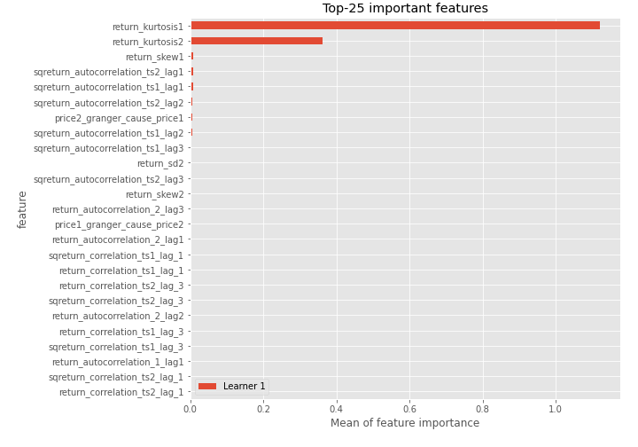
## Confusion Matrix

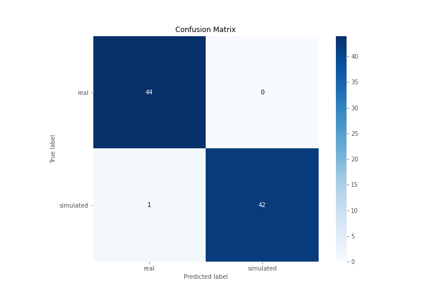

## Normalized Confusion Matrix

## ROC Curve

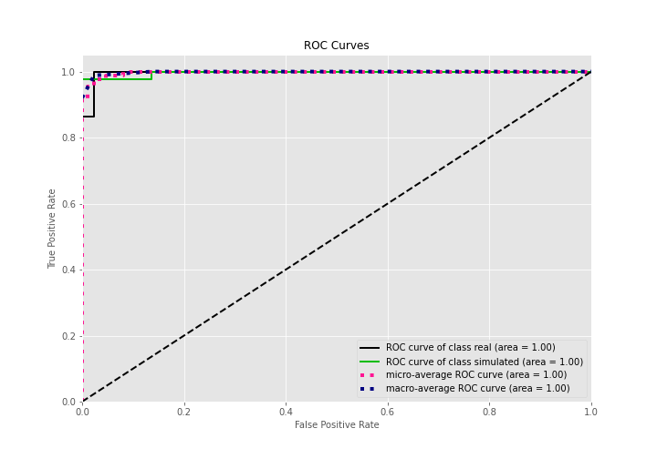

## Kolmogorov-Smirnov Statistic

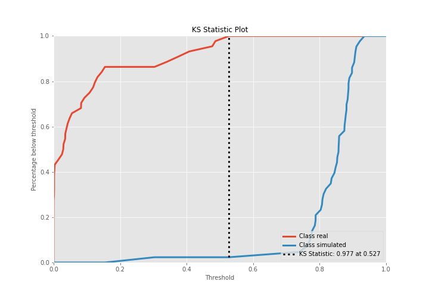

## Precision-Recall Curve

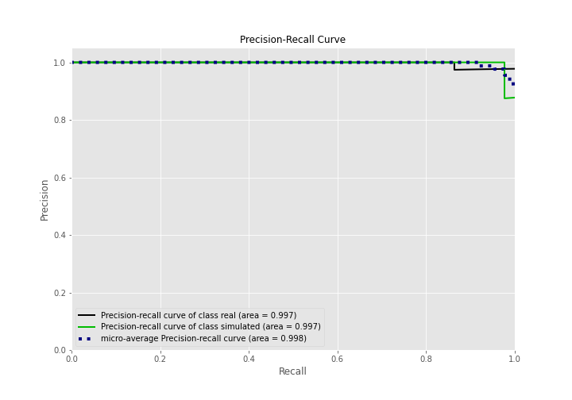

## Calibration Curve

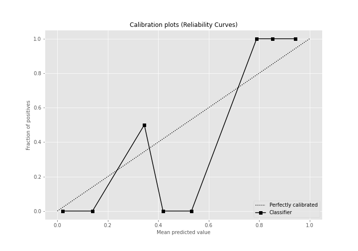

## Cumulative Gains Curve

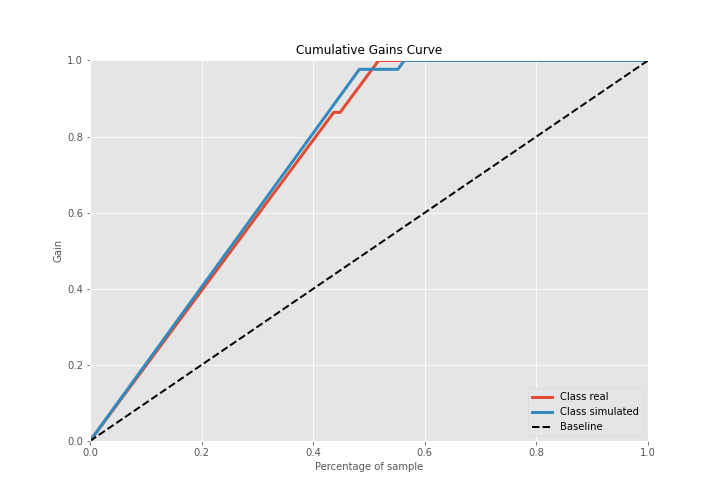

## Lift Curve

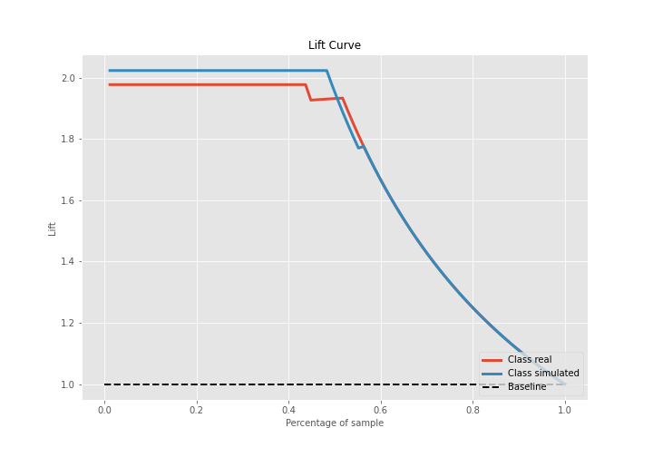

## SHAP Importance
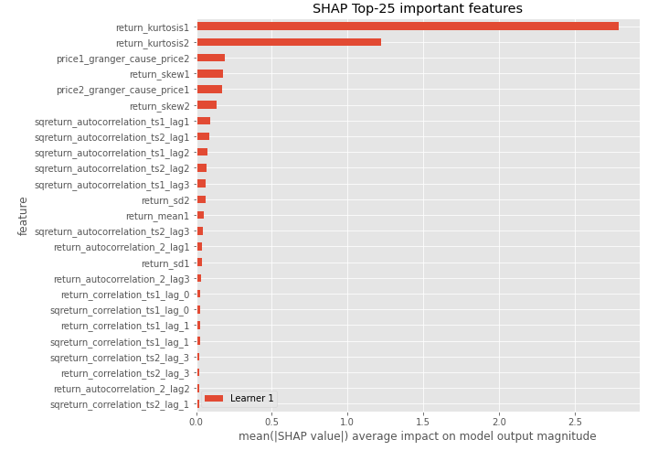

## SHAP Dependence plots

### Dependence (Fold 1)
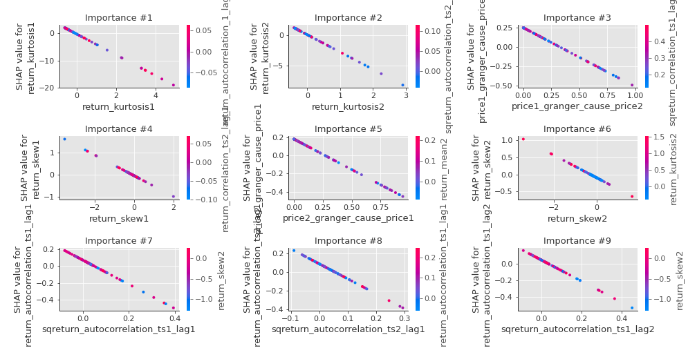

## SHAP Decision plots

### Top-10 Worst decisions for class 0 (Fold 1)
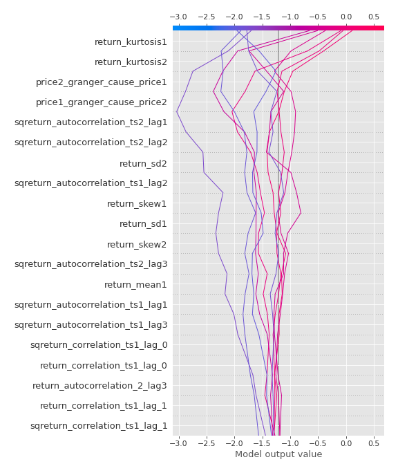
### Top-10 Best decisions for class 0 (Fold 1)
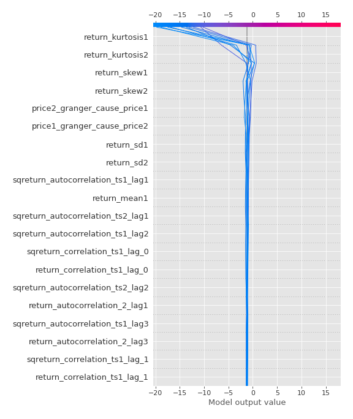
### Top-10 Worst decisions for class 1 (Fold 1)
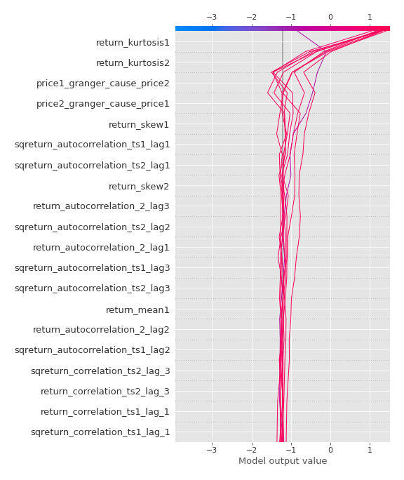
### Top-10 Best decisions for class 1 (Fold 1)
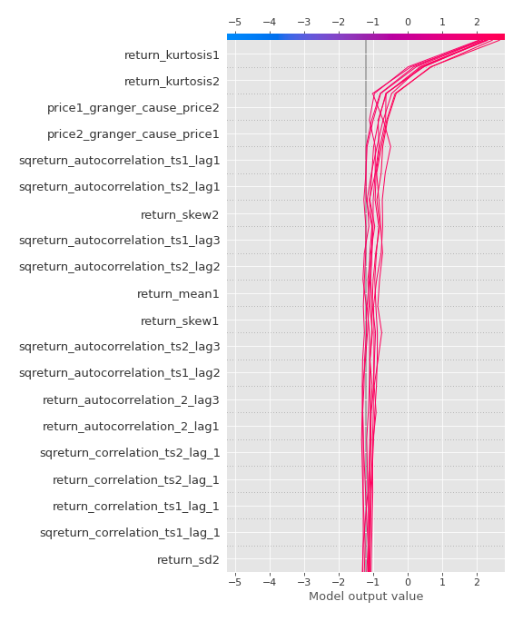

[<< Go back](../README.md)
