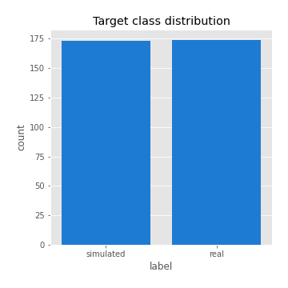
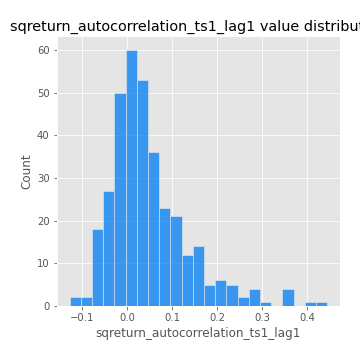
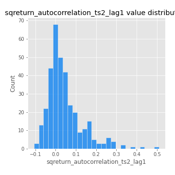
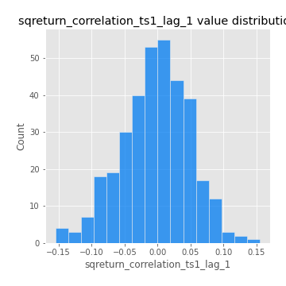

# Exploratory Data Analysis

[<< Go back](../README.md)
## Feature : target
- **Feature type** : categorical
- **Missing** : 0.0%
- **Unique** : 2
- **Count** :347
- **Unique** :2
- **Top** :real
- **Freq** :174

## Feature : return_mean1
- **Feature type** : continous
- **Missing** : 0.0%
- **Unique** : 347
- **Count** :347.0
- **Mean** :0.036237972715222125
- **Std** :0.070929136296297
- **Min** :-0.22632637961920957
- **25%th Percentile** : -0.008118618758975148
- **50%th Percentile** : 0.034848913033867716
- **75%th Percentile** : 0.08188633395391876
- **Max** :0.37175100008111034

## Feature : return_mean2
- **Feature type** : continous
- **Missing** : 0.0%
- **Unique** : 347
- **Count** :347.0
- **Mean** :0.06565502583645616
- **Std** :0.08918161613149472
- **Min** :-0.2381295093970479
- **25%th Percentile** : 0.014873546145045501
- **50%th Percentile** : 0.06290753417306273
- **75%th Percentile** : 0.11314090334727088
- **Max** :0.5324101954257852

## Feature : return_sd1
- **Feature type** : continous
- **Missing** : 0.0%
- **Unique** : 347
- **Count** :347.0
- **Mean** :1.6899526573634795
- **Std** :0.7650119937233936
- **Min** :0.7470080772831957
- **25%th Percentile** : 1.4174978274189933
- **50%th Percentile** : 1.4798284919079407
- **75%th Percentile** : 1.6613148468316
- **Max** :9.236766377527575

## Feature : return_sd2
- **Feature type** : continous
- **Missing** : 0.0%
- **Unique** : 347
- **Count** :347.0
- **Mean** :1.6893895348823647
- **Std** :0.6273967798739865
- **Min** :0.8455946193085045
- **25%th Percentile** : 1.4898597573185892
- **50%th Percentile** : 1.564681894607965
- **75%th Percentile** : 1.6484782203762356
- **Max** :6.737618636746393

## Feature : return_skew1
- **Feature type** : continous
- **Missing** : 0.0%
- **Unique** : 347
- **Count** :347.0
- **Mean** :-0.15831784083978895
- **Std** :0.5871526304547404
- **Min** :-3.530116233761814
- **25%th Percentile** : -0.2802832788522973
- **50%th Percentile** : -0.08312094509937916
- **75%th Percentile** : 0.038679637275098974
- **Max** :2.5845963767725557

## Feature : return_skew2
- **Feature type** : continous
- **Missing** : 0.0%
- **Unique** : 347
- **Count** :347.0
- **Mean** :-0.2506887842163041
- **Std** :0.7340393303334574
- **Min** :-8.801502855292393
- **25%th Percentile** : -0.36342573574506665
- **50%th Percentile** : -0.161795729185454
- **75%th Percentile** : 0.004658697651873449
- **Max** :2.2606839051517187

## Feature : return_kurtosis1
- **Feature type** : continous
- **Missing** : 0.0%
- **Unique** : 347
- **Count** :347.0
- **Mean** :3.506081594964024
- **Std** :6.172931343294671
- **Min** :-0.4515349552140666
- **25%th Percentile** : 0.21748388506714922
- **50%th Percentile** : 1.08258488337747
- **75%th Percentile** : 3.8405863563633806
- **Max** :36.91113889081053

## Feature : return_kurtosis2
- **Feature type** : continous
- **Missing** : 0.0%
- **Unique** : 347
- **Count** :347.0
- **Mean** :4.019193824197798
- **Std** :9.291105751962814
- **Min** :-0.25119185275358324
- **25%th Percentile** : 0.47683387477912387
- **50%th Percentile** : 1.495181828389176
- **75%th Percentile** : 4.27733023150664
- **Max** :143.10871011533666

## Feature : return_autocorrelation_1_lag1
- **Feature type** : continous
- **Missing** : 0.0%
- **Unique** : 347
- **Count** :347.0
- **Mean** :-0.016732734829209967
- **Std** :0.057857521964894444
- **Min** :-0.20673896439036124
- **25%th Percentile** : -0.050541732978349393
- **50%th Percentile** : -0.013097469450215055
- **75%th Percentile** : 0.022090511826894862
- **Max** :0.13264169010552043

## Feature : return_autocorrelation_1_lag2
- **Feature type** : continous
- **Missing** : 0.0%
- **Unique** : 347
- **Count** :347.0
- **Mean** :-0.003712245304341037
- **Std** :0.04969191816348618
- **Min** :-0.12386585824121897
- **25%th Percentile** : -0.03320058978987912
- **50%th Percentile** : -0.003252569218034035
- **75%th Percentile** : 0.02459744074597782
- **Max** :0.1561488228015672

## Feature : return_autocorrelation_1_lag3
- **Feature type** : continous
- **Missing** : 0.0%
- **Unique** : 347
- **Count** :347.0
- **Mean** :-0.004152733040017194
- **Std** :0.052182220630068304
- **Min** :-0.1940836867390813
- **25%th Percentile** : -0.03842317866946815
- **50%th Percentile** : -0.0037399346828342773
- **75%th Percentile** : 0.03302413175903555
- **Max** :0.17805869530681923

## Feature : return_autocorrelation_2_lag1
- **Feature type** : continous
- **Missing** : 0.0%
- **Unique** : 347
- **Count** :347.0
- **Mean** :-0.004251983767771407
- **Std** :0.059978802658329694
- **Min** :-0.25075531010123286
- **25%th Percentile** : -0.03673885538763179
- **50%th Percentile** : 0.0007346489414504101
- **75%th Percentile** : 0.03379838118175084
- **Max** :0.14605925719006835

## Feature : return_autocorrelation_2_lag2
- **Feature type** : continous
- **Missing** : 0.0%
- **Unique** : 347
- **Count** :347.0
- **Mean** :0.007450655506121105
- **Std** :0.05226738858293204
- **Min** :-0.1495113937562178
- **25%th Percentile** : -0.02812341726172224
- **50%th Percentile** : 0.00304632806792607
- **75%th Percentile** : 0.043636126303921906
- **Max** :0.1735398560230086

## Feature : return_autocorrelation_2_lag3
- **Feature type** : continous
- **Missing** : 0.0%
- **Unique** : 347
- **Count** :347.0
- **Mean** :0.004082928679250959
- **Std** :0.05325647674527591
- **Min** :-0.14200107169559698
- **25%th Percentile** : -0.03001945872978584
- **50%th Percentile** : 0.006076462886470466
- **75%th Percentile** : 0.043656578789993614
- **Max** :0.14665172163977813

## Feature : return_correlation_ts1_lag_0
- **Feature type** : continous
- **Missing** : 0.0%
- **Unique** : 347
- **Count** :347.0
- **Mean** :0.3018069628390894
- **Std** :0.1096693802324028
- **Min** :-0.027089510445801036
- **25%th Percentile** : 0.24692411349689153
- **50%th Percentile** : 0.2908720354714204
- **75%th Percentile** : 0.3472581914162153
- **Max** :0.7028422087350163

## Feature : return_correlation_ts1_lag_1
- **Feature type** : continous
- **Missing** : 0.0%
- **Unique** : 347
- **Count** :347.0
- **Mean** :-0.002810097963440262
- **Std** :0.051721073590146945
- **Min** :-0.1549695474991776
- **25%th Percentile** : -0.03670126524466065
- **50%th Percentile** : -2.377646402126443e-05
- **75%th Percentile** : 0.0343672118325725
- **Max** :0.15499424718508623

## Feature : return_correlation_ts1_lag_2
- **Feature type** : continous
- **Missing** : 0.0%
- **Unique** : 347
- **Count** :347.0
- **Mean** :0.0017800367355578822
- **Std** :0.0466869289566295
- **Min** :-0.14126195204746103
- **25%th Percentile** : -0.03070370192198693
- **50%th Percentile** : 0.005723869752580742
- **75%th Percentile** : 0.03653149962364305
- **Max** :0.10916944041387708

## Feature : return_correlation_ts1_lag_3
- **Feature type** : continous
- **Missing** : 0.0%
- **Unique** : 347
- **Count** :347.0
- **Mean** :-0.0006263443033128746
- **Std** :0.051393363798175544
- **Min** :-0.13931168638968316
- **25%th Percentile** : -0.033294276392045866
- **50%th Percentile** : -0.0014326864439641496
- **75%th Percentile** : 0.03258690472832905
- **Max** :0.1636773216468148

## Feature : return_correlation_ts2_lag_1
- **Feature type** : continous
- **Missing** : 0.0%
- **Unique** : 347
- **Count** :347.0
- **Mean** :-0.00742711869380496
- **Std** :0.05115256755161502
- **Min** :-0.2081139431093261
- **25%th Percentile** : -0.038657531590436375
- **50%th Percentile** : -0.006088841923033191
- **75%th Percentile** : 0.028457143858575333
- **Max** :0.12298031534459476

## Feature : return_correlation_ts2_lag_2
- **Feature type** : continous
- **Missing** : 0.0%
- **Unique** : 347
- **Count** :347.0
- **Mean** :0.0016385240666641821
- **Std** :0.05103967302601735
- **Min** :-0.23751835475804678
- **25%th Percentile** : -0.031230240864854396
- **50%th Percentile** : -0.0020314529696740277
- **75%th Percentile** : 0.03370437346224907
- **Max** :0.20772887392904255

## Feature : return_correlation_ts2_lag_3
- **Feature type** : continous
- **Missing** : 0.0%
- **Unique** : 347
- **Count** :347.0
- **Mean** :0.0010511003258771023
- **Std** :0.052711340567593946
- **Min** :-0.17564076057312866
- **25%th Percentile** : -0.026310847804123093
- **50%th Percentile** : 0.002154135581951735
- **75%th Percentile** : 0.039197963135235964
- **Max** :0.17061235513678577

## Feature : sqreturn_autocorrelation_ts1_lag1
- **Feature type** : continous
- **Missing** : 0.0%
- **Unique** : 347
- **Count** :347.0
- **Mean** :0.04783699157786597
- **Std** :0.0874581002850339
- **Min** :-0.1274433771047356
- **25%th Percentile** : -0.00619767640740793
- **50%th Percentile** : 0.02806239900883558
- **75%th Percentile** : 0.08389693547723884
- **Max** :0.4439086285737898

## Feature : sqreturn_autocorrelation_ts1_lag2
- **Feature type** : continous
- **Missing** : 0.0%
- **Unique** : 347
- **Count** :347.0
- **Mean** :0.0412841784356433
- **Std** :0.08932599561135013
- **Min** :-0.09056125049801877
- **25%th Percentile** : -0.011815705533222148
- **50%th Percentile** : 0.019026525573813947
- **75%th Percentile** : 0.06514618460044172
- **Max** :0.4522162366773919

## Feature : sqreturn_autocorrelation_ts1_lag3
- **Feature type** : continous
- **Missing** : 0.0%
- **Unique** : 347
- **Count** :347.0
- **Mean** :0.0333485857988755
- **Std** :0.07729719551158505
- **Min** :-0.10527020244502974
- **25%th Percentile** : -0.013058764918648335
- **50%th Percentile** : 0.017412275669772066
- **75%th Percentile** : 0.05836092422204766
- **Max** :0.41030914918857014

## Feature : sqreturn_autocorrelation_ts2_lag1
- **Feature type** : continous
- **Missing** : 0.0%
- **Unique** : 347
- **Count** :347.0
- **Mean** :0.044805304789192514
- **Std** :0.08868032386184013
- **Min** :-0.10718218163758231
- **25%th Percentile** : -0.010511938095460964
- **50%th Percentile** : 0.020903489322475564
- **75%th Percentile** : 0.07391895622826458
- **Max** :0.510085647437958

## Feature : sqreturn_autocorrelation_ts2_lag2
- **Feature type** : continous
- **Missing** : 0.0%
- **Unique** : 347
- **Count** :347.0
- **Mean** :0.03691378463975555
- **Std** :0.08881825421444954
- **Min** :-0.11573388900595646
- **25%th Percentile** : -0.013553376648963836
- **50%th Percentile** : 0.012728648183241015
- **75%th Percentile** : 0.05129996546501016
- **Max** :0.45676817892778204

## Feature : sqreturn_autocorrelation_ts2_lag3
- **Feature type** : continous
- **Missing** : 0.0%
- **Unique** : 347
- **Count** :347.0
- **Mean** :0.027281002352083628
- **Std** :0.0685620639075588
- **Min** :-0.10585999128181112
- **25%th Percentile** : -0.017345388815683177
- **50%th Percentile** : 0.01376013224244892
- **75%th Percentile** : 0.052063177155063645
- **Max** :0.31225727797735664

## Feature : sqreturn_correlation_ts1_lag_0
- **Feature type** : continous
- **Missing** : 0.0%
- **Unique** : 347
- **Count** :347.0
- **Mean** :0.3018069628390894
- **Std** :0.1096693802324028
- **Min** :-0.027089510445801036
- **25%th Percentile** : 0.24692411349689153
- **50%th Percentile** : 0.2908720354714204
- **75%th Percentile** : 0.3472581914162153
- **Max** :0.7028422087350163

## Feature : sqreturn_correlation_ts1_lag_1
- **Feature type** : continous
- **Missing** : 0.0%
- **Unique** : 347
- **Count** :347.0
- **Mean** :-0.002810097963440262
- **Std** :0.051721073590146945
- **Min** :-0.1549695474991776
- **25%th Percentile** : -0.03670126524466065
- **50%th Percentile** : -2.377646402126443e-05
- **75%th Percentile** : 0.0343672118325725
- **Max** :0.15499424718508623

## Feature : sqreturn_correlation_ts1_lag_2
- **Feature type** : continous
- **Missing** : 0.0%
- **Unique** : 347
- **Count** :347.0
- **Mean** :0.0017800367355578822
- **Std** :0.0466869289566295
- **Min** :-0.14126195204746103
- **25%th Percentile** : -0.03070370192198693
- **50%th Percentile** : 0.005723869752580742
- **75%th Percentile** : 0.03653149962364305
- **Max** :0.10916944041387708

## Feature : sqreturn_correlation_ts1_lag_3
- **Feature type** : continous
- **Missing** : 0.0%
- **Unique** : 347
- **Count** :347.0
- **Mean** :-0.0006263443033128746
- **Std** :0.051393363798175544
- **Min** :-0.13931168638968316
- **25%th Percentile** : -0.033294276392045866
- **50%th Percentile** : -0.0014326864439641496
- **75%th Percentile** : 0.03258690472832905
- **Max** :0.1636773216468148

## Feature : sqreturn_correlation_ts2_lag_1
- **Feature type** : continous
- **Missing** : 0.0%
- **Unique** : 347
- **Count** :347.0
- **Mean** :-0.00742711869380496
- **Std** :0.05115256755161502
- **Min** :-0.2081139431093261
- **25%th Percentile** : -0.038657531590436375
- **50%th Percentile** : -0.006088841923033191
- **75%th Percentile** : 0.028457143858575333
- **Max** :0.12298031534459476

## Feature : sqreturn_correlation_ts2_lag_2
- **Feature type** : continous
- **Missing** : 0.0%
- **Unique** : 347
- **Count** :347.0
- **Mean** :0.0016385240666641821
- **Std** :0.05103967302601735
- **Min** :-0.23751835475804678
- **25%th Percentile** : -0.031230240864854396
- **50%th Percentile** : -0.0020314529696740277
- **75%th Percentile** : 0.03370437346224907
- **Max** :0.20772887392904255

## Feature : sqreturn_correlation_ts2_lag_3
- **Feature type** : continous
- **Missing** : 0.0%
- **Unique** : 347
- **Count** :347.0
- **Mean** :0.0010511003258771023
- **Std** :0.052711340567593946
- **Min** :-0.17564076057312866
- **25%th Percentile** : -0.026310847804123093
- **50%th Percentile** : 0.002154135581951735
- **75%th Percentile** : 0.039197963135235964
- **Max** :0.17061235513678577

## Feature : price2_granger_cause_price1
- **Feature type** : continous
- **Missing** : 0.0%
- **Unique** : 347
- **Count** :347.0
- **Mean** :0.2976114255353333
- **Std** :0.29373894346691926
- **Min** :1.0178632712036622e-06
- **25%th Percentile** : 0.039507443577089796
- **50%th Percentile** : 0.20327454067296524
- **75%th Percentile** : 0.5007068460395088
- **Max** :0.9885712803689185

## Feature : price1_granger_cause_price2
- **Feature type** : continous
- **Missing** : 0.0%
- **Unique** : 347
- **Count** :347.0
- **Mean** :0.26653768608737555
- **Std** :0.2738491340845629
- **Min** :1.8235821536477048e-12
- **25%th Percentile** : 0.03163093695143106
- **50%th Percentile** : 0.1736660215408894
- **75%th Percentile** : 0.43047011401652213
- **Max** :0.9710186204408006

[<< Go back](../README.md)
