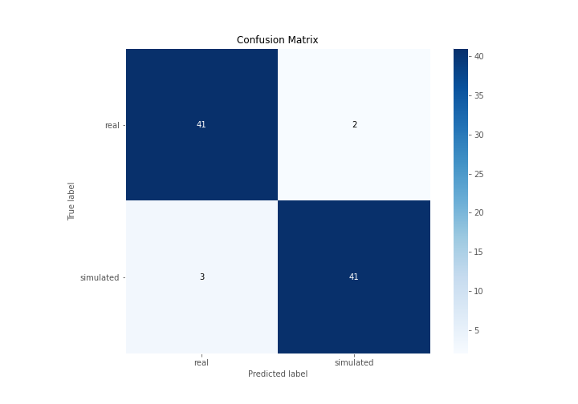
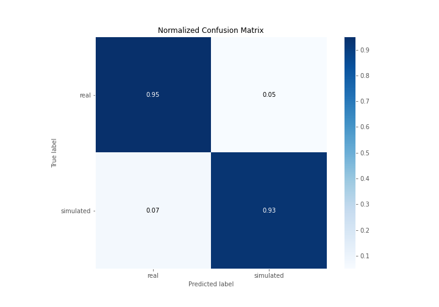
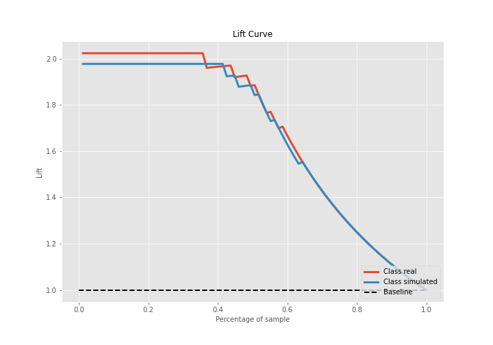

# Summary of 3_Linear

[<< Go back](../README.md)

## Logistic Regression (Linear)
- **n_jobs**: -1
- **explain_level**: 2

## Validation
 - **validation_type**: split
 - **train_ratio**: 0.75
 - **shuffle**: True
 - **stratify**: True

## Optimized metric
accuracy

## Training time

19.1 seconds

## Metric details
|           |    score |     threshold |
|:----------|---------:|--------------:|
| logloss   | 0.232093 | nan           |
| auc       | 0.984672 | nan           |
| f1        | 0.94382  |   0.692318    |
| accuracy  | 0.942529 |   0.769419    |
| precision | 1        |   0.90191     |
| recall    | 1        |   4.24443e-07 |
| mcc       | 0.885307 |   0.769419    |

## Confusion matrix (at threshold=0.769419)
|                      |   Predicted as real |   Predicted as simulated |
|:---------------------|--------------------:|-------------------------:|
| Labeled as real      |                  41 |                        2 |
| Labeled as simulated |                   3 |                       41 |

## Learning curves

## Coefficients
| feature                           |   Learner_1 |
|:----------------------------------|------------:|
| return_autocorrelation_2_lag3     |   0.652361  |
| return_autocorrelation_2_lag1     |   0.579763  |
| sqreturn_correlation_ts1_lag_1    |   0.444007  |
| return_correlation_ts1_lag_1      |   0.444007  |
| return_autocorrelation_2_lag2     |   0.413761  |
| sqreturn_correlation_ts1_lag_3    |   0.349716  |
| return_correlation_ts1_lag_3      |   0.349716  |
| sqreturn_correlation_ts2_lag_1    |   0.278901  |
| return_correlation_ts2_lag_1      |   0.278901  |
| sqreturn_correlation_ts1_lag_2    |   0.243677  |
| return_correlation_ts1_lag_2      |   0.243677  |
| sqreturn_correlation_ts2_lag_3    |   0.241546  |
| return_correlation_ts2_lag_3      |   0.241546  |
| return_autocorrelation_1_lag3     |   0.174777  |
| return_autocorrelation_1_lag2     |   0.125814  |
| return_mean2                      |   0.0229008 |
| return_skew2                      |   0.0115051 |
| return_autocorrelation_1_lag1     |  -0.0293926 |
| sqreturn_correlation_ts2_lag_2    |  -0.0386088 |
| return_correlation_ts2_lag_2      |  -0.0386088 |
| return_skew1                      |  -0.0462995 |
| sqreturn_correlation_ts1_lag_0    |  -0.207384  |
| return_correlation_ts1_lag_0      |  -0.207384  |
| return_sd1                        |  -0.278548  |
| return_sd2                        |  -0.396667  |
| sqreturn_autocorrelation_ts2_lag3 |  -0.522003  |
| intercept                         |  -0.550257  |
| price2_granger_cause_price1       |  -0.78786   |
| sqreturn_autocorrelation_ts1_lag3 |  -0.793683  |
| sqreturn_autocorrelation_ts2_lag2 |  -0.995724  |
| return_mean1                      |  -1.06847   |
| price1_granger_cause_price2       |  -1.12898   |
| sqreturn_autocorrelation_ts1_lag2 |  -1.2618    |
| sqreturn_autocorrelation_ts1_lag1 |  -1.45206   |
| sqreturn_autocorrelation_ts2_lag1 |  -1.47298   |
| return_kurtosis2                  |  -1.91973   |
| return_kurtosis1                  |  -4.28227   |

## Permutation-based Importance

## Confusion Matrix

## Normalized Confusion Matrix

## ROC Curve

## Kolmogorov-Smirnov Statistic

## Precision-Recall Curve

## Calibration Curve

## Cumulative Gains Curve

## Lift Curve

## SHAP Importance

## SHAP Dependence plots

### Dependence (Fold 1)

## SHAP Decision plots

### Top-10 Worst decisions for class 0 (Fold 1)

### Top-10 Best decisions for class 0 (Fold 1)

### Top-10 Worst decisions for class 1 (Fold 1)

### Top-10 Best decisions for class 1 (Fold 1)

[<< Go back](../README.md)
