# Exploratory Data Analysis

[<< Go back](../README.md)
## Feature : target
- **Feature type** : categorical
- **Missing** : 0.0%
- **Unique** : 2
- **Count** :347
- **Unique** :2
- **Top** :simulated
- **Freq** :174

## Feature : return_mean1
- **Feature type** : continous
- **Missing** : 0.0%
- **Unique** : 347
- **Count** :347.0
- **Mean** :0.03601542559621969
- **Std** :0.07422401909271162
- **Min** :-0.22632637961920957
- **25%th Percentile** : -0.0097400792830119
- **50%th Percentile** : 0.03127010294081103
- **75%th Percentile** : 0.08072912208670588
- **Max** :0.37175100008111034

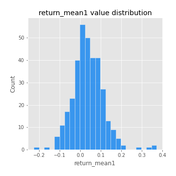
## Feature : return_mean2
- **Feature type** : continous
- **Missing** : 0.0%
- **Unique** : 347
- **Count** :347.0
- **Mean** :0.06939772084636082
- **Std** :0.09400089207153034
- **Min** :-0.24205418062825398
- **25%th Percentile** : 0.018166639178980353
- **50%th Percentile** : 0.06570734740050053
- **75%th Percentile** : 0.11445704013833846
- **Max** :0.6156202974537657

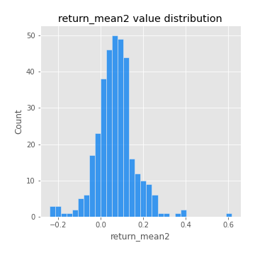
## Feature : return_sd1
- **Feature type** : continous
- **Missing** : 0.0%
- **Unique** : 347
- **Count** :347.0
- **Mean** :1.705628201033426
- **Std** :0.7601707424631051
- **Min** :0.7470080772831957
- **25%th Percentile** : 1.4160485305974035
- **50%th Percentile** : 1.4905916841829414
- **75%th Percentile** : 1.6902017658202082
- **Max** :9.236766377527575

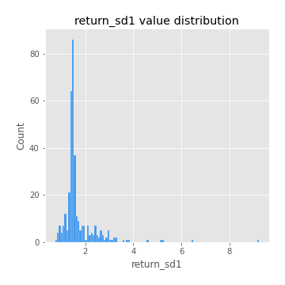
## Feature : return_sd2
- **Feature type** : continous
- **Missing** : 0.0%
- **Unique** : 347
- **Count** :347.0
- **Mean** :1.765487365453464
- **Std** :0.7726806536780407
- **Min** :0.8592887433004143
- **25%th Percentile** : 1.4922825960849395
- **50%th Percentile** : 1.5644662747146145
- **75%th Percentile** : 1.6801236685910923
- **Max** :6.737618636746393

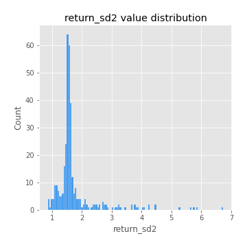
## Feature : return_skew1
- **Feature type** : continous
- **Missing** : 0.0%
- **Unique** : 347
- **Count** :347.0
- **Mean** :-0.1099670072311252
- **Std** :0.5796234986636613
- **Min** :-3.530116233761814
- **25%th Percentile** : -0.23745830037277516
- **50%th Percentile** : -0.07817443284803711
- **75%th Percentile** : 0.0832937101707594
- **Max** :2.5845963767725557

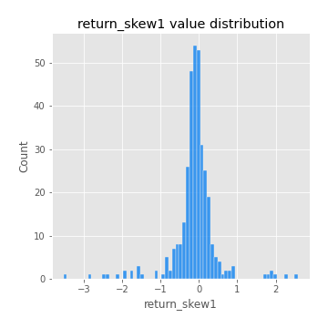
## Feature : return_skew2
- **Feature type** : continous
- **Missing** : 0.0%
- **Unique** : 347
- **Count** :347.0
- **Mean** :-0.2262422983543375
- **Std** :0.8067599837668783
- **Min** :-8.801502855292393
- **25%th Percentile** : -0.3718223900747931
- **50%th Percentile** : -0.14712629435825428
- **75%th Percentile** : 0.02424883939528438
- **Max** :2.2606839051517187

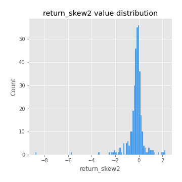
## Feature : return_kurtosis1
- **Feature type** : continous
- **Missing** : 0.0%
- **Unique** : 347
- **Count** :347.0
- **Mean** :3.286991504077136
- **Std** :5.73398651789202
- **Min** :-0.3690251059732943
- **25%th Percentile** : 0.24335367925628915
- **50%th Percentile** : 0.9526663009767273
- **75%th Percentile** : 3.926946560753578
- **Max** :36.91113889081053

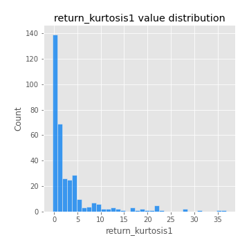
## Feature : return_kurtosis2
- **Feature type** : continous
- **Missing** : 0.0%
- **Unique** : 347
- **Count** :347.0
- **Mean** :4.126265714364227
- **Std** :9.852731764113996
- **Min** :-0.3019902582423639
- **25%th Percentile** : 0.5241913508043827
- **50%th Percentile** : 1.5914359586645461
- **75%th Percentile** : 4.28091647302106
- **Max** :143.10871011533666

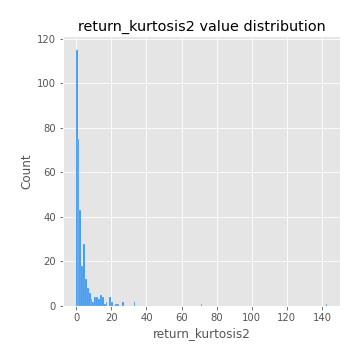
## Feature : return_autocorrelation_1_lag1
- **Feature type** : continous
- **Missing** : 0.0%
- **Unique** : 347
- **Count** :347.0
- **Mean** :-0.012726005438149154
- **Std** :0.05783352282023712
- **Min** :-0.20673896439036124
- **25%th Percentile** : -0.0472771758186081
- **50%th Percentile** : -0.00883282998852309
- **75%th Percentile** : 0.026582813426182732
- **Max** :0.1275670233465667

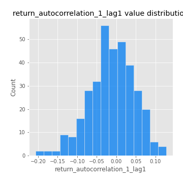
## Feature : return_autocorrelation_1_lag2
- **Feature type** : continous
- **Missing** : 0.0%
- **Unique** : 347
- **Count** :347.0
- **Mean** :-0.005604619339397381
- **Std** :0.052462958270470275
- **Min** :-0.13965476499116994
- **25%th Percentile** : -0.03783255597023571
- **50%th Percentile** : -0.0042311867346429
- **75%th Percentile** : 0.02662532753304691
- **Max** :0.1561488228015672

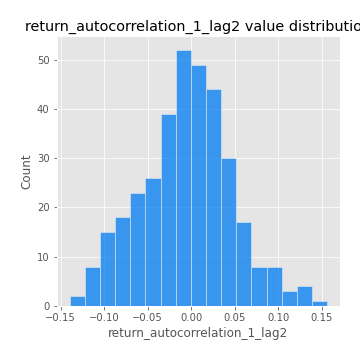
## Feature : return_autocorrelation_1_lag3
- **Feature type** : continous
- **Missing** : 0.0%
- **Unique** : 347
- **Count** :347.0
- **Mean** :-0.0007720815344292066
- **Std** :0.05231648507147206
- **Min** :-0.1940836867390813
- **25%th Percentile** : -0.030363236689560508
- **50%th Percentile** : -0.0005637401913804838
- **75%th Percentile** : 0.033473543771549485
- **Max** :0.17805869530681923

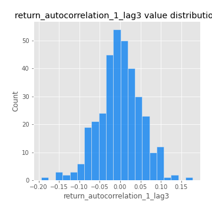
## Feature : return_autocorrelation_2_lag1
- **Feature type** : continous
- **Missing** : 0.0%
- **Unique** : 347
- **Count** :347.0
- **Mean** :-0.0017205575681674568
- **Std** :0.06751648732691042
- **Min** :-0.25075531010123286
- **25%th Percentile** : -0.037725663752592384
- **50%th Percentile** : 0.003832417123947006
- **75%th Percentile** : 0.03865514720348321
- **Max** :0.31863413537898483

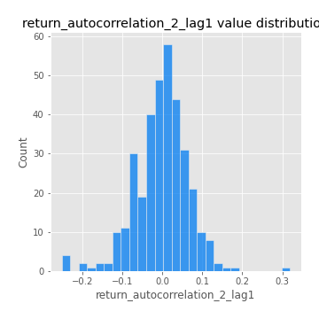
## Feature : return_autocorrelation_2_lag2
- **Feature type** : continous
- **Missing** : 0.0%
- **Unique** : 347
- **Count** :347.0
- **Mean** :0.007207240324385012
- **Std** :0.05230905412842669
- **Min** :-0.15323211089747296
- **25%th Percentile** : -0.029271215096320784
- **50%th Percentile** : 0.005779355179263716
- **75%th Percentile** : 0.04005307379124891
- **Max** :0.20974504043791217

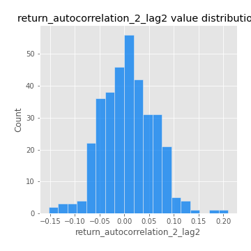
## Feature : return_autocorrelation_2_lag3
- **Feature type** : continous
- **Missing** : 0.0%
- **Unique** : 347
- **Count** :347.0
- **Mean** :0.004873589642073896
- **Std** :0.05018923676766905
- **Min** :-0.14200107169559698
- **25%th Percentile** : -0.026769849665945
- **50%th Percentile** : 0.006236155490409903
- **75%th Percentile** : 0.04130723584655663
- **Max** :0.1419999376914021

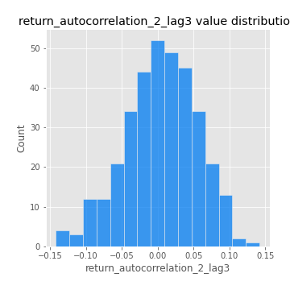
## Feature : return_correlation_ts1_lag_0
- **Feature type** : continous
- **Missing** : 0.0%
- **Unique** : 347
- **Count** :347.0
- **Mean** :0.30366266089934674
- **Std** :0.10801374682715888
- **Min** :0.005136598099876001
- **25%th Percentile** : 0.2499787642719089
- **50%th Percentile** : 0.29638594584279626
- **75%th Percentile** : 0.3449006956701304
- **Max** :0.7041861626832071

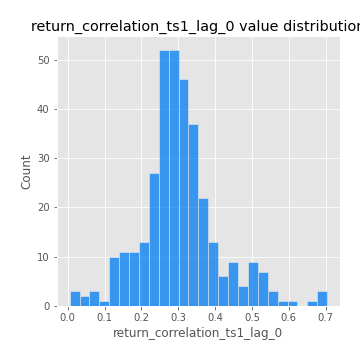
## Feature : return_correlation_ts1_lag_1
- **Feature type** : continous
- **Missing** : 0.0%
- **Unique** : 347
- **Count** :347.0
- **Mean** :-0.0022821227898205975
- **Std** :0.050804666210915304
- **Min** :-0.1506680294614535
- **25%th Percentile** : -0.033565741146539776
- **50%th Percentile** : 0.002157207880544263
- **75%th Percentile** : 0.03379431120295988
- **Max** :0.15499424718508623

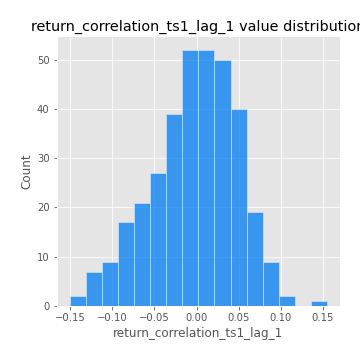
## Feature : return_correlation_ts1_lag_2
- **Feature type** : continous
- **Missing** : 0.0%
- **Unique** : 347
- **Count** :347.0
- **Mean** :-0.0006686122906691462
- **Std** :0.047507305884893436
- **Min** :-0.1246451147068724
- **25%th Percentile** : -0.033833728725773185
- **50%th Percentile** : -0.0005589878134664665
- **75%th Percentile** : 0.03370957157565625
- **Max** :0.12478866280031885

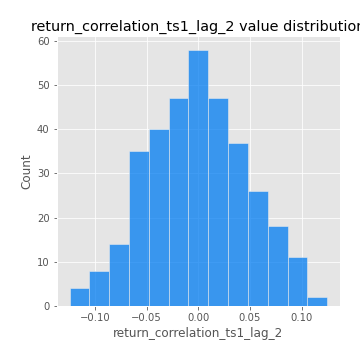
## Feature : return_correlation_ts1_lag_3
- **Feature type** : continous
- **Missing** : 0.0%
- **Unique** : 347
- **Count** :347.0
- **Mean** :0.004647559411646
- **Std** :0.05155676288485358
- **Min** :-0.1270218498974763
- **25%th Percentile** : -0.027812015837910903
- **50%th Percentile** : 0.005148581441872404
- **75%th Percentile** : 0.03706701643662322
- **Max** :0.18922604560558015

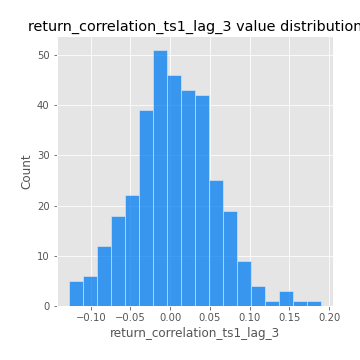
## Feature : return_correlation_ts2_lag_1
- **Feature type** : continous
- **Missing** : 0.0%
- **Unique** : 347
- **Count** :347.0
- **Mean** :-0.0042304984036487065
- **Std** :0.057219472338002675
- **Min** :-0.2081139431093261
- **25%th Percentile** : -0.040758962076325296
- **50%th Percentile** : -0.0038839224860007264
- **75%th Percentile** : 0.03344775201834169
- **Max** :0.17208763791364762

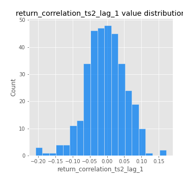
## Feature : return_correlation_ts2_lag_2
- **Feature type** : continous
- **Missing** : 0.0%
- **Unique** : 347
- **Count** :347.0
- **Mean** :0.004710903235863405
- **Std** :0.049194317735696685
- **Min** :-0.15299951737180204
- **25%th Percentile** : -0.02866357205628524
- **50%th Percentile** : 0.004123150039324329
- **75%th Percentile** : 0.03477870982558057
- **Max** :0.20772887392904255

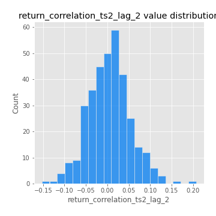
## Feature : return_correlation_ts2_lag_3
- **Feature type** : continous
- **Missing** : 0.0%
- **Unique** : 347
- **Count** :347.0
- **Mean** :-0.0005160857184896222
- **Std** :0.049726662840105046
- **Min** :-0.17564076057312866
- **25%th Percentile** : -0.030148466780711362
- **50%th Percentile** : -0.0013378052253093752
- **75%th Percentile** : 0.03588943480112224
- **Max** :0.12502781355851633

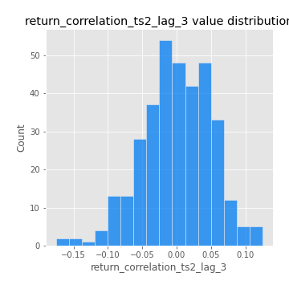
## Feature : sqreturn_autocorrelation_ts1_lag1
- **Feature type** : continous
- **Missing** : 0.0%
- **Unique** : 347
- **Count** :347.0
- **Mean** :0.04993191290251705
- **Std** :0.09418475274368324
- **Min** :-0.10710229076161368
- **25%th Percentile** : -0.01119871129431219
- **50%th Percentile** : 0.02672915646187806
- **75%th Percentile** : 0.08376338233713185
- **Max** :0.49414293176447355

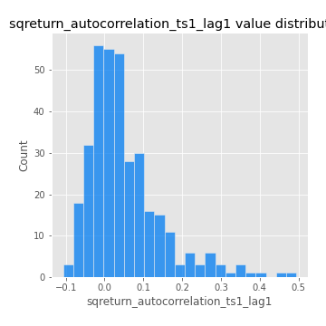
## Feature : sqreturn_autocorrelation_ts1_lag2
- **Feature type** : continous
- **Missing** : 0.0%
- **Unique** : 347
- **Count** :347.0
- **Mean** :0.043030222404411005
- **Std** :0.0960683955856692
- **Min** :-0.11663148507038824
- **25%th Percentile** : -0.014109417842855097
- **50%th Percentile** : 0.01626135840334948
- **75%th Percentile** : 0.07038118959680979
- **Max** :0.540735851444759

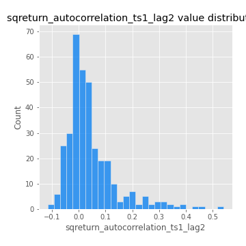
## Feature : sqreturn_autocorrelation_ts1_lag3
- **Feature type** : continous
- **Missing** : 0.0%
- **Unique** : 347
- **Count** :347.0
- **Mean** :0.03675811538690317
- **Std** :0.08165025564573383
- **Min** :-0.0987198496567415
- **25%th Percentile** : -0.014579195013889986
- **50%th Percentile** : 0.014758277930103383
- **75%th Percentile** : 0.0609954698348627
- **Max** :0.44755937369538146

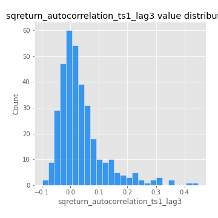
## Feature : sqreturn_autocorrelation_ts2_lag1
- **Feature type** : continous
- **Missing** : 0.0%
- **Unique** : 347
- **Count** :347.0
- **Mean** :0.047835162881008114
- **Std** :0.09177884687538258
- **Min** :-0.08520586663750691
- **25%th Percentile** : -0.013216937051253926
- **50%th Percentile** : 0.026725025425980955
- **75%th Percentile** : 0.08078931800983971
- **Max** :0.510085647437958

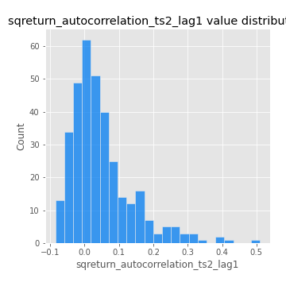
## Feature : sqreturn_autocorrelation_ts2_lag2
- **Feature type** : continous
- **Missing** : 0.0%
- **Unique** : 347
- **Count** :347.0
- **Mean** :0.03883117509488066
- **Std** :0.09111795626708812
- **Min** :-0.08583715973023365
- **25%th Percentile** : -0.015536306931203796
- **50%th Percentile** : 0.01386660012565615
- **75%th Percentile** : 0.05121442039584342
- **Max** :0.5373432415582473

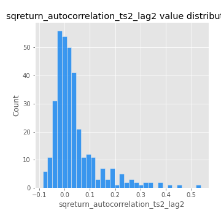
## Feature : sqreturn_autocorrelation_ts2_lag3
- **Feature type** : continous
- **Missing** : 0.0%
- **Unique** : 347
- **Count** :347.0
- **Mean** :0.03275093704868653
- **Std** :0.06752687904017622
- **Min** :-0.10741309286117119
- **25%th Percentile** : -0.009262221757185603
- **50%th Percentile** : 0.016586498259138164
- **75%th Percentile** : 0.05521984105273659
- **Max** :0.31225727797735664

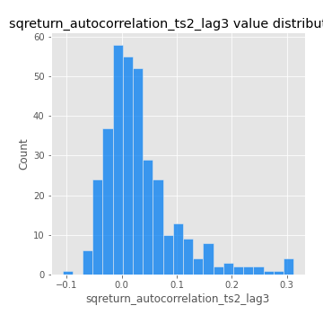
## Feature : sqreturn_correlation_ts1_lag_0
- **Feature type** : continous
- **Missing** : 0.0%
- **Unique** : 347
- **Count** :347.0
- **Mean** :0.30366266089934674
- **Std** :0.10801374682715888
- **Min** :0.005136598099876001
- **25%th Percentile** : 0.2499787642719089
- **50%th Percentile** : 0.29638594584279626
- **75%th Percentile** : 0.3449006956701304
- **Max** :0.7041861626832071

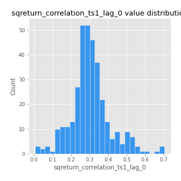
## Feature : sqreturn_correlation_ts1_lag_1
- **Feature type** : continous
- **Missing** : 0.0%
- **Unique** : 347
- **Count** :347.0
- **Mean** :-0.0022821227898205975
- **Std** :0.050804666210915304
- **Min** :-0.1506680294614535
- **25%th Percentile** : -0.033565741146539776
- **50%th Percentile** : 0.002157207880544263
- **75%th Percentile** : 0.03379431120295988
- **Max** :0.15499424718508623

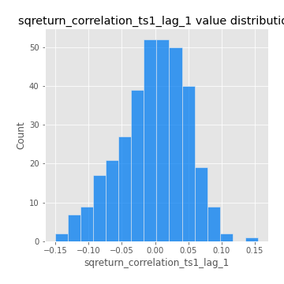
## Feature : sqreturn_correlation_ts1_lag_2
- **Feature type** : continous
- **Missing** : 0.0%
- **Unique** : 347
- **Count** :347.0
- **Mean** :-0.0006686122906691462
- **Std** :0.047507305884893436
- **Min** :-0.1246451147068724
- **25%th Percentile** : -0.033833728725773185
- **50%th Percentile** : -0.0005589878134664665
- **75%th Percentile** : 0.03370957157565625
- **Max** :0.12478866280031885

## Feature : sqreturn_correlation_ts1_lag_3
- **Feature type** : continous
- **Missing** : 0.0%
- **Unique** : 347
- **Count** :347.0
- **Mean** :0.004647559411646
- **Std** :0.05155676288485358
- **Min** :-0.1270218498974763
- **25%th Percentile** : -0.027812015837910903
- **50%th Percentile** : 0.005148581441872404
- **75%th Percentile** : 0.03706701643662322
- **Max** :0.18922604560558015

## Feature : sqreturn_correlation_ts2_lag_1
- **Feature type** : continous
- **Missing** : 0.0%
- **Unique** : 347
- **Count** :347.0
- **Mean** :-0.0042304984036487065
- **Std** :0.057219472338002675
- **Min** :-0.2081139431093261
- **25%th Percentile** : -0.040758962076325296
- **50%th Percentile** : -0.0038839224860007264
- **75%th Percentile** : 0.03344775201834169
- **Max** :0.17208763791364762

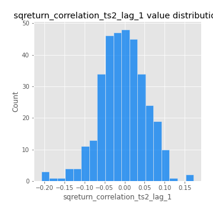
## Feature : sqreturn_correlation_ts2_lag_2
- **Feature type** : continous
- **Missing** : 0.0%
- **Unique** : 347
- **Count** :347.0
- **Mean** :0.004710903235863405
- **Std** :0.049194317735696685
- **Min** :-0.15299951737180204
- **25%th Percentile** : -0.02866357205628524
- **50%th Percentile** : 0.004123150039324329
- **75%th Percentile** : 0.03477870982558057
- **Max** :0.20772887392904255

## Feature : sqreturn_correlation_ts2_lag_3
- **Feature type** : continous
- **Missing** : 0.0%
- **Unique** : 347
- **Count** :347.0
- **Mean** :-0.0005160857184896222
- **Std** :0.049726662840105046
- **Min** :-0.17564076057312866
- **25%th Percentile** : -0.030148466780711362
- **50%th Percentile** : -0.0013378052253093752
- **75%th Percentile** : 0.03588943480112224
- **Max** :0.12502781355851633

## Feature : price2_granger_cause_price1
- **Feature type** : continous
- **Missing** : 0.0%
- **Unique** : 347
- **Count** :347.0
- **Mean** :0.2992383589212606
- **Std** :0.28402956724225215
- **Min** :1.2860992685052314e-06
- **25%th Percentile** : 0.058465869578158663
- **50%th Percentile** : 0.20130279272279958
- **75%th Percentile** : 0.49384275866212857
- **Max** :0.9885712803689185

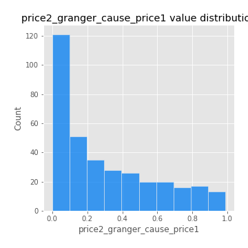
## Feature : price1_granger_cause_price2
- **Feature type** : continous
- **Missing** : 0.0%
- **Unique** : 347
- **Count** :347.0
- **Mean** :0.2549511315605811
- **Std** :0.28022239653739117
- **Min** :3.1890660752537273e-07
- **25%th Percentile** : 0.022529794652339345
- **50%th Percentile** : 0.147796481393116
- **75%th Percentile** : 0.41683139748496373
- **Max** :0.9951398266867577

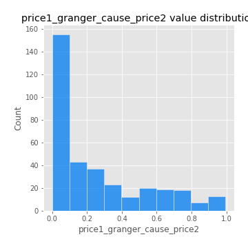

[<< Go back](../README.md)
