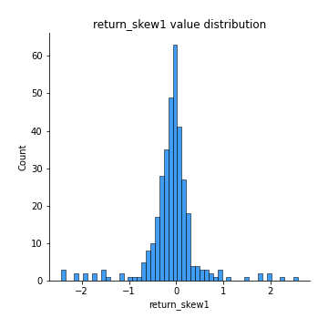
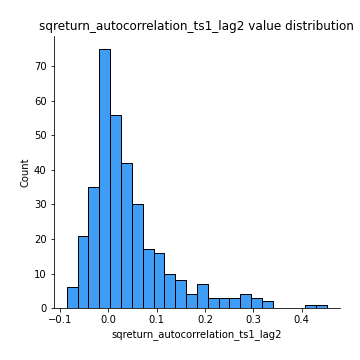

# Exploratory Data Analysis

[<< Go back](../README.md)
## Feature : target
- **Feature type** : categorical
- **Missing** : 0.0%
- **Unique** : 2
- **Count** :347
- **Unique** :2
- **Top** :simulated
- **Freq** :175

## Feature : return_mean1
- **Feature type** : continous
- **Missing** : 0.0%
- **Unique** : 347
- **Count** :347.0
- **Mean** :0.03172735271269029
- **Std** :0.07436078260199368
- **Min** :-0.19762459965120752
- **25%th Percentile** : -0.015094729234071035
- **50%th Percentile** : 0.032784746389487474
- **75%th Percentile** : 0.07953614544375757
- **Max** :0.35951212719134734

## Feature : return_mean2
- **Feature type** : continous
- **Missing** : 0.0%
- **Unique** : 347
- **Count** :347.0
- **Mean** :0.0701498932494551
- **Std** :0.09383162726399134
- **Min** :-0.24205418062825398
- **25%th Percentile** : 0.019948292851444047
- **50%th Percentile** : 0.06955070952619666
- **75%th Percentile** : 0.12679795760424376
- **Max** :0.37616608147096464

## Feature : return_sd1
- **Feature type** : continous
- **Missing** : 0.0%
- **Unique** : 347
- **Count** :347.0
- **Mean** :1.682175014672318
- **Std** :0.614428463630064
- **Min** :0.7470080772831957
- **25%th Percentile** : 1.4186255098796137
- **50%th Percentile** : 1.4889581664488174
- **75%th Percentile** : 1.6755231874636776
- **Max** :5.996244884956102

## Feature : return_sd2
- **Feature type** : continous
- **Missing** : 0.0%
- **Unique** : 347
- **Count** :347.0
- **Mean** :1.7621426970917822
- **Std** :0.7506073593691389
- **Min** :0.8967691504919791
- **25%th Percentile** : 1.4897463473488588
- **50%th Percentile** : 1.5714385944466436
- **75%th Percentile** : 1.688788001830758
- **Max** :6.737618636746393

## Feature : return_skew1
- **Feature type** : continous
- **Missing** : 0.0%
- **Unique** : 347
- **Count** :347.0
- **Mean** :-0.10339153560213592
- **Std** :0.549283675055985
- **Min** :-2.4443473868357586
- **25%th Percentile** : -0.2577866772288817
- **50%th Percentile** : -0.07007116665394814
- **75%th Percentile** : 0.08179719680078845
- **Max** :2.5845963767725557

## Feature : return_skew2
- **Feature type** : continous
- **Missing** : 0.0%
- **Unique** : 347
- **Count** :347.0
- **Mean** :-0.22235047044900388
- **Std** :0.7550741164740101
- **Min** :-8.801502855292393
- **25%th Percentile** : -0.35928247154706194
- **50%th Percentile** : -0.15870343587849983
- **75%th Percentile** : 0.04384523787333525
- **Max** :2.2606839051517187

## Feature : return_kurtosis1
- **Feature type** : continous
- **Missing** : 0.0%
- **Unique** : 347
- **Count** :347.0
- **Mean** :3.1704557265728495
- **Std** :5.448329350609283
- **Min** :-0.42475693281101234
- **25%th Percentile** : 0.21949472201365872
- **50%th Percentile** : 0.9526663009767273
- **75%th Percentile** : 3.665814934210274
- **Max** :35.56636016047202

## Feature : return_kurtosis2
- **Feature type** : continous
- **Missing** : 0.0%
- **Unique** : 347
- **Count** :347.0
- **Mean** :4.049930395928119
- **Std** :9.434432043411809
- **Min** :-0.23062081189287298
- **25%th Percentile** : 0.5287672313676746
- **50%th Percentile** : 1.500699658317393
- **75%th Percentile** : 4.335825686593465
- **Max** :143.10871011533666

## Feature : return_autocorrelation_1_lag1
- **Feature type** : continous
- **Missing** : 0.0%
- **Unique** : 347
- **Count** :347.0
- **Mean** :-0.013100649965734169
- **Std** :0.05519327636722553
- **Min** :-0.20673896439036124
- **25%th Percentile** : -0.044368432119569895
- **50%th Percentile** : -0.008922084796971104
- **75%th Percentile** : 0.024252677597115087
- **Max** :0.1462814971516347

## Feature : return_autocorrelation_1_lag2
- **Feature type** : continous
- **Missing** : 0.0%
- **Unique** : 347
- **Count** :347.0
- **Mean** :-0.005316249010456313
- **Std** :0.04987444398914253
- **Min** :-0.13309283796645122
- **25%th Percentile** : -0.03676065795886685
- **50%th Percentile** : -0.0045615526994123076
- **75%th Percentile** : 0.025450387949687424
- **Max** :0.13553587149024285

## Feature : return_autocorrelation_1_lag3
- **Feature type** : continous
- **Missing** : 0.0%
- **Unique** : 347
- **Count** :347.0
- **Mean** :0.00010575967582111378
- **Std** :0.04913670303084671
- **Min** :-0.15806635192103805
- **25%th Percentile** : -0.029571875181655577
- **50%th Percentile** : 0.00010684383579549596
- **75%th Percentile** : 0.03247670150812793
- **Max** :0.17805869530681923

## Feature : return_autocorrelation_2_lag1
- **Feature type** : continous
- **Missing** : 0.0%
- **Unique** : 347
- **Count** :347.0
- **Mean** :-0.0010366015457664332
- **Std** :0.06041116566093191
- **Min** :-0.24590087874039124
- **25%th Percentile** : -0.03452286659263881
- **50%th Percentile** : 0.0021989134261649573
- **75%th Percentile** : 0.03904354289208206
- **Max** :0.16349871797309318

## Feature : return_autocorrelation_2_lag2
- **Feature type** : continous
- **Missing** : 0.0%
- **Unique** : 347
- **Count** :347.0
- **Mean** :0.007795617799924442
- **Std** :0.05238187985124627
- **Min** :-0.15323211089747296
- **25%th Percentile** : -0.028663415501346497
- **50%th Percentile** : 0.006682285058973788
- **75%th Percentile** : 0.044391906422596064
- **Max** :0.1636830495402612

## Feature : return_autocorrelation_2_lag3
- **Feature type** : continous
- **Missing** : 0.0%
- **Unique** : 347
- **Count** :347.0
- **Mean** :0.0042939681329742145
- **Std** :0.049769358395186786
- **Min** :-0.1315535528857823
- **25%th Percentile** : -0.025982842638499447
- **50%th Percentile** : 0.006405796229843848
- **75%th Percentile** : 0.03454539611412471
- **Max** :0.1730820107024542

## Feature : return_correlation_ts1_lag_0
- **Feature type** : continous
- **Missing** : 0.0%
- **Unique** : 347
- **Count** :347.0
- **Mean** :0.30264098962319125
- **Std** :0.10504429390092541
- **Min** :-0.027089510445801036
- **25%th Percentile** : 0.2431562131283148
- **50%th Percentile** : 0.29833177064093713
- **75%th Percentile** : 0.35165976142240774
- **Max** :0.7041861626832071

## Feature : return_correlation_ts1_lag_1
- **Feature type** : continous
- **Missing** : 0.0%
- **Unique** : 347
- **Count** :347.0
- **Mean** :-0.005987422061374852
- **Std** :0.05107300358907052
- **Min** :-0.15776193292681923
- **25%th Percentile** : -0.03752822531210838
- **50%th Percentile** : -0.004408903687248778
- **75%th Percentile** : 0.028784713984288945
- **Max** :0.12679882834396192

## Feature : return_correlation_ts1_lag_2
- **Feature type** : continous
- **Missing** : 0.0%
- **Unique** : 347
- **Count** :347.0
- **Mean** :-0.00042320639384459146
- **Std** :0.04853970816574128
- **Min** :-0.1246451147068724
- **25%th Percentile** : -0.031269483776691545
- **50%th Percentile** : -0.001993439908319755
- **75%th Percentile** : 0.03478035867944459
- **Max** :0.11700290145101319

## Feature : return_correlation_ts1_lag_3
- **Feature type** : continous
- **Missing** : 0.0%
- **Unique** : 347
- **Count** :347.0
- **Mean** :0.0030218553936627113
- **Std** :0.05054229167829414
- **Min** :-0.12933925723603718
- **25%th Percentile** : -0.028302240861353436
- **50%th Percentile** : 0.0037194575885862217
- **75%th Percentile** : 0.03647124176567708
- **Max** :0.1636773216468148

## Feature : return_correlation_ts2_lag_1
- **Feature type** : continous
- **Missing** : 0.0%
- **Unique** : 347
- **Count** :347.0
- **Mean** :-0.004450097780346594
- **Std** :0.05356565336653528
- **Min** :-0.2081139431093261
- **25%th Percentile** : -0.03744427225472156
- **50%th Percentile** : -0.0050514227174079055
- **75%th Percentile** : 0.030467758649785924
- **Max** :0.17208763791364762

## Feature : return_correlation_ts2_lag_2
- **Feature type** : continous
- **Missing** : 0.0%
- **Unique** : 347
- **Count** :347.0
- **Mean** :0.0005125604069379882
- **Std** :0.05122101039159103
- **Min** :-0.23751835475804678
- **25%th Percentile** : -0.0358956464435295
- **50%th Percentile** : -0.00015461458315295084
- **75%th Percentile** : 0.02923932886080305
- **Max** :0.15388933426238696

## Feature : return_correlation_ts2_lag_3
- **Feature type** : continous
- **Missing** : 0.0%
- **Unique** : 347
- **Count** :347.0
- **Mean** :0.00012762123701258883
- **Std** :0.04868492280821138
- **Min** :-0.16212823605110202
- **25%th Percentile** : -0.02770691591087145
- **50%th Percentile** : -0.00010796666030959765
- **75%th Percentile** : 0.030387840886854207
- **Max** :0.13583419402695965

## Feature : sqreturn_autocorrelation_ts1_lag1
- **Feature type** : continous
- **Missing** : 0.0%
- **Unique** : 347
- **Count** :347.0
- **Mean** :0.04731119641100321
- **Std** :0.09358089136971762
- **Min** :-0.11596426790278402
- **25%th Percentile** : -0.014860203722893674
- **50%th Percentile** : 0.02352609230559959
- **75%th Percentile** : 0.08476889035149268
- **Max** :0.49414293176447355

## Feature : sqreturn_autocorrelation_ts1_lag2
- **Feature type** : continous
- **Missing** : 0.0%
- **Unique** : 347
- **Count** :347.0
- **Mean** :0.040848730100022844
- **Std** :0.08469989776362429
- **Min** :-0.08601812833635636
- **25%th Percentile** : -0.013559241627972505
- **50%th Percentile** : 0.01742381197615294
- **75%th Percentile** : 0.06643484448584669
- **Max** :0.4522162366773919

## Feature : sqreturn_autocorrelation_ts1_lag3
- **Feature type** : continous
- **Missing** : 0.0%
- **Unique** : 347
- **Count** :347.0
- **Mean** :0.030416661361716054
- **Std** :0.07861597889398395
- **Min** :-0.1275354919207758
- **25%th Percentile** : -0.017801959064291144
- **50%th Percentile** : 0.008431700812654527
- **75%th Percentile** : 0.06182280455307715
- **Max** :0.44755937369538146

## Feature : sqreturn_autocorrelation_ts2_lag1
- **Feature type** : continous
- **Missing** : 0.0%
- **Unique** : 347
- **Count** :347.0
- **Mean** :0.04854103602496738
- **Std** :0.08762921064288
- **Min** :-0.1057424510036611
- **25%th Percentile** : -0.0069614400622194945
- **50%th Percentile** : 0.025695549370206412
- **75%th Percentile** : 0.08279681381390727
- **Max** :0.510085647437958

## Feature : sqreturn_autocorrelation_ts2_lag2
- **Feature type** : continous
- **Missing** : 0.0%
- **Unique** : 347
- **Count** :347.0
- **Mean** :0.03632476960492608
- **Std** :0.08458073829290999
- **Min** :-0.10698552036937618
- **25%th Percentile** : -0.012529637923989537
- **50%th Percentile** : 0.012523053468335535
- **75%th Percentile** : 0.05456836955400635
- **Max** :0.4161185589245815

## Feature : sqreturn_autocorrelation_ts2_lag3
- **Feature type** : continous
- **Missing** : 0.0%
- **Unique** : 347
- **Count** :347.0
- **Mean** :0.026378030560027205
- **Std** :0.06653902054635237
- **Min** :-0.08741861423791124
- **25%th Percentile** : -0.01773004351105912
- **50%th Percentile** : 0.01260305280121771
- **75%th Percentile** : 0.05341026907600256
- **Max** :0.2982547942937359

## Feature : sqreturn_correlation_ts1_lag_0
- **Feature type** : continous
- **Missing** : 0.0%
- **Unique** : 347
- **Count** :347.0
- **Mean** :0.30264098962319125
- **Std** :0.10504429390092541
- **Min** :-0.027089510445801036
- **25%th Percentile** : 0.2431562131283148
- **50%th Percentile** : 0.29833177064093713
- **75%th Percentile** : 0.35165976142240774
- **Max** :0.7041861626832071

## Feature : sqreturn_correlation_ts1_lag_1
- **Feature type** : continous
- **Missing** : 0.0%
- **Unique** : 347
- **Count** :347.0
- **Mean** :-0.005987422061374852
- **Std** :0.05107300358907052
- **Min** :-0.15776193292681923
- **25%th Percentile** : -0.03752822531210838
- **50%th Percentile** : -0.004408903687248778
- **75%th Percentile** : 0.028784713984288945
- **Max** :0.12679882834396192

## Feature : sqreturn_correlation_ts1_lag_2
- **Feature type** : continous
- **Missing** : 0.0%
- **Unique** : 347
- **Count** :347.0
- **Mean** :-0.00042320639384459146
- **Std** :0.04853970816574128
- **Min** :-0.1246451147068724
- **25%th Percentile** : -0.031269483776691545
- **50%th Percentile** : -0.001993439908319755
- **75%th Percentile** : 0.03478035867944459
- **Max** :0.11700290145101319

## Feature : sqreturn_correlation_ts1_lag_3
- **Feature type** : continous
- **Missing** : 0.0%
- **Unique** : 347
- **Count** :347.0
- **Mean** :0.0030218553936627113
- **Std** :0.05054229167829414
- **Min** :-0.12933925723603718
- **25%th Percentile** : -0.028302240861353436
- **50%th Percentile** : 0.0037194575885862217
- **75%th Percentile** : 0.03647124176567708
- **Max** :0.1636773216468148

## Feature : sqreturn_correlation_ts2_lag_1
- **Feature type** : continous
- **Missing** : 0.0%
- **Unique** : 347
- **Count** :347.0
- **Mean** :-0.004450097780346594
- **Std** :0.05356565336653528
- **Min** :-0.2081139431093261
- **25%th Percentile** : -0.03744427225472156
- **50%th Percentile** : -0.0050514227174079055
- **75%th Percentile** : 0.030467758649785924
- **Max** :0.17208763791364762

## Feature : sqreturn_correlation_ts2_lag_2
- **Feature type** : continous
- **Missing** : 0.0%
- **Unique** : 347
- **Count** :347.0
- **Mean** :0.0005125604069379882
- **Std** :0.05122101039159103
- **Min** :-0.23751835475804678
- **25%th Percentile** : -0.0358956464435295
- **50%th Percentile** : -0.00015461458315295084
- **75%th Percentile** : 0.02923932886080305
- **Max** :0.15388933426238696

## Feature : sqreturn_correlation_ts2_lag_3
- **Feature type** : continous
- **Missing** : 0.0%
- **Unique** : 347
- **Count** :347.0
- **Mean** :0.00012762123701258883
- **Std** :0.04868492280821138
- **Min** :-0.16212823605110202
- **25%th Percentile** : -0.02770691591087145
- **50%th Percentile** : -0.00010796666030959765
- **75%th Percentile** : 0.030387840886854207
- **Max** :0.13583419402695965

## Feature : price2_granger_cause_price1
- **Feature type** : continous
- **Missing** : 0.0%
- **Unique** : 347
- **Count** :347.0
- **Mean** :0.2954095700701077
- **Std** :0.2879992028636264
- **Min** :6.56016657269692e-06
- **25%th Percentile** : 0.046610027165463204
- **50%th Percentile** : 0.21317299339849893
- **75%th Percentile** : 0.4758525225400729
- **Max** :0.9977900796606116

## Feature : price1_granger_cause_price2
- **Feature type** : continous
- **Missing** : 0.0%
- **Unique** : 347
- **Count** :347.0
- **Mean** :0.28222990777815876
- **Std** :0.2848660482993037
- **Min** :1.700889806410468e-08
- **25%th Percentile** : 0.02516759895376558
- **50%th Percentile** : 0.18533161316691435
- **75%th Percentile** : 0.49888018408534685
- **Max** :0.9879727075241895

[<< Go back](../README.md)
