# Summary of 3_Linear

[<< Go back](../README.md)

## Logistic Regression (Linear)
- **n_jobs**: -1
- **explain_level**: 2

## Validation
 - **validation_type**: split
 - **train_ratio**: 0.75
 - **shuffle**: True
 - **stratify**: True

## Optimized metric
accuracy

## Training time

4.2 seconds

## Metric details
|           |    score |     threshold |
|:----------|---------:|--------------:|
| logloss   | 0.234403 | nan           |
| auc       | 0.989418 | nan           |
| f1        | 0.966292 |   0.697201    |
| accuracy  | 0.965517 |   0.697201    |
| precision | 1        |   0.910118    |
| recall    | 1        |   7.48066e-13 |
| mcc       | 0.931253 |   0.697201    |

## Confusion matrix (at threshold=0.697201)
|                      |   Predicted as real |   Predicted as simulated |
|:---------------------|--------------------:|-------------------------:|
| Labeled as real      |                  41 |                        1 |
| Labeled as simulated |                   2 |                       43 |

## Learning curves
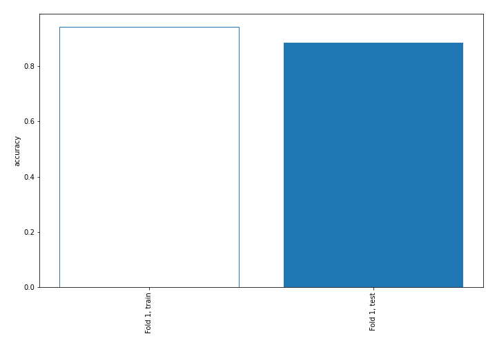

## Coefficients
| feature                           |   Learner_1 |
|:----------------------------------|------------:|
| return_autocorrelation_2_lag3     |   0.808234  |
| return_autocorrelation_2_lag1     |   0.703802  |
| return_autocorrelation_2_lag2     |   0.473672  |
| sqreturn_correlation_ts1_lag_3    |   0.4134    |
| return_correlation_ts1_lag_3      |   0.4134    |
| sqreturn_correlation_ts2_lag_3    |   0.412105  |
| return_correlation_ts2_lag_3      |   0.412105  |
| sqreturn_correlation_ts2_lag_1    |   0.373559  |
| return_correlation_ts2_lag_1      |   0.373559  |
| sqreturn_correlation_ts1_lag_1    |   0.335515  |
| return_correlation_ts1_lag_1      |   0.335515  |
| return_autocorrelation_1_lag3     |   0.328637  |
| sqreturn_correlation_ts1_lag_2    |   0.161534  |
| return_correlation_ts1_lag_2      |   0.161534  |
| return_autocorrelation_1_lag1     |   0.130683  |
| return_mean2                      |   0.108461  |
| return_autocorrelation_1_lag2     |   0.0558376 |
| return_sd1                        |  -0.0756576 |
| return_correlation_ts1_lag_0      |  -0.0790435 |
| sqreturn_correlation_ts1_lag_0    |  -0.0790435 |
| return_correlation_ts2_lag_2      |  -0.111118  |
| sqreturn_correlation_ts2_lag_2    |  -0.111118  |
| return_skew2                      |  -0.267618  |
| return_sd2                        |  -0.360073  |
| return_skew1                      |  -0.427935  |
| price1_granger_cause_price2       |  -0.460161  |
| sqreturn_autocorrelation_ts2_lag3 |  -0.504106  |
| price2_granger_cause_price1       |  -0.570207  |
| sqreturn_autocorrelation_ts2_lag2 |  -0.772109  |
| return_mean1                      |  -0.923029  |
| sqreturn_autocorrelation_ts1_lag2 |  -1.0618    |
| sqreturn_autocorrelation_ts1_lag3 |  -1.09583   |
| intercept                         |  -1.12382   |
| sqreturn_autocorrelation_ts1_lag1 |  -1.18558   |
| sqreturn_autocorrelation_ts2_lag1 |  -1.2725    |
| return_kurtosis2                  |  -2.94178   |
| return_kurtosis1                  |  -4.31401   |

## Permutation-based Importance
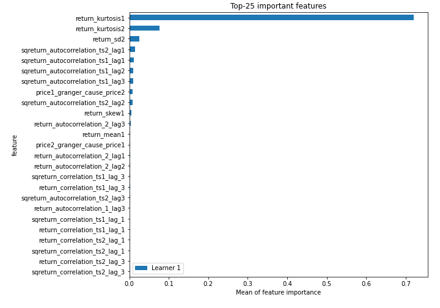
## Confusion Matrix

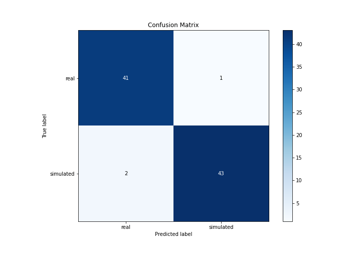

## Normalized Confusion Matrix

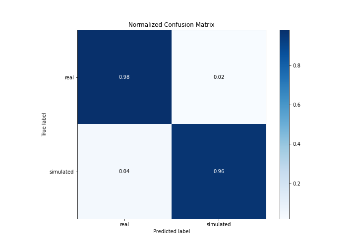

## ROC Curve

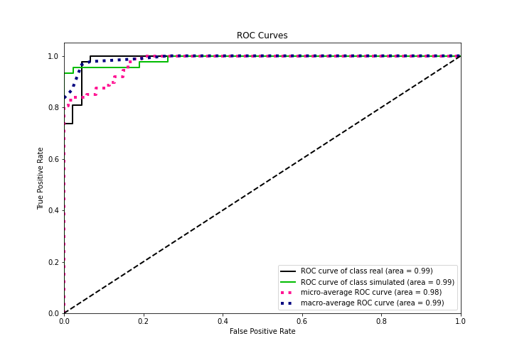

## Kolmogorov-Smirnov Statistic

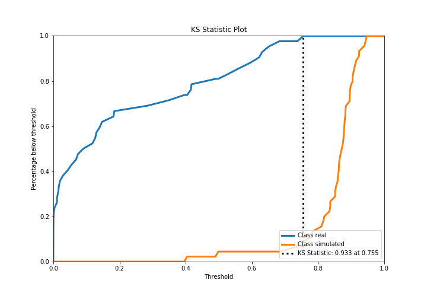

## Precision-Recall Curve

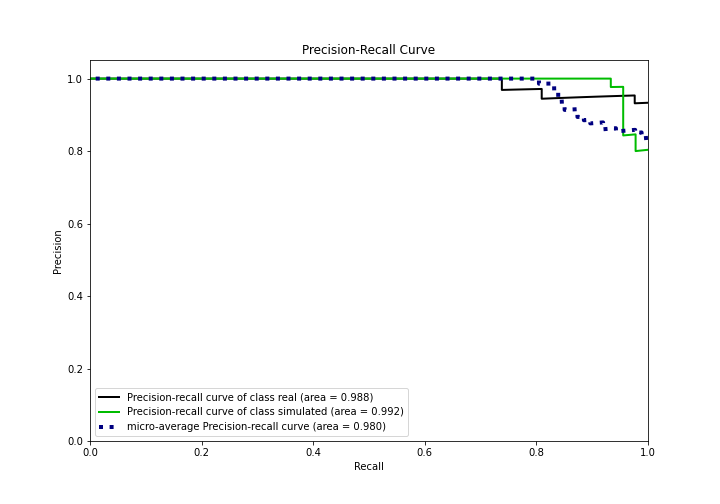

## Calibration Curve

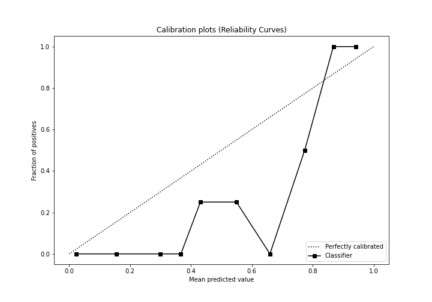

## Cumulative Gains Curve

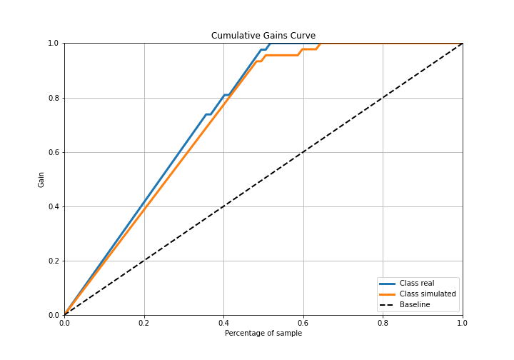

## Lift Curve

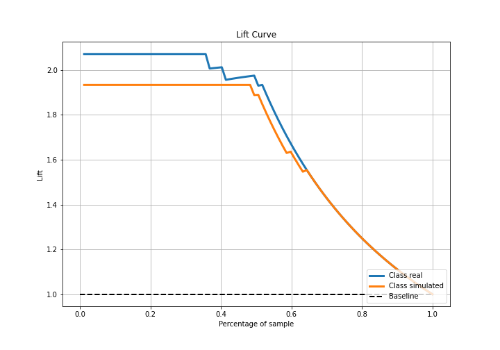

## SHAP Importance
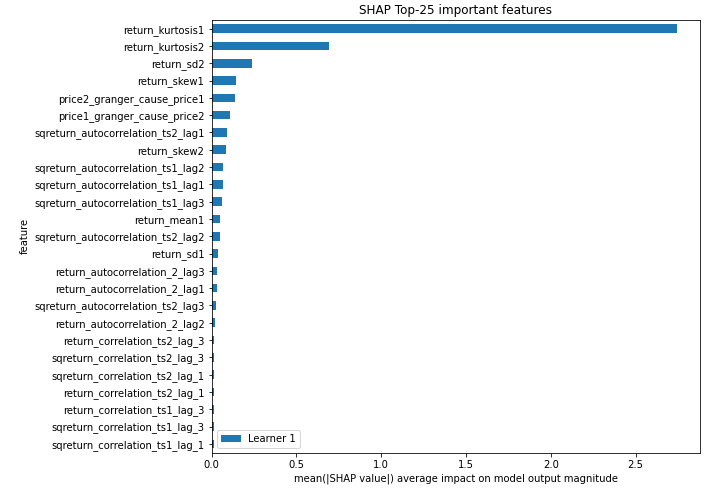

## SHAP Dependence plots

### Dependence (Fold 1)
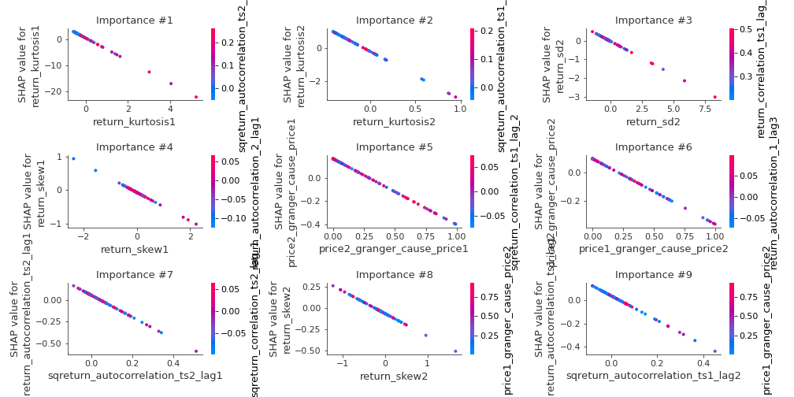

## SHAP Decision plots

### Top-10 Worst decisions for class 0 (Fold 1)
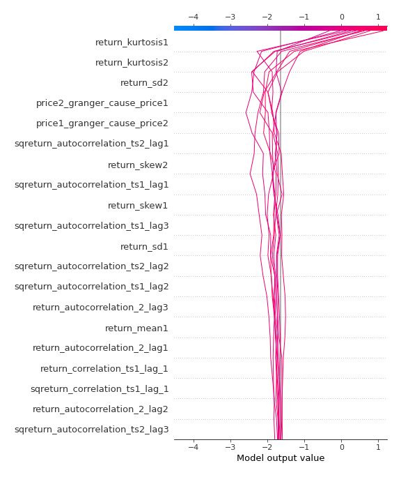
### Top-10 Best decisions for class 0 (Fold 1)
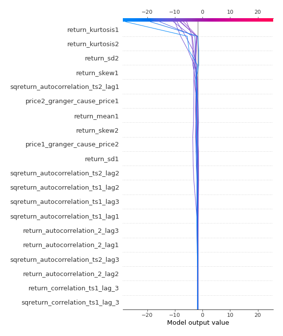
### Top-10 Worst decisions for class 1 (Fold 1)
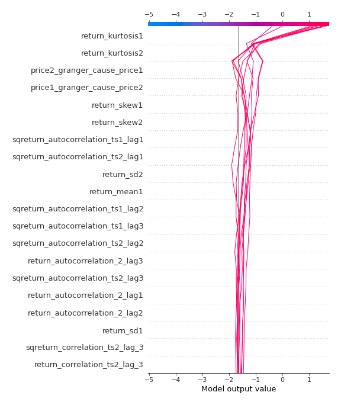
### Top-10 Best decisions for class 1 (Fold 1)
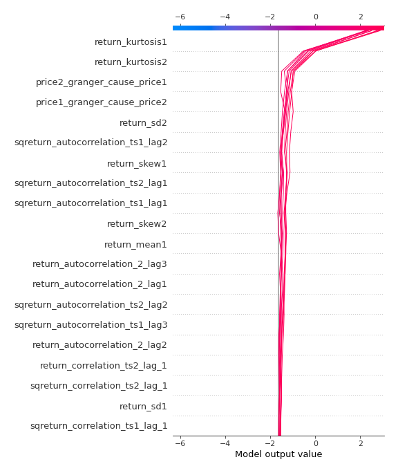

[<< Go back](../README.md)
