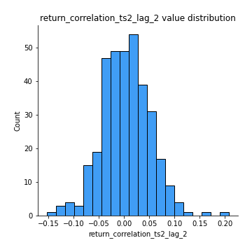

# Exploratory Data Analysis

[<< Go back](../README.md)
## Feature : target
- **Feature type** : categorical
- **Missing** : 0.0%
- **Unique** : 2
- **Count** :347
- **Unique** :2
- **Top** :simulated
- **Freq** :179

## Feature : return_mean1
- **Feature type** : continous
- **Missing** : 0.0%
- **Unique** : 347
- **Count** :347.0
- **Mean** :0.03014821865922659
- **Std** :0.07965185061001706
- **Min** :-0.22632637961920957
- **25%th Percentile** : -0.016795165693313546
- **50%th Percentile** : 0.028397377609672602
- **75%th Percentile** : 0.08008196167792192
- **Max** :0.3612366374600757

## Feature : return_mean2
- **Feature type** : continous
- **Missing** : 0.0%
- **Unique** : 347
- **Count** :347.0
- **Mean** :0.06773709385161407
- **Std** :0.08942865248673541
- **Min** :-0.24205418062825398
- **25%th Percentile** : 0.02147169855279374
- **50%th Percentile** : 0.06532028775144855
- **75%th Percentile** : 0.12326111026870078
- **Max** :0.3890911337421948

## Feature : return_sd1
- **Feature type** : continous
- **Missing** : 0.0%
- **Unique** : 347
- **Count** :347.0
- **Mean** :1.6881303102548326
- **Std** :0.7285777751767377
- **Min** :0.7470080772831957
- **25%th Percentile** : 1.4294004005721073
- **50%th Percentile** : 1.4946101745586244
- **75%th Percentile** : 1.6755231874636776
- **Max** :9.236766377527575

## Feature : return_sd2
- **Feature type** : continous
- **Missing** : 0.0%
- **Unique** : 347
- **Count** :347.0
- **Mean** :1.7469769173824807
- **Std** :0.6718830824894559
- **Min** :0.8592887433004143
- **25%th Percentile** : 1.49666114563475
- **50%th Percentile** : 1.5757477396061579
- **75%th Percentile** : 1.6664370011435905
- **Max** :6.737618636746393

## Feature : return_skew1
- **Feature type** : continous
- **Missing** : 0.0%
- **Unique** : 347
- **Count** :347.0
- **Mean** :-0.1349257819569194
- **Std** :0.5885758161770289
- **Min** :-3.530116233761814
- **25%th Percentile** : -0.24777759382125875
- **50%th Percentile** : -0.07761971346164312
- **75%th Percentile** : 0.06324278497337754
- **Max** :2.5845963767725557

## Feature : return_skew2
- **Feature type** : continous
- **Missing** : 0.0%
- **Unique** : 347
- **Count** :347.0
- **Mean** :-0.24120279633636155
- **Std** :0.7712432472392473
- **Min** :-8.801502855292393
- **25%th Percentile** : -0.3801191951988292
- **50%th Percentile** : -0.1449076306170314
- **75%th Percentile** : 0.02610397951685435
- **Max** :2.2606839051517187

## Feature : return_kurtosis1
- **Feature type** : continous
- **Missing** : 0.0%
- **Unique** : 347
- **Count** :347.0
- **Mean** :3.3222341776780153
- **Std** :6.039523328832839
- **Min** :-0.33729624137263414
- **25%th Percentile** : 0.24582866443930662
- **50%th Percentile** : 1.008467356572479
- **75%th Percentile** : 3.583058820532593
- **Max** :46.07507808162177

## Feature : return_kurtosis2
- **Feature type** : continous
- **Missing** : 0.0%
- **Unique** : 347
- **Count** :347.0
- **Mean** :4.096119393541313
- **Std** :10.18255035615216
- **Min** :-0.4826850225103776
- **25%th Percentile** : 0.5565858588816919
- **50%th Percentile** : 1.5229244677518596
- **75%th Percentile** : 4.202853905029984
- **Max** :143.10871011533666

## Feature : return_autocorrelation_1_lag1
- **Feature type** : continous
- **Missing** : 0.0%
- **Unique** : 347
- **Count** :347.0
- **Mean** :-0.009649988647569859
- **Std** :0.05668885572997675
- **Min** :-0.2135576224968752
- **25%th Percentile** : -0.041236073675728624
- **50%th Percentile** : -0.003654705826058786
- **75%th Percentile** : 0.025016300753709732
- **Max** :0.12810656890648087

## Feature : return_autocorrelation_1_lag2
- **Feature type** : continous
- **Missing** : 0.0%
- **Unique** : 347
- **Count** :347.0
- **Mean** :-0.006773607677126422
- **Std** :0.050307557159998025
- **Min** :-0.13309283796645122
- **25%th Percentile** : -0.03855604633487879
- **50%th Percentile** : -0.004952732798879338
- **75%th Percentile** : 0.024858358140128732
- **Max** :0.1561488228015672

## Feature : return_autocorrelation_1_lag3
- **Feature type** : continous
- **Missing** : 0.0%
- **Unique** : 347
- **Count** :347.0
- **Mean** :-0.000946308787300167
- **Std** :0.0517499061215975
- **Min** :-0.1940836867390813
- **25%th Percentile** : -0.03234258222085594
- **50%th Percentile** : 0.001687129426038458
- **75%th Percentile** : 0.03196239267216361
- **Max** :0.17805869530681923

## Feature : return_autocorrelation_2_lag1
- **Feature type** : continous
- **Missing** : 0.0%
- **Unique** : 347
- **Count** :347.0
- **Mean** :0.0003588982386996773
- **Std** :0.062277752843055464
- **Min** :-0.25075531010123286
- **25%th Percentile** : -0.03202846904149215
- **50%th Percentile** : 0.007202574955272374
- **75%th Percentile** : 0.03895812634604708
- **Max** :0.31863413537898483

## Feature : return_autocorrelation_2_lag2
- **Feature type** : continous
- **Missing** : 0.0%
- **Unique** : 347
- **Count** :347.0
- **Mean** :0.008083839108966855
- **Std** :0.0524653484061051
- **Min** :-0.1495113937562178
- **25%th Percentile** : -0.027990397475043803
- **50%th Percentile** : 0.007484652083896286
- **75%th Percentile** : 0.04435792456983949
- **Max** :0.20974504043791217

## Feature : return_autocorrelation_2_lag3
- **Feature type** : continous
- **Missing** : 0.0%
- **Unique** : 347
- **Count** :347.0
- **Mean** :0.007010609945768406
- **Std** :0.05288601256474406
- **Min** :-0.1344316177078651
- **25%th Percentile** : -0.02828426935272149
- **50%th Percentile** : 0.0071566782792465145
- **75%th Percentile** : 0.04221325399127142
- **Max** :0.14583435437463346

## Feature : return_correlation_ts1_lag_0
- **Feature type** : continous
- **Missing** : 0.0%
- **Unique** : 347
- **Count** :347.0
- **Mean** :0.3057328009019097
- **Std** :0.10248329966649045
- **Min** :0.005136598099876001
- **25%th Percentile** : 0.25086242142992865
- **50%th Percentile** : 0.30100057696224025
- **75%th Percentile** : 0.349665014027998
- **Max** :0.6812020480945222

## Feature : return_correlation_ts1_lag_1
- **Feature type** : continous
- **Missing** : 0.0%
- **Unique** : 347
- **Count** :347.0
- **Mean** :-0.0016083505077087498
- **Std** :0.05077375460950808
- **Min** :-0.16985510949917193
- **25%th Percentile** : -0.034550839516429455
- **50%th Percentile** : 0.002228399120814599
- **75%th Percentile** : 0.03276150119401319
- **Max** :0.15499424718508623

## Feature : return_correlation_ts1_lag_2
- **Feature type** : continous
- **Missing** : 0.0%
- **Unique** : 347
- **Count** :347.0
- **Mean** :0.0009943256658886716
- **Std** :0.04914920952399646
- **Min** :-0.21653581047581763
- **25%th Percentile** : -0.03160929111881888
- **50%th Percentile** : 0.00015586442007547576
- **75%th Percentile** : 0.0360658928558059
- **Max** :0.12611863020622446

## Feature : return_correlation_ts1_lag_3
- **Feature type** : continous
- **Missing** : 0.0%
- **Unique** : 347
- **Count** :347.0
- **Mean** :0.003936922658015652
- **Std** :0.0512843742334746
- **Min** :-0.1270218498974763
- **25%th Percentile** : -0.03178951172100715
- **50%th Percentile** : 0.005795509608942123
- **75%th Percentile** : 0.03863170575505144
- **Max** :0.1636773216468148

## Feature : return_correlation_ts2_lag_1
- **Feature type** : continous
- **Missing** : 0.0%
- **Unique** : 347
- **Count** :347.0
- **Mean** :-0.0024537510508357064
- **Std** :0.053138305906329224
- **Min** :-0.2081139431093261
- **25%th Percentile** : -0.035062262495050796
- **50%th Percentile** : 0.00042644339815202116
- **75%th Percentile** : 0.0378723218561826
- **Max** :0.11556235671885211

## Feature : return_correlation_ts2_lag_2
- **Feature type** : continous
- **Missing** : 0.0%
- **Unique** : 347
- **Count** :347.0
- **Mean** :0.003963368542220113
- **Std** :0.047675503543318176
- **Min** :-0.15299951737180204
- **25%th Percentile** : -0.027952212665296627
- **50%th Percentile** : 0.0031353414704733433
- **75%th Percentile** : 0.036240565395599604
- **Max** :0.20772887392904255

## Feature : return_correlation_ts2_lag_3
- **Feature type** : continous
- **Missing** : 0.0%
- **Unique** : 347
- **Count** :347.0
- **Mean** :0.0023888911406046713
- **Std** :0.052473661753538084
- **Min** :-0.17564076057312866
- **25%th Percentile** : -0.026310847804123093
- **50%th Percentile** : 0.003982715714552914
- **75%th Percentile** : 0.036861410861043595
- **Max** :0.14267874587553828

## Feature : sqreturn_autocorrelation_ts1_lag1
- **Feature type** : continous
- **Missing** : 0.0%
- **Unique** : 347
- **Count** :347.0
- **Mean** :0.044223707862119606
- **Std** :0.0855938409430961
- **Min** :-0.12377178586366948
- **25%th Percentile** : -0.010034630911256484
- **50%th Percentile** : 0.021573159790830257
- **75%th Percentile** : 0.07500178907962843
- **Max** :0.4439086285737898

## Feature : sqreturn_autocorrelation_ts1_lag2
- **Feature type** : continous
- **Missing** : 0.0%
- **Unique** : 347
- **Count** :347.0
- **Mean** :0.0377104170552062
- **Std** :0.09133350641382935
- **Min** :-0.0984159956258121
- **25%th Percentile** : -0.017199938864975978
- **50%th Percentile** : 0.010933086411203167
- **75%th Percentile** : 0.06106748982479154
- **Max** :0.4522162366773919

## Feature : sqreturn_autocorrelation_ts1_lag3
- **Feature type** : continous
- **Missing** : 0.0%
- **Unique** : 347
- **Count** :347.0
- **Mean** :0.03496311775029231
- **Std** :0.07898543971997912
- **Min** :-0.08835481208782485
- **25%th Percentile** : -0.015319027928406302
- **50%th Percentile** : 0.011795578039100923
- **75%th Percentile** : 0.06302625843491666
- **Max** :0.41030914918857014

## Feature : sqreturn_autocorrelation_ts2_lag1
- **Feature type** : continous
- **Missing** : 0.0%
- **Unique** : 347
- **Count** :347.0
- **Mean** :0.04567839356868522
- **Std** :0.08937608251741844
- **Min** :-0.12622322582563145
- **25%th Percentile** : -0.011899277472339057
- **50%th Percentile** : 0.01861744420917813
- **75%th Percentile** : 0.07353819757056218
- **Max** :0.510085647437958

## Feature : sqreturn_autocorrelation_ts2_lag2
- **Feature type** : continous
- **Missing** : 0.0%
- **Unique** : 347
- **Count** :347.0
- **Mean** :0.033853937760240975
- **Std** :0.08669483509648601
- **Min** :-0.11276987839532539
- **25%th Percentile** : -0.017991101236670592
- **50%th Percentile** : 0.011743873066816169
- **75%th Percentile** : 0.052937788348182
- **Max** :0.5373432415582473

## Feature : sqreturn_autocorrelation_ts2_lag3
- **Feature type** : continous
- **Missing** : 0.0%
- **Unique** : 347
- **Count** :347.0
- **Mean** :0.026166308056904872
- **Std** :0.06516651176595412
- **Min** :-0.08998148939120548
- **25%th Percentile** : -0.01316641144961863
- **50%th Percentile** : 0.010493312383313016
- **75%th Percentile** : 0.04756668849671135
- **Max** :0.31225727797735664

## Feature : sqreturn_correlation_ts1_lag_0
- **Feature type** : continous
- **Missing** : 0.0%
- **Unique** : 347
- **Count** :347.0
- **Mean** :0.3057328009019097
- **Std** :0.10248329966649045
- **Min** :0.005136598099876001
- **25%th Percentile** : 0.25086242142992865
- **50%th Percentile** : 0.30100057696224025
- **75%th Percentile** : 0.349665014027998
- **Max** :0.6812020480945222

## Feature : sqreturn_correlation_ts1_lag_1
- **Feature type** : continous
- **Missing** : 0.0%
- **Unique** : 347
- **Count** :347.0
- **Mean** :-0.0016083505077087498
- **Std** :0.05077375460950808
- **Min** :-0.16985510949917193
- **25%th Percentile** : -0.034550839516429455
- **50%th Percentile** : 0.002228399120814599
- **75%th Percentile** : 0.03276150119401319
- **Max** :0.15499424718508623

## Feature : sqreturn_correlation_ts1_lag_2
- **Feature type** : continous
- **Missing** : 0.0%
- **Unique** : 347
- **Count** :347.0
- **Mean** :0.0009943256658886716
- **Std** :0.04914920952399646
- **Min** :-0.21653581047581763
- **25%th Percentile** : -0.03160929111881888
- **50%th Percentile** : 0.00015586442007547576
- **75%th Percentile** : 0.0360658928558059
- **Max** :0.12611863020622446

## Feature : sqreturn_correlation_ts1_lag_3
- **Feature type** : continous
- **Missing** : 0.0%
- **Unique** : 347
- **Count** :347.0
- **Mean** :0.003936922658015652
- **Std** :0.0512843742334746
- **Min** :-0.1270218498974763
- **25%th Percentile** : -0.03178951172100715
- **50%th Percentile** : 0.005795509608942123
- **75%th Percentile** : 0.03863170575505144
- **Max** :0.1636773216468148

## Feature : sqreturn_correlation_ts2_lag_1
- **Feature type** : continous
- **Missing** : 0.0%
- **Unique** : 347
- **Count** :347.0
- **Mean** :-0.0024537510508357064
- **Std** :0.053138305906329224
- **Min** :-0.2081139431093261
- **25%th Percentile** : -0.035062262495050796
- **50%th Percentile** : 0.00042644339815202116
- **75%th Percentile** : 0.0378723218561826
- **Max** :0.11556235671885211

## Feature : sqreturn_correlation_ts2_lag_2
- **Feature type** : continous
- **Missing** : 0.0%
- **Unique** : 347
- **Count** :347.0
- **Mean** :0.003963368542220113
- **Std** :0.047675503543318176
- **Min** :-0.15299951737180204
- **25%th Percentile** : -0.027952212665296627
- **50%th Percentile** : 0.0031353414704733433
- **75%th Percentile** : 0.036240565395599604
- **Max** :0.20772887392904255

## Feature : sqreturn_correlation_ts2_lag_3
- **Feature type** : continous
- **Missing** : 0.0%
- **Unique** : 347
- **Count** :347.0
- **Mean** :0.0023888911406046713
- **Std** :0.052473661753538084
- **Min** :-0.17564076057312866
- **25%th Percentile** : -0.026310847804123093
- **50%th Percentile** : 0.003982715714552914
- **75%th Percentile** : 0.036861410861043595
- **Max** :0.14267874587553828

## Feature : price2_granger_cause_price1
- **Feature type** : continous
- **Missing** : 0.0%
- **Unique** : 347
- **Count** :347.0
- **Mean** :0.30909363397972656
- **Std** :0.2913344914154249
- **Min** :1.1505642493585304e-05
- **25%th Percentile** : 0.04673634308414286
- **50%th Percentile** : 0.2284290991659397
- **75%th Percentile** : 0.523840242225535
- **Max** :0.9885712803689185

## Feature : price1_granger_cause_price2
- **Feature type** : continous
- **Missing** : 0.0%
- **Unique** : 347
- **Count** :347.0
- **Mean** :0.2562866068650016
- **Std** :0.28444889345333085
- **Min** :2.318614364617489e-07
- **25%th Percentile** : 0.012327378634054266
- **50%th Percentile** : 0.14621344658837349
- **75%th Percentile** : 0.41993721634646813
- **Max** :0.9951398266867577

[<< Go back](../README.md)
