# Summary of 3_Linear

[<< Go back](../README.md)

## Logistic Regression (Linear)
- **n_jobs**: -1
- **explain_level**: 2

## Validation
 - **validation_type**: split
 - **train_ratio**: 0.75
 - **shuffle**: True
 - **stratify**: True

## Optimized metric
accuracy

## Training time

5.5 seconds

## Metric details
|           |    score |     threshold |
|:----------|---------:|--------------:|
| logloss   | 0.153696 | nan           |
| auc       | 1        | nan           |
| f1        | 1        |   0.627424    |
| accuracy  | 1        |   0.627424    |
| precision | 1        |   0.862814    |
| recall    | 1        |   4.57058e-11 |
| mcc       | 1        |   0.627424    |

## Confusion matrix (at threshold=0.627424)
|                      |   Predicted as real |   Predicted as simulated |
|:---------------------|--------------------:|-------------------------:|
| Labeled as real      |                  45 |                        0 |
| Labeled as simulated |                   0 |                       42 |

## Learning curves
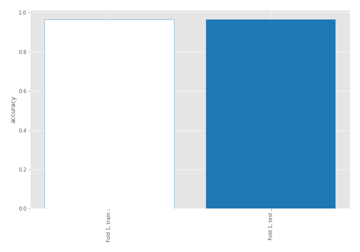

## Coefficients
| feature                           |   Learner_1 |
|:----------------------------------|------------:|
| return_skew2                      |   0.60453   |
| return_autocorrelation_2_lag3     |   0.447089  |
| return_autocorrelation_2_lag2     |   0.336198  |
| return_correlation_ts1_lag_1      |   0.303225  |
| sqreturn_correlation_ts1_lag_1    |   0.303225  |
| return_autocorrelation_2_lag1     |   0.289122  |
| return_autocorrelation_1_lag2     |   0.263635  |
| sqreturn_correlation_ts2_lag_3    |   0.243259  |
| return_correlation_ts2_lag_3      |   0.243259  |
| return_sd1                        |   0.22232   |
| return_autocorrelation_1_lag3     |   0.181611  |
| return_correlation_ts1_lag_3      |   0.153156  |
| sqreturn_correlation_ts1_lag_3    |   0.153156  |
| sqreturn_correlation_ts1_lag_2    |   0.150029  |
| return_correlation_ts1_lag_2      |   0.150029  |
| price1_granger_cause_price2       |   0.110563  |
| return_skew1                      |   0.0855042 |
| return_correlation_ts2_lag_1      |   0.0775218 |
| sqreturn_correlation_ts2_lag_1    |   0.0775218 |
| return_autocorrelation_1_lag1     |   0.0742665 |
| price2_granger_cause_price1       |   0.0679731 |
| return_correlation_ts1_lag_0      |   0.0594858 |
| sqreturn_correlation_ts1_lag_0    |   0.0594858 |
| return_correlation_ts2_lag_2      |   0.0279877 |
| sqreturn_correlation_ts2_lag_2    |   0.0279877 |
| return_mean1                      |  -0.211576  |
| return_mean2                      |  -0.438135  |
| return_sd2                        |  -0.529214  |
| sqreturn_autocorrelation_ts2_lag3 |  -0.670158  |
| sqreturn_autocorrelation_ts1_lag3 |  -0.996482  |
| sqreturn_autocorrelation_ts2_lag2 |  -1.02974   |
| sqreturn_autocorrelation_ts1_lag2 |  -1.12879   |
| sqreturn_autocorrelation_ts1_lag1 |  -1.28016   |
| sqreturn_autocorrelation_ts2_lag1 |  -1.29486   |
| intercept                         |  -1.70381   |
| return_kurtosis2                  |  -3.09737   |
| return_kurtosis1                  |  -4.5436    |

## Permutation-based Importance
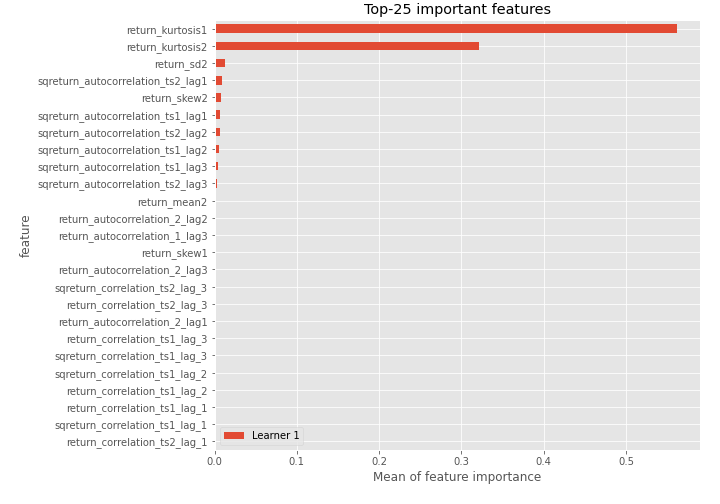
## Confusion Matrix

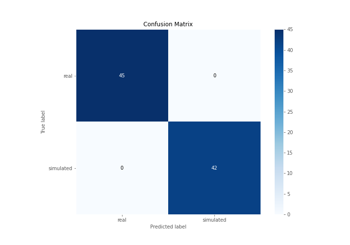

## Normalized Confusion Matrix

## ROC Curve

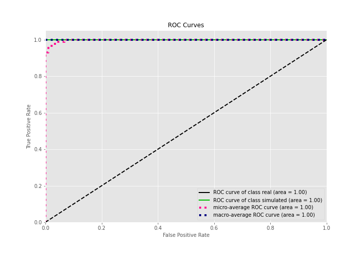

## Kolmogorov-Smirnov Statistic

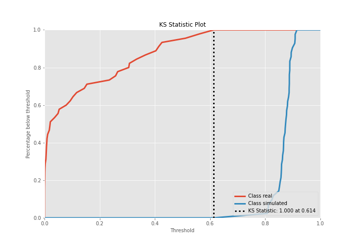

## Precision-Recall Curve

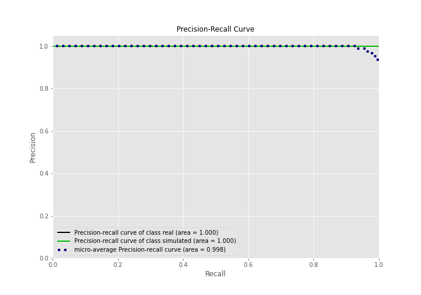

## Calibration Curve

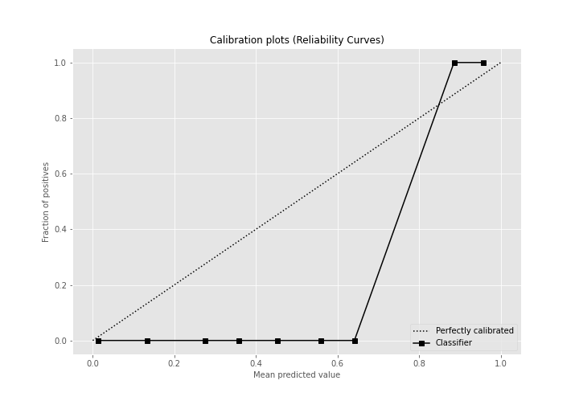

## Cumulative Gains Curve

## Lift Curve

## SHAP Importance
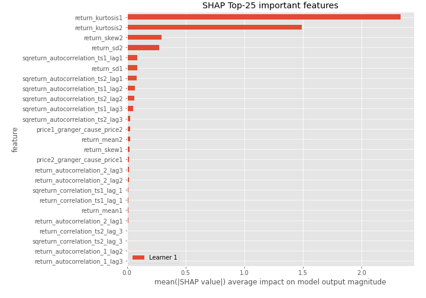

## SHAP Dependence plots

### Dependence (Fold 1)
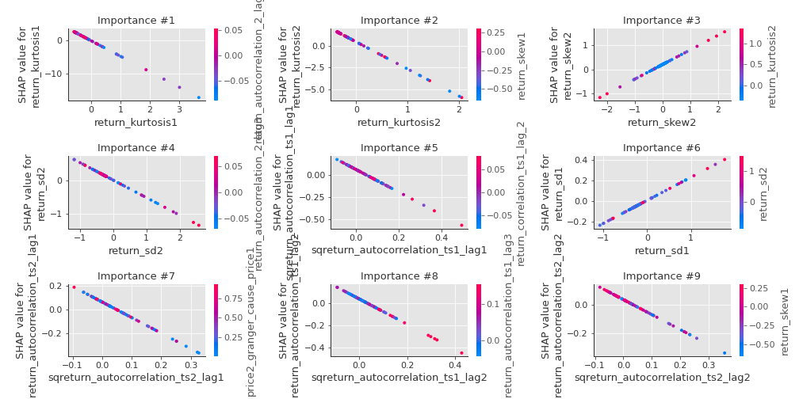

## SHAP Decision plots

### Top-10 Worst decisions for class 0 (Fold 1)
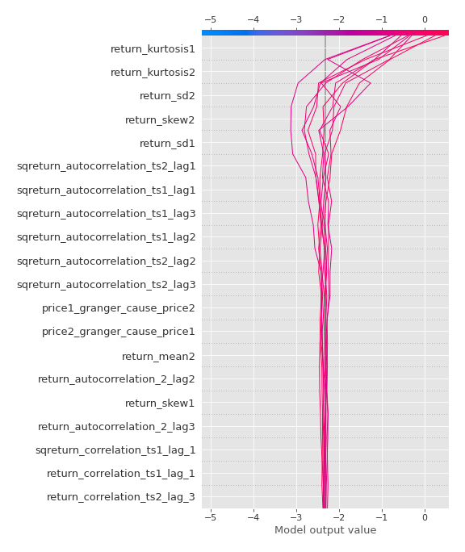
### Top-10 Best decisions for class 0 (Fold 1)
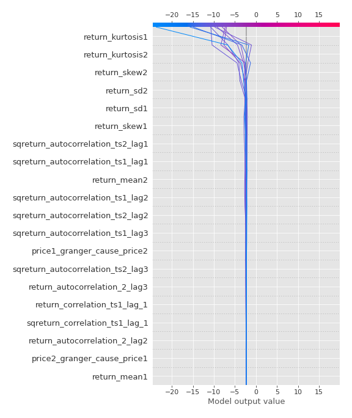
### Top-10 Worst decisions for class 1 (Fold 1)
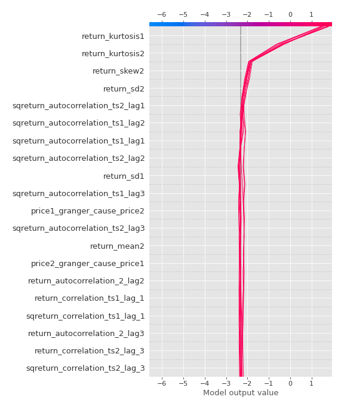
### Top-10 Best decisions for class 1 (Fold 1)
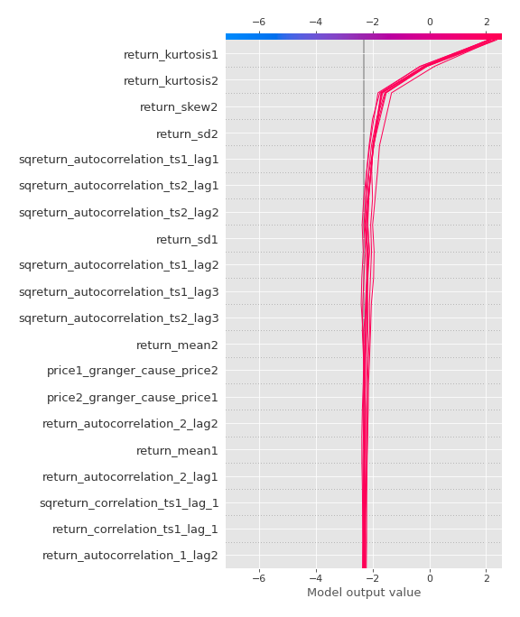

[<< Go back](../README.md)
