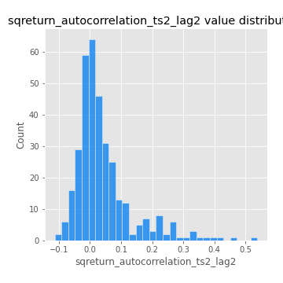

# Exploratory Data Analysis

[<< Go back](../README.md)
## Feature : target
- **Feature type** : categorical
- **Missing** : 0.0%
- **Unique** : 2
- **Count** :347
- **Unique** :2
- **Top** :real
- **Freq** :178

## Feature : return_mean1
- **Feature type** : continous
- **Missing** : 0.0%
- **Unique** : 347
- **Count** :347.0
- **Mean** :0.04869361374539954
- **Std** :0.07342587502600664
- **Min** :-0.22632637961920957
- **25%th Percentile** : 0.0013426647055598696
- **50%th Percentile** : 0.04912987029805134
- **75%th Percentile** : 0.09221078235813196
- **Max** :0.3612366374600757

## Feature : return_mean2
- **Feature type** : continous
- **Missing** : 0.0%
- **Unique** : 347
- **Count** :347.0
- **Mean** :0.05478035774062889
- **Std** :0.09153390157035354
- **Min** :-0.24205418062825398
- **25%th Percentile** : 0.004334939142177993
- **50%th Percentile** : 0.05946743570771436
- **75%th Percentile** : 0.1035009420236761
- **Max** :0.37616608147096464

## Feature : return_sd1
- **Feature type** : continous
- **Missing** : 0.0%
- **Unique** : 347
- **Count** :347.0
- **Mean** :1.769476394567307
- **Std** :0.7471881080269485
- **Min** :0.7470080772831957
- **25%th Percentile** : 1.5389810833097346
- **50%th Percentile** : 1.6023960402533244
- **75%th Percentile** : 1.7233528915570995
- **Max** :9.236766377527575

## Feature : return_sd2
- **Feature type** : continous
- **Missing** : 0.0%
- **Unique** : 347
- **Count** :347.0
- **Mean** :1.7938914998140698
- **Std** :0.7297678777809938
- **Min** :0.8592887433004143
- **25%th Percentile** : 1.516196622923251
- **50%th Percentile** : 1.5887423210205407
- **75%th Percentile** : 1.7148173010774352
- **Max** :6.737618636746393

## Feature : return_skew1
- **Feature type** : continous
- **Missing** : 0.0%
- **Unique** : 347
- **Count** :347.0
- **Mean** :-0.08523089489556415
- **Std** :0.5492341355067032
- **Min** :-2.817259764925239
- **25%th Percentile** : -0.19554536100248743
- **50%th Percentile** : -0.01370737418908027
- **75%th Percentile** : 0.08228731599204477
- **Max** :2.5845963767725557

## Feature : return_skew2
- **Feature type** : continous
- **Missing** : 0.0%
- **Unique** : 347
- **Count** :347.0
- **Mean** :-0.15038712789598796
- **Std** :0.7920486997165957
- **Min** :-8.801502855292393
- **25%th Percentile** : -0.2157965686355796
- **50%th Percentile** : -0.047202725976482764
- **75%th Percentile** : 0.06913158228316882
- **Max** :2.2606839051517187

## Feature : return_kurtosis1
- **Feature type** : continous
- **Missing** : 0.0%
- **Unique** : 347
- **Count** :347.0
- **Mean** :3.0452175994932174
- **Std** :5.673170010491252
- **Min** :-0.3570345955070331
- **25%th Percentile** : 0.005499811654959608
- **50%th Percentile** : 0.7343851244767841
- **75%th Percentile** : 3.583058820532593
- **Max** :36.91113889081053

## Feature : return_kurtosis2
- **Feature type** : continous
- **Missing** : 0.0%
- **Unique** : 347
- **Count** :347.0
- **Mean** :3.7706341358692
- **Std** :10.219574166202673
- **Min** :-0.4080697944999607
- **25%th Percentile** : -0.04692691119580239
- **50%th Percentile** : 0.6208695975279284
- **75%th Percentile** : 4.042224598652708
- **Max** :143.10871011533666

## Feature : return_autocorrelation_1_lag1
- **Feature type** : continous
- **Missing** : 0.0%
- **Unique** : 347
- **Count** :347.0
- **Mean** :-0.01347246549502668
- **Std** :0.05869325467185773
- **Min** :-0.2135576224968752
- **25%th Percentile** : -0.044891652340856805
- **50%th Percentile** : -0.010357315966109417
- **75%th Percentile** : 0.02412425492950531
- **Max** :0.1324855284768283

## Feature : return_autocorrelation_1_lag2
- **Feature type** : continous
- **Missing** : 0.0%
- **Unique** : 347
- **Count** :347.0
- **Mean** :-0.0039717791126142625
- **Std** :0.05020089782379758
- **Min** :-0.13309283796645122
- **25%th Percentile** : -0.035588025570453215
- **50%th Percentile** : -0.0016392323698294076
- **75%th Percentile** : 0.029134930614262085
- **Max** :0.1561488228015672

## Feature : return_autocorrelation_1_lag3
- **Feature type** : continous
- **Missing** : 0.0%
- **Unique** : 347
- **Count** :347.0
- **Mean** :-0.00670520736110798
- **Std** :0.05322031379483552
- **Min** :-0.1940836867390813
- **25%th Percentile** : -0.04145094815993496
- **50%th Percentile** : -0.005187774305168985
- **75%th Percentile** : 0.030601510205239685
- **Max** :0.17805869530681923

## Feature : return_autocorrelation_2_lag1
- **Feature type** : continous
- **Missing** : 0.0%
- **Unique** : 347
- **Count** :347.0
- **Mean** :-0.010950645044546846
- **Std** :0.05975186550897705
- **Min** :-0.24590087874039124
- **25%th Percentile** : -0.042438554623809736
- **50%th Percentile** : -0.006541002372382946
- **75%th Percentile** : 0.027318992160073233
- **Max** :0.31863413537898483

## Feature : return_autocorrelation_2_lag2
- **Feature type** : continous
- **Missing** : 0.0%
- **Unique** : 347
- **Count** :347.0
- **Mean** :0.0005102650046576237
- **Std** :0.05288321233940268
- **Min** :-0.15323211089747296
- **25%th Percentile** : -0.03384987596198084
- **50%th Percentile** : -0.00047850193121562565
- **75%th Percentile** : 0.035088683826291905
- **Max** :0.20974504043791217

## Feature : return_autocorrelation_2_lag3
- **Feature type** : continous
- **Missing** : 0.0%
- **Unique** : 347
- **Count** :347.0
- **Mean** :-0.002049607768734991
- **Std** :0.04882457279502345
- **Min** :-0.14200107169559698
- **25%th Percentile** : -0.03322017360375963
- **50%th Percentile** : -0.0011789625775280846
- **75%th Percentile** : 0.03212381956157884
- **Max** :0.13436695547271935

## Feature : return_correlation_ts1_lag_0
- **Feature type** : continous
- **Missing** : 0.0%
- **Unique** : 347
- **Count** :347.0
- **Mean** :0.32773777172341906
- **Std** :0.10949954721796669
- **Min** :-0.027089510445801036
- **25%th Percentile** : 0.2698433649389113
- **50%th Percentile** : 0.3250255316469731
- **75%th Percentile** : 0.3671446456679536
- **Max** :0.7028422087350163

## Feature : return_correlation_ts1_lag_1
- **Feature type** : continous
- **Missing** : 0.0%
- **Unique** : 347
- **Count** :347.0
- **Mean** :-0.00820718593262874
- **Std** :0.05335520470587368
- **Min** :-0.16985510949917193
- **25%th Percentile** : -0.04337658215570539
- **50%th Percentile** : -0.005790314761031967
- **75%th Percentile** : 0.02669508342668863
- **Max** :0.15499424718508623

## Feature : return_correlation_ts1_lag_2
- **Feature type** : continous
- **Missing** : 0.0%
- **Unique** : 347
- **Count** :347.0
- **Mean** :-0.0016047867981765463
- **Std** :0.04847743037965332
- **Min** :-0.21653581047581763
- **25%th Percentile** : -0.03472274324779098
- **50%th Percentile** : -0.0008649688367629019
- **75%th Percentile** : 0.0283389017522195
- **Max** :0.1295226252911066

## Feature : return_correlation_ts1_lag_3
- **Feature type** : continous
- **Missing** : 0.0%
- **Unique** : 347
- **Count** :347.0
- **Mean** :-0.003964443908239084
- **Std** :0.0519886470160293
- **Min** :-0.1270771609660377
- **25%th Percentile** : -0.03768501584354901
- **50%th Percentile** : -0.006833316947276784
- **75%th Percentile** : 0.02734439317901552
- **Max** :0.16584992673973065

## Feature : return_correlation_ts2_lag_1
- **Feature type** : continous
- **Missing** : 0.0%
- **Unique** : 347
- **Count** :347.0
- **Mean** :-0.009347038300274646
- **Std** :0.05291738826158117
- **Min** :-0.2081139431093261
- **25%th Percentile** : -0.039158902342413704
- **50%th Percentile** : -0.008841770328884549
- **75%th Percentile** : 0.02503126836179737
- **Max** :0.1179004467985867

## Feature : return_correlation_ts2_lag_2
- **Feature type** : continous
- **Missing** : 0.0%
- **Unique** : 347
- **Count** :347.0
- **Mean** :-0.0015618181551184866
- **Std** :0.04928887598878956
- **Min** :-0.23751835475804678
- **25%th Percentile** : -0.03164019901610411
- **50%th Percentile** : -0.0027358749519114604
- **75%th Percentile** : 0.027874515655592604
- **Max** :0.20772887392904255

## Feature : return_correlation_ts2_lag_3
- **Feature type** : continous
- **Missing** : 0.0%
- **Unique** : 347
- **Count** :347.0
- **Mean** :-0.001606027052952204
- **Std** :0.05347378758893446
- **Min** :-0.17564076057312866
- **25%th Percentile** : -0.03291089362769524
- **50%th Percentile** : -0.0024844486102674553
- **75%th Percentile** : 0.036594007197148865
- **Max** :0.14359172105672524

## Feature : sqreturn_autocorrelation_ts1_lag1
- **Feature type** : continous
- **Missing** : 0.0%
- **Unique** : 347
- **Count** :347.0
- **Mean** :0.05535464563525847
- **Std** :0.09590221806968219
- **Min** :-0.10590654917063615
- **25%th Percentile** : -0.012329709410242322
- **50%th Percentile** : 0.03078082206288772
- **75%th Percentile** : 0.09587623559216421
- **Max** :0.49414293176447355

## Feature : sqreturn_autocorrelation_ts1_lag2
- **Feature type** : continous
- **Missing** : 0.0%
- **Unique** : 347
- **Count** :347.0
- **Mean** :0.04883051537058507
- **Std** :0.09685324326328901
- **Min** :-0.09142957162673139
- **25%th Percentile** : -0.008988480293677648
- **50%th Percentile** : 0.022567435940495997
- **75%th Percentile** : 0.07462054318273581
- **Max** :0.540735851444759

## Feature : sqreturn_autocorrelation_ts1_lag3
- **Feature type** : continous
- **Missing** : 0.0%
- **Unique** : 347
- **Count** :347.0
- **Mean** :0.03518747443797558
- **Std** :0.07978606563169556
- **Min** :-0.10582707869759146
- **25%th Percentile** : -0.015025879053668124
- **50%th Percentile** : 0.013396151058836205
- **75%th Percentile** : 0.05958983119616897
- **Max** :0.41030914918857014

## Feature : sqreturn_autocorrelation_ts2_lag1
- **Feature type** : continous
- **Missing** : 0.0%
- **Unique** : 347
- **Count** :347.0
- **Mean** :0.049372433694607164
- **Std** :0.09150561036567137
- **Min** :-0.09500140599955369
- **25%th Percentile** : -0.009971440524988703
- **50%th Percentile** : 0.025695549370206412
- **75%th Percentile** : 0.08731796840775374
- **Max** :0.510085647437958

## Feature : sqreturn_autocorrelation_ts2_lag2
- **Feature type** : continous
- **Missing** : 0.0%
- **Unique** : 347
- **Count** :347.0
- **Mean** :0.04272023412809278
- **Std** :0.0941871258593666
- **Min** :-0.1132025117305611
- **25%th Percentile** : -0.013306707415391751
- **50%th Percentile** : 0.01574233289516576
- **75%th Percentile** : 0.06550891437628889
- **Max** :0.5373432415582473

## Feature : sqreturn_autocorrelation_ts2_lag3
- **Feature type** : continous
- **Missing** : 0.0%
- **Unique** : 347
- **Count** :347.0
- **Mean** :0.03251440707687767
- **Std** :0.07199497396967905
- **Min** :-0.12750345923808123
- **25%th Percentile** : -0.012862516518436898
- **50%th Percentile** : 0.016555456153511505
- **75%th Percentile** : 0.05933077747824955
- **Max** :0.31225727797735664

## Feature : sqreturn_correlation_ts1_lag_0
- **Feature type** : continous
- **Missing** : 0.0%
- **Unique** : 347
- **Count** :347.0
- **Mean** :0.32773777172341906
- **Std** :0.10949954721796669
- **Min** :-0.027089510445801036
- **25%th Percentile** : 0.2698433649389113
- **50%th Percentile** : 0.3250255316469731
- **75%th Percentile** : 0.3671446456679536
- **Max** :0.7028422087350163

## Feature : sqreturn_correlation_ts1_lag_1
- **Feature type** : continous
- **Missing** : 0.0%
- **Unique** : 347
- **Count** :347.0
- **Mean** :-0.00820718593262874
- **Std** :0.05335520470587368
- **Min** :-0.16985510949917193
- **25%th Percentile** : -0.04337658215570539
- **50%th Percentile** : -0.005790314761031967
- **75%th Percentile** : 0.02669508342668863
- **Max** :0.15499424718508623

## Feature : sqreturn_correlation_ts1_lag_2
- **Feature type** : continous
- **Missing** : 0.0%
- **Unique** : 347
- **Count** :347.0
- **Mean** :-0.0016047867981765463
- **Std** :0.04847743037965332
- **Min** :-0.21653581047581763
- **25%th Percentile** : -0.03472274324779098
- **50%th Percentile** : -0.0008649688367629019
- **75%th Percentile** : 0.0283389017522195
- **Max** :0.1295226252911066

## Feature : sqreturn_correlation_ts1_lag_3
- **Feature type** : continous
- **Missing** : 0.0%
- **Unique** : 347
- **Count** :347.0
- **Mean** :-0.003964443908239084
- **Std** :0.0519886470160293
- **Min** :-0.1270771609660377
- **25%th Percentile** : -0.03768501584354901
- **50%th Percentile** : -0.006833316947276784
- **75%th Percentile** : 0.02734439317901552
- **Max** :0.16584992673973065

## Feature : sqreturn_correlation_ts2_lag_1
- **Feature type** : continous
- **Missing** : 0.0%
- **Unique** : 347
- **Count** :347.0
- **Mean** :-0.009347038300274646
- **Std** :0.05291738826158117
- **Min** :-0.2081139431093261
- **25%th Percentile** : -0.039158902342413704
- **50%th Percentile** : -0.008841770328884549
- **75%th Percentile** : 0.02503126836179737
- **Max** :0.1179004467985867

## Feature : sqreturn_correlation_ts2_lag_2
- **Feature type** : continous
- **Missing** : 0.0%
- **Unique** : 347
- **Count** :347.0
- **Mean** :-0.0015618181551184866
- **Std** :0.04928887598878956
- **Min** :-0.23751835475804678
- **25%th Percentile** : -0.03164019901610411
- **50%th Percentile** : -0.0027358749519114604
- **75%th Percentile** : 0.027874515655592604
- **Max** :0.20772887392904255

## Feature : sqreturn_correlation_ts2_lag_3
- **Feature type** : continous
- **Missing** : 0.0%
- **Unique** : 347
- **Count** :347.0
- **Mean** :-0.001606027052952204
- **Std** :0.05347378758893446
- **Min** :-0.17564076057312866
- **25%th Percentile** : -0.03291089362769524
- **50%th Percentile** : -0.0024844486102674553
- **75%th Percentile** : 0.036594007197148865
- **Max** :0.14359172105672524

## Feature : price2_granger_cause_price1
- **Feature type** : continous
- **Missing** : 0.0%
- **Unique** : 347
- **Count** :347.0
- **Mean** :0.3385079197263156
- **Std** :0.2960109337786244
- **Min** :1.1505642493585304e-05
- **25%th Percentile** : 0.0643915431588638
- **50%th Percentile** : 0.27911126090260113
- **75%th Percentile** : 0.5637058614206074
- **Max** :0.9962461153623554

## Feature : price1_granger_cause_price2
- **Feature type** : continous
- **Missing** : 0.0%
- **Unique** : 347
- **Count** :347.0
- **Mean** :0.30395981759202684
- **Std** :0.2870574120821837
- **Min** :3.8112838766057795e-06
- **25%th Percentile** : 0.047952601101966315
- **50%th Percentile** : 0.23037613057020018
- **75%th Percentile** : 0.49879657652899256
- **Max** :0.9951398266867577

[<< Go back](../README.md)
