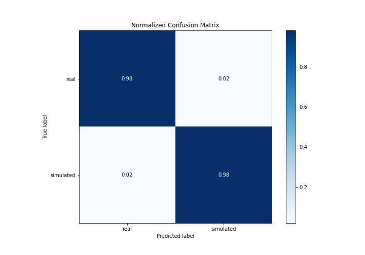
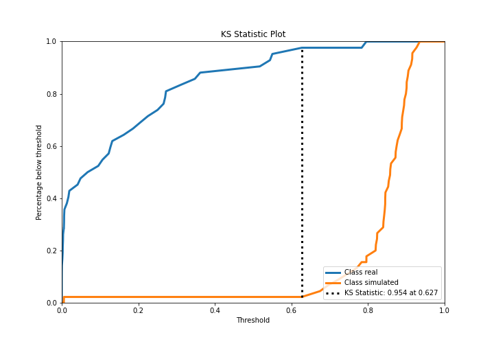

# Summary of 3_Linear

[<< Go back](../README.md)

## Logistic Regression (Linear)
- **n_jobs**: -1
- **explain_level**: 2

## Validation
 - **validation_type**: split
 - **train_ratio**: 0.75
 - **shuffle**: True
 - **stratify**: True

## Optimized metric
accuracy

## Training time

3.9 seconds

## Metric details
|           |    score |     threshold |
|:----------|---------:|--------------:|
| logloss   | 0.246498 | nan           |
| auc       | 0.980952 | nan           |
| f1        | 0.977778 |   0.637023    |
| accuracy  | 0.977011 |   0.637023    |
| precision | 1        |   0.851093    |
| recall    | 1        |   9.77219e-07 |
| mcc       | 0.953968 |   0.637023    |

## Confusion matrix (at threshold=0.637023)
|                      |   Predicted as real |   Predicted as simulated |
|:---------------------|--------------------:|-------------------------:|
| Labeled as real      |                  41 |                        1 |
| Labeled as simulated |                   1 |                       44 |

## Learning curves

## Coefficients
| feature                           |   Learner_1 |
|:----------------------------------|------------:|
| return_autocorrelation_2_lag2     |   0.890742  |
| return_autocorrelation_2_lag1     |   0.669305  |
| sqreturn_correlation_ts1_lag_1    |   0.579765  |
| return_correlation_ts1_lag_1      |   0.579765  |
| return_autocorrelation_2_lag3     |   0.534713  |
| return_correlation_ts2_lag_1      |   0.473966  |
| sqreturn_correlation_ts2_lag_1    |   0.473966  |
| return_correlation_ts1_lag_2      |   0.473419  |
| sqreturn_correlation_ts1_lag_2    |   0.473419  |
| return_mean2                      |   0.375947  |
| return_autocorrelation_1_lag2     |   0.336101  |
| return_autocorrelation_1_lag1     |   0.254391  |
| return_correlation_ts2_lag_2      |   0.24524   |
| sqreturn_correlation_ts2_lag_2    |   0.24524   |
| return_correlation_ts2_lag_3      |   0.211361  |
| sqreturn_correlation_ts2_lag_3    |   0.211361  |
| sqreturn_correlation_ts1_lag_3    |   0.130448  |
| return_correlation_ts1_lag_3      |   0.130448  |
| return_autocorrelation_1_lag3     |   0.0748826 |
| return_sd1                        |  -0.140233  |
| return_sd2                        |  -0.240696  |
| intercept                         |  -0.367596  |
| sqreturn_correlation_ts1_lag_0    |  -0.393619  |
| return_correlation_ts1_lag_0      |  -0.393619  |
| return_skew1                      |  -0.417678  |
| price1_granger_cause_price2       |  -0.456068  |
| price2_granger_cause_price1       |  -0.74577   |
| return_mean1                      |  -0.898057  |
| return_skew2                      |  -0.921826  |
| sqreturn_autocorrelation_ts2_lag3 |  -1.04877   |
| sqreturn_autocorrelation_ts1_lag3 |  -1.16518   |
| sqreturn_autocorrelation_ts2_lag2 |  -1.17992   |
| sqreturn_autocorrelation_ts1_lag2 |  -1.24564   |
| sqreturn_autocorrelation_ts2_lag1 |  -1.70384   |
| sqreturn_autocorrelation_ts1_lag1 |  -1.72138   |
| return_kurtosis2                  |  -2.73078   |
| return_kurtosis1                  |  -3.10989   |

## Permutation-based Importance

## Confusion Matrix

## Normalized Confusion Matrix

## ROC Curve

## Kolmogorov-Smirnov Statistic

## Precision-Recall Curve

## Calibration Curve

## Cumulative Gains Curve

## Lift Curve

## SHAP Importance

## SHAP Dependence plots

### Dependence (Fold 1)

## SHAP Decision plots

### Top-10 Worst decisions for class 0 (Fold 1)

### Top-10 Best decisions for class 0 (Fold 1)

### Top-10 Worst decisions for class 1 (Fold 1)

### Top-10 Best decisions for class 1 (Fold 1)

[<< Go back](../README.md)
