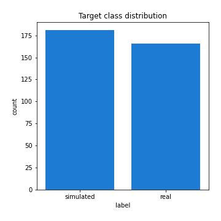

# Exploratory Data Analysis

[<< Go back](../README.md)
## Feature : target
- **Feature type** : categorical
- **Missing** : 0.0%
- **Unique** : 2
- **Count** :347
- **Unique** :2
- **Top** :simulated
- **Freq** :181

## Feature : return_mean1
- **Feature type** : continous
- **Missing** : 0.0%
- **Unique** : 347
- **Count** :347.0
- **Mean** :0.03208130279711664
- **Std** :0.07712123103853377
- **Min** :-0.161698323900724
- **25%th Percentile** : -0.013013366888933122
- **50%th Percentile** : 0.029700224992778478
- **75%th Percentile** : 0.0740449335339185
- **Max** :0.37175100008111034

## Feature : return_mean2
- **Feature type** : continous
- **Missing** : 0.0%
- **Unique** : 347
- **Count** :347.0
- **Mean** :0.0690422780704476
- **Std** :0.0942170663126041
- **Min** :-0.24205418062825398
- **25%th Percentile** : 0.020626599370460862
- **50%th Percentile** : 0.0729487615323011
- **75%th Percentile** : 0.12143975926140796
- **Max** :0.4313806684198084

## Feature : return_sd1
- **Feature type** : continous
- **Missing** : 0.0%
- **Unique** : 347
- **Count** :347.0
- **Mean** :1.6913597860294995
- **Std** :0.6611990816385496
- **Min** :0.7620831696941981
- **25%th Percentile** : 1.421694674381379
- **50%th Percentile** : 1.4858795217253902
- **75%th Percentile** : 1.6755385086464987
- **Max** :5.996244884956102

## Feature : return_sd2
- **Feature type** : continous
- **Missing** : 0.0%
- **Unique** : 347
- **Count** :347.0
- **Mean** :1.7541944216188692
- **Std** :0.720092394262799
- **Min** :0.8455946193085045
- **25%th Percentile** : 1.4964571198041692
- **50%th Percentile** : 1.564527220677321
- **75%th Percentile** : 1.6542594343741999
- **Max** :6.737618636746393

## Feature : return_skew1
- **Feature type** : continous
- **Missing** : 0.0%
- **Unique** : 347
- **Count** :347.0
- **Mean** :-0.13454080014678102
- **Std** :0.5924981326613892
- **Min** :-3.530116233761814
- **25%th Percentile** : -0.2636310068333661
- **50%th Percentile** : -0.0780200796661802
- **75%th Percentile** : 0.04803874246078213
- **Max** :2.5845963767725557

## Feature : return_skew2
- **Feature type** : continous
- **Missing** : 0.0%
- **Unique** : 347
- **Count** :347.0
- **Mean** :-0.23502678288917853
- **Std** :0.8050684626548132
- **Min** :-8.801502855292393
- **25%th Percentile** : -0.3403467615210849
- **50%th Percentile** : -0.12258216080470323
- **75%th Percentile** : 0.03845948506664565
- **Max** :2.2606839051517187

## Feature : return_kurtosis1
- **Feature type** : continous
- **Missing** : 0.0%
- **Unique** : 347
- **Count** :347.0
- **Mean** :3.155490091588213
- **Std** :5.8872662866136904
- **Min** :-0.3763362910659245
- **25%th Percentile** : 0.2501760028046127
- **50%th Percentile** : 0.9023884582933617
- **75%th Percentile** : 3.353308478350364
- **Max** :36.91113889081053

## Feature : return_kurtosis2
- **Feature type** : continous
- **Missing** : 0.0%
- **Unique** : 347
- **Count** :347.0
- **Mean** :4.253903379745483
- **Std** :10.129976126065861
- **Min** :-0.3494942539766943
- **25%th Percentile** : 0.42396776459396035
- **50%th Percentile** : 1.2745507740492168
- **75%th Percentile** : 4.554197422813971
- **Max** :143.10871011533666

## Feature : return_autocorrelation_1_lag1
- **Feature type** : continous
- **Missing** : 0.0%
- **Unique** : 347
- **Count** :347.0
- **Mean** :-0.008884195373171852
- **Std** :0.05485395860075318
- **Min** :-0.2135576224968752
- **25%th Percentile** : -0.03766548648858431
- **50%th Percentile** : -0.000358859837128093
- **75%th Percentile** : 0.02644160632985651
- **Max** :0.1413317658782479

## Feature : return_autocorrelation_1_lag2
- **Feature type** : continous
- **Missing** : 0.0%
- **Unique** : 347
- **Count** :347.0
- **Mean** :-0.004404987261939009
- **Std** :0.051807305092642905
- **Min** :-0.13309283796645122
- **25%th Percentile** : -0.037308880857671534
- **50%th Percentile** : -0.0036118734350910806
- **75%th Percentile** : 0.02841890643694312
- **Max** :0.18237730157129348

## Feature : return_autocorrelation_1_lag3
- **Feature type** : continous
- **Missing** : 0.0%
- **Unique** : 347
- **Count** :347.0
- **Mean** :0.00021171716163736424
- **Std** :0.04752981140928068
- **Min** :-0.16938047486036883
- **25%th Percentile** : -0.028573210957596427
- **50%th Percentile** : 0.00038579400785691966
- **75%th Percentile** : 0.03181448169066571
- **Max** :0.14978942247169358

## Feature : return_autocorrelation_2_lag1
- **Feature type** : continous
- **Missing** : 0.0%
- **Unique** : 347
- **Count** :347.0
- **Mean** :0.0025486335461998647
- **Std** :0.06471213141145729
- **Min** :-0.25075531010123286
- **25%th Percentile** : -0.03433560806340487
- **50%th Percentile** : 0.006579302492884274
- **75%th Percentile** : 0.04310074515991562
- **Max** :0.31863413537898483

## Feature : return_autocorrelation_2_lag2
- **Feature type** : continous
- **Missing** : 0.0%
- **Unique** : 347
- **Count** :347.0
- **Mean** :0.007611846929442015
- **Std** :0.05416777840813819
- **Min** :-0.15323211089747296
- **25%th Percentile** : -0.02906068544202112
- **50%th Percentile** : 0.008681952157616557
- **75%th Percentile** : 0.044975571799538414
- **Max** :0.20974504043791217

## Feature : return_autocorrelation_2_lag3
- **Feature type** : continous
- **Missing** : 0.0%
- **Unique** : 347
- **Count** :347.0
- **Mean** :0.008087890729418384
- **Std** :0.04951273357387704
- **Min** :-0.14200107169559698
- **25%th Percentile** : -0.02177301889349373
- **50%th Percentile** : 0.00898366396008383
- **75%th Percentile** : 0.03893300024847203
- **Max** :0.1419999376914021

## Feature : return_correlation_ts1_lag_0
- **Feature type** : continous
- **Missing** : 0.0%
- **Unique** : 347
- **Count** :347.0
- **Mean** :0.3028510108277803
- **Std** :0.10265674498914895
- **Min** :0.005136598099876001
- **25%th Percentile** : 0.24892954024190586
- **50%th Percentile** : 0.2981576374006602
- **75%th Percentile** : 0.34604074214196
- **Max** :0.7028422087350163

## Feature : return_correlation_ts1_lag_1
- **Feature type** : continous
- **Missing** : 0.0%
- **Unique** : 347
- **Count** :347.0
- **Mean** :-0.0036661710975675237
- **Std** :0.048896703528508924
- **Min** :-0.16985510949917193
- **25%th Percentile** : -0.0348288713536921
- **50%th Percentile** : -0.0003733890371953093
- **75%th Percentile** : 0.03131864138248729
- **Max** :0.11819480385322509

## Feature : return_correlation_ts1_lag_2
- **Feature type** : continous
- **Missing** : 0.0%
- **Unique** : 347
- **Count** :347.0
- **Mean** :0.002107552984253355
- **Std** :0.04817223108355724
- **Min** :-0.21653581047581763
- **25%th Percentile** : -0.028150577281824938
- **50%th Percentile** : 0.0014917860882998602
- **75%th Percentile** : 0.03786008966546949
- **Max** :0.12459687149854047

## Feature : return_correlation_ts1_lag_3
- **Feature type** : continous
- **Missing** : 0.0%
- **Unique** : 347
- **Count** :347.0
- **Mean** :0.0004114757242879411
- **Std** :0.05041707689449203
- **Min** :-0.12306593817498207
- **25%th Percentile** : -0.03255573798922506
- **50%th Percentile** : -0.0016003589285729638
- **75%th Percentile** : 0.03324420606621606
- **Max** :0.1636773216468148

## Feature : return_correlation_ts2_lag_1
- **Feature type** : continous
- **Missing** : 0.0%
- **Unique** : 347
- **Count** :347.0
- **Mean** :0.002577749993320063
- **Std** :0.05349492709136334
- **Min** :-0.2081139431093261
- **25%th Percentile** : -0.028689059544226354
- **50%th Percentile** : 0.003806845495939207
- **75%th Percentile** : 0.037237322383364954
- **Max** :0.17208763791364762

## Feature : return_correlation_ts2_lag_2
- **Feature type** : continous
- **Missing** : 0.0%
- **Unique** : 347
- **Count** :347.0
- **Mean** :0.00500737619435391
- **Std** :0.0488259932939703
- **Min** :-0.15299951737180204
- **25%th Percentile** : -0.028818831607765837
- **50%th Percentile** : 0.00454153459282533
- **75%th Percentile** : 0.036002014865134074
- **Max** :0.15388933426238696

## Feature : return_correlation_ts2_lag_3
- **Feature type** : continous
- **Missing** : 0.0%
- **Unique** : 347
- **Count** :347.0
- **Mean** :0.007510437427609523
- **Std** :0.04941842798251238
- **Min** :-0.1603001201932561
- **25%th Percentile** : -0.02109425412850289
- **50%th Percentile** : 0.00849507381061762
- **75%th Percentile** : 0.03885159880961098
- **Max** :0.14626870498176195

## Feature : sqreturn_autocorrelation_ts1_lag1
- **Feature type** : continous
- **Missing** : 0.0%
- **Unique** : 347
- **Count** :347.0
- **Mean** :0.04203183736076691
- **Std** :0.0826040446319218
- **Min** :-0.09876200114457107
- **25%th Percentile** : -0.015389941287743885
- **50%th Percentile** : 0.024892568265632083
- **75%th Percentile** : 0.08136190515092542
- **Max** :0.35395833119681636

## Feature : sqreturn_autocorrelation_ts1_lag2
- **Feature type** : continous
- **Missing** : 0.0%
- **Unique** : 347
- **Count** :347.0
- **Mean** :0.039766773647583506
- **Std** :0.07909708658404435
- **Min** :-0.09938986032737888
- **25%th Percentile** : -0.010185678677624377
- **50%th Percentile** : 0.02102209928699496
- **75%th Percentile** : 0.07141430984610711
- **Max** :0.39723504055743203

## Feature : sqreturn_autocorrelation_ts1_lag3
- **Feature type** : continous
- **Missing** : 0.0%
- **Unique** : 347
- **Count** :347.0
- **Mean** :0.030110616186739696
- **Std** :0.06925598988043236
- **Min** :-0.09356736847826848
- **25%th Percentile** : -0.013517938661701489
- **50%th Percentile** : 0.01719546210374901
- **75%th Percentile** : 0.05497299384592731
- **Max** :0.30313296655542116

## Feature : sqreturn_autocorrelation_ts2_lag1
- **Feature type** : continous
- **Missing** : 0.0%
- **Unique** : 347
- **Count** :347.0
- **Mean** :0.048480178149502916
- **Std** :0.08939706419289399
- **Min** :-0.10343033583403492
- **25%th Percentile** : -0.010312319511274846
- **50%th Percentile** : 0.028024673012368214
- **75%th Percentile** : 0.08311599375667086
- **Max** :0.510085647437958

## Feature : sqreturn_autocorrelation_ts2_lag2
- **Feature type** : continous
- **Missing** : 0.0%
- **Unique** : 347
- **Count** :347.0
- **Mean** :0.03335957820090812
- **Std** :0.08298840187699844
- **Min** :-0.1105803286401315
- **25%th Percentile** : -0.013260108632596197
- **50%th Percentile** : 0.012409244605127252
- **75%th Percentile** : 0.057620366262740315
- **Max** :0.5373432415582473

## Feature : sqreturn_autocorrelation_ts2_lag3
- **Feature type** : continous
- **Missing** : 0.0%
- **Unique** : 347
- **Count** :347.0
- **Mean** :0.023397145185329756
- **Std** :0.06831679834473077
- **Min** :-0.09169929627781107
- **25%th Percentile** : -0.016923536226455677
- **50%th Percentile** : 0.00784855358048498
- **75%th Percentile** : 0.04560664051878223
- **Max** :0.2982547942937359

## Feature : sqreturn_correlation_ts1_lag_0
- **Feature type** : continous
- **Missing** : 0.0%
- **Unique** : 347
- **Count** :347.0
- **Mean** :0.3028510108277803
- **Std** :0.10265674498914895
- **Min** :0.005136598099876001
- **25%th Percentile** : 0.24892954024190586
- **50%th Percentile** : 0.2981576374006602
- **75%th Percentile** : 0.34604074214196
- **Max** :0.7028422087350163

## Feature : sqreturn_correlation_ts1_lag_1
- **Feature type** : continous
- **Missing** : 0.0%
- **Unique** : 347
- **Count** :347.0
- **Mean** :-0.0036661710975675237
- **Std** :0.048896703528508924
- **Min** :-0.16985510949917193
- **25%th Percentile** : -0.0348288713536921
- **50%th Percentile** : -0.0003733890371953093
- **75%th Percentile** : 0.03131864138248729
- **Max** :0.11819480385322509

## Feature : sqreturn_correlation_ts1_lag_2
- **Feature type** : continous
- **Missing** : 0.0%
- **Unique** : 347
- **Count** :347.0
- **Mean** :0.002107552984253355
- **Std** :0.04817223108355724
- **Min** :-0.21653581047581763
- **25%th Percentile** : -0.028150577281824938
- **50%th Percentile** : 0.0014917860882998602
- **75%th Percentile** : 0.03786008966546949
- **Max** :0.12459687149854047

## Feature : sqreturn_correlation_ts1_lag_3
- **Feature type** : continous
- **Missing** : 0.0%
- **Unique** : 347
- **Count** :347.0
- **Mean** :0.0004114757242879411
- **Std** :0.05041707689449203
- **Min** :-0.12306593817498207
- **25%th Percentile** : -0.03255573798922506
- **50%th Percentile** : -0.0016003589285729638
- **75%th Percentile** : 0.03324420606621606
- **Max** :0.1636773216468148

## Feature : sqreturn_correlation_ts2_lag_1
- **Feature type** : continous
- **Missing** : 0.0%
- **Unique** : 347
- **Count** :347.0
- **Mean** :0.002577749993320063
- **Std** :0.05349492709136334
- **Min** :-0.2081139431093261
- **25%th Percentile** : -0.028689059544226354
- **50%th Percentile** : 0.003806845495939207
- **75%th Percentile** : 0.037237322383364954
- **Max** :0.17208763791364762

## Feature : sqreturn_correlation_ts2_lag_2
- **Feature type** : continous
- **Missing** : 0.0%
- **Unique** : 347
- **Count** :347.0
- **Mean** :0.00500737619435391
- **Std** :0.0488259932939703
- **Min** :-0.15299951737180204
- **25%th Percentile** : -0.028818831607765837
- **50%th Percentile** : 0.00454153459282533
- **75%th Percentile** : 0.036002014865134074
- **Max** :0.15388933426238696

## Feature : sqreturn_correlation_ts2_lag_3
- **Feature type** : continous
- **Missing** : 0.0%
- **Unique** : 347
- **Count** :347.0
- **Mean** :0.007510437427609523
- **Std** :0.04941842798251238
- **Min** :-0.1603001201932561
- **25%th Percentile** : -0.02109425412850289
- **50%th Percentile** : 0.00849507381061762
- **75%th Percentile** : 0.03885159880961098
- **Max** :0.14626870498176195

## Feature : price2_granger_cause_price1
- **Feature type** : continous
- **Missing** : 0.0%
- **Unique** : 347
- **Count** :347.0
- **Mean** :0.305158814790943
- **Std** :0.2972391376225626
- **Min** :9.636194585507506e-08
- **25%th Percentile** : 0.04111162446713631
- **50%th Percentile** : 0.22066670074754838
- **75%th Percentile** : 0.5074270327189252
- **Max** :0.9987269365422687

## Feature : price1_granger_cause_price2
- **Feature type** : continous
- **Missing** : 0.0%
- **Unique** : 347
- **Count** :347.0
- **Mean** :0.25640784275940315
- **Std** :0.2798924021868433
- **Min** :3.7025040708542827e-07
- **25%th Percentile** : 0.02019496591091144
- **50%th Percentile** : 0.16917554597893408
- **75%th Percentile** : 0.3752962585454995
- **Max** :0.9951398266867577

[<< Go back](../README.md)
