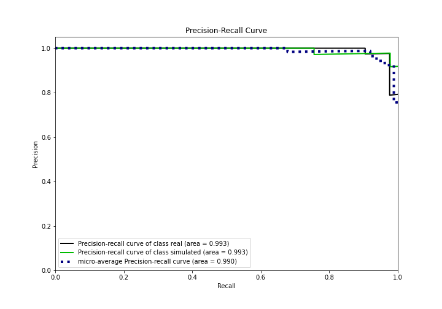

# Summary of 3_Linear

[<< Go back](../README.md)

## Logistic Regression (Linear)
- **n_jobs**: -1
- **explain_level**: 2

## Validation
 - **validation_type**: split
 - **train_ratio**: 0.75
 - **shuffle**: True
 - **stratify**: True

## Optimized metric
accuracy

## Training time

4.3 seconds

## Metric details
|           |    score |    threshold |
|:----------|---------:|-------------:|
| logloss   | 0.204188 | nan          |
| auc       | 0.992593 | nan          |
| f1        | 0.977778 |   0.66658    |
| accuracy  | 0.977011 |   0.66658    |
| precision | 1        |   0.854347   |
| recall    | 1        |   8.3158e-07 |
| mcc       | 0.953968 |   0.66658    |

## Confusion matrix (at threshold=0.66658)
|                      |   Predicted as real |   Predicted as simulated |
|:---------------------|--------------------:|-------------------------:|
| Labeled as real      |                  41 |                        1 |
| Labeled as simulated |                   1 |                       44 |

## Learning curves

## Coefficients
| feature                           |   Learner_1 |
|:----------------------------------|------------:|
| return_autocorrelation_2_lag2     |  0.6652     |
| sqreturn_correlation_ts1_lag_1    |  0.639644   |
| return_correlation_ts1_lag_1      |  0.639644   |
| return_autocorrelation_2_lag1     |  0.608      |
| return_autocorrelation_1_lag3     |  0.583219   |
| return_autocorrelation_2_lag3     |  0.453857   |
| sqreturn_correlation_ts1_lag_3    |  0.347237   |
| return_correlation_ts1_lag_3      |  0.347237   |
| sqreturn_correlation_ts2_lag_1    |  0.334446   |
| return_correlation_ts2_lag_1      |  0.334446   |
| sqreturn_correlation_ts2_lag_3    |  0.330879   |
| return_correlation_ts2_lag_3      |  0.330879   |
| return_autocorrelation_1_lag1     |  0.19347    |
| return_correlation_ts1_lag_2      |  0.177698   |
| sqreturn_correlation_ts1_lag_2    |  0.177698   |
| return_autocorrelation_1_lag2     |  0.136528   |
| return_mean2                      |  0.0065378  |
| sqreturn_correlation_ts2_lag_2    | -0.00468472 |
| return_correlation_ts2_lag_2      | -0.00468472 |
| return_sd1                        | -0.150571   |
| sqreturn_correlation_ts1_lag_0    | -0.156752   |
| return_correlation_ts1_lag_0      | -0.156752   |
| return_sd2                        | -0.284922   |
| return_skew2                      | -0.351833   |
| intercept                         | -0.503563   |
| price2_granger_cause_price1       | -0.525898   |
| return_skew1                      | -0.537175   |
| sqreturn_autocorrelation_ts2_lag3 | -0.818841   |
| return_mean1                      | -0.833759   |
| price1_granger_cause_price2       | -0.922968   |
| sqreturn_autocorrelation_ts2_lag2 | -1.10533    |
| sqreturn_autocorrelation_ts1_lag3 | -1.10562    |
| sqreturn_autocorrelation_ts1_lag2 | -1.36689    |
| sqreturn_autocorrelation_ts1_lag1 | -1.51759    |
| sqreturn_autocorrelation_ts2_lag1 | -1.62201    |
| return_kurtosis2                  | -2.42496    |
| return_kurtosis1                  | -3.56552    |

## Permutation-based Importance

## Confusion Matrix

## Normalized Confusion Matrix

## ROC Curve

## Kolmogorov-Smirnov Statistic

## Precision-Recall Curve

## Calibration Curve

## Cumulative Gains Curve

## Lift Curve

## SHAP Importance

## SHAP Dependence plots

### Dependence (Fold 1)

## SHAP Decision plots

### Top-10 Worst decisions for class 0 (Fold 1)

### Top-10 Best decisions for class 0 (Fold 1)

### Top-10 Worst decisions for class 1 (Fold 1)

### Top-10 Best decisions for class 1 (Fold 1)

[<< Go back](../README.md)
