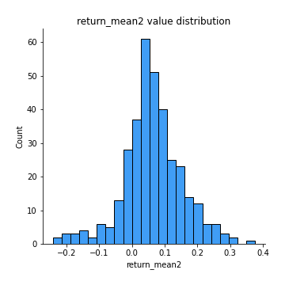
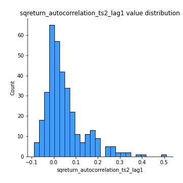

# Exploratory Data Analysis

[<< Go back](../README.md)
## Feature : target
- **Feature type** : categorical
- **Missing** : 0.0%
- **Unique** : 2
- **Count** :347
- **Unique** :2
- **Top** :simulated
- **Freq** :180

## Feature : return_mean1
- **Feature type** : continous
- **Missing** : 0.0%
- **Unique** : 347
- **Count** :347.0
- **Mean** :0.030784225137266932
- **Std** :0.07658700078327135
- **Min** :-0.22632637961920957
- **25%th Percentile** : -0.015871301583578447
- **50%th Percentile** : 0.02931270746886866
- **75%th Percentile** : 0.07907562141018333
- **Max** :0.37175100008111034

## Feature : return_mean2
- **Feature type** : continous
- **Missing** : 0.0%
- **Unique** : 347
- **Count** :347.0
- **Mean** :0.06254845554372848
- **Std** :0.0916279024248924
- **Min** :-0.24205418062825398
- **25%th Percentile** : 0.014772955278497937
- **50%th Percentile** : 0.057928199993399085
- **75%th Percentile** : 0.11350013692911977
- **Max** :0.37616608147096464

## Feature : return_sd1
- **Feature type** : continous
- **Missing** : 0.0%
- **Unique** : 347
- **Count** :347.0
- **Mean** :1.7024276323289873
- **Std** :0.7855747177224278
- **Min** :0.7470080772831957
- **25%th Percentile** : 1.4264068004070074
- **50%th Percentile** : 1.4897981447582997
- **75%th Percentile** : 1.6066916125334902
- **Max** :9.236766377527575

## Feature : return_sd2
- **Feature type** : continous
- **Missing** : 0.0%
- **Unique** : 347
- **Count** :347.0
- **Mean** :1.7545974217179259
- **Std** :0.7088260257599809
- **Min** :0.8455946193085045
- **25%th Percentile** : 1.4959382712825007
- **50%th Percentile** : 1.574376753515575
- **75%th Percentile** : 1.6755598508116663
- **Max** :6.737618636746393

## Feature : return_skew1
- **Feature type** : continous
- **Missing** : 0.0%
- **Unique** : 347
- **Count** :347.0
- **Mean** :-0.10872738576677177
- **Std** :0.5203265009773989
- **Min** :-2.5812453059760836
- **25%th Percentile** : -0.25113143406606786
- **50%th Percentile** : -0.07272161877083043
- **75%th Percentile** : 0.06038129450898261
- **Max** :2.5845963767725557

## Feature : return_skew2
- **Feature type** : continous
- **Missing** : 0.0%
- **Unique** : 347
- **Count** :347.0
- **Mean** :-0.2328987585839243
- **Std** :0.7986437453978446
- **Min** :-8.801502855292393
- **25%th Percentile** : -0.37155961676958305
- **50%th Percentile** : -0.14941190117924177
- **75%th Percentile** : 0.026931732892350346
- **Max** :2.2606839051517187

## Feature : return_kurtosis1
- **Feature type** : continous
- **Missing** : 0.0%
- **Unique** : 347
- **Count** :347.0
- **Mean** :2.9321447048717224
- **Std** :4.992162437088147
- **Min** :-0.4734762048110852
- **25%th Percentile** : 0.2679051102888239
- **50%th Percentile** : 1.0691678865487142
- **75%th Percentile** : 3.493977699762969
- **Max** :35.56636016047202

## Feature : return_kurtosis2
- **Feature type** : continous
- **Missing** : 0.0%
- **Unique** : 347
- **Count** :347.0
- **Mean** :4.1789213187193655
- **Std** :10.028839839340765
- **Min** :-0.4015405283372253
- **25%th Percentile** : 0.5282341451174317
- **50%th Percentile** : 1.5899523749854558
- **75%th Percentile** : 4.109234780795159
- **Max** :143.10871011533666

## Feature : return_autocorrelation_1_lag1
- **Feature type** : continous
- **Missing** : 0.0%
- **Unique** : 347
- **Count** :347.0
- **Mean** :-0.007016710072066297
- **Std** :0.056225069774614986
- **Min** :-0.2135576224968752
- **25%th Percentile** : -0.04074936172264777
- **50%th Percentile** : -0.002952079080113821
- **75%th Percentile** : 0.029751716688866454
- **Max** :0.1441848522867116

## Feature : return_autocorrelation_1_lag2
- **Feature type** : continous
- **Missing** : 0.0%
- **Unique** : 347
- **Count** :347.0
- **Mean** :-0.007304251429974411
- **Std** :0.049404735628460233
- **Min** :-0.13309283796645122
- **25%th Percentile** : -0.03928437632863113
- **50%th Percentile** : -0.0036118734350910806
- **75%th Percentile** : 0.024688913137969847
- **Max** :0.1561488228015672

## Feature : return_autocorrelation_1_lag3
- **Feature type** : continous
- **Missing** : 0.0%
- **Unique** : 347
- **Count** :347.0
- **Mean** :-0.0004997408089536207
- **Std** :0.05274237700135016
- **Min** :-0.1940836867390813
- **25%th Percentile** : -0.0323541572310011
- **50%th Percentile** : 0.00010684383579549596
- **75%th Percentile** : 0.03388123901002736
- **Max** :0.17805869530681923

## Feature : return_autocorrelation_2_lag1
- **Feature type** : continous
- **Missing** : 0.0%
- **Unique** : 347
- **Count** :347.0
- **Mean** :0.0022455936266171585
- **Std** :0.0647170003263053
- **Min** :-0.25075531010123286
- **25%th Percentile** : -0.03343992316035954
- **50%th Percentile** : 0.009743624047419184
- **75%th Percentile** : 0.04067294229478402
- **Max** :0.31863413537898483

## Feature : return_autocorrelation_2_lag2
- **Feature type** : continous
- **Missing** : 0.0%
- **Unique** : 347
- **Count** :347.0
- **Mean** :0.008135823908986874
- **Std** :0.056252338413063534
- **Min** :-0.15323211089747296
- **25%th Percentile** : -0.03033771598587332
- **50%th Percentile** : 0.008567993903275645
- **75%th Percentile** : 0.04783493557982958
- **Max** :0.20974504043791217

## Feature : return_autocorrelation_2_lag3
- **Feature type** : continous
- **Missing** : 0.0%
- **Unique** : 347
- **Count** :347.0
- **Mean** :0.0043704333808718574
- **Std** :0.050604566636837114
- **Min** :-0.14200107169559698
- **25%th Percentile** : -0.026581376199028554
- **50%th Percentile** : 0.0026790259892069254
- **75%th Percentile** : 0.038117546127148516
- **Max** :0.1419999376914021

## Feature : return_correlation_ts1_lag_0
- **Feature type** : continous
- **Missing** : 0.0%
- **Unique** : 347
- **Count** :347.0
- **Mean** :0.30876042493630546
- **Std** :0.10800348943033437
- **Min** :0.005136598099876001
- **25%th Percentile** : 0.2481776202336182
- **50%th Percentile** : 0.3005380261895448
- **75%th Percentile** : 0.3544769937627109
- **Max** :0.7041861626832071

## Feature : return_correlation_ts1_lag_1
- **Feature type** : continous
- **Missing** : 0.0%
- **Unique** : 347
- **Count** :347.0
- **Mean** :0.00022796500026609328
- **Std** :0.05441313657361753
- **Min** :-0.16985510949917193
- **25%th Percentile** : -0.037160707375204924
- **50%th Percentile** : 0.002038852059619574
- **75%th Percentile** : 0.03841354727563309
- **Max** :0.15499424718508623

## Feature : return_correlation_ts1_lag_2
- **Feature type** : continous
- **Missing** : 0.0%
- **Unique** : 347
- **Count** :347.0
- **Mean** :-0.001032195924815817
- **Std** :0.04938953852907925
- **Min** :-0.21653581047581763
- **25%th Percentile** : -0.03078046520115727
- **50%th Percentile** : -0.0014534736287393124
- **75%th Percentile** : 0.03417093191439971
- **Max** :0.11971634970027556

## Feature : return_correlation_ts1_lag_3
- **Feature type** : continous
- **Missing** : 0.0%
- **Unique** : 347
- **Count** :347.0
- **Mean** :-1.139255300174334e-05
- **Std** :0.05449433752653558
- **Min** :-0.1270218498974763
- **25%th Percentile** : -0.0343240266753888
- **50%th Percentile** : -0.0005948374539047082
- **75%th Percentile** : 0.0362168939473454
- **Max** :0.1651203135386137

## Feature : return_correlation_ts2_lag_1
- **Feature type** : continous
- **Missing** : 0.0%
- **Unique** : 347
- **Count** :347.0
- **Mean** :0.0018629649868283121
- **Std** :0.052026379521744985
- **Min** :-0.2081139431093261
- **25%th Percentile** : -0.02955802047814359
- **50%th Percentile** : -0.0003418558995802806
- **75%th Percentile** : 0.03442698383430587
- **Max** :0.17208763791364762

## Feature : return_correlation_ts2_lag_2
- **Feature type** : continous
- **Missing** : 0.0%
- **Unique** : 347
- **Count** :347.0
- **Mean** :0.003646509445554883
- **Std** :0.05023240239744697
- **Min** :-0.23751835475804678
- **25%th Percentile** : -0.0296007742013141
- **50%th Percentile** : 0.004624144408871608
- **75%th Percentile** : 0.03587337299702398
- **Max** :0.20772887392904255

## Feature : return_correlation_ts2_lag_3
- **Feature type** : continous
- **Missing** : 0.0%
- **Unique** : 347
- **Count** :347.0
- **Mean** :0.001121756350222662
- **Std** :0.051843933182525115
- **Min** :-0.17564076057312866
- **25%th Percentile** : -0.0290911106374293
- **50%th Percentile** : -0.0011263914179240767
- **75%th Percentile** : 0.03751455969321592
- **Max** :0.13131889236217645

## Feature : sqreturn_autocorrelation_ts1_lag1
- **Feature type** : continous
- **Missing** : 0.0%
- **Unique** : 347
- **Count** :347.0
- **Mean** :0.04931856976976151
- **Std** :0.09548099608605658
- **Min** :-0.11670342932283925
- **25%th Percentile** : -0.012684226176839734
- **50%th Percentile** : 0.02537990075109974
- **75%th Percentile** : 0.0821043171702141
- **Max** :0.49414293176447355

## Feature : sqreturn_autocorrelation_ts1_lag2
- **Feature type** : continous
- **Missing** : 0.0%
- **Unique** : 347
- **Count** :347.0
- **Mean** :0.04251166081618363
- **Std** :0.09176890686981966
- **Min** :-0.08950655496757101
- **25%th Percentile** : -0.013268519438803614
- **50%th Percentile** : 0.01539348968564187
- **75%th Percentile** : 0.06439831975255392
- **Max** :0.4522162366773919

## Feature : sqreturn_autocorrelation_ts1_lag3
- **Feature type** : continous
- **Missing** : 0.0%
- **Unique** : 347
- **Count** :347.0
- **Mean** :0.034971761735798454
- **Std** :0.08129130316782071
- **Min** :-0.1114967051934355
- **25%th Percentile** : -0.015026675513737434
- **50%th Percentile** : 0.013863298981016558
- **75%th Percentile** : 0.06240467467100794
- **Max** :0.41030914918857014

## Feature : sqreturn_autocorrelation_ts2_lag1
- **Feature type** : continous
- **Missing** : 0.0%
- **Unique** : 347
- **Count** :347.0
- **Mean** :0.04827417266685828
- **Std** :0.08897024032864326
- **Min** :-0.08975195456163079
- **25%th Percentile** : -0.00799097070400769
- **50%th Percentile** : 0.022529642572539425
- **75%th Percentile** : 0.07349084046444238
- **Max** :0.510085647437958

## Feature : sqreturn_autocorrelation_ts2_lag2
- **Feature type** : continous
- **Missing** : 0.0%
- **Unique** : 347
- **Count** :347.0
- **Mean** :0.04200321413476747
- **Std** :0.09094269065035414
- **Min** :-0.09146510880047491
- **25%th Percentile** : -0.013255226315739605
- **50%th Percentile** : 0.015185213759964006
- **75%th Percentile** : 0.06109439572841521
- **Max** :0.5373432415582473

## Feature : sqreturn_autocorrelation_ts2_lag3
- **Feature type** : continous
- **Missing** : 0.0%
- **Unique** : 347
- **Count** :347.0
- **Mean** :0.025297559038425597
- **Std** :0.0717412064330661
- **Min** :-0.09345430312485971
- **25%th Percentile** : -0.019352044310551715
- **50%th Percentile** : 0.008134318913598013
- **75%th Percentile** : 0.04196442123412314
- **Max** :0.31225727797735664

## Feature : sqreturn_correlation_ts1_lag_0
- **Feature type** : continous
- **Missing** : 0.0%
- **Unique** : 347
- **Count** :347.0
- **Mean** :0.30876042493630546
- **Std** :0.10800348943033437
- **Min** :0.005136598099876001
- **25%th Percentile** : 0.2481776202336182
- **50%th Percentile** : 0.3005380261895448
- **75%th Percentile** : 0.3544769937627109
- **Max** :0.7041861626832071

## Feature : sqreturn_correlation_ts1_lag_1
- **Feature type** : continous
- **Missing** : 0.0%
- **Unique** : 347
- **Count** :347.0
- **Mean** :0.00022796500026609328
- **Std** :0.05441313657361753
- **Min** :-0.16985510949917193
- **25%th Percentile** : -0.037160707375204924
- **50%th Percentile** : 0.002038852059619574
- **75%th Percentile** : 0.03841354727563309
- **Max** :0.15499424718508623

## Feature : sqreturn_correlation_ts1_lag_2
- **Feature type** : continous
- **Missing** : 0.0%
- **Unique** : 347
- **Count** :347.0
- **Mean** :-0.001032195924815817
- **Std** :0.04938953852907925
- **Min** :-0.21653581047581763
- **25%th Percentile** : -0.03078046520115727
- **50%th Percentile** : -0.0014534736287393124
- **75%th Percentile** : 0.03417093191439971
- **Max** :0.11971634970027556

## Feature : sqreturn_correlation_ts1_lag_3
- **Feature type** : continous
- **Missing** : 0.0%
- **Unique** : 347
- **Count** :347.0
- **Mean** :-1.139255300174334e-05
- **Std** :0.05449433752653558
- **Min** :-0.1270218498974763
- **25%th Percentile** : -0.0343240266753888
- **50%th Percentile** : -0.0005948374539047082
- **75%th Percentile** : 0.0362168939473454
- **Max** :0.1651203135386137

## Feature : sqreturn_correlation_ts2_lag_1
- **Feature type** : continous
- **Missing** : 0.0%
- **Unique** : 347
- **Count** :347.0
- **Mean** :0.0018629649868283121
- **Std** :0.052026379521744985
- **Min** :-0.2081139431093261
- **25%th Percentile** : -0.02955802047814359
- **50%th Percentile** : -0.0003418558995802806
- **75%th Percentile** : 0.03442698383430587
- **Max** :0.17208763791364762

## Feature : sqreturn_correlation_ts2_lag_2
- **Feature type** : continous
- **Missing** : 0.0%
- **Unique** : 347
- **Count** :347.0
- **Mean** :0.003646509445554883
- **Std** :0.05023240239744697
- **Min** :-0.23751835475804678
- **25%th Percentile** : -0.0296007742013141
- **50%th Percentile** : 0.004624144408871608
- **75%th Percentile** : 0.03587337299702398
- **Max** :0.20772887392904255

## Feature : sqreturn_correlation_ts2_lag_3
- **Feature type** : continous
- **Missing** : 0.0%
- **Unique** : 347
- **Count** :347.0
- **Mean** :0.001121756350222662
- **Std** :0.051843933182525115
- **Min** :-0.17564076057312866
- **25%th Percentile** : -0.0290911106374293
- **50%th Percentile** : -0.0011263914179240767
- **75%th Percentile** : 0.03751455969321592
- **Max** :0.13131889236217645

## Feature : price2_granger_cause_price1
- **Feature type** : continous
- **Missing** : 0.0%
- **Unique** : 347
- **Count** :347.0
- **Mean** :0.2734495883948253
- **Std** :0.28301123920194265
- **Min** :1.1505642493585304e-05
- **25%th Percentile** : 0.03253090971339669
- **50%th Percentile** : 0.16402483580056745
- **75%th Percentile** : 0.4501260122737943
- **Max** :0.9990726136285538

## Feature : price1_granger_cause_price2
- **Feature type** : continous
- **Missing** : 0.0%
- **Unique** : 347
- **Count** :347.0
- **Mean** :0.23849016107617257
- **Std** :0.2583321609851271
- **Min** :7.03009323147354e-10
- **25%th Percentile** : 0.02558185644851705
- **50%th Percentile** : 0.14086275536871795
- **75%th Percentile** : 0.3752962585454995
- **Max** :0.9951398266867577

[<< Go back](../README.md)
