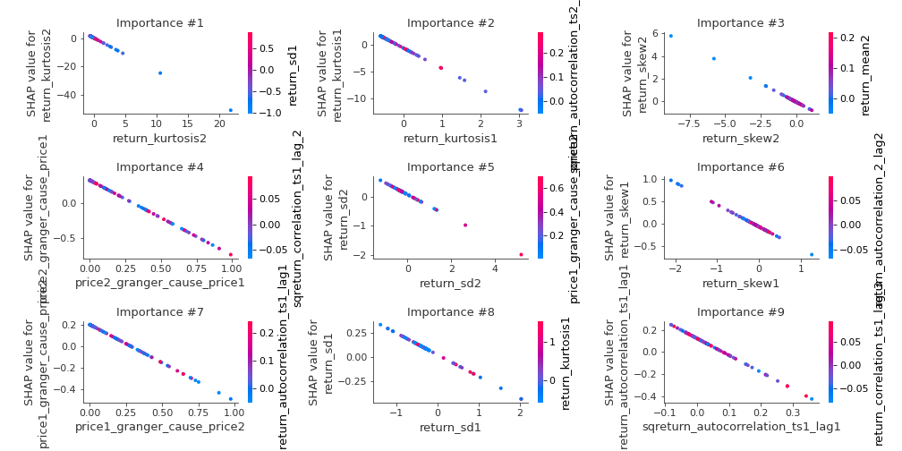

# Summary of 3_Linear

[<< Go back](../README.md)

## Logistic Regression (Linear)
- **n_jobs**: -1
- **explain_level**: 2

## Validation
 - **validation_type**: split
 - **train_ratio**: 0.75
 - **shuffle**: True
 - **stratify**: True

## Optimized metric
accuracy

## Training time

6.7 seconds

## Metric details
|           |    score |     threshold |
|:----------|---------:|--------------:|
| logloss   | 0.286408 | nan           |
| auc       | 0.960359 | nan           |
| f1        | 0.913043 |   0.563878    |
| accuracy  | 0.908046 |   0.655021    |
| precision | 1        |   0.944917    |
| recall    | 1        |   1.67022e-20 |
| mcc       | 0.819728 |   0.784157    |

## Confusion matrix (at threshold=0.655021)
|                      |   Predicted as real |   Predicted as simulated |
|:---------------------|--------------------:|-------------------------:|
| Labeled as real      |                  39 |                        4 |
| Labeled as simulated |                   4 |                       40 |

## Learning curves

## Coefficients
| feature                           |   Learner_1 |
|:----------------------------------|------------:|
| return_autocorrelation_2_lag1     |   0.811884  |
| return_autocorrelation_2_lag3     |   0.427287  |
| return_autocorrelation_2_lag2     |   0.32594   |
| return_autocorrelation_1_lag2     |   0.324111  |
| sqreturn_correlation_ts2_lag_3    |   0.306071  |
| return_correlation_ts2_lag_3      |   0.306071  |
| sqreturn_correlation_ts1_lag_3    |   0.303587  |
| return_correlation_ts1_lag_3      |   0.303587  |
| return_correlation_ts2_lag_1      |   0.264763  |
| sqreturn_correlation_ts2_lag_1    |   0.264763  |
| return_correlation_ts1_lag_2      |   0.206059  |
| sqreturn_correlation_ts1_lag_2    |   0.206059  |
| return_autocorrelation_1_lag3     |   0.19502   |
| return_correlation_ts1_lag_1      |   0.191808  |
| sqreturn_correlation_ts1_lag_1    |   0.191808  |
| return_correlation_ts2_lag_2      |   0.0833562 |
| sqreturn_correlation_ts2_lag_2    |   0.0833562 |
| return_autocorrelation_1_lag1     |  -0.0349148 |
| return_mean2                      |  -0.067562  |
| return_correlation_ts1_lag_0      |  -0.069462  |
| sqreturn_correlation_ts1_lag_0    |  -0.069462  |
| return_sd1                        |  -0.224775  |
| return_sd2                        |  -0.397729  |
| return_skew1                      |  -0.488833  |
| return_skew2                      |  -0.66974   |
| price1_granger_cause_price2       |  -0.710786  |
| return_mean1                      |  -0.771514  |
| sqreturn_autocorrelation_ts2_lag3 |  -0.799302  |
| intercept                         |  -0.805092  |
| sqreturn_autocorrelation_ts2_lag2 |  -0.983778  |
| sqreturn_autocorrelation_ts1_lag3 |  -1.06307   |
| price2_granger_cause_price1       |  -1.06554   |
| sqreturn_autocorrelation_ts1_lag2 |  -1.30924   |
| sqreturn_autocorrelation_ts2_lag1 |  -1.33875   |
| sqreturn_autocorrelation_ts1_lag1 |  -1.51524   |
| return_kurtosis2                  |  -2.35389   |
| return_kurtosis1                  |  -3.76306   |

## Permutation-based Importance

## Confusion Matrix

## Normalized Confusion Matrix

## ROC Curve

## Kolmogorov-Smirnov Statistic

## Precision-Recall Curve

## Calibration Curve

## Cumulative Gains Curve

## Lift Curve

## SHAP Importance

## SHAP Dependence plots

### Dependence (Fold 1)

## SHAP Decision plots

### Top-10 Worst decisions for class 0 (Fold 1)

### Top-10 Best decisions for class 0 (Fold 1)

### Top-10 Worst decisions for class 1 (Fold 1)

### Top-10 Best decisions for class 1 (Fold 1)

[<< Go back](../README.md)
