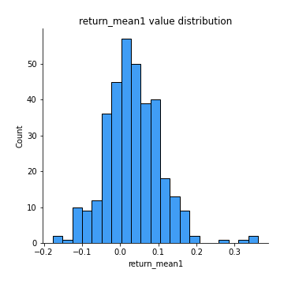
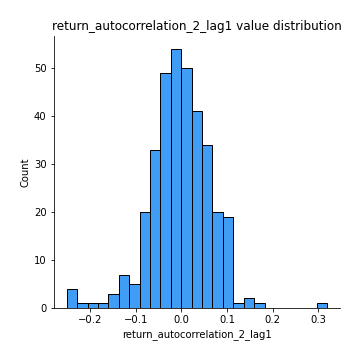
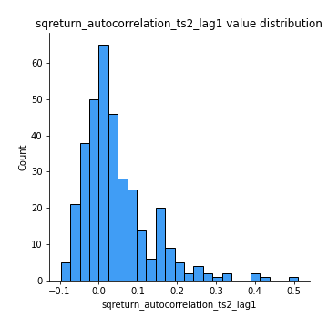
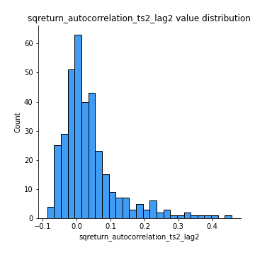
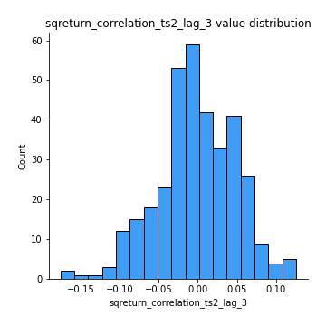

# Exploratory Data Analysis

[<< Go back](../README.md)
## Feature : target
- **Feature type** : categorical
- **Missing** : 0.0%
- **Unique** : 2
- **Count** :347
- **Unique** :2
- **Top** :simulated
- **Freq** :174

## Feature : return_mean1
- **Feature type** : continous
- **Missing** : 0.0%
- **Unique** : 347
- **Count** :347.0
- **Mean** :0.03310043704745581
- **Std** :0.07424391775106459
- **Min** :-0.17686457077756634
- **25%th Percentile** : -0.013736170712555416
- **50%th Percentile** : 0.028313295891670708
- **75%th Percentile** : 0.07900168189983703
- **Max** :0.3612366374600757

## Feature : return_mean2
- **Feature type** : continous
- **Missing** : 0.0%
- **Unique** : 347
- **Count** :347.0
- **Mean** :0.0714682436098407
- **Std** :0.09400312318993062
- **Min** :-0.24205418062825398
- **25%th Percentile** : 0.01921223760835587
- **50%th Percentile** : 0.06260861114779251
- **75%th Percentile** : 0.12251359445151555
- **Max** :0.4591946767867565

## Feature : return_sd1
- **Feature type** : continous
- **Missing** : 0.0%
- **Unique** : 347
- **Count** :347.0
- **Mean** :1.681447727337037
- **Std** :0.6433552389857146
- **Min** :0.7470080772831957
- **25%th Percentile** : 1.4143085781542655
- **50%th Percentile** : 1.4990651455619195
- **75%th Percentile** : 1.6961081505063993
- **Max** :6.495661311240861

## Feature : return_sd2
- **Feature type** : continous
- **Missing** : 0.0%
- **Unique** : 347
- **Count** :347.0
- **Mean** :1.757696295235468
- **Std** :0.71011373205526
- **Min** :0.8455946193085045
- **25%th Percentile** : 1.491537111806664
- **50%th Percentile** : 1.569781959195715
- **75%th Percentile** : 1.6820350564853936
- **Max** :5.762808157208253

## Feature : return_skew1
- **Feature type** : continous
- **Missing** : 0.0%
- **Unique** : 347
- **Count** :347.0
- **Mean** :-0.14532758512224137
- **Std** :0.6004624529027109
- **Min** :-3.453087436558107
- **25%th Percentile** : -0.2671534371074699
- **50%th Percentile** : -0.08369828132943916
- **75%th Percentile** : 0.058809513349568715
- **Max** :2.5845963767725557

## Feature : return_skew2
- **Feature type** : continous
- **Missing** : 0.0%
- **Unique** : 347
- **Count** :347.0
- **Mean** :-0.22885585029870617
- **Std** :0.8415889262436084
- **Min** :-8.801502855292393
- **25%th Percentile** : -0.3743195281774706
- **50%th Percentile** : -0.12148362203314543
- **75%th Percentile** : 0.062137540243417805
- **Max** :2.2606839051517187

## Feature : return_kurtosis1
- **Feature type** : continous
- **Missing** : 0.0%
- **Unique** : 347
- **Count** :347.0
- **Mean** :3.3623620281950215
- **Std** :5.826996879144254
- **Min** :-0.3841475335107467
- **25%th Percentile** : 0.2714966411181228
- **50%th Percentile** : 1.0429160082526567
- **75%th Percentile** : 3.8376122618365898
- **Max** :46.07507808162177

## Feature : return_kurtosis2
- **Feature type** : continous
- **Missing** : 0.0%
- **Unique** : 347
- **Count** :347.0
- **Mean** :4.43726150092742
- **Std** :10.463634641533726
- **Min** :-0.2662720625886541
- **25%th Percentile** : 0.594815168812661
- **50%th Percentile** : 1.676253569619599
- **75%th Percentile** : 4.3612884611668505
- **Max** :143.10871011533666

## Feature : return_autocorrelation_1_lag1
- **Feature type** : continous
- **Missing** : 0.0%
- **Unique** : 347
- **Count** :347.0
- **Mean** :-0.012488975151639742
- **Std** :0.05586781081151193
- **Min** :-0.20673896439036124
- **25%th Percentile** : -0.04449736772467543
- **50%th Percentile** : -0.009701693508012465
- **75%th Percentile** : 0.026247231987361393
- **Max** :0.12810656890648087

## Feature : return_autocorrelation_1_lag2
- **Feature type** : continous
- **Missing** : 0.0%
- **Unique** : 347
- **Count** :347.0
- **Mean** :-0.00452670241902326
- **Std** :0.04898120083231799
- **Min** :-0.13309283796645122
- **25%th Percentile** : -0.03527230124568727
- **50%th Percentile** : -0.0030029556290622275
- **75%th Percentile** : 0.023884015403767802
- **Max** :0.15702552195338904

## Feature : return_autocorrelation_1_lag3
- **Feature type** : continous
- **Missing** : 0.0%
- **Unique** : 347
- **Count** :347.0
- **Mean** :-0.002346972098622224
- **Std** :0.0510229417578087
- **Min** :-0.15806635192103805
- **25%th Percentile** : -0.03329847914389654
- **50%th Percentile** : -0.0037887967699358326
- **75%th Percentile** : 0.03282997459785112
- **Max** :0.17805869530681923

## Feature : return_autocorrelation_2_lag1
- **Feature type** : continous
- **Missing** : 0.0%
- **Unique** : 347
- **Count** :347.0
- **Mean** :-0.0025498892669475063
- **Std** :0.06660864755093239
- **Min** :-0.25075531010123286
- **25%th Percentile** : -0.038633449300468706
- **50%th Percentile** : -0.0016407934488977378
- **75%th Percentile** : 0.04185004722588426
- **Max** :0.31863413537898483

## Feature : return_autocorrelation_2_lag2
- **Feature type** : continous
- **Missing** : 0.0%
- **Unique** : 347
- **Count** :347.0
- **Mean** :0.006391797148377041
- **Std** :0.05203341088933831
- **Min** :-0.13300063901033632
- **25%th Percentile** : -0.029201478709591125
- **50%th Percentile** : 0.004528996351335117
- **75%th Percentile** : 0.039356132057698424
- **Max** :0.20974504043791217

## Feature : return_autocorrelation_2_lag3
- **Feature type** : continous
- **Missing** : 0.0%
- **Unique** : 347
- **Count** :347.0
- **Mean** :0.00047880245462251565
- **Std** :0.04982400908535851
- **Min** :-0.14200107169559698
- **25%th Percentile** : -0.03138676980244878
- **50%th Percentile** : 0.001168038911395616
- **75%th Percentile** : 0.03385322039832532
- **Max** :0.1419999376914021

## Feature : return_correlation_ts1_lag_0
- **Feature type** : continous
- **Missing** : 0.0%
- **Unique** : 347
- **Count** :347.0
- **Mean** :0.3084535412641723
- **Std** :0.10761218837800017
- **Min** :-0.027089510445801036
- **25%th Percentile** : 0.25476002441051937
- **50%th Percentile** : 0.3042042149273845
- **75%th Percentile** : 0.3581154774004105
- **Max** :0.6812020480945222

## Feature : return_correlation_ts1_lag_1
- **Feature type** : continous
- **Missing** : 0.0%
- **Unique** : 347
- **Count** :347.0
- **Mean** :-0.005120891337003627
- **Std** :0.05003272943591471
- **Min** :-0.15776193292681923
- **25%th Percentile** : -0.03769695882764326
- **50%th Percentile** : 0.00036059030370543037
- **75%th Percentile** : 0.030195085473491007
- **Max** :0.11704571737718318

## Feature : return_correlation_ts1_lag_2
- **Feature type** : continous
- **Missing** : 0.0%
- **Unique** : 347
- **Count** :347.0
- **Mean** :0.00507960277080382
- **Std** :0.0460705866852808
- **Min** :-0.12864410180561703
- **25%th Percentile** : -0.026253678880927448
- **50%th Percentile** : 0.002715299498941847
- **75%th Percentile** : 0.037609126075252824
- **Max** :0.11826934700997306

## Feature : return_correlation_ts1_lag_3
- **Feature type** : continous
- **Missing** : 0.0%
- **Unique** : 347
- **Count** :347.0
- **Mean** :0.0014457425445211954
- **Std** :0.05188958924523164
- **Min** :-0.14559875815060416
- **25%th Percentile** : -0.03139927059815743
- **50%th Percentile** : 0.003586528888343079
- **75%th Percentile** : 0.03542124032095764
- **Max** :0.1636773216468148

## Feature : return_correlation_ts2_lag_1
- **Feature type** : continous
- **Missing** : 0.0%
- **Unique** : 347
- **Count** :347.0
- **Mean** :-0.0059072215018299915
- **Std** :0.053367368597114315
- **Min** :-0.2081139431093261
- **25%th Percentile** : -0.03855341227511895
- **50%th Percentile** : -0.002414087278310181
- **75%th Percentile** : 0.028213896073440728
- **Max** :0.11556235671885211

## Feature : return_correlation_ts2_lag_2
- **Feature type** : continous
- **Missing** : 0.0%
- **Unique** : 347
- **Count** :347.0
- **Mean** :0.0005394227740044105
- **Std** :0.04809903171561184
- **Min** :-0.15299951737180204
- **25%th Percentile** : -0.030924244095849
- **50%th Percentile** : -0.00045688431833074323
- **75%th Percentile** : 0.027856982534324067
- **Max** :0.20772887392904255

## Feature : return_correlation_ts2_lag_3
- **Feature type** : continous
- **Missing** : 0.0%
- **Unique** : 347
- **Count** :347.0
- **Mean** :-0.0012988525271133105
- **Std** :0.05039522450615829
- **Min** :-0.17564076057312866
- **25%th Percentile** : -0.029184209235302364
- **50%th Percentile** : -0.0024553396757163943
- **75%th Percentile** : 0.03619151091965883
- **Max** :0.12578577770423086

## Feature : sqreturn_autocorrelation_ts1_lag1
- **Feature type** : continous
- **Missing** : 0.0%
- **Unique** : 347
- **Count** :347.0
- **Mean** :0.054620801613544594
- **Std** :0.09665350890930578
- **Min** :-0.10745924641686475
- **25%th Percentile** : -0.008949202523860222
- **50%th Percentile** : 0.02946049601812473
- **75%th Percentile** : 0.0885302299795455
- **Max** :0.49414293176447355

## Feature : sqreturn_autocorrelation_ts1_lag2
- **Feature type** : continous
- **Missing** : 0.0%
- **Unique** : 347
- **Count** :347.0
- **Mean** :0.03921178358485667
- **Std** :0.09210659813701677
- **Min** :-0.10562749951390055
- **25%th Percentile** : -0.014518521428684754
- **50%th Percentile** : 0.012258675682636002
- **75%th Percentile** : 0.06420564692038422
- **Max** :0.4522162366773919

## Feature : sqreturn_autocorrelation_ts1_lag3
- **Feature type** : continous
- **Missing** : 0.0%
- **Unique** : 347
- **Count** :347.0
- **Mean** :0.03499536613423152
- **Std** :0.08170483563250833
- **Min** :-0.102159752856113
- **25%th Percentile** : -0.014948105672929365
- **50%th Percentile** : 0.017715678087511982
- **75%th Percentile** : 0.05486117219829814
- **Max** :0.44755937369538146

## Feature : sqreturn_autocorrelation_ts2_lag1
- **Feature type** : continous
- **Missing** : 0.0%
- **Unique** : 347
- **Count** :347.0
- **Mean** :0.04409396220662306
- **Std** :0.08764671580300365
- **Min** :-0.09719712339374466
- **25%th Percentile** : -0.01251186484156178
- **50%th Percentile** : 0.02191836163705438
- **75%th Percentile** : 0.07495209806557487
- **Max** :0.510085647437958

## Feature : sqreturn_autocorrelation_ts2_lag2
- **Feature type** : continous
- **Missing** : 0.0%
- **Unique** : 347
- **Count** :347.0
- **Mean** :0.038151947129836564
- **Std** :0.08510990136008072
- **Min** :-0.08629844762173224
- **25%th Percentile** : -0.013822549302815616
- **50%th Percentile** : 0.015185213759964006
- **75%th Percentile** : 0.05879328128260773
- **Max** :0.45676817892778204

## Feature : sqreturn_autocorrelation_ts2_lag3
- **Feature type** : continous
- **Missing** : 0.0%
- **Unique** : 347
- **Count** :347.0
- **Mean** :0.030183331341488914
- **Std** :0.06848623303826
- **Min** :-0.11134663500141088
- **25%th Percentile** : -0.01528680458879737
- **50%th Percentile** : 0.015795395949154748
- **75%th Percentile** : 0.058806955134239246
- **Max** :0.31225727797735664

## Feature : sqreturn_correlation_ts1_lag_0
- **Feature type** : continous
- **Missing** : 0.0%
- **Unique** : 347
- **Count** :347.0
- **Mean** :0.3084535412641723
- **Std** :0.10761218837800017
- **Min** :-0.027089510445801036
- **25%th Percentile** : 0.25476002441051937
- **50%th Percentile** : 0.3042042149273845
- **75%th Percentile** : 0.3581154774004105
- **Max** :0.6812020480945222

## Feature : sqreturn_correlation_ts1_lag_1
- **Feature type** : continous
- **Missing** : 0.0%
- **Unique** : 347
- **Count** :347.0
- **Mean** :-0.005120891337003627
- **Std** :0.05003272943591471
- **Min** :-0.15776193292681923
- **25%th Percentile** : -0.03769695882764326
- **50%th Percentile** : 0.00036059030370543037
- **75%th Percentile** : 0.030195085473491007
- **Max** :0.11704571737718318

## Feature : sqreturn_correlation_ts1_lag_2
- **Feature type** : continous
- **Missing** : 0.0%
- **Unique** : 347
- **Count** :347.0
- **Mean** :0.00507960277080382
- **Std** :0.0460705866852808
- **Min** :-0.12864410180561703
- **25%th Percentile** : -0.026253678880927448
- **50%th Percentile** : 0.002715299498941847
- **75%th Percentile** : 0.037609126075252824
- **Max** :0.11826934700997306

## Feature : sqreturn_correlation_ts1_lag_3
- **Feature type** : continous
- **Missing** : 0.0%
- **Unique** : 347
- **Count** :347.0
- **Mean** :0.0014457425445211954
- **Std** :0.05188958924523164
- **Min** :-0.14559875815060416
- **25%th Percentile** : -0.03139927059815743
- **50%th Percentile** : 0.003586528888343079
- **75%th Percentile** : 0.03542124032095764
- **Max** :0.1636773216468148

## Feature : sqreturn_correlation_ts2_lag_1
- **Feature type** : continous
- **Missing** : 0.0%
- **Unique** : 347
- **Count** :347.0
- **Mean** :-0.0059072215018299915
- **Std** :0.053367368597114315
- **Min** :-0.2081139431093261
- **25%th Percentile** : -0.03855341227511895
- **50%th Percentile** : -0.002414087278310181
- **75%th Percentile** : 0.028213896073440728
- **Max** :0.11556235671885211

## Feature : sqreturn_correlation_ts2_lag_2
- **Feature type** : continous
- **Missing** : 0.0%
- **Unique** : 347
- **Count** :347.0
- **Mean** :0.0005394227740044105
- **Std** :0.04809903171561184
- **Min** :-0.15299951737180204
- **25%th Percentile** : -0.030924244095849
- **50%th Percentile** : -0.00045688431833074323
- **75%th Percentile** : 0.027856982534324067
- **Max** :0.20772887392904255

## Feature : sqreturn_correlation_ts2_lag_3
- **Feature type** : continous
- **Missing** : 0.0%
- **Unique** : 347
- **Count** :347.0
- **Mean** :-0.0012988525271133105
- **Std** :0.05039522450615829
- **Min** :-0.17564076057312866
- **25%th Percentile** : -0.029184209235302364
- **50%th Percentile** : -0.0024553396757163943
- **75%th Percentile** : 0.03619151091965883
- **Max** :0.12578577770423086

## Feature : price2_granger_cause_price1
- **Feature type** : continous
- **Missing** : 0.0%
- **Unique** : 347
- **Count** :347.0
- **Mean** :0.30318959724803946
- **Std** :0.28294237787428905
- **Min** :3.697372867464025e-07
- **25%th Percentile** : 0.04688041496586315
- **50%th Percentile** : 0.23087715989737487
- **75%th Percentile** : 0.4939221123529386
- **Max** :0.9907176455938178

## Feature : price1_granger_cause_price2
- **Feature type** : continous
- **Missing** : 0.0%
- **Unique** : 347
- **Count** :347.0
- **Mean** :0.26542983293970224
- **Std** :0.2797869156168831
- **Min** :2.0470635759508308e-07
- **25%th Percentile** : 0.02512783693171261
- **50%th Percentile** : 0.14920948072277807
- **75%th Percentile** : 0.44805750174392267
- **Max** :0.994814126341974

[<< Go back](../README.md)
