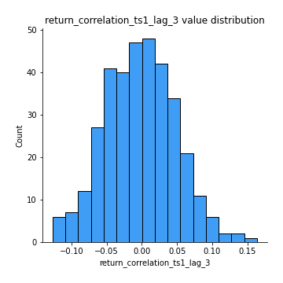

# Exploratory Data Analysis

[<< Go back](../README.md)
## Feature : target
- **Feature type** : categorical
- **Missing** : 0.0%
- **Unique** : 2
- **Count** :347
- **Unique** :2
- **Top** :real
- **Freq** :175

## Feature : return_mean1
- **Feature type** : continous
- **Missing** : 0.0%
- **Unique** : 347
- **Count** :347.0
- **Mean** :0.033331289232730175
- **Std** :0.0762582515384016
- **Min** :-0.22632637961920957
- **25%th Percentile** : -0.013721801237911824
- **50%th Percentile** : 0.03512638441177084
- **75%th Percentile** : 0.07731107250433181
- **Max** :0.3612366374600757

## Feature : return_mean2
- **Feature type** : continous
- **Missing** : 0.0%
- **Unique** : 347
- **Count** :347.0
- **Mean** :0.06957254077316868
- **Std** :0.0968010944182492
- **Min** :-0.21818165578778434
- **25%th Percentile** : 0.017511649001981405
- **50%th Percentile** : 0.06648790061648883
- **75%th Percentile** : 0.11941846357593147
- **Max** :0.48881182452885036

## Feature : return_sd1
- **Feature type** : continous
- **Missing** : 0.0%
- **Unique** : 347
- **Count** :347.0
- **Mean** :1.7176461173211977
- **Std** :0.771287378070651
- **Min** :0.8382061051466024
- **25%th Percentile** : 1.4249211986355186
- **50%th Percentile** : 1.4870580579951058
- **75%th Percentile** : 1.7016656487251025
- **Max** :9.236766377527575

## Feature : return_sd2
- **Feature type** : continous
- **Missing** : 0.0%
- **Unique** : 347
- **Count** :347.0
- **Mean** :1.7754915878933424
- **Std** :0.7471648602611626
- **Min** :0.8455946193085045
- **25%th Percentile** : 1.4860339005476537
- **50%th Percentile** : 1.581554274295549
- **75%th Percentile** : 1.6913973693495161
- **Max** :6.737618636746393

## Feature : return_skew1
- **Feature type** : continous
- **Missing** : 0.0%
- **Unique** : 347
- **Count** :347.0
- **Mean** :-0.0989480098901482
- **Std** :0.5945169279277634
- **Min** :-3.530116233761814
- **25%th Percentile** : -0.23000557220653128
- **50%th Percentile** : -0.0568167888680805
- **75%th Percentile** : 0.1020509693876345
- **Max** :2.5845963767725557

## Feature : return_skew2
- **Feature type** : continous
- **Missing** : 0.0%
- **Unique** : 347
- **Count** :347.0
- **Mean** :-0.1862266968759906
- **Std** :0.7680152762101771
- **Min** :-8.801502855292393
- **25%th Percentile** : -0.3311213112387877
- **50%th Percentile** : -0.11400015548555023
- **75%th Percentile** : 0.04585601426752463
- **Max** :2.2606839051517187

## Feature : return_kurtosis1
- **Feature type** : continous
- **Missing** : 0.0%
- **Unique** : 347
- **Count** :347.0
- **Mean** :3.430723233446726
- **Std** :5.850893180479196
- **Min** :-0.27232742811015154
- **25%th Percentile** : 0.3022233937619001
- **50%th Percentile** : 1.1065685877791824
- **75%th Percentile** : 3.926946560753578
- **Max** :35.56636016047202

## Feature : return_kurtosis2
- **Feature type** : continous
- **Missing** : 0.0%
- **Unique** : 347
- **Count** :347.0
- **Mean** :4.193171982596737
- **Std** :9.469413427788306
- **Min** :-0.18432961273231818
- **25%th Percentile** : 0.6410583078230097
- **50%th Percentile** : 1.564186275378479
- **75%th Percentile** : 4.49631400753587
- **Max** :143.10871011533666

## Feature : return_autocorrelation_1_lag1
- **Feature type** : continous
- **Missing** : 0.0%
- **Unique** : 347
- **Count** :347.0
- **Mean** :-0.010757730346154695
- **Std** :0.0574787570811048
- **Min** :-0.2135576224968752
- **25%th Percentile** : -0.044025353269418824
- **50%th Percentile** : -0.004417673661142481
- **75%th Percentile** : 0.026270496593337966
- **Max** :0.1508646789303536

## Feature : return_autocorrelation_1_lag2
- **Feature type** : continous
- **Missing** : 0.0%
- **Unique** : 347
- **Count** :347.0
- **Mean** :-0.004139473274995322
- **Std** :0.05014552463395239
- **Min** :-0.11950109167626709
- **25%th Percentile** : -0.03626315814053136
- **50%th Percentile** : -0.0010093763061739163
- **75%th Percentile** : 0.02557076914339974
- **Max** :0.1561488228015672

## Feature : return_autocorrelation_1_lag3
- **Feature type** : continous
- **Missing** : 0.0%
- **Unique** : 347
- **Count** :347.0
- **Mean** :-0.003923912750415034
- **Std** :0.04900661565102726
- **Min** :-0.15806635192103805
- **25%th Percentile** : -0.034291724392852004
- **50%th Percentile** : -0.005124528524575594
- **75%th Percentile** : 0.03028321817349492
- **Max** :0.13316701264626327

## Feature : return_autocorrelation_2_lag1
- **Feature type** : continous
- **Missing** : 0.0%
- **Unique** : 347
- **Count** :347.0
- **Mean** :-0.0028605723069775294
- **Std** :0.06190950352443389
- **Min** :-0.25075531010123286
- **25%th Percentile** : -0.037725663752592384
- **50%th Percentile** : -8.28190260347712e-06
- **75%th Percentile** : 0.03928332848644543
- **Max** :0.16349871797309318

## Feature : return_autocorrelation_2_lag2
- **Feature type** : continous
- **Missing** : 0.0%
- **Unique** : 347
- **Count** :347.0
- **Mean** :0.0026225967617632927
- **Std** :0.05119344384055736
- **Min** :-0.15323211089747296
- **25%th Percentile** : -0.03274485009175572
- **50%th Percentile** : 0.0022635915712172997
- **75%th Percentile** : 0.038330235273948604
- **Max** :0.1735398560230086

## Feature : return_autocorrelation_2_lag3
- **Feature type** : continous
- **Missing** : 0.0%
- **Unique** : 347
- **Count** :347.0
- **Mean** :-0.0007314710831872373
- **Std** :0.050156246116161325
- **Min** :-0.14200107169559698
- **25%th Percentile** : -0.029979323980836952
- **50%th Percentile** : -0.0011063716445832894
- **75%th Percentile** : 0.031224671108709908
- **Max** :0.1363622303330101

## Feature : return_correlation_ts1_lag_0
- **Feature type** : continous
- **Missing** : 0.0%
- **Unique** : 347
- **Count** :347.0
- **Mean** :0.3059589347898977
- **Std** :0.10817287225724524
- **Min** :-0.027089510445801036
- **25%th Percentile** : 0.2512685940017346
- **50%th Percentile** : 0.3000973512241731
- **75%th Percentile** : 0.3510157750102345
- **Max** :0.6949986865664105

## Feature : return_correlation_ts1_lag_1
- **Feature type** : continous
- **Missing** : 0.0%
- **Unique** : 347
- **Count** :347.0
- **Mean** :-0.002855109771265632
- **Std** :0.050015770217600786
- **Min** :-0.16985510949917193
- **25%th Percentile** : -0.03747189196903068
- **50%th Percentile** : -0.0003195101735165295
- **75%th Percentile** : 0.029806637550902147
- **Max** :0.15499424718508623

## Feature : return_correlation_ts1_lag_2
- **Feature type** : continous
- **Missing** : 0.0%
- **Unique** : 347
- **Count** :347.0
- **Mean** :0.0003503959980316326
- **Std** :0.049588441126503256
- **Min** :-0.21653581047581763
- **25%th Percentile** : -0.03241219057174867
- **50%th Percentile** : -0.003861988654335365
- **75%th Percentile** : 0.03636755163567308
- **Max** :0.13668304843797358

## Feature : return_correlation_ts1_lag_3
- **Feature type** : continous
- **Missing** : 0.0%
- **Unique** : 347
- **Count** :347.0
- **Mean** :-0.0023881829562663066
- **Std** :0.05039595464244333
- **Min** :-0.1270218498974763
- **25%th Percentile** : -0.03794076267077534
- **50%th Percentile** : -0.003340206166492643
- **75%th Percentile** : 0.030045490700457714
- **Max** :0.1636773216468148

## Feature : return_correlation_ts2_lag_1
- **Feature type** : continous
- **Missing** : 0.0%
- **Unique** : 347
- **Count** :347.0
- **Mean** :-0.0018491578641096351
- **Std** :0.05652324563785208
- **Min** :-0.2081139431093261
- **25%th Percentile** : -0.03868255914944284
- **50%th Percentile** : 0.0001283449911914402
- **75%th Percentile** : 0.038140758709930944
- **Max** :0.17208763791364762

## Feature : return_correlation_ts2_lag_2
- **Feature type** : continous
- **Missing** : 0.0%
- **Unique** : 347
- **Count** :347.0
- **Mean** :0.002226768762272096
- **Std** :0.0496831920386562
- **Min** :-0.23751835475804678
- **25%th Percentile** : -0.030916875420410987
- **50%th Percentile** : 0.0012192446514126048
- **75%th Percentile** : 0.03452773560857131
- **Max** :0.20772887392904255

## Feature : return_correlation_ts2_lag_3
- **Feature type** : continous
- **Missing** : 0.0%
- **Unique** : 347
- **Count** :347.0
- **Mean** :-0.002453911836744376
- **Std** :0.05017827584422953
- **Min** :-0.17564076057312866
- **25%th Percentile** : -0.031921823173353125
- **50%th Percentile** : -0.0014930972633726716
- **75%th Percentile** : 0.03203799785262183
- **Max** :0.12578577770423086

## Feature : sqreturn_autocorrelation_ts1_lag1
- **Feature type** : continous
- **Missing** : 0.0%
- **Unique** : 347
- **Count** :347.0
- **Mean** :0.04885270789426519
- **Std** :0.09416620514465307
- **Min** :-0.10472639315825828
- **25%th Percentile** : -0.01385164111206083
- **50%th Percentile** : 0.02417154477171563
- **75%th Percentile** : 0.08538969663794785
- **Max** :0.4439086285737898

## Feature : sqreturn_autocorrelation_ts1_lag2
- **Feature type** : continous
- **Missing** : 0.0%
- **Unique** : 347
- **Count** :347.0
- **Mean** :0.044284881598818895
- **Std** :0.09531319917101949
- **Min** :-0.10866021102663431
- **25%th Percentile** : -0.01404409554659444
- **50%th Percentile** : 0.019044132744531112
- **75%th Percentile** : 0.06748409348875148
- **Max** :0.540735851444759

## Feature : sqreturn_autocorrelation_ts1_lag3
- **Feature type** : continous
- **Missing** : 0.0%
- **Unique** : 347
- **Count** :347.0
- **Mean** :0.03798104476362048
- **Std** :0.07933709727250088
- **Min** :-0.0857783575191602
- **25%th Percentile** : -0.012587809084029445
- **50%th Percentile** : 0.016160731030332297
- **75%th Percentile** : 0.06546266062583125
- **Max** :0.44755937369538146

## Feature : sqreturn_autocorrelation_ts2_lag1
- **Feature type** : continous
- **Missing** : 0.0%
- **Unique** : 347
- **Count** :347.0
- **Mean** :0.04975179618639383
- **Std** :0.08820988183240631
- **Min** :-0.09594428098591458
- **25%th Percentile** : -0.008915616224024139
- **50%th Percentile** : 0.028024673012368214
- **75%th Percentile** : 0.08888835576042374
- **Max** :0.510085647437958

## Feature : sqreturn_autocorrelation_ts2_lag2
- **Feature type** : continous
- **Missing** : 0.0%
- **Unique** : 347
- **Count** :347.0
- **Mean** :0.039402172286042585
- **Std** :0.08813013039928658
- **Min** :-0.0997025547355206
- **25%th Percentile** : -0.012424849633143508
- **50%th Percentile** : 0.015494621057797952
- **75%th Percentile** : 0.058328148811560426
- **Max** :0.5373432415582473

## Feature : sqreturn_autocorrelation_ts2_lag3
- **Feature type** : continous
- **Missing** : 0.0%
- **Unique** : 347
- **Count** :347.0
- **Mean** :0.028198859837499424
- **Std** :0.06815287554933189
- **Min** :-0.10263058520444157
- **25%th Percentile** : -0.016217540018055844
- **50%th Percentile** : 0.010674848682306184
- **75%th Percentile** : 0.05482775879878379
- **Max** :0.31225727797735664

## Feature : sqreturn_correlation_ts1_lag_0
- **Feature type** : continous
- **Missing** : 0.0%
- **Unique** : 347
- **Count** :347.0
- **Mean** :0.3059589347898977
- **Std** :0.10817287225724524
- **Min** :-0.027089510445801036
- **25%th Percentile** : 0.2512685940017346
- **50%th Percentile** : 0.3000973512241731
- **75%th Percentile** : 0.3510157750102345
- **Max** :0.6949986865664105

## Feature : sqreturn_correlation_ts1_lag_1
- **Feature type** : continous
- **Missing** : 0.0%
- **Unique** : 347
- **Count** :347.0
- **Mean** :-0.002855109771265632
- **Std** :0.050015770217600786
- **Min** :-0.16985510949917193
- **25%th Percentile** : -0.03747189196903068
- **50%th Percentile** : -0.0003195101735165295
- **75%th Percentile** : 0.029806637550902147
- **Max** :0.15499424718508623

## Feature : sqreturn_correlation_ts1_lag_2
- **Feature type** : continous
- **Missing** : 0.0%
- **Unique** : 347
- **Count** :347.0
- **Mean** :0.0003503959980316326
- **Std** :0.049588441126503256
- **Min** :-0.21653581047581763
- **25%th Percentile** : -0.03241219057174867
- **50%th Percentile** : -0.003861988654335365
- **75%th Percentile** : 0.03636755163567308
- **Max** :0.13668304843797358

## Feature : sqreturn_correlation_ts1_lag_3
- **Feature type** : continous
- **Missing** : 0.0%
- **Unique** : 347
- **Count** :347.0
- **Mean** :-0.0023881829562663066
- **Std** :0.05039595464244333
- **Min** :-0.1270218498974763
- **25%th Percentile** : -0.03794076267077534
- **50%th Percentile** : -0.003340206166492643
- **75%th Percentile** : 0.030045490700457714
- **Max** :0.1636773216468148

## Feature : sqreturn_correlation_ts2_lag_1
- **Feature type** : continous
- **Missing** : 0.0%
- **Unique** : 347
- **Count** :347.0
- **Mean** :-0.0018491578641096351
- **Std** :0.05652324563785208
- **Min** :-0.2081139431093261
- **25%th Percentile** : -0.03868255914944284
- **50%th Percentile** : 0.0001283449911914402
- **75%th Percentile** : 0.038140758709930944
- **Max** :0.17208763791364762

## Feature : sqreturn_correlation_ts2_lag_2
- **Feature type** : continous
- **Missing** : 0.0%
- **Unique** : 347
- **Count** :347.0
- **Mean** :0.002226768762272096
- **Std** :0.0496831920386562
- **Min** :-0.23751835475804678
- **25%th Percentile** : -0.030916875420410987
- **50%th Percentile** : 0.0012192446514126048
- **75%th Percentile** : 0.03452773560857131
- **Max** :0.20772887392904255

## Feature : sqreturn_correlation_ts2_lag_3
- **Feature type** : continous
- **Missing** : 0.0%
- **Unique** : 347
- **Count** :347.0
- **Mean** :-0.002453911836744376
- **Std** :0.05017827584422953
- **Min** :-0.17564076057312866
- **25%th Percentile** : -0.031921823173353125
- **50%th Percentile** : -0.0014930972633726716
- **75%th Percentile** : 0.03203799785262183
- **Max** :0.12578577770423086

## Feature : price2_granger_cause_price1
- **Feature type** : continous
- **Missing** : 0.0%
- **Unique** : 347
- **Count** :347.0
- **Mean** :0.2741444877832718
- **Std** :0.2806247254971745
- **Min** :1.1505642493585304e-05
- **25%th Percentile** : 0.04008799484099879
- **50%th Percentile** : 0.1524549127494169
- **75%th Percentile** : 0.4671532837527466
- **Max** :0.9993665608521236

## Feature : price1_granger_cause_price2
- **Feature type** : continous
- **Missing** : 0.0%
- **Unique** : 347
- **Count** :347.0
- **Mean** :0.2592704799740678
- **Std** :0.2750899197039547
- **Min** :3.6866360339519933e-07
- **25%th Percentile** : 0.019967870506551993
- **50%th Percentile** : 0.16438322840358718
- **75%th Percentile** : 0.43277835804974113
- **Max** :0.9951398266867577

[<< Go back](../README.md)
