# Summary of 3_Linear

[<< Go back](../README.md)

## Logistic Regression (Linear)
- **n_jobs**: -1
- **explain_level**: 2

## Validation
 - **validation_type**: split
 - **train_ratio**: 0.75
 - **shuffle**: True
 - **stratify**: True

## Optimized metric
accuracy

## Training time

8.3 seconds

## Metric details
|           |    score |    threshold |
|:----------|---------:|-------------:|
| logloss   | 0.189294 | nan          |
| auc       | 0.992047 | nan          |
| f1        | 0.95122  |   0.516618   |
| accuracy  | 0.954023 |   0.516618   |
| precision | 1        |   0.917727   |
| recall    | 1        |   5.0762e-08 |
| mcc       | 0.907741 |   0.516618   |

## Confusion matrix (at threshold=0.516618)
|                      |   Predicted as real |   Predicted as simulated |
|:---------------------|--------------------:|-------------------------:|
| Labeled as real      |                  44 |                        2 |
| Labeled as simulated |                   2 |                       39 |

## Learning curves
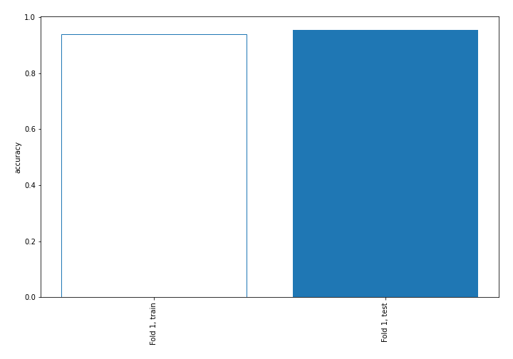

## Coefficients
| feature                           |   Learner_1 |
|:----------------------------------|------------:|
| return_autocorrelation_2_lag1     |   0.751592  |
| return_autocorrelation_2_lag2     |   0.645538  |
| return_autocorrelation_2_lag3     |   0.639742  |
| sqreturn_correlation_ts1_lag_3    |   0.424354  |
| return_correlation_ts1_lag_3      |   0.424354  |
| return_correlation_ts2_lag_1      |   0.413693  |
| sqreturn_correlation_ts2_lag_1    |   0.413693  |
| sqreturn_correlation_ts1_lag_2    |   0.345648  |
| return_correlation_ts1_lag_2      |   0.345648  |
| return_autocorrelation_1_lag1     |   0.342488  |
| sqreturn_correlation_ts1_lag_1    |   0.320525  |
| return_correlation_ts1_lag_1      |   0.320525  |
| return_correlation_ts2_lag_2      |   0.285853  |
| sqreturn_correlation_ts2_lag_2    |   0.285853  |
| return_autocorrelation_1_lag2     |   0.260421  |
| return_autocorrelation_1_lag3     |   0.200239  |
| return_mean2                      |   0.163232  |
| sqreturn_correlation_ts2_lag_3    |   0.0402392 |
| return_correlation_ts2_lag_3      |   0.0402392 |
| return_skew2                      |  -0.111987  |
| return_sd1                        |  -0.164725  |
| price2_granger_cause_price1       |  -0.22089   |
| return_correlation_ts1_lag_0      |  -0.319447  |
| sqreturn_correlation_ts1_lag_0    |  -0.319447  |
| return_skew1                      |  -0.358186  |
| return_sd2                        |  -0.397578  |
| price1_granger_cause_price2       |  -0.741548  |
| return_mean1                      |  -0.831398  |
| intercept                         |  -0.892039  |
| sqreturn_autocorrelation_ts2_lag3 |  -0.947817  |
| sqreturn_autocorrelation_ts1_lag3 |  -1.02434   |
| sqreturn_autocorrelation_ts2_lag2 |  -1.18157   |
| sqreturn_autocorrelation_ts1_lag2 |  -1.2387    |
| sqreturn_autocorrelation_ts1_lag1 |  -1.49256   |
| sqreturn_autocorrelation_ts2_lag1 |  -1.56489   |
| return_kurtosis2                  |  -2.00484   |
| return_kurtosis1                  |  -3.48799   |

## Permutation-based Importance
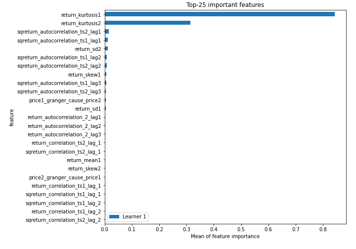
## Confusion Matrix

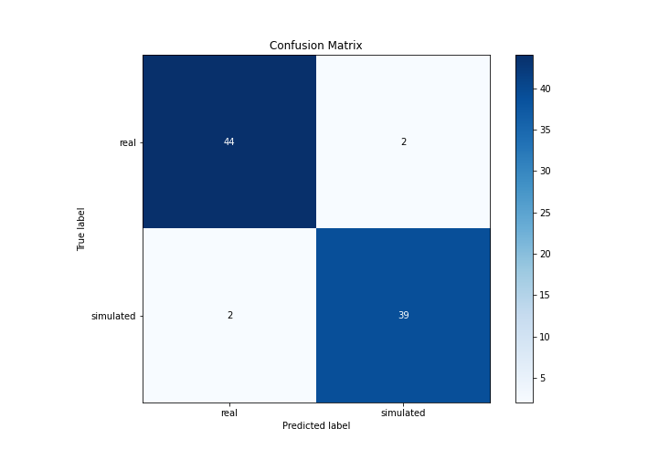

## Normalized Confusion Matrix

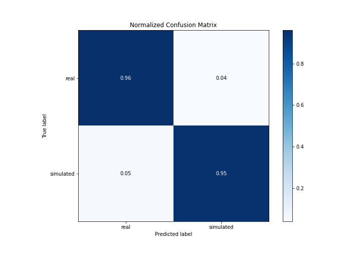

## ROC Curve

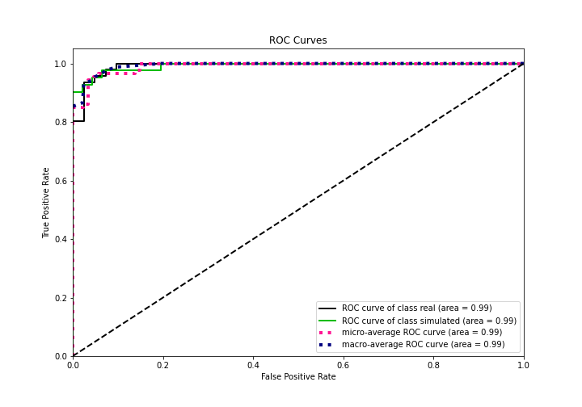

## Kolmogorov-Smirnov Statistic

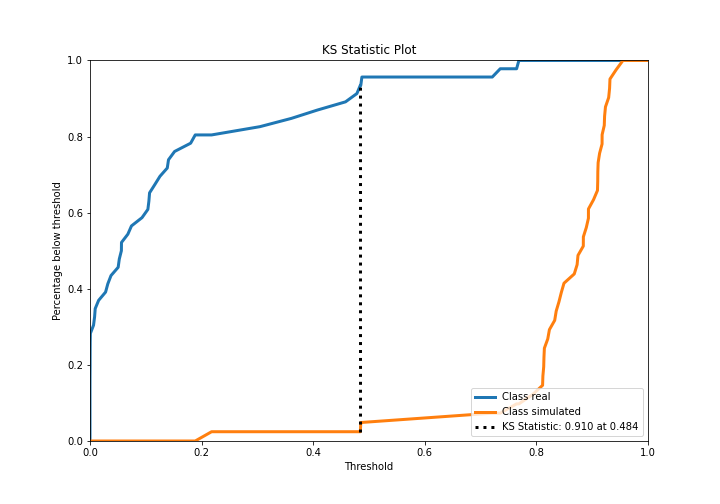

## Precision-Recall Curve

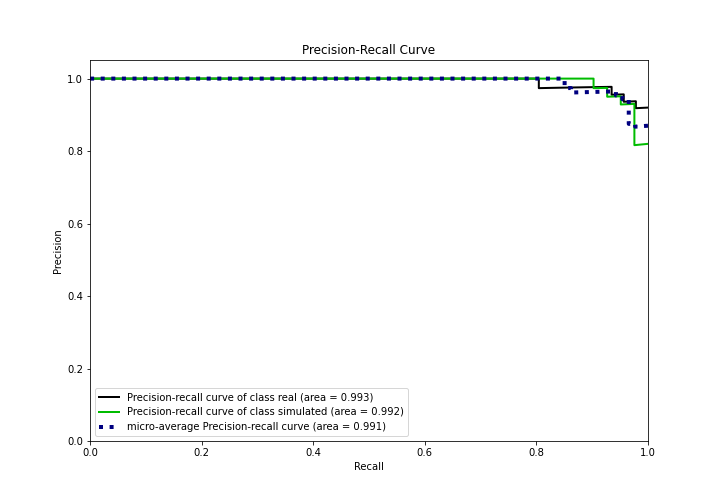

## Calibration Curve

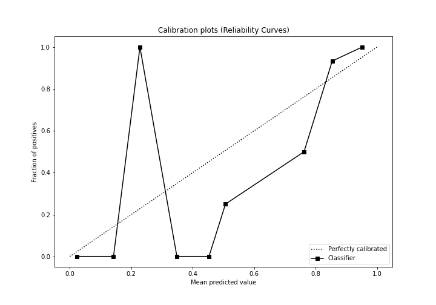

## Cumulative Gains Curve

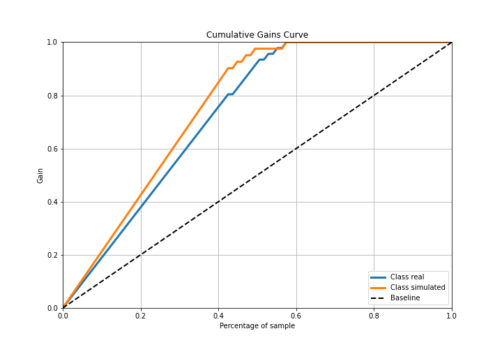

## Lift Curve

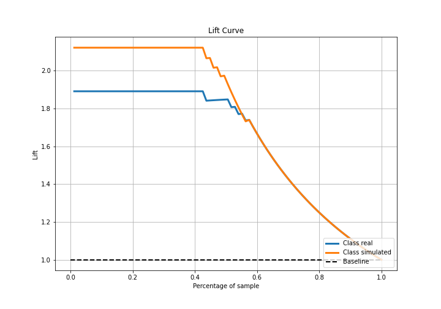

## SHAP Importance
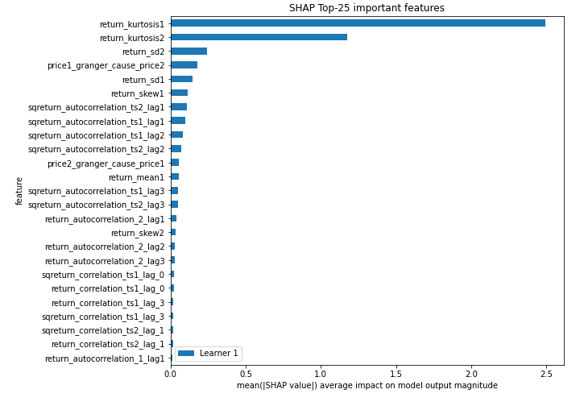

## SHAP Dependence plots

### Dependence (Fold 1)
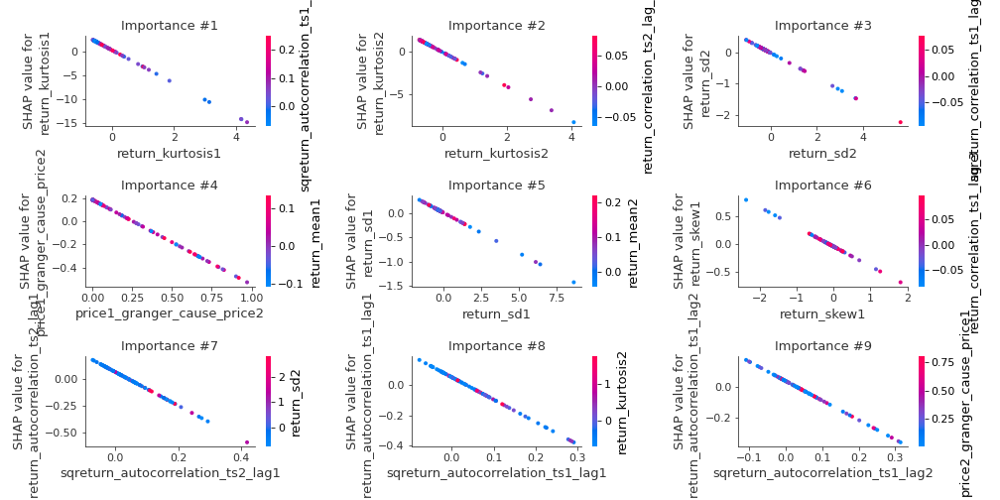

## SHAP Decision plots

### Top-10 Worst decisions for class 0 (Fold 1)
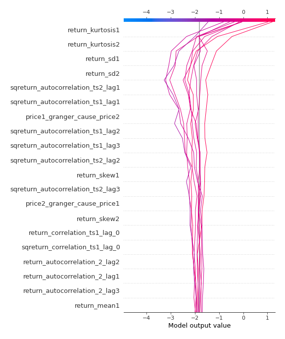
### Top-10 Best decisions for class 0 (Fold 1)
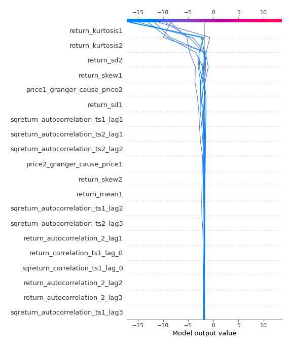
### Top-10 Worst decisions for class 1 (Fold 1)
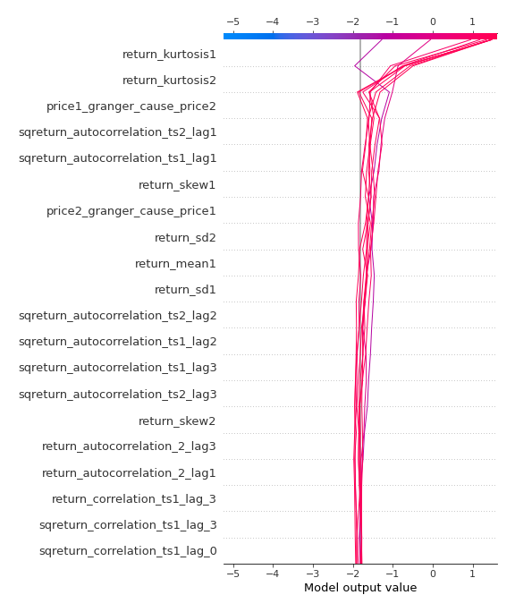
### Top-10 Best decisions for class 1 (Fold 1)
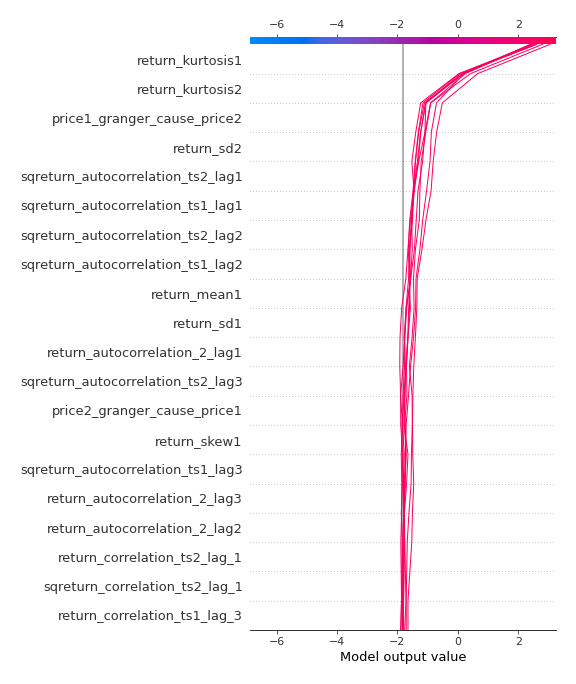

[<< Go back](../README.md)
