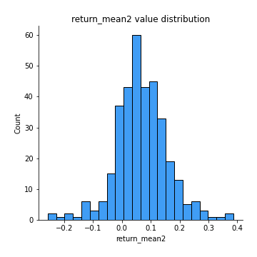
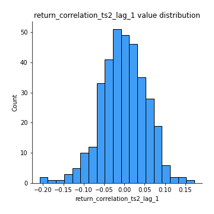

# Exploratory Data Analysis

[<< Go back](../README.md)
## Feature : target
- **Feature type** : categorical
- **Missing** : 0.0%
- **Unique** : 2
- **Count** :347
- **Unique** :2
- **Top** :real
- **Freq** :183

## Feature : return_mean1
- **Feature type** : continous
- **Missing** : 0.0%
- **Unique** : 347
- **Count** :347.0
- **Mean** :0.037582502970755126
- **Std** :0.07470780971706714
- **Min** :-0.17686457077756634
- **25%th Percentile** : -0.009548184649827679
- **50%th Percentile** : 0.039022803008239924
- **75%th Percentile** : 0.08429652825444711
- **Max** :0.37175100008111034

## Feature : return_mean2
- **Feature type** : continous
- **Missing** : 0.0%
- **Unique** : 347
- **Count** :347.0
- **Mean** :0.06853093414155506
- **Std** :0.08974737823345746
- **Min** :-0.2565543279624933
- **25%th Percentile** : 0.015199622141516121
- **50%th Percentile** : 0.06440647854576999
- **75%th Percentile** : 0.11958060153872688
- **Max** :0.3860210407789147

## Feature : return_sd1
- **Feature type** : continous
- **Missing** : 0.0%
- **Unique** : 347
- **Count** :347.0
- **Mean** :1.678945675935429
- **Std** :0.6706038371425347
- **Min** :0.7470080772831957
- **25%th Percentile** : 1.4205012955256997
- **50%th Percentile** : 1.4859613024387022
- **75%th Percentile** : 1.6457364156622571
- **Max** :6.495661311240861

## Feature : return_sd2
- **Feature type** : continous
- **Missing** : 0.0%
- **Unique** : 347
- **Count** :347.0
- **Mean** :1.755760300610939
- **Std** :0.7552825047799347
- **Min** :0.8455946193085045
- **25%th Percentile** : 1.4742572272042758
- **50%th Percentile** : 1.5734833468817229
- **75%th Percentile** : 1.6864886753889157
- **Max** :6.737618636746393

## Feature : return_skew1
- **Feature type** : continous
- **Missing** : 0.0%
- **Unique** : 347
- **Count** :347.0
- **Mean** :-0.15290149154403054
- **Std** :0.6021225402164758
- **Min** :-3.530116233761814
- **25%th Percentile** : -0.2767942320040348
- **50%th Percentile** : -0.07576312602843817
- **75%th Percentile** : 0.04709865084703848
- **Max** :2.224942816365292

## Feature : return_skew2
- **Feature type** : continous
- **Missing** : 0.0%
- **Unique** : 347
- **Count** :347.0
- **Mean** :-0.139978754093239
- **Std** :0.5848851754764568
- **Min** :-3.436088288137694
- **25%th Percentile** : -0.3460105147137267
- **50%th Percentile** : -0.1394578063485084
- **75%th Percentile** : 0.07367575256262317
- **Max** :2.2606839051517187

## Feature : return_kurtosis1
- **Feature type** : continous
- **Missing** : 0.0%
- **Unique** : 347
- **Count** :347.0
- **Mean** :3.500350903241243
- **Std** :6.027453660574138
- **Min** :-0.3026997411871162
- **25%th Percentile** : 0.3039374857164745
- **50%th Percentile** : 1.1758169788911421
- **75%th Percentile** : 3.9926829085040287
- **Max** :36.91113889081053

## Feature : return_kurtosis2
- **Feature type** : continous
- **Missing** : 0.0%
- **Unique** : 347
- **Count** :347.0
- **Mean** :3.671508131965949
- **Std** :5.342736774561812
- **Min** :-0.11682897336099263
- **25%th Percentile** : 0.5956546744103102
- **50%th Percentile** : 1.679786007779335
- **75%th Percentile** : 4.381239604898888
- **Max** :33.2074998145622

## Feature : return_autocorrelation_1_lag1
- **Feature type** : continous
- **Missing** : 0.0%
- **Unique** : 347
- **Count** :347.0
- **Mean** :-0.011226401174729653
- **Std** :0.05805590391147204
- **Min** :-0.20673896439036124
- **25%th Percentile** : -0.043108771636871115
- **50%th Percentile** : -0.0069089598187218
- **75%th Percentile** : 0.027967175118917588
- **Max** :0.14024882361315383

## Feature : return_autocorrelation_1_lag2
- **Feature type** : continous
- **Missing** : 0.0%
- **Unique** : 347
- **Count** :347.0
- **Mean** :-0.0062136198558326566
- **Std** :0.05089186853407048
- **Min** :-0.13309283796645122
- **25%th Percentile** : -0.04237777442030641
- **50%th Percentile** : -0.005044631902696011
- **75%th Percentile** : 0.02593634267340484
- **Max** :0.1561488228015672

## Feature : return_autocorrelation_1_lag3
- **Feature type** : continous
- **Missing** : 0.0%
- **Unique** : 347
- **Count** :347.0
- **Mean** :-0.005994410527995721
- **Std** :0.04969743646409115
- **Min** :-0.1940836867390813
- **25%th Percentile** : -0.03694894809134185
- **50%th Percentile** : -0.0037399346828342773
- **75%th Percentile** : 0.02820286619406733
- **Max** :0.11613347145181814

## Feature : return_autocorrelation_2_lag1
- **Feature type** : continous
- **Missing** : 0.0%
- **Unique** : 347
- **Count** :347.0
- **Mean** :-0.0008654544220831162
- **Std** :0.06063615062061356
- **Min** :-0.24265814531706406
- **25%th Percentile** : -0.03639570005321319
- **50%th Percentile** : 0.0024362179117015277
- **75%th Percentile** : 0.04262854948242244
- **Max** :0.16349871797309318

## Feature : return_autocorrelation_2_lag2
- **Feature type** : continous
- **Missing** : 0.0%
- **Unique** : 347
- **Count** :347.0
- **Mean** :0.004655255101010137
- **Std** :0.05360499143719356
- **Min** :-0.15323211089747296
- **25%th Percentile** : -0.03157731268115359
- **50%th Percentile** : 0.0019331227939847727
- **75%th Percentile** : 0.03832848315130636
- **Max** :0.1735398560230086

## Feature : return_autocorrelation_2_lag3
- **Feature type** : continous
- **Missing** : 0.0%
- **Unique** : 347
- **Count** :347.0
- **Mean** :0.0032450237396368414
- **Std** :0.053377033418774596
- **Min** :-0.14200107169559698
- **25%th Percentile** : -0.028408102037505586
- **50%th Percentile** : 0.0028404035682689796
- **75%th Percentile** : 0.03863393542756688
- **Max** :0.1419999376914021

## Feature : return_correlation_ts1_lag_0
- **Feature type** : continous
- **Missing** : 0.0%
- **Unique** : 347
- **Count** :347.0
- **Mean** :0.3050602085196326
- **Std** :0.10984168083007494
- **Min** :-0.027089510445801036
- **25%th Percentile** : 0.2457860339749225
- **50%th Percentile** : 0.29833177064093713
- **75%th Percentile** : 0.35172073381685165
- **Max** :0.7028422087350163

## Feature : return_correlation_ts1_lag_1
- **Feature type** : continous
- **Missing** : 0.0%
- **Unique** : 347
- **Count** :347.0
- **Mean** :-0.005579682911891286
- **Std** :0.050453168330191506
- **Min** :-0.1549695474991776
- **25%th Percentile** : -0.03558678008500873
- **50%th Percentile** : -0.004562399420215428
- **75%th Percentile** : 0.028871819115559357
- **Max** :0.12676961081362767

## Feature : return_correlation_ts1_lag_2
- **Feature type** : continous
- **Missing** : 0.0%
- **Unique** : 347
- **Count** :347.0
- **Mean** :0.002367523295291868
- **Std** :0.04715596559916983
- **Min** :-0.12864410180561703
- **25%th Percentile** : -0.02940301408186584
- **50%th Percentile** : 0.0021548868385388204
- **75%th Percentile** : 0.03713160405136083
- **Max** :0.11117203811460201

## Feature : return_correlation_ts1_lag_3
- **Feature type** : continous
- **Missing** : 0.0%
- **Unique** : 347
- **Count** :347.0
- **Mean** :0.0002445617253663773
- **Std** :0.0532048148982649
- **Min** :-0.1270218498974763
- **25%th Percentile** : -0.03312911319463009
- **50%th Percentile** : -0.0004800538905649805
- **75%th Percentile** : 0.035042359447365515
- **Max** :0.1636773216468148

## Feature : return_correlation_ts2_lag_1
- **Feature type** : continous
- **Missing** : 0.0%
- **Unique** : 347
- **Count** :347.0
- **Mean** :-0.0023340466095373787
- **Std** :0.05543587967404453
- **Min** :-0.2081139431093261
- **25%th Percentile** : -0.036801468486249135
- **50%th Percentile** : -0.002303160147173273
- **75%th Percentile** : 0.03562253270120186
- **Max** :0.17208763791364762

## Feature : return_correlation_ts2_lag_2
- **Feature type** : continous
- **Missing** : 0.0%
- **Unique** : 347
- **Count** :347.0
- **Mean** :0.0008857993126501763
- **Std** :0.050122312964826374
- **Min** :-0.23751835475804678
- **25%th Percentile** : -0.03176981879822528
- **50%th Percentile** : -0.0006954833685730923
- **75%th Percentile** : 0.02793604393521227
- **Max** :0.20772887392904255

## Feature : return_correlation_ts2_lag_3
- **Feature type** : continous
- **Missing** : 0.0%
- **Unique** : 347
- **Count** :347.0
- **Mean** :-0.003529657792888268
- **Std** :0.051229411583883326
- **Min** :-0.17564076057312866
- **25%th Percentile** : -0.029519077911967513
- **50%th Percentile** : -0.003451645375118328
- **75%th Percentile** : 0.03162166944795998
- **Max** :0.13128380114518473

## Feature : sqreturn_autocorrelation_ts1_lag1
- **Feature type** : continous
- **Missing** : 0.0%
- **Unique** : 347
- **Count** :347.0
- **Mean** :0.05252517253963763
- **Std** :0.09165807033524939
- **Min** :-0.09021609527425573
- **25%th Percentile** : -0.006468478758395907
- **50%th Percentile** : 0.028232667311884372
- **75%th Percentile** : 0.08626020282751887
- **Max** :0.49414293176447355

## Feature : sqreturn_autocorrelation_ts1_lag2
- **Feature type** : continous
- **Missing** : 0.0%
- **Unique** : 347
- **Count** :347.0
- **Mean** :0.04380254310263371
- **Std** :0.0915540168602681
- **Min** :-0.10878251158224028
- **25%th Percentile** : -0.014649337877679417
- **50%th Percentile** : 0.02117945377419964
- **75%th Percentile** : 0.07883165905089753
- **Max** :0.42719220751700526

## Feature : sqreturn_autocorrelation_ts1_lag3
- **Feature type** : continous
- **Missing** : 0.0%
- **Unique** : 347
- **Count** :347.0
- **Mean** :0.03527852540174523
- **Std** :0.07938855081662595
- **Min** :-0.1100599503322873
- **25%th Percentile** : -0.013975923404649359
- **50%th Percentile** : 0.015025304867092403
- **75%th Percentile** : 0.06157270051571623
- **Max** :0.44755937369538146

## Feature : sqreturn_autocorrelation_ts2_lag1
- **Feature type** : continous
- **Missing** : 0.0%
- **Unique** : 347
- **Count** :347.0
- **Mean** :0.049710064352115675
- **Std** :0.09000730738278401
- **Min** :-0.09351303597817306
- **25%th Percentile** : -0.00902401593384375
- **50%th Percentile** : 0.02895180152359041
- **75%th Percentile** : 0.08343447905876857
- **Max** :0.510085647437958

## Feature : sqreturn_autocorrelation_ts2_lag2
- **Feature type** : continous
- **Missing** : 0.0%
- **Unique** : 347
- **Count** :347.0
- **Mean** :0.03979058411822914
- **Std** :0.09020412774920619
- **Min** :-0.09829358398874785
- **25%th Percentile** : -0.013309035359050217
- **50%th Percentile** : 0.017882055724033695
- **75%th Percentile** : 0.06270371225503485
- **Max** :0.5373432415582473

## Feature : sqreturn_autocorrelation_ts2_lag3
- **Feature type** : continous
- **Missing** : 0.0%
- **Unique** : 347
- **Count** :347.0
- **Mean** :0.030185576156260534
- **Std** :0.07036728145346006
- **Min** :-0.08923487786594678
- **25%th Percentile** : -0.011334839237256363
- **50%th Percentile** : 0.015820106843036613
- **75%th Percentile** : 0.054721192506567734
- **Max** :0.31225727797735664

## Feature : sqreturn_correlation_ts1_lag_0
- **Feature type** : continous
- **Missing** : 0.0%
- **Unique** : 347
- **Count** :347.0
- **Mean** :0.3050602085196326
- **Std** :0.10984168083007494
- **Min** :-0.027089510445801036
- **25%th Percentile** : 0.2457860339749225
- **50%th Percentile** : 0.29833177064093713
- **75%th Percentile** : 0.35172073381685165
- **Max** :0.7028422087350163

## Feature : sqreturn_correlation_ts1_lag_1
- **Feature type** : continous
- **Missing** : 0.0%
- **Unique** : 347
- **Count** :347.0
- **Mean** :-0.005579682911891286
- **Std** :0.050453168330191506
- **Min** :-0.1549695474991776
- **25%th Percentile** : -0.03558678008500873
- **50%th Percentile** : -0.004562399420215428
- **75%th Percentile** : 0.028871819115559357
- **Max** :0.12676961081362767

## Feature : sqreturn_correlation_ts1_lag_2
- **Feature type** : continous
- **Missing** : 0.0%
- **Unique** : 347
- **Count** :347.0
- **Mean** :0.002367523295291868
- **Std** :0.04715596559916983
- **Min** :-0.12864410180561703
- **25%th Percentile** : -0.02940301408186584
- **50%th Percentile** : 0.0021548868385388204
- **75%th Percentile** : 0.03713160405136083
- **Max** :0.11117203811460201

## Feature : sqreturn_correlation_ts1_lag_3
- **Feature type** : continous
- **Missing** : 0.0%
- **Unique** : 347
- **Count** :347.0
- **Mean** :0.0002445617253663773
- **Std** :0.0532048148982649
- **Min** :-0.1270218498974763
- **25%th Percentile** : -0.03312911319463009
- **50%th Percentile** : -0.0004800538905649805
- **75%th Percentile** : 0.035042359447365515
- **Max** :0.1636773216468148

## Feature : sqreturn_correlation_ts2_lag_1
- **Feature type** : continous
- **Missing** : 0.0%
- **Unique** : 347
- **Count** :347.0
- **Mean** :-0.0023340466095373787
- **Std** :0.05543587967404453
- **Min** :-0.2081139431093261
- **25%th Percentile** : -0.036801468486249135
- **50%th Percentile** : -0.002303160147173273
- **75%th Percentile** : 0.03562253270120186
- **Max** :0.17208763791364762

## Feature : sqreturn_correlation_ts2_lag_2
- **Feature type** : continous
- **Missing** : 0.0%
- **Unique** : 347
- **Count** :347.0
- **Mean** :0.0008857993126501763
- **Std** :0.050122312964826374
- **Min** :-0.23751835475804678
- **25%th Percentile** : -0.03176981879822528
- **50%th Percentile** : -0.0006954833685730923
- **75%th Percentile** : 0.02793604393521227
- **Max** :0.20772887392904255

## Feature : sqreturn_correlation_ts2_lag_3
- **Feature type** : continous
- **Missing** : 0.0%
- **Unique** : 347
- **Count** :347.0
- **Mean** :-0.003529657792888268
- **Std** :0.051229411583883326
- **Min** :-0.17564076057312866
- **25%th Percentile** : -0.029519077911967513
- **50%th Percentile** : -0.003451645375118328
- **75%th Percentile** : 0.03162166944795998
- **Max** :0.13128380114518473

## Feature : price2_granger_cause_price1
- **Feature type** : continous
- **Missing** : 0.0%
- **Unique** : 347
- **Count** :347.0
- **Mean** :0.30123324304565646
- **Std** :0.29342110473733546
- **Min** :1.1505642493585304e-05
- **25%th Percentile** : 0.04175826579776212
- **50%th Percentile** : 0.19746341048318203
- **75%th Percentile** : 0.5147757293737734
- **Max** :0.9886210469720781

## Feature : price1_granger_cause_price2
- **Feature type** : continous
- **Missing** : 0.0%
- **Unique** : 347
- **Count** :347.0
- **Mean** :0.283808458726296
- **Std** :0.2957868538642253
- **Min** :1.4650207669680448e-10
- **25%th Percentile** : 0.02508728239414736
- **50%th Percentile** : 0.18138430054880503
- **75%th Percentile** : 0.5132087329656607
- **Max** :0.9951398266867577

[<< Go back](../README.md)
