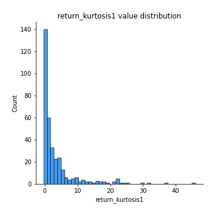
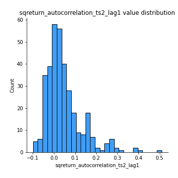
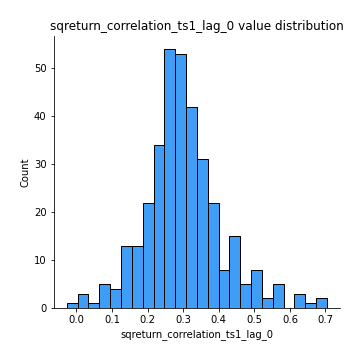

# Exploratory Data Analysis

[<< Go back](../README.md)
## Feature : target
- **Feature type** : categorical
- **Missing** : 0.0%
- **Unique** : 2
- **Count** :347
- **Unique** :2
- **Top** :real
- **Freq** :174

## Feature : return_mean1
- **Feature type** : continous
- **Missing** : 0.0%
- **Unique** : 347
- **Count** :347.0
- **Mean** :0.02964226418186174
- **Std** :0.08051605751135886
- **Min** :-0.22632637961920957
- **25%th Percentile** : -0.021569701645961413
- **50%th Percentile** : 0.02678261832024687
- **75%th Percentile** : 0.08015695169606074
- **Max** :0.37175100008111034

## Feature : return_mean2
- **Feature type** : continous
- **Missing** : 0.0%
- **Unique** : 347
- **Count** :347.0
- **Mean** :0.06833701136702369
- **Std** :0.08798325685580803
- **Min** :-0.24205418062825398
- **25%th Percentile** : 0.01981485498746275
- **50%th Percentile** : 0.06648790061648883
- **75%th Percentile** : 0.12260392718613009
- **Max** :0.35467233975026907

## Feature : return_sd1
- **Feature type** : continous
- **Missing** : 0.0%
- **Unique** : 347
- **Count** :347.0
- **Mean** :1.729783196719195
- **Std** :0.7898562159539478
- **Min** :0.7470080772831957
- **25%th Percentile** : 1.4293384949002326
- **50%th Percentile** : 1.498422813356306
- **75%th Percentile** : 1.696332008867418
- **Max** :9.236766377527575

## Feature : return_sd2
- **Feature type** : continous
- **Missing** : 0.0%
- **Unique** : 347
- **Count** :347.0
- **Mean** :1.754854086278528
- **Std** :0.7130019227786242
- **Min** :0.8455946193085045
- **25%th Percentile** : 1.484752308918238
- **50%th Percentile** : 1.5652870458249613
- **75%th Percentile** : 1.6983009467639116
- **Max** :5.762808157208253

## Feature : return_skew1
- **Feature type** : continous
- **Missing** : 0.0%
- **Unique** : 347
- **Count** :347.0
- **Mean** :-0.1328383165661667
- **Std** :0.6069532695701239
- **Min** :-3.530116233761814
- **25%th Percentile** : -0.259875930785591
- **50%th Percentile** : -0.0842327290939746
- **75%th Percentile** : 0.0733822381218702
- **Max** :2.5845963767725557

## Feature : return_skew2
- **Feature type** : continous
- **Missing** : 0.0%
- **Unique** : 347
- **Count** :347.0
- **Mean** :-0.25005795814696213
- **Std** :0.8379398602563889
- **Min** :-8.801502855292393
- **25%th Percentile** : -0.37768186537505954
- **50%th Percentile** : -0.12408408087276467
- **75%th Percentile** : 0.043954716674764284
- **Max** :2.2606839051517187

## Feature : return_kurtosis1
- **Feature type** : continous
- **Missing** : 0.0%
- **Unique** : 347
- **Count** :347.0
- **Mean** :3.5356812937678503
- **Std** :6.110124349712472
- **Min** :-0.39499458478180216
- **25%th Percentile** : 0.22261652498237972
- **50%th Percentile** : 1.0647312473665083
- **75%th Percentile** : 3.9930614339876844
- **Max** :46.07507808162177

## Feature : return_kurtosis2
- **Feature type** : continous
- **Missing** : 0.0%
- **Unique** : 347
- **Count** :347.0
- **Mean** :4.539268309874405
- **Std** :10.55243078549181
- **Min** :-0.2872271828014661
- **25%th Percentile** : 0.5185024601397421
- **50%th Percentile** : 1.550166300336691
- **75%th Percentile** : 4.40716859472003
- **Max** :143.10871011533666

## Feature : return_autocorrelation_1_lag1
- **Feature type** : continous
- **Missing** : 0.0%
- **Unique** : 347
- **Count** :347.0
- **Mean** :-0.009996307708020994
- **Std** :0.060245721369154834
- **Min** :-0.20673896439036124
- **25%th Percentile** : -0.04601364975285302
- **50%th Percentile** : -0.0059700508516175345
- **75%th Percentile** : 0.030049496941845562
- **Max** :0.12810656890648087

## Feature : return_autocorrelation_1_lag2
- **Feature type** : continous
- **Missing** : 0.0%
- **Unique** : 347
- **Count** :347.0
- **Mean** :-0.004102764193920626
- **Std** :0.04862893195824856
- **Min** :-0.13309283796645122
- **25%th Percentile** : -0.034613553294681285
- **50%th Percentile** : 1.731147300643271e-05
- **75%th Percentile** : 0.02673800718714888
- **Max** :0.1561488228015672

## Feature : return_autocorrelation_1_lag3
- **Feature type** : continous
- **Missing** : 0.0%
- **Unique** : 347
- **Count** :347.0
- **Mean** :-0.005927489890268093
- **Std** :0.05473400321253852
- **Min** :-0.1940836867390813
- **25%th Percentile** : -0.04326028775819998
- **50%th Percentile** : -0.005710181544867908
- **75%th Percentile** : 0.03196159295564502
- **Max** :0.17805869530681923

## Feature : return_autocorrelation_2_lag1
- **Feature type** : continous
- **Missing** : 0.0%
- **Unique** : 347
- **Count** :347.0
- **Mean** :-0.003471500636918241
- **Std** :0.06212777231678798
- **Min** :-0.25075531010123286
- **25%th Percentile** : -0.037034205020820304
- **50%th Percentile** : 6.261544778132169e-05
- **75%th Percentile** : 0.03607661203708866
- **Max** :0.31863413537898483

## Feature : return_autocorrelation_2_lag2
- **Feature type** : continous
- **Missing** : 0.0%
- **Unique** : 347
- **Count** :347.0
- **Mean** :0.008737842198224037
- **Std** :0.05339865156393864
- **Min** :-0.15323211089747296
- **25%th Percentile** : -0.027444602366189563
- **50%th Percentile** : 0.007001672095422855
- **75%th Percentile** : 0.043421360245073926
- **Max** :0.20974504043791217

## Feature : return_autocorrelation_2_lag3
- **Feature type** : continous
- **Missing** : 0.0%
- **Unique** : 347
- **Count** :347.0
- **Mean** :0.002334627571448976
- **Std** :0.047705688919612736
- **Min** :-0.1344316177078651
- **25%th Percentile** : -0.02658497951704932
- **50%th Percentile** : 0.006236155490409903
- **75%th Percentile** : 0.03425323045142295
- **Max** :0.12489629575199976

## Feature : return_correlation_ts1_lag_0
- **Feature type** : continous
- **Missing** : 0.0%
- **Unique** : 347
- **Count** :347.0
- **Mean** :0.3004267223539442
- **Std** :0.11045525485640834
- **Min** :-0.027089510445801036
- **25%th Percentile** : 0.2411794950400821
- **50%th Percentile** : 0.2931310026067798
- **75%th Percentile** : 0.3508008628542932
- **Max** :0.7041861626832071

## Feature : return_correlation_ts1_lag_1
- **Feature type** : continous
- **Missing** : 0.0%
- **Unique** : 347
- **Count** :347.0
- **Mean** :-0.002707274956857067
- **Std** :0.05101735135928639
- **Min** :-0.1549695474991776
- **25%th Percentile** : -0.03671750520580966
- **50%th Percentile** : 0.001598889547046003
- **75%th Percentile** : 0.03166416610235287
- **Max** :0.15499424718508623

## Feature : return_correlation_ts1_lag_2
- **Feature type** : continous
- **Missing** : 0.0%
- **Unique** : 347
- **Count** :347.0
- **Mean** :0.0034781433255330852
- **Std** :0.04779551685441211
- **Min** :-0.12864410180561703
- **25%th Percentile** : -0.029475578997718743
- **50%th Percentile** : 0.0036496485181203267
- **75%th Percentile** : 0.037057395363123934
- **Max** :0.12758223101538324

## Feature : return_correlation_ts1_lag_3
- **Feature type** : continous
- **Missing** : 0.0%
- **Unique** : 347
- **Count** :347.0
- **Mean** :-0.0004333637368624586
- **Std** :0.05158192402886009
- **Min** :-0.1270218498974763
- **25%th Percentile** : -0.03442417588250647
- **50%th Percentile** : -0.0030588769470795136
- **75%th Percentile** : 0.030977829094506942
- **Max** :0.1636773216468148

## Feature : return_correlation_ts2_lag_1
- **Feature type** : continous
- **Missing** : 0.0%
- **Unique** : 347
- **Count** :347.0
- **Mean** :-0.0038337621075337186
- **Std** :0.05438465348692079
- **Min** :-0.2081139431093261
- **25%th Percentile** : -0.040675464249582745
- **50%th Percentile** : -0.0032372418790404954
- **75%th Percentile** : 0.034904752884661404
- **Max** :0.14513823705685333

## Feature : return_correlation_ts2_lag_2
- **Feature type** : continous
- **Missing** : 0.0%
- **Unique** : 347
- **Count** :347.0
- **Mean** :0.003504339022096712
- **Std** :0.046849260350680974
- **Min** :-0.23751835475804678
- **25%th Percentile** : -0.027435664963866582
- **50%th Percentile** : 0.002976867126186143
- **75%th Percentile** : 0.029229895844545224
- **Max** :0.20772887392904255

## Feature : return_correlation_ts2_lag_3
- **Feature type** : continous
- **Missing** : 0.0%
- **Unique** : 347
- **Count** :347.0
- **Mean** :-0.0017387075667347218
- **Std** :0.052343309243682044
- **Min** :-0.17564076057312866
- **25%th Percentile** : -0.03128409550876923
- **50%th Percentile** : -0.003951643816637508
- **75%th Percentile** : 0.03760446979408512
- **Max** :0.13128380114518473

## Feature : sqreturn_autocorrelation_ts1_lag1
- **Feature type** : continous
- **Missing** : 0.0%
- **Unique** : 347
- **Count** :347.0
- **Mean** :0.05414146733913981
- **Std** :0.09590237423124888
- **Min** :-0.1550949990928145
- **25%th Percentile** : -0.009004408091402277
- **50%th Percentile** : 0.03195471165851907
- **75%th Percentile** : 0.08969758859287408
- **Max** :0.49414293176447355

## Feature : sqreturn_autocorrelation_ts1_lag2
- **Feature type** : continous
- **Missing** : 0.0%
- **Unique** : 347
- **Count** :347.0
- **Mean** :0.04203332613314479
- **Std** :0.09103840073322128
- **Min** :-0.0840370475311171
- **25%th Percentile** : -0.012992415488607124
- **50%th Percentile** : 0.016072630923868826
- **75%th Percentile** : 0.06572588147611967
- **Max** :0.4522162366773919

## Feature : sqreturn_autocorrelation_ts1_lag3
- **Feature type** : continous
- **Missing** : 0.0%
- **Unique** : 347
- **Count** :347.0
- **Mean** :0.03347257639582069
- **Std** :0.08121787357774227
- **Min** :-0.08926329246014272
- **25%th Percentile** : -0.01803526485835319
- **50%th Percentile** : 0.013014190554133217
- **75%th Percentile** : 0.06101724603175518
- **Max** :0.44755937369538146

## Feature : sqreturn_autocorrelation_ts2_lag1
- **Feature type** : continous
- **Missing** : 0.0%
- **Unique** : 347
- **Count** :347.0
- **Mean** :0.046500246078862426
- **Std** :0.08685829514853728
- **Min** :-0.09906031870177817
- **25%th Percentile** : -0.00767567331747045
- **50%th Percentile** : 0.02545826625569208
- **75%th Percentile** : 0.07310845567424916
- **Max** :0.510085647437958

## Feature : sqreturn_autocorrelation_ts2_lag2
- **Feature type** : continous
- **Missing** : 0.0%
- **Unique** : 347
- **Count** :347.0
- **Mean** :0.036874750982700426
- **Std** :0.08518283747419
- **Min** :-0.09625911027806641
- **25%th Percentile** : -0.010856236411587523
- **50%th Percentile** : 0.013690327408629983
- **75%th Percentile** : 0.05112191803330886
- **Max** :0.45676817892778204

## Feature : sqreturn_autocorrelation_ts2_lag3
- **Feature type** : continous
- **Missing** : 0.0%
- **Unique** : 347
- **Count** :347.0
- **Mean** :0.026383187885073368
- **Std** :0.06812664303860701
- **Min** :-0.087487656023933
- **25%th Percentile** : -0.01612256579865269
- **50%th Percentile** : 0.009247250565406496
- **75%th Percentile** : 0.05072551628207648
- **Max** :0.31225727797735664

## Feature : sqreturn_correlation_ts1_lag_0
- **Feature type** : continous
- **Missing** : 0.0%
- **Unique** : 347
- **Count** :347.0
- **Mean** :0.3004267223539442
- **Std** :0.11045525485640834
- **Min** :-0.027089510445801036
- **25%th Percentile** : 0.2411794950400821
- **50%th Percentile** : 0.2931310026067798
- **75%th Percentile** : 0.3508008628542932
- **Max** :0.7041861626832071

## Feature : sqreturn_correlation_ts1_lag_1
- **Feature type** : continous
- **Missing** : 0.0%
- **Unique** : 347
- **Count** :347.0
- **Mean** :-0.002707274956857067
- **Std** :0.05101735135928639
- **Min** :-0.1549695474991776
- **25%th Percentile** : -0.03671750520580966
- **50%th Percentile** : 0.001598889547046003
- **75%th Percentile** : 0.03166416610235287
- **Max** :0.15499424718508623

## Feature : sqreturn_correlation_ts1_lag_2
- **Feature type** : continous
- **Missing** : 0.0%
- **Unique** : 347
- **Count** :347.0
- **Mean** :0.0034781433255330852
- **Std** :0.04779551685441211
- **Min** :-0.12864410180561703
- **25%th Percentile** : -0.029475578997718743
- **50%th Percentile** : 0.0036496485181203267
- **75%th Percentile** : 0.037057395363123934
- **Max** :0.12758223101538324

## Feature : sqreturn_correlation_ts1_lag_3
- **Feature type** : continous
- **Missing** : 0.0%
- **Unique** : 347
- **Count** :347.0
- **Mean** :-0.0004333637368624586
- **Std** :0.05158192402886009
- **Min** :-0.1270218498974763
- **25%th Percentile** : -0.03442417588250647
- **50%th Percentile** : -0.0030588769470795136
- **75%th Percentile** : 0.030977829094506942
- **Max** :0.1636773216468148

## Feature : sqreturn_correlation_ts2_lag_1
- **Feature type** : continous
- **Missing** : 0.0%
- **Unique** : 347
- **Count** :347.0
- **Mean** :-0.0038337621075337186
- **Std** :0.05438465348692079
- **Min** :-0.2081139431093261
- **25%th Percentile** : -0.040675464249582745
- **50%th Percentile** : -0.0032372418790404954
- **75%th Percentile** : 0.034904752884661404
- **Max** :0.14513823705685333

## Feature : sqreturn_correlation_ts2_lag_2
- **Feature type** : continous
- **Missing** : 0.0%
- **Unique** : 347
- **Count** :347.0
- **Mean** :0.003504339022096712
- **Std** :0.046849260350680974
- **Min** :-0.23751835475804678
- **25%th Percentile** : -0.027435664963866582
- **50%th Percentile** : 0.002976867126186143
- **75%th Percentile** : 0.029229895844545224
- **Max** :0.20772887392904255

## Feature : sqreturn_correlation_ts2_lag_3
- **Feature type** : continous
- **Missing** : 0.0%
- **Unique** : 347
- **Count** :347.0
- **Mean** :-0.0017387075667347218
- **Std** :0.052343309243682044
- **Min** :-0.17564076057312866
- **25%th Percentile** : -0.03128409550876923
- **50%th Percentile** : -0.003951643816637508
- **75%th Percentile** : 0.03760446979408512
- **Max** :0.13128380114518473

## Feature : price2_granger_cause_price1
- **Feature type** : continous
- **Missing** : 0.0%
- **Unique** : 347
- **Count** :347.0
- **Mean** :0.32369011441488527
- **Std** :0.2901697227755842
- **Min** :1.1505642493585304e-05
- **25%th Percentile** : 0.06845372705552383
- **50%th Percentile** : 0.2558962499697314
- **75%th Percentile** : 0.5230924482252011
- **Max** :0.9853666024514321

## Feature : price1_granger_cause_price2
- **Feature type** : continous
- **Missing** : 0.0%
- **Unique** : 347
- **Count** :347.0
- **Mean** :0.28356910995517554
- **Std** :0.2892333362297582
- **Min** :1.3426320592782138e-07
- **25%th Percentile** : 0.019398500312014812
- **50%th Percentile** : 0.1855655239541396
- **75%th Percentile** : 0.48323421046339304
- **Max** :0.9951398266867577

[<< Go back](../README.md)
