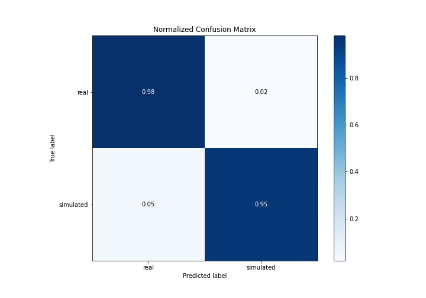
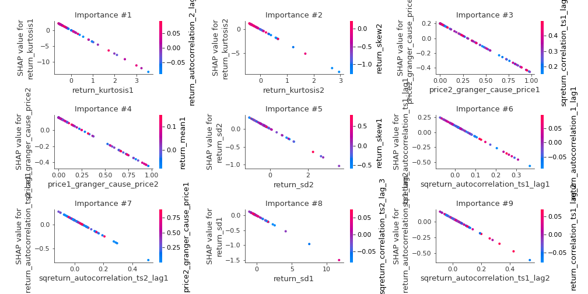

# Summary of 3_Linear

[<< Go back](../README.md)

## Logistic Regression (Linear)
- **n_jobs**: -1
- **explain_level**: 2

## Validation
 - **validation_type**: split
 - **train_ratio**: 0.75
 - **shuffle**: True
 - **stratify**: True

## Optimized metric
accuracy

## Training time

10.9 seconds

## Metric details
|           |    score |     threshold |
|:----------|---------:|--------------:|
| logloss   | 0.218814 | nan           |
| auc       | 0.984144 | nan           |
| f1        | 0.965517 |   0.719452    |
| accuracy  | 0.965517 |   0.719452    |
| precision | 1        |   0.895313    |
| recall    | 1        |   7.36727e-09 |
| mcc       | 0.93129  |   0.719452    |

## Confusion matrix (at threshold=0.719452)
|                      |   Predicted as real |   Predicted as simulated |
|:---------------------|--------------------:|-------------------------:|
| Labeled as real      |                  42 |                        1 |
| Labeled as simulated |                   2 |                       42 |

## Learning curves

## Coefficients
| feature                           |   Learner_1 |
|:----------------------------------|------------:|
| return_autocorrelation_2_lag1     |   0.743969  |
| return_autocorrelation_2_lag3     |   0.537237  |
| return_correlation_ts1_lag_1      |   0.50516   |
| sqreturn_correlation_ts1_lag_1    |   0.50516   |
| sqreturn_correlation_ts2_lag_3    |   0.445057  |
| return_correlation_ts2_lag_3      |   0.445057  |
| return_autocorrelation_1_lag3     |   0.44455   |
| return_autocorrelation_2_lag2     |   0.443126  |
| return_correlation_ts1_lag_3      |   0.392526  |
| sqreturn_correlation_ts1_lag_3    |   0.392526  |
| return_correlation_ts2_lag_1      |   0.344066  |
| sqreturn_correlation_ts2_lag_1    |   0.344066  |
| return_correlation_ts1_lag_2      |   0.241748  |
| sqreturn_correlation_ts1_lag_2    |   0.241748  |
| return_autocorrelation_1_lag2     |   0.0793977 |
| return_autocorrelation_1_lag1     |   0.0446854 |
| return_skew1                      |  -0.107073  |
| return_sd1                        |  -0.125744  |
| return_skew2                      |  -0.164186  |
| return_correlation_ts2_lag_2      |  -0.174302  |
| sqreturn_correlation_ts2_lag_2    |  -0.174302  |
| return_correlation_ts1_lag_0      |  -0.245996  |
| sqreturn_correlation_ts1_lag_0    |  -0.245996  |
| return_sd2                        |  -0.285626  |
| return_mean2                      |  -0.297208  |
| intercept                         |  -0.556213  |
| price1_granger_cause_price2       |  -0.620202  |
| price2_granger_cause_price1       |  -0.666707  |
| sqreturn_autocorrelation_ts2_lag3 |  -0.781311  |
| return_mean1                      |  -0.949975  |
| sqreturn_autocorrelation_ts2_lag2 |  -1.01094   |
| sqreturn_autocorrelation_ts1_lag2 |  -1.22963   |
| sqreturn_autocorrelation_ts1_lag3 |  -1.25845   |
| sqreturn_autocorrelation_ts2_lag1 |  -1.62225   |
| sqreturn_autocorrelation_ts1_lag1 |  -1.84921   |
| return_kurtosis2                  |  -2.9996    |
| return_kurtosis1                  |  -3.71124   |

## Permutation-based Importance

## Confusion Matrix

## Normalized Confusion Matrix

## ROC Curve

## Kolmogorov-Smirnov Statistic

## Precision-Recall Curve

## Calibration Curve

## Cumulative Gains Curve

## Lift Curve

## SHAP Importance

## SHAP Dependence plots

### Dependence (Fold 1)

## SHAP Decision plots

### Top-10 Worst decisions for class 0 (Fold 1)

### Top-10 Best decisions for class 0 (Fold 1)

### Top-10 Worst decisions for class 1 (Fold 1)

### Top-10 Best decisions for class 1 (Fold 1)

[<< Go back](../README.md)
