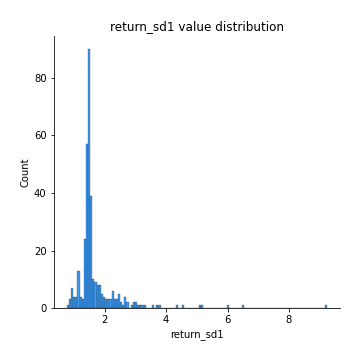
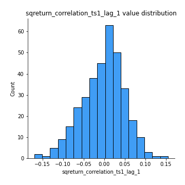

# Exploratory Data Analysis

[<< Go back](../README.md)
## Feature : target
- **Feature type** : categorical
- **Missing** : 0.0%
- **Unique** : 2
- **Count** :347
- **Unique** :2
- **Top** :simulated
- **Freq** :175

## Feature : return_mean1
- **Feature type** : continous
- **Missing** : 0.0%
- **Unique** : 347
- **Count** :347.0
- **Mean** :0.026513588409605465
- **Std** :0.0725376992873454
- **Min** :-0.22632637961920957
- **25%th Percentile** : -0.022504140131897457
- **50%th Percentile** : 0.02670526752485874
- **75%th Percentile** : 0.07419310478877408
- **Max** :0.3243165523728677

## Feature : return_mean2
- **Feature type** : continous
- **Missing** : 0.0%
- **Unique** : 347
- **Count** :347.0
- **Mean** :0.059831588597884594
- **Std** :0.08970451896229295
- **Min** :-0.24205418062825398
- **25%th Percentile** : 0.01116435415876334
- **50%th Percentile** : 0.06201769329073691
- **75%th Percentile** : 0.11216441812127162
- **Max** :0.31562159045349353

## Feature : return_sd1
- **Feature type** : continous
- **Missing** : 0.0%
- **Unique** : 347
- **Count** :347.0
- **Mean** :1.7004438655038987
- **Std** :0.7823039146790696
- **Min** :0.7620831696941981
- **25%th Percentile** : 1.4227136234066693
- **50%th Percentile** : 1.4864763692761676
- **75%th Percentile** : 1.6681739054148195
- **Max** :9.236766377527575

## Feature : return_sd2
- **Feature type** : continous
- **Missing** : 0.0%
- **Unique** : 347
- **Count** :347.0
- **Mean** :1.746810432789534
- **Std** :0.7035675931203017
- **Min** :0.8455946193085045
- **25%th Percentile** : 1.4973161448462164
- **50%th Percentile** : 1.5717524339934275
- **75%th Percentile** : 1.6808545699655184
- **Max** :6.737618636746393

## Feature : return_skew1
- **Feature type** : continous
- **Missing** : 0.0%
- **Unique** : 347
- **Count** :347.0
- **Mean** :-0.13234129614238505
- **Std** :0.5971987725271004
- **Min** :-3.530116233761814
- **25%th Percentile** : -0.2448497559863516
- **50%th Percentile** : -0.08758518615561067
- **75%th Percentile** : 0.06694989461505875
- **Max** :2.5845963767725557

## Feature : return_skew2
- **Feature type** : continous
- **Missing** : 0.0%
- **Unique** : 347
- **Count** :347.0
- **Mean** :-0.212846226570024
- **Std** :0.7543465166528002
- **Min** :-8.801502855292393
- **25%th Percentile** : -0.3329764520636564
- **50%th Percentile** : -0.13907674361585276
- **75%th Percentile** : 0.048696194538245724
- **Max** :2.2606839051517187

## Feature : return_kurtosis1
- **Feature type** : continous
- **Missing** : 0.0%
- **Unique** : 347
- **Count** :347.0
- **Mean** :3.3359090517411993
- **Std** :6.0231027566040956
- **Min** :-0.39330322558131003
- **25%th Percentile** : 0.2762724406434045
- **50%th Percentile** : 1.0279615611405037
- **75%th Percentile** : 3.562148308433014
- **Max** :46.07507808162177

## Feature : return_kurtosis2
- **Feature type** : continous
- **Missing** : 0.0%
- **Unique** : 347
- **Count** :347.0
- **Mean** :4.075442348349611
- **Std** :9.806906847567618
- **Min** :-0.33260581740703454
- **25%th Percentile** : 0.48762592057923193
- **50%th Percentile** : 1.4413895462027937
- **75%th Percentile** : 4.292990687869494
- **Max** :143.10871011533666

## Feature : return_autocorrelation_1_lag1
- **Feature type** : continous
- **Missing** : 0.0%
- **Unique** : 347
- **Count** :347.0
- **Mean** :-0.01266336854504789
- **Std** :0.05775088897798268
- **Min** :-0.2135576224968752
- **25%th Percentile** : -0.04953843854433461
- **50%th Percentile** : -0.005138826378263132
- **75%th Percentile** : 0.024381617965731774
- **Max** :0.12311391564956375

## Feature : return_autocorrelation_1_lag2
- **Feature type** : continous
- **Missing** : 0.0%
- **Unique** : 347
- **Count** :347.0
- **Mean** :-0.0045557064464718236
- **Std** :0.049933780786119465
- **Min** :-0.13309283796645122
- **25%th Percentile** : -0.03682031455392332
- **50%th Percentile** : -0.0029247444443187332
- **75%th Percentile** : 0.026863268532456477
- **Max** :0.12993318557465194

## Feature : return_autocorrelation_1_lag3
- **Feature type** : continous
- **Missing** : 0.0%
- **Unique** : 347
- **Count** :347.0
- **Mean** :-0.0019902730614598414
- **Std** :0.051319018843190296
- **Min** :-0.15806635192103805
- **25%th Percentile** : -0.03761459695237822
- **50%th Percentile** : -0.0008105102559118239
- **75%th Percentile** : 0.03271038647523086
- **Max** :0.17805869530681923

## Feature : return_autocorrelation_2_lag1
- **Feature type** : continous
- **Missing** : 0.0%
- **Unique** : 347
- **Count** :347.0
- **Mean** :-0.003805294058820653
- **Std** :0.06346580991650906
- **Min** :-0.25075531010123286
- **25%th Percentile** : -0.040159490808782755
- **50%th Percentile** : -0.000702562157974753
- **75%th Percentile** : 0.03624546477248462
- **Max** :0.16349871797309318

## Feature : return_autocorrelation_2_lag2
- **Feature type** : continous
- **Missing** : 0.0%
- **Unique** : 347
- **Count** :347.0
- **Mean** :0.0063774420304645325
- **Std** :0.051597952270327783
- **Min** :-0.15323211089747296
- **25%th Percentile** : -0.030026568016001235
- **50%th Percentile** : 0.006273930241667754
- **75%th Percentile** : 0.039535142283482455
- **Max** :0.15900510901384107

## Feature : return_autocorrelation_2_lag3
- **Feature type** : continous
- **Missing** : 0.0%
- **Unique** : 347
- **Count** :347.0
- **Mean** :0.005393214127889734
- **Std** :0.05028364224082923
- **Min** :-0.14200107169559698
- **25%th Percentile** : -0.025298262747671045
- **50%th Percentile** : 0.008000008979241665
- **75%th Percentile** : 0.03819637861599362
- **Max** :0.12489629575199976

## Feature : return_correlation_ts1_lag_0
- **Feature type** : continous
- **Missing** : 0.0%
- **Unique** : 347
- **Count** :347.0
- **Mean** :0.3121378336433639
- **Std** :0.1081693933043552
- **Min** :0.005136598099876001
- **25%th Percentile** : 0.2499787642719089
- **50%th Percentile** : 0.3049748403691827
- **75%th Percentile** : 0.35644784110228445
- **Max** :0.7041861626832071

## Feature : return_correlation_ts1_lag_1
- **Feature type** : continous
- **Missing** : 0.0%
- **Unique** : 347
- **Count** :347.0
- **Mean** :-0.001976351742919665
- **Std** :0.051356288113853066
- **Min** :-0.16985510949917193
- **25%th Percentile** : -0.03544882983862442
- **50%th Percentile** : 0.003626470192176239
- **75%th Percentile** : 0.03213254705779111
- **Max** :0.15499424718508623

## Feature : return_correlation_ts1_lag_2
- **Feature type** : continous
- **Missing** : 0.0%
- **Unique** : 347
- **Count** :347.0
- **Mean** :-0.002470536403088547
- **Std** :0.0472042420810399
- **Min** :-0.21653581047581763
- **25%th Percentile** : -0.03566684314173473
- **50%th Percentile** : -0.0020126584596116674
- **75%th Percentile** : 0.027903337461054247
- **Max** :0.10916944041387708

## Feature : return_correlation_ts1_lag_3
- **Feature type** : continous
- **Missing** : 0.0%
- **Unique** : 347
- **Count** :347.0
- **Mean** :0.00571598427638279
- **Std** :0.051089801543953574
- **Min** :-0.12275228590862461
- **25%th Percentile** : -0.028117274179947548
- **50%th Percentile** : 0.005503912365482743
- **75%th Percentile** : 0.04155919832108623
- **Max** :0.1636773216468148

## Feature : return_correlation_ts2_lag_1
- **Feature type** : continous
- **Missing** : 0.0%
- **Unique** : 347
- **Count** :347.0
- **Mean** :-0.0061473746070974675
- **Std** :0.05640726033165525
- **Min** :-0.2081139431093261
- **25%th Percentile** : -0.03941733312831624
- **50%th Percentile** : -0.006904377293697197
- **75%th Percentile** : 0.02911193722789375
- **Max** :0.17208763791364762

## Feature : return_correlation_ts2_lag_2
- **Feature type** : continous
- **Missing** : 0.0%
- **Unique** : 347
- **Count** :347.0
- **Mean** :0.0021563159561327743
- **Std** :0.052517022202654584
- **Min** :-0.23751835475804678
- **25%th Percentile** : -0.03155338092667228
- **50%th Percentile** : -0.00016553792162788547
- **75%th Percentile** : 0.0382372810024663
- **Max** :0.15388933426238696

## Feature : return_correlation_ts2_lag_3
- **Feature type** : continous
- **Missing** : 0.0%
- **Unique** : 347
- **Count** :347.0
- **Mean** :0.000636091513650727
- **Std** :0.05139256785635991
- **Min** :-0.16212823605110202
- **25%th Percentile** : -0.02915151455695513
- **50%th Percentile** : 7.979170935312992e-06
- **75%th Percentile** : 0.03992011199954089
- **Max** :0.13128380114518473

## Feature : sqreturn_autocorrelation_ts1_lag1
- **Feature type** : continous
- **Missing** : 0.0%
- **Unique** : 347
- **Count** :347.0
- **Mean** :0.04927671890782381
- **Std** :0.09474435656495363
- **Min** :-0.1145530946950107
- **25%th Percentile** : -0.010793802525418693
- **50%th Percentile** : 0.021263578449339546
- **75%th Percentile** : 0.0830523949530373
- **Max** :0.49414293176447355

## Feature : sqreturn_autocorrelation_ts1_lag2
- **Feature type** : continous
- **Missing** : 0.0%
- **Unique** : 347
- **Count** :347.0
- **Mean** :0.0448822507065932
- **Std** :0.0911575489329305
- **Min** :-0.10187551386875092
- **25%th Percentile** : -0.010465575928948702
- **50%th Percentile** : 0.021205796702706746
- **75%th Percentile** : 0.06942429284476091
- **Max** :0.540735851444759

## Feature : sqreturn_autocorrelation_ts1_lag3
- **Feature type** : continous
- **Missing** : 0.0%
- **Unique** : 347
- **Count** :347.0
- **Mean** :0.035233673105212984
- **Std** :0.07756905777435522
- **Min** :-0.083551465388728
- **25%th Percentile** : -0.015297915160199665
- **50%th Percentile** : 0.018492499492989197
- **75%th Percentile** : 0.06269104546144452
- **Max** :0.41030914918857014

## Feature : sqreturn_autocorrelation_ts2_lag1
- **Feature type** : continous
- **Missing** : 0.0%
- **Unique** : 347
- **Count** :347.0
- **Mean** :0.04739786208774644
- **Std** :0.08788307202434067
- **Min** :-0.10982144058522161
- **25%th Percentile** : -0.010142276729799905
- **50%th Percentile** : 0.022772000438872102
- **75%th Percentile** : 0.08252946367672215
- **Max** :0.510085647437958

## Feature : sqreturn_autocorrelation_ts2_lag2
- **Feature type** : continous
- **Missing** : 0.0%
- **Unique** : 347
- **Count** :347.0
- **Mean** :0.03971511041763119
- **Std** :0.08423334807832648
- **Min** :-0.1046197747602187
- **25%th Percentile** : -0.01059412394643942
- **50%th Percentile** : 0.017783740767332964
- **75%th Percentile** : 0.0568037788464561
- **Max** :0.4161185589245815

## Feature : sqreturn_autocorrelation_ts2_lag3
- **Feature type** : continous
- **Missing** : 0.0%
- **Unique** : 347
- **Count** :347.0
- **Mean** :0.02939360865829053
- **Std** :0.06926573542175622
- **Min** :-0.09349540928922766
- **25%th Percentile** : -0.016508525765301294
- **50%th Percentile** : 0.012277747375320891
- **75%th Percentile** : 0.05988650145256176
- **Max** :0.2982547942937359

## Feature : sqreturn_correlation_ts1_lag_0
- **Feature type** : continous
- **Missing** : 0.0%
- **Unique** : 347
- **Count** :347.0
- **Mean** :0.3121378336433639
- **Std** :0.1081693933043552
- **Min** :0.005136598099876001
- **25%th Percentile** : 0.2499787642719089
- **50%th Percentile** : 0.3049748403691827
- **75%th Percentile** : 0.35644784110228445
- **Max** :0.7041861626832071

## Feature : sqreturn_correlation_ts1_lag_1
- **Feature type** : continous
- **Missing** : 0.0%
- **Unique** : 347
- **Count** :347.0
- **Mean** :-0.001976351742919665
- **Std** :0.051356288113853066
- **Min** :-0.16985510949917193
- **25%th Percentile** : -0.03544882983862442
- **50%th Percentile** : 0.003626470192176239
- **75%th Percentile** : 0.03213254705779111
- **Max** :0.15499424718508623

## Feature : sqreturn_correlation_ts1_lag_2
- **Feature type** : continous
- **Missing** : 0.0%
- **Unique** : 347
- **Count** :347.0
- **Mean** :-0.002470536403088547
- **Std** :0.0472042420810399
- **Min** :-0.21653581047581763
- **25%th Percentile** : -0.03566684314173473
- **50%th Percentile** : -0.0020126584596116674
- **75%th Percentile** : 0.027903337461054247
- **Max** :0.10916944041387708

## Feature : sqreturn_correlation_ts1_lag_3
- **Feature type** : continous
- **Missing** : 0.0%
- **Unique** : 347
- **Count** :347.0
- **Mean** :0.00571598427638279
- **Std** :0.051089801543953574
- **Min** :-0.12275228590862461
- **25%th Percentile** : -0.028117274179947548
- **50%th Percentile** : 0.005503912365482743
- **75%th Percentile** : 0.04155919832108623
- **Max** :0.1636773216468148

## Feature : sqreturn_correlation_ts2_lag_1
- **Feature type** : continous
- **Missing** : 0.0%
- **Unique** : 347
- **Count** :347.0
- **Mean** :-0.0061473746070974675
- **Std** :0.05640726033165525
- **Min** :-0.2081139431093261
- **25%th Percentile** : -0.03941733312831624
- **50%th Percentile** : -0.006904377293697197
- **75%th Percentile** : 0.02911193722789375
- **Max** :0.17208763791364762

## Feature : sqreturn_correlation_ts2_lag_2
- **Feature type** : continous
- **Missing** : 0.0%
- **Unique** : 347
- **Count** :347.0
- **Mean** :0.0021563159561327743
- **Std** :0.052517022202654584
- **Min** :-0.23751835475804678
- **25%th Percentile** : -0.03155338092667228
- **50%th Percentile** : -0.00016553792162788547
- **75%th Percentile** : 0.0382372810024663
- **Max** :0.15388933426238696

## Feature : sqreturn_correlation_ts2_lag_3
- **Feature type** : continous
- **Missing** : 0.0%
- **Unique** : 347
- **Count** :347.0
- **Mean** :0.000636091513650727
- **Std** :0.05139256785635991
- **Min** :-0.16212823605110202
- **25%th Percentile** : -0.02915151455695513
- **50%th Percentile** : 7.979170935312992e-06
- **75%th Percentile** : 0.03992011199954089
- **Max** :0.13128380114518473

## Feature : price2_granger_cause_price1
- **Feature type** : continous
- **Missing** : 0.0%
- **Unique** : 347
- **Count** :347.0
- **Mean** :0.29698272909680845
- **Std** :0.2751610784308387
- **Min** :7.155200788080637e-07
- **25%th Percentile** : 0.056755639994285345
- **50%th Percentile** : 0.23323694517697294
- **75%th Percentile** : 0.4956956174110921
- **Max** :0.9939375343020035

## Feature : price1_granger_cause_price2
- **Feature type** : continous
- **Missing** : 0.0%
- **Unique** : 347
- **Count** :347.0
- **Mean** :0.2551210366073765
- **Std** :0.28102709373597295
- **Min** :3.2291277107523153e-09
- **25%th Percentile** : 0.01736313892120058
- **50%th Percentile** : 0.14015593319364275
- **75%th Percentile** : 0.4136961855566415
- **Max** :0.9951398266867577

[<< Go back](../README.md)
