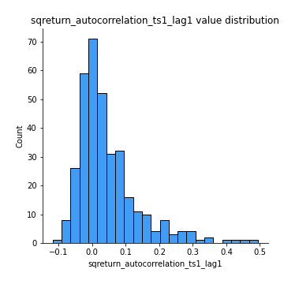

# Exploratory Data Analysis

[<< Go back](../README.md)
## Feature : target
- **Feature type** : categorical
- **Missing** : 0.0%
- **Unique** : 2
- **Count** :347
- **Unique** :2
- **Top** :simulated
- **Freq** :174

## Feature : return_mean1
- **Feature type** : continous
- **Missing** : 0.0%
- **Unique** : 347
- **Count** :347.0
- **Mean** :0.03507519705389206
- **Std** :0.07549584989451245
- **Min** :-0.1777014010740803
- **25%th Percentile** : -0.010592481955421082
- **50%th Percentile** : 0.0355033487617428
- **75%th Percentile** : 0.08122890297109106
- **Max** :0.37175100008111034

## Feature : return_mean2
- **Feature type** : continous
- **Missing** : 0.0%
- **Unique** : 347
- **Count** :347.0
- **Mean** :0.06805148478543223
- **Std** :0.09084270498797688
- **Min** :-0.21818165578778434
- **25%th Percentile** : 0.01777667373757294
- **50%th Percentile** : 0.06371982250616907
- **75%th Percentile** : 0.11865264197277062
- **Max** :0.47635411491338164

## Feature : return_sd1
- **Feature type** : continous
- **Missing** : 0.0%
- **Unique** : 347
- **Count** :347.0
- **Mean** :1.6743450628116514
- **Std** :0.6038083553084403
- **Min** :0.7470080772831957
- **25%th Percentile** : 1.4165305812314632
- **50%th Percentile** : 1.4906651162236408
- **75%th Percentile** : 1.6629161534619006
- **Max** :5.24521302455331

## Feature : return_sd2
- **Feature type** : continous
- **Missing** : 0.0%
- **Unique** : 347
- **Count** :347.0
- **Mean** :1.7272357367800362
- **Std** :0.6888296663640198
- **Min** :0.8455946193085045
- **25%th Percentile** : 1.4837169013163782
- **50%th Percentile** : 1.5646591600484536
- **75%th Percentile** : 1.6652046821204096
- **Max** :6.737618636746393

## Feature : return_skew1
- **Feature type** : continous
- **Missing** : 0.0%
- **Unique** : 347
- **Count** :347.0
- **Mean** :-0.12603149287908902
- **Std** :0.5981318170776153
- **Min** :-3.530116233761814
- **25%th Percentile** : -0.2798391436941944
- **50%th Percentile** : -0.06609370972080354
- **75%th Percentile** : 0.08460129148109446
- **Max** :2.5845963767725557

## Feature : return_skew2
- **Feature type** : continous
- **Missing** : 0.0%
- **Unique** : 347
- **Count** :347.0
- **Mean** :-0.21122465740272975
- **Std** :0.7286622485618078
- **Min** :-8.801502855292393
- **25%th Percentile** : -0.3718048145427413
- **50%th Percentile** : -0.11920939236349902
- **75%th Percentile** : 0.0666601444988885
- **Max** :2.123597625075353

## Feature : return_kurtosis1
- **Feature type** : continous
- **Missing** : 0.0%
- **Unique** : 347
- **Count** :347.0
- **Mean** :3.496831331881396
- **Std** :6.339435015382362
- **Min** :-0.30506937550696067
- **25%th Percentile** : 0.23614265974431725
- **50%th Percentile** : 1.2523617482923286
- **75%th Percentile** : 3.75263690524766
- **Max** :46.07507808162177

## Feature : return_kurtosis2
- **Feature type** : continous
- **Missing** : 0.0%
- **Unique** : 347
- **Count** :347.0
- **Mean** :3.783804108336613
- **Std** :9.22248014037932
- **Min** :-0.3236798803577523
- **25%th Percentile** : 0.5156584143937084
- **50%th Percentile** : 1.601362263987013
- **75%th Percentile** : 4.1488807640792835
- **Max** :143.10871011533666

## Feature : return_autocorrelation_1_lag1
- **Feature type** : continous
- **Missing** : 0.0%
- **Unique** : 347
- **Count** :347.0
- **Mean** :-0.013147801205417657
- **Std** :0.05820711450206457
- **Min** :-0.2135576224968752
- **25%th Percentile** : -0.0477920359429258
- **50%th Percentile** : -0.006970481934315749
- **75%th Percentile** : 0.025060330343149632
- **Max** :0.1351662620546063

## Feature : return_autocorrelation_1_lag2
- **Feature type** : continous
- **Missing** : 0.0%
- **Unique** : 347
- **Count** :347.0
- **Mean** :-0.004414643552724108
- **Std** :0.04985911749573239
- **Min** :-0.12172858720259
- **25%th Percentile** : -0.03547694493498393
- **50%th Percentile** : -0.00299995482899673
- **75%th Percentile** : 0.02886503095718094
- **Max** :0.1561488228015672

## Feature : return_autocorrelation_1_lag3
- **Feature type** : continous
- **Missing** : 0.0%
- **Unique** : 347
- **Count** :347.0
- **Mean** :-0.0007174856093544906
- **Std** :0.04898693286307238
- **Min** :-0.15117275786205733
- **25%th Percentile** : -0.02910537814288538
- **50%th Percentile** : 0.00010684383579549596
- **75%th Percentile** : 0.0332314214069962
- **Max** :0.17805869530681923

## Feature : return_autocorrelation_2_lag1
- **Feature type** : continous
- **Missing** : 0.0%
- **Unique** : 347
- **Count** :347.0
- **Mean** :-0.0033825832720812575
- **Std** :0.05986742499860002
- **Min** :-0.24590087874039124
- **25%th Percentile** : -0.03407917141821566
- **50%th Percentile** : -0.0006270719955293724
- **75%th Percentile** : 0.032817173367803404
- **Max** :0.16349871797309318

## Feature : return_autocorrelation_2_lag2
- **Feature type** : continous
- **Missing** : 0.0%
- **Unique** : 347
- **Count** :347.0
- **Mean** :0.004475981206004542
- **Std** :0.05280850586377585
- **Min** :-0.15323211089747296
- **25%th Percentile** : -0.031102296226589138
- **50%th Percentile** : 0.00232968168898049
- **75%th Percentile** : 0.0395424487265105
- **Max** :0.1735398560230086

## Feature : return_autocorrelation_2_lag3
- **Feature type** : continous
- **Missing** : 0.0%
- **Unique** : 347
- **Count** :347.0
- **Mean** :0.006074322059234331
- **Std** :0.05244097285906171
- **Min** :-0.14200107169559698
- **25%th Percentile** : -0.027888686191798573
- **50%th Percentile** : 0.008189588685784554
- **75%th Percentile** : 0.0453977601430859
- **Max** :0.16118344114745398

## Feature : return_correlation_ts1_lag_0
- **Feature type** : continous
- **Missing** : 0.0%
- **Unique** : 347
- **Count** :347.0
- **Mean** :0.3075420103955074
- **Std** :0.11027393994158037
- **Min** :-0.027089510445801036
- **25%th Percentile** : 0.2480892807482669
- **50%th Percentile** : 0.3037365529925118
- **75%th Percentile** : 0.3542585668002749
- **Max** :0.7041861626832071

## Feature : return_correlation_ts1_lag_1
- **Feature type** : continous
- **Missing** : 0.0%
- **Unique** : 347
- **Count** :347.0
- **Mean** :-0.006806715916404092
- **Std** :0.050813848150429726
- **Min** :-0.16985510949917193
- **25%th Percentile** : -0.04055566005855798
- **50%th Percentile** : -0.001980081691607125
- **75%th Percentile** : 0.026547460347463657
- **Max** :0.1198489884137091

## Feature : return_correlation_ts1_lag_2
- **Feature type** : continous
- **Missing** : 0.0%
- **Unique** : 347
- **Count** :347.0
- **Mean** :-0.00011908829777152244
- **Std** :0.04687773976850773
- **Min** :-0.21653581047581763
- **25%th Percentile** : -0.029566135939374412
- **50%th Percentile** : -0.0009681797294642787
- **75%th Percentile** : 0.031022545164254234
- **Max** :0.10925794766608564

## Feature : return_correlation_ts1_lag_3
- **Feature type** : continous
- **Missing** : 0.0%
- **Unique** : 347
- **Count** :347.0
- **Mean** :0.00410085443837077
- **Std** :0.05141692654524249
- **Min** :-0.1270218498974763
- **25%th Percentile** : -0.03276605079548702
- **50%th Percentile** : 0.008606126968461924
- **75%th Percentile** : 0.039603783855165026
- **Max** :0.1636773216468148

## Feature : return_correlation_ts2_lag_1
- **Feature type** : continous
- **Missing** : 0.0%
- **Unique** : 347
- **Count** :347.0
- **Mean** :-0.005665111255344561
- **Std** :0.0534553842919981
- **Min** :-0.2081139431093261
- **25%th Percentile** : -0.03651418047836864
- **50%th Percentile** : -0.0077147023976848255
- **75%th Percentile** : 0.034164074014160245
- **Max** :0.11556235671885211

## Feature : return_correlation_ts2_lag_2
- **Feature type** : continous
- **Missing** : 0.0%
- **Unique** : 347
- **Count** :347.0
- **Mean** :0.0034476008095880896
- **Std** :0.04972227935829841
- **Min** :-0.23751835475804678
- **25%th Percentile** : -0.02773936116983028
- **50%th Percentile** : 0.002421365181653593
- **75%th Percentile** : 0.0356751036903886
- **Max** :0.20772887392904255

## Feature : return_correlation_ts2_lag_3
- **Feature type** : continous
- **Missing** : 0.0%
- **Unique** : 347
- **Count** :347.0
- **Mean** :-0.0021346341445216115
- **Std** :0.053563595225877246
- **Min** :-0.17564076057312866
- **25%th Percentile** : -0.027504735337781853
- **50%th Percentile** : -0.003319058028354213
- **75%th Percentile** : 0.03555133184813583
- **Max** :0.12578577770423086

## Feature : sqreturn_autocorrelation_ts1_lag1
- **Feature type** : continous
- **Missing** : 0.0%
- **Unique** : 347
- **Count** :347.0
- **Mean** :0.04498088353199094
- **Std** :0.09156903722667407
- **Min** :-0.11784984338805808
- **25%th Percentile** : -0.015008876464852218
- **50%th Percentile** : 0.02197247203768061
- **75%th Percentile** : 0.07984953986941637
- **Max** :0.49414293176447355

## Feature : sqreturn_autocorrelation_ts1_lag2
- **Feature type** : continous
- **Missing** : 0.0%
- **Unique** : 347
- **Count** :347.0
- **Mean** :0.03601688094300951
- **Std** :0.0883186656910973
- **Min** :-0.10830191890919443
- **25%th Percentile** : -0.01734728160712669
- **50%th Percentile** : 0.014215384456860275
- **75%th Percentile** : 0.06092118817448158
- **Max** :0.4522162366773919

## Feature : sqreturn_autocorrelation_ts1_lag3
- **Feature type** : continous
- **Missing** : 0.0%
- **Unique** : 347
- **Count** :347.0
- **Mean** :0.034790095236421126
- **Std** :0.0757724824111923
- **Min** :-0.09780297190914454
- **25%th Percentile** : -0.012906945492696553
- **50%th Percentile** : 0.013014190554133217
- **75%th Percentile** : 0.058309220474880616
- **Max** :0.41030914918857014

## Feature : sqreturn_autocorrelation_ts2_lag1
- **Feature type** : continous
- **Missing** : 0.0%
- **Unique** : 347
- **Count** :347.0
- **Mean** :0.04854064719707265
- **Std** :0.08822134647810997
- **Min** :-0.08754038504336518
- **25%th Percentile** : -0.009111705223946737
- **50%th Percentile** : 0.028024673012368214
- **75%th Percentile** : 0.08506784259927522
- **Max** :0.510085647437958

## Feature : sqreturn_autocorrelation_ts2_lag2
- **Feature type** : continous
- **Missing** : 0.0%
- **Unique** : 347
- **Count** :347.0
- **Mean** :0.03807267109770227
- **Std** :0.08593125783436865
- **Min** :-0.07456391185032053
- **25%th Percentile** : -0.014271263465959324
- **50%th Percentile** : 0.01386660012565615
- **75%th Percentile** : 0.05901839310847558
- **Max** :0.45676817892778204

## Feature : sqreturn_autocorrelation_ts2_lag3
- **Feature type** : continous
- **Missing** : 0.0%
- **Unique** : 347
- **Count** :347.0
- **Mean** :0.030099589307509708
- **Std** :0.0703948718839876
- **Min** :-0.0886806942528392
- **25%th Percentile** : -0.01522875187280679
- **50%th Percentile** : 0.014281711134292916
- **75%th Percentile** : 0.05615794402868018
- **Max** :0.31225727797735664

## Feature : sqreturn_correlation_ts1_lag_0
- **Feature type** : continous
- **Missing** : 0.0%
- **Unique** : 347
- **Count** :347.0
- **Mean** :0.3075420103955074
- **Std** :0.11027393994158037
- **Min** :-0.027089510445801036
- **25%th Percentile** : 0.2480892807482669
- **50%th Percentile** : 0.3037365529925118
- **75%th Percentile** : 0.3542585668002749
- **Max** :0.7041861626832071

## Feature : sqreturn_correlation_ts1_lag_1
- **Feature type** : continous
- **Missing** : 0.0%
- **Unique** : 347
- **Count** :347.0
- **Mean** :-0.006806715916404092
- **Std** :0.050813848150429726
- **Min** :-0.16985510949917193
- **25%th Percentile** : -0.04055566005855798
- **50%th Percentile** : -0.001980081691607125
- **75%th Percentile** : 0.026547460347463657
- **Max** :0.1198489884137091

## Feature : sqreturn_correlation_ts1_lag_2
- **Feature type** : continous
- **Missing** : 0.0%
- **Unique** : 347
- **Count** :347.0
- **Mean** :-0.00011908829777152244
- **Std** :0.04687773976850773
- **Min** :-0.21653581047581763
- **25%th Percentile** : -0.029566135939374412
- **50%th Percentile** : -0.0009681797294642787
- **75%th Percentile** : 0.031022545164254234
- **Max** :0.10925794766608564

## Feature : sqreturn_correlation_ts1_lag_3
- **Feature type** : continous
- **Missing** : 0.0%
- **Unique** : 347
- **Count** :347.0
- **Mean** :0.00410085443837077
- **Std** :0.05141692654524249
- **Min** :-0.1270218498974763
- **25%th Percentile** : -0.03276605079548702
- **50%th Percentile** : 0.008606126968461924
- **75%th Percentile** : 0.039603783855165026
- **Max** :0.1636773216468148

## Feature : sqreturn_correlation_ts2_lag_1
- **Feature type** : continous
- **Missing** : 0.0%
- **Unique** : 347
- **Count** :347.0
- **Mean** :-0.005665111255344561
- **Std** :0.0534553842919981
- **Min** :-0.2081139431093261
- **25%th Percentile** : -0.03651418047836864
- **50%th Percentile** : -0.0077147023976848255
- **75%th Percentile** : 0.034164074014160245
- **Max** :0.11556235671885211

## Feature : sqreturn_correlation_ts2_lag_2
- **Feature type** : continous
- **Missing** : 0.0%
- **Unique** : 347
- **Count** :347.0
- **Mean** :0.0034476008095880896
- **Std** :0.04972227935829841
- **Min** :-0.23751835475804678
- **25%th Percentile** : -0.02773936116983028
- **50%th Percentile** : 0.002421365181653593
- **75%th Percentile** : 0.0356751036903886
- **Max** :0.20772887392904255

## Feature : sqreturn_correlation_ts2_lag_3
- **Feature type** : continous
- **Missing** : 0.0%
- **Unique** : 347
- **Count** :347.0
- **Mean** :-0.0021346341445216115
- **Std** :0.053563595225877246
- **Min** :-0.17564076057312866
- **25%th Percentile** : -0.027504735337781853
- **50%th Percentile** : -0.003319058028354213
- **75%th Percentile** : 0.03555133184813583
- **Max** :0.12578577770423086

## Feature : price2_granger_cause_price1
- **Feature type** : continous
- **Missing** : 0.0%
- **Unique** : 347
- **Count** :347.0
- **Mean** :0.3124999054912974
- **Std** :0.2927198529761323
- **Min** :1.2646334872132843e-06
- **25%th Percentile** : 0.050806353895963684
- **50%th Percentile** : 0.2369928032318464
- **75%th Percentile** : 0.523840242225535
- **Max** :0.9981218278454834

## Feature : price1_granger_cause_price2
- **Feature type** : continous
- **Missing** : 0.0%
- **Unique** : 347
- **Count** :347.0
- **Mean** :0.23828058109998884
- **Std** :0.2597092469305807
- **Min** :8.400368297403859e-08
- **25%th Percentile** : 0.018368475470513013
- **50%th Percentile** : 0.13629299833543784
- **75%th Percentile** : 0.3776526859734004
- **Max** :0.9945736403637635

[<< Go back](../README.md)
