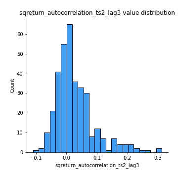
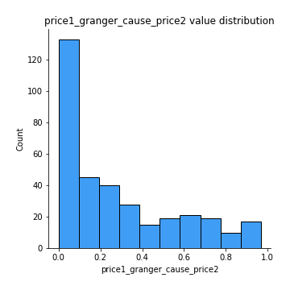

# Exploratory Data Analysis

[<< Go back](../README.md)
## Feature : target
- **Feature type** : categorical
- **Missing** : 0.0%
- **Unique** : 2
- **Count** :347
- **Unique** :2
- **Top** :simulated
- **Freq** :176

## Feature : return_mean1
- **Feature type** : continous
- **Missing** : 0.0%
- **Unique** : 347
- **Count** :347.0
- **Mean** :0.039170624313504966
- **Std** :0.07405499405232058
- **Min** :-0.17686457077756634
- **25%th Percentile** : -0.007001978989339228
- **50%th Percentile** : 0.03832144711887668
- **75%th Percentile** : 0.08477391215091004
- **Max** :0.3612366374600757

## Feature : return_mean2
- **Feature type** : continous
- **Missing** : 0.0%
- **Unique** : 347
- **Count** :347.0
- **Mean** :0.0704987496260403
- **Std** :0.09412742435571614
- **Min** :-0.24205418062825398
- **25%th Percentile** : 0.013786427041999168
- **50%th Percentile** : 0.06648790061648883
- **75%th Percentile** : 0.11907529230692102
- **Max** :0.4708006766366501

## Feature : return_sd1
- **Feature type** : continous
- **Missing** : 0.0%
- **Unique** : 347
- **Count** :347.0
- **Mean** :1.6482025742550384
- **Std** :0.5591259985235434
- **Min** :0.7470080772831957
- **25%th Percentile** : 1.4125378821043437
- **50%th Percentile** : 1.4815774764272955
- **75%th Percentile** : 1.6196561523264283
- **Max** :5.078944219768741

## Feature : return_sd2
- **Feature type** : continous
- **Missing** : 0.0%
- **Unique** : 347
- **Count** :347.0
- **Mean** :1.7412351714791032
- **Std** :0.7190768936106829
- **Min** :0.8455946193085045
- **25%th Percentile** : 1.4861596264984138
- **50%th Percentile** : 1.5721826033742017
- **75%th Percentile** : 1.6566685519975
- **Max** :6.737618636746393

## Feature : return_skew1
- **Feature type** : continous
- **Missing** : 0.0%
- **Unique** : 347
- **Count** :347.0
- **Mean** :-0.1120373625856531
- **Std** :0.5754177449446408
- **Min** :-3.530116233761814
- **25%th Percentile** : -0.24390955367294964
- **50%th Percentile** : -0.08625310180634935
- **75%th Percentile** : 0.06441856409712324
- **Max** :2.224942816365292

## Feature : return_skew2
- **Feature type** : continous
- **Missing** : 0.0%
- **Unique** : 347
- **Count** :347.0
- **Mean** :-0.19199989410982377
- **Std** :0.6514811107082353
- **Min** :-5.778144124281153
- **25%th Percentile** : -0.35844617336244256
- **50%th Percentile** : -0.12988354704203042
- **75%th Percentile** : 0.06662296017690236
- **Max** :2.2606839051517187

## Feature : return_kurtosis1
- **Feature type** : continous
- **Missing** : 0.0%
- **Unique** : 347
- **Count** :347.0
- **Mean** :3.185253242647051
- **Std** :5.53730813416053
- **Min** :-0.3925127322920372
- **25%th Percentile** : 0.23246501195231817
- **50%th Percentile** : 1.0056949824871668
- **75%th Percentile** : 3.562148308433014
- **Max** :35.56636016047202

## Feature : return_kurtosis2
- **Feature type** : continous
- **Missing** : 0.0%
- **Unique** : 347
- **Count** :347.0
- **Mean** :3.6745957890488086
- **Std** :6.709445862613707
- **Min** :-0.20234313669794846
- **25%th Percentile** : 0.4776574892550376
- **50%th Percentile** : 1.406021651694887
- **75%th Percentile** : 4.109234780795159
- **Max** :71.39844769176813

## Feature : return_autocorrelation_1_lag1
- **Feature type** : continous
- **Missing** : 0.0%
- **Unique** : 347
- **Count** :347.0
- **Mean** :-0.014282253613576665
- **Std** :0.056974865308504805
- **Min** :-0.20673896439036124
- **25%th Percentile** : -0.04353721868734553
- **50%th Percentile** : -0.011971656679722213
- **75%th Percentile** : 0.0254699810546377
- **Max** :0.12810656890648087

## Feature : return_autocorrelation_1_lag2
- **Feature type** : continous
- **Missing** : 0.0%
- **Unique** : 347
- **Count** :347.0
- **Mean** :-0.005559951925012395
- **Std** :0.049476256828603064
- **Min** :-0.13309283796645122
- **25%th Percentile** : -0.039360937079586183
- **50%th Percentile** : -0.004613866201947514
- **75%th Percentile** : 0.024694982767774154
- **Max** :0.1561488228015672

## Feature : return_autocorrelation_1_lag3
- **Feature type** : continous
- **Missing** : 0.0%
- **Unique** : 347
- **Count** :347.0
- **Mean** :-0.0017943282617842204
- **Std** :0.05044575036196592
- **Min** :-0.1940836867390813
- **25%th Percentile** : -0.03603476038698643
- **50%th Percentile** : -0.00019114321989891582
- **75%th Percentile** : 0.032544585331758476
- **Max** :0.17805869530681923

## Feature : return_autocorrelation_2_lag1
- **Feature type** : continous
- **Missing** : 0.0%
- **Unique** : 347
- **Count** :347.0
- **Mean** :-0.0014039748356398467
- **Std** :0.06406712106921411
- **Min** :-0.25075531010123286
- **25%th Percentile** : -0.03433560806340487
- **50%th Percentile** : 0.002150887043461021
- **75%th Percentile** : 0.03898133863726498
- **Max** :0.31863413537898483

## Feature : return_autocorrelation_2_lag2
- **Feature type** : continous
- **Missing** : 0.0%
- **Unique** : 347
- **Count** :347.0
- **Mean** :0.005195703294398661
- **Std** :0.053407908151876654
- **Min** :-0.1495113937562178
- **25%th Percentile** : -0.031863046304821493
- **50%th Percentile** : 0.0022635915712172997
- **75%th Percentile** : 0.044133194514677586
- **Max** :0.20974504043791217

## Feature : return_autocorrelation_2_lag3
- **Feature type** : continous
- **Missing** : 0.0%
- **Unique** : 347
- **Count** :347.0
- **Mean** :0.0025595126602653948
- **Std** :0.05205720027602634
- **Min** :-0.14200107169559698
- **25%th Percentile** : -0.03247079342851454
- **50%th Percentile** : 0.004628183672190703
- **75%th Percentile** : 0.03738461545623155
- **Max** :0.15597620805299045

## Feature : return_correlation_ts1_lag_0
- **Feature type** : continous
- **Missing** : 0.0%
- **Unique** : 347
- **Count** :347.0
- **Mean** :0.3054711626712279
- **Std** :0.10877572643083164
- **Min** :-0.027089510445801036
- **25%th Percentile** : 0.24951849781629182
- **50%th Percentile** : 0.29616573098378085
- **75%th Percentile** : 0.3428422988050751
- **Max** :0.7041861626832071

## Feature : return_correlation_ts1_lag_1
- **Feature type** : continous
- **Missing** : 0.0%
- **Unique** : 347
- **Count** :347.0
- **Mean** :-0.005905488571233592
- **Std** :0.04936595604407245
- **Min** :-0.1549695474991776
- **25%th Percentile** : -0.03888493995054957
- **50%th Percentile** : -2.377646402126443e-05
- **75%th Percentile** : 0.0283218852214168
- **Max** :0.15749757717677906

## Feature : return_correlation_ts1_lag_2
- **Feature type** : continous
- **Missing** : 0.0%
- **Unique** : 347
- **Count** :347.0
- **Mean** :-0.000329832811496109
- **Std** :0.04981172733961737
- **Min** :-0.13971501563212496
- **25%th Percentile** : -0.036790625651029335
- **50%th Percentile** : 0.0003906274123772696
- **75%th Percentile** : 0.034753742993893846
- **Max** :0.13102774284639881

## Feature : return_correlation_ts1_lag_3
- **Feature type** : continous
- **Missing** : 0.0%
- **Unique** : 347
- **Count** :347.0
- **Mean** :-0.00026823782695659625
- **Std** :0.04946864932487694
- **Min** :-0.1270218498974763
- **25%th Percentile** : -0.03283332360604757
- **50%th Percentile** : 0.0020580330729513805
- **75%th Percentile** : 0.03450664505736821
- **Max** :0.1422809271770942

## Feature : return_correlation_ts2_lag_1
- **Feature type** : continous
- **Missing** : 0.0%
- **Unique** : 347
- **Count** :347.0
- **Mean** :-0.0021124773506176462
- **Std** :0.05367455841265659
- **Min** :-0.2081139431093261
- **25%th Percentile** : -0.032475590436940836
- **50%th Percentile** : -0.001052307586426952
- **75%th Percentile** : 0.03084484924812364
- **Max** :0.17208763791364762

## Feature : return_correlation_ts2_lag_2
- **Feature type** : continous
- **Missing** : 0.0%
- **Unique** : 347
- **Count** :347.0
- **Mean** :-0.0016372925844738045
- **Std** :0.0502949206537231
- **Min** :-0.23751835475804678
- **25%th Percentile** : -0.03356387368397078
- **50%th Percentile** : -0.005117865914798468
- **75%th Percentile** : 0.028054091567226054
- **Max** :0.20772887392904255

## Feature : return_correlation_ts2_lag_3
- **Feature type** : continous
- **Missing** : 0.0%
- **Unique** : 347
- **Count** :347.0
- **Mean** :0.0002706953407955172
- **Std** :0.05254495762831936
- **Min** :-0.17564076057312866
- **25%th Percentile** : -0.02804165280235757
- **50%th Percentile** : 0.0005156439438987019
- **75%th Percentile** : 0.03414707921726661
- **Max** :0.12578577770423086

## Feature : sqreturn_autocorrelation_ts1_lag1
- **Feature type** : continous
- **Missing** : 0.0%
- **Unique** : 347
- **Count** :347.0
- **Mean** :0.05227561278802986
- **Std** :0.0945655434508663
- **Min** :-0.1068018786214887
- **25%th Percentile** : -0.010397753104626583
- **50%th Percentile** : 0.031476128277277214
- **75%th Percentile** : 0.08844330958355191
- **Max** :0.49414293176447355

## Feature : sqreturn_autocorrelation_ts1_lag2
- **Feature type** : continous
- **Missing** : 0.0%
- **Unique** : 347
- **Count** :347.0
- **Mean** :0.038518184785961744
- **Std** :0.09019604519889399
- **Min** :-0.13817351024639243
- **25%th Percentile** : -0.020135012088046397
- **50%th Percentile** : 0.018982108441692992
- **75%th Percentile** : 0.06771142380041774
- **Max** :0.4522162366773919

## Feature : sqreturn_autocorrelation_ts1_lag3
- **Feature type** : continous
- **Missing** : 0.0%
- **Unique** : 347
- **Count** :347.0
- **Mean** :0.03506040960974791
- **Std** :0.08307268378854206
- **Min** :-0.10942530988472504
- **25%th Percentile** : -0.015461309166702946
- **50%th Percentile** : 0.018392687991846495
- **75%th Percentile** : 0.06131780202652669
- **Max** :0.44755937369538146

## Feature : sqreturn_autocorrelation_ts2_lag1
- **Feature type** : continous
- **Missing** : 0.0%
- **Unique** : 347
- **Count** :347.0
- **Mean** :0.040810371696653386
- **Std** :0.0846373449523067
- **Min** :-0.11301900552863035
- **25%th Percentile** : -0.01848796816098236
- **50%th Percentile** : 0.018336854732589655
- **75%th Percentile** : 0.07464678766495364
- **Max** :0.3965571120415088

## Feature : sqreturn_autocorrelation_ts2_lag2
- **Feature type** : continous
- **Missing** : 0.0%
- **Unique** : 347
- **Count** :347.0
- **Mean** :0.03749788622559615
- **Std** :0.08702819805830733
- **Min** :-0.09868160671534071
- **25%th Percentile** : -0.01220271540775833
- **50%th Percentile** : 0.015185213759964006
- **75%th Percentile** : 0.05669096479429103
- **Max** :0.5373432415582473

## Feature : sqreturn_autocorrelation_ts2_lag3
- **Feature type** : continous
- **Missing** : 0.0%
- **Unique** : 347
- **Count** :347.0
- **Mean** :0.027356715503504034
- **Std** :0.06479968880431561
- **Min** :-0.10948170659098416
- **25%th Percentile** : -0.012862098721251623
- **50%th Percentile** : 0.012047049281430727
- **75%th Percentile** : 0.05405967681945993
- **Max** :0.31225727797735664

## Feature : sqreturn_correlation_ts1_lag_0
- **Feature type** : continous
- **Missing** : 0.0%
- **Unique** : 347
- **Count** :347.0
- **Mean** :0.3054711626712279
- **Std** :0.10877572643083164
- **Min** :-0.027089510445801036
- **25%th Percentile** : 0.24951849781629182
- **50%th Percentile** : 0.29616573098378085
- **75%th Percentile** : 0.3428422988050751
- **Max** :0.7041861626832071

## Feature : sqreturn_correlation_ts1_lag_1
- **Feature type** : continous
- **Missing** : 0.0%
- **Unique** : 347
- **Count** :347.0
- **Mean** :-0.005905488571233592
- **Std** :0.04936595604407245
- **Min** :-0.1549695474991776
- **25%th Percentile** : -0.03888493995054957
- **50%th Percentile** : -2.377646402126443e-05
- **75%th Percentile** : 0.0283218852214168
- **Max** :0.15749757717677906

## Feature : sqreturn_correlation_ts1_lag_2
- **Feature type** : continous
- **Missing** : 0.0%
- **Unique** : 347
- **Count** :347.0
- **Mean** :-0.000329832811496109
- **Std** :0.04981172733961737
- **Min** :-0.13971501563212496
- **25%th Percentile** : -0.036790625651029335
- **50%th Percentile** : 0.0003906274123772696
- **75%th Percentile** : 0.034753742993893846
- **Max** :0.13102774284639881

## Feature : sqreturn_correlation_ts1_lag_3
- **Feature type** : continous
- **Missing** : 0.0%
- **Unique** : 347
- **Count** :347.0
- **Mean** :-0.00026823782695659625
- **Std** :0.04946864932487694
- **Min** :-0.1270218498974763
- **25%th Percentile** : -0.03283332360604757
- **50%th Percentile** : 0.0020580330729513805
- **75%th Percentile** : 0.03450664505736821
- **Max** :0.1422809271770942

## Feature : sqreturn_correlation_ts2_lag_1
- **Feature type** : continous
- **Missing** : 0.0%
- **Unique** : 347
- **Count** :347.0
- **Mean** :-0.0021124773506176462
- **Std** :0.05367455841265659
- **Min** :-0.2081139431093261
- **25%th Percentile** : -0.032475590436940836
- **50%th Percentile** : -0.001052307586426952
- **75%th Percentile** : 0.03084484924812364
- **Max** :0.17208763791364762

## Feature : sqreturn_correlation_ts2_lag_2
- **Feature type** : continous
- **Missing** : 0.0%
- **Unique** : 347
- **Count** :347.0
- **Mean** :-0.0016372925844738045
- **Std** :0.0502949206537231
- **Min** :-0.23751835475804678
- **25%th Percentile** : -0.03356387368397078
- **50%th Percentile** : -0.005117865914798468
- **75%th Percentile** : 0.028054091567226054
- **Max** :0.20772887392904255

## Feature : sqreturn_correlation_ts2_lag_3
- **Feature type** : continous
- **Missing** : 0.0%
- **Unique** : 347
- **Count** :347.0
- **Mean** :0.0002706953407955172
- **Std** :0.05254495762831936
- **Min** :-0.17564076057312866
- **25%th Percentile** : -0.02804165280235757
- **50%th Percentile** : 0.0005156439438987019
- **75%th Percentile** : 0.03414707921726661
- **Max** :0.12578577770423086

## Feature : price2_granger_cause_price1
- **Feature type** : continous
- **Missing** : 0.0%
- **Unique** : 347
- **Count** :347.0
- **Mean** :0.2910863696505356
- **Std** :0.2903713573423262
- **Min** :1.1505642493585304e-05
- **25%th Percentile** : 0.037718610757932536
- **50%th Percentile** : 0.18335968001925124
- **75%th Percentile** : 0.5049964937766461
- **Max** :0.9943826780377498

## Feature : price1_granger_cause_price2
- **Feature type** : continous
- **Missing** : 0.0%
- **Unique** : 347
- **Count** :347.0
- **Mean** :0.27725822299367436
- **Std** :0.2820175764244179
- **Min** :4.44827061006428e-07
- **25%th Percentile** : 0.029531865331293785
- **50%th Percentile** : 0.18533161316691435
- **75%th Percentile** : 0.47310662636261336
- **Max** :0.9677499172353743

[<< Go back](../README.md)
