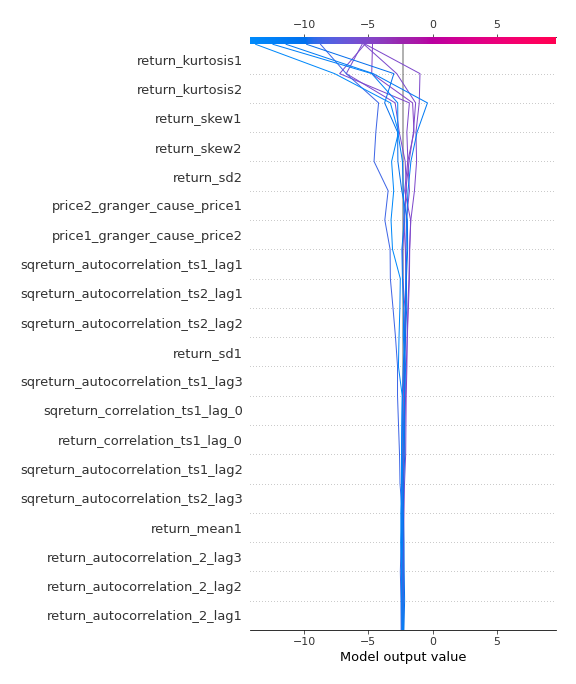

# Summary of 3_Linear

[<< Go back](../README.md)

## Logistic Regression (Linear)
- **n_jobs**: -1
- **explain_level**: 2

## Validation
 - **validation_type**: split
 - **train_ratio**: 0.75
 - **shuffle**: True
 - **stratify**: True

## Optimized metric
accuracy

## Training time

13.6 seconds

## Metric details
|           |    score |     threshold |
|:----------|---------:|--------------:|
| logloss   | 0.227377 | nan           |
| auc       | 1        | nan           |
| f1        | 1        |   0.774687    |
| accuracy  | 1        |   0.774687    |
| precision | 1        |   0.90455     |
| recall    | 1        |   9.45062e-07 |
| mcc       | 1        |   0.774687    |

## Confusion matrix (at threshold=0.774687)
|                      |   Predicted as real |   Predicted as simulated |
|:---------------------|--------------------:|-------------------------:|
| Labeled as real      |                  43 |                        0 |
| Labeled as simulated |                   0 |                       44 |

## Learning curves

## Coefficients
| feature                           |   Learner_1 |
|:----------------------------------|------------:|
| return_autocorrelation_2_lag3     |   0.705429  |
| return_autocorrelation_2_lag2     |   0.558602  |
| return_autocorrelation_2_lag1     |   0.480524  |
| return_correlation_ts1_lag_1      |   0.453741  |
| sqreturn_correlation_ts1_lag_1    |   0.453741  |
| sqreturn_correlation_ts1_lag_2    |   0.418593  |
| return_correlation_ts1_lag_2      |   0.418593  |
| return_autocorrelation_1_lag3     |   0.416188  |
| return_correlation_ts2_lag_3      |   0.414257  |
| sqreturn_correlation_ts2_lag_3    |   0.414257  |
| return_autocorrelation_1_lag1     |   0.282801  |
| return_mean2                      |   0.239713  |
| sqreturn_correlation_ts2_lag_1    |   0.178421  |
| return_correlation_ts2_lag_1      |   0.178421  |
| return_correlation_ts1_lag_3      |   0.165687  |
| sqreturn_correlation_ts1_lag_3    |   0.165687  |
| return_autocorrelation_1_lag2     |   0.160599  |
| sqreturn_correlation_ts2_lag_2    |   0.0397478 |
| return_correlation_ts2_lag_2      |   0.0397478 |
| return_sd1                        |  -0.127121  |
| return_skew2                      |  -0.249252  |
| return_correlation_ts1_lag_0      |  -0.407101  |
| sqreturn_correlation_ts1_lag_0    |  -0.407101  |
| return_sd2                        |  -0.431696  |
| return_skew1                      |  -0.469997  |
| intercept                         |  -0.506196  |
| price1_granger_cause_price2       |  -0.596502  |
| sqreturn_autocorrelation_ts2_lag3 |  -0.773028  |
| return_mean1                      |  -0.787258  |
| price2_granger_cause_price1       |  -0.831622  |
| sqreturn_autocorrelation_ts2_lag2 |  -1.13088   |
| sqreturn_autocorrelation_ts1_lag2 |  -1.19744   |
| sqreturn_autocorrelation_ts1_lag3 |  -1.21217   |
| sqreturn_autocorrelation_ts1_lag1 |  -1.56018   |
| sqreturn_autocorrelation_ts2_lag1 |  -1.60808   |
| return_kurtosis2                  |  -2.91356   |
| return_kurtosis1                  |  -3.71083   |

## Permutation-based Importance

## Confusion Matrix

## Normalized Confusion Matrix

## ROC Curve

## Kolmogorov-Smirnov Statistic

## Precision-Recall Curve

## Calibration Curve

## Cumulative Gains Curve

## Lift Curve

## SHAP Importance

## SHAP Dependence plots

### Dependence (Fold 1)

## SHAP Decision plots

### Top-10 Worst decisions for class 0 (Fold 1)

### Top-10 Best decisions for class 0 (Fold 1)

### Top-10 Worst decisions for class 1 (Fold 1)

### Top-10 Best decisions for class 1 (Fold 1)

[<< Go back](../README.md)
