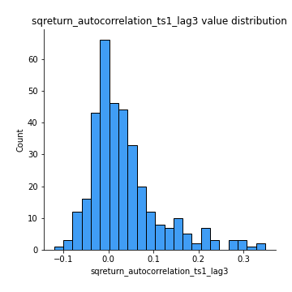
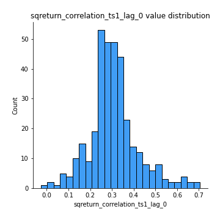

# Exploratory Data Analysis

[<< Go back](../README.md)
## Feature : target
- **Feature type** : categorical
- **Missing** : 0.0%
- **Unique** : 2
- **Count** :347
- **Unique** :2
- **Top** :simulated
- **Freq** :174

## Feature : return_mean1
- **Feature type** : continous
- **Missing** : 0.0%
- **Unique** : 347
- **Count** :347.0
- **Mean** :0.03544773344589547
- **Std** :0.07768464669946384
- **Min** :-0.22632637961920957
- **25%th Percentile** : -0.009879977098200645
- **50%th Percentile** : 0.034862449283564544
- **75%th Percentile** : 0.08165742054318986
- **Max** :0.37175100008111034

## Feature : return_mean2
- **Feature type** : continous
- **Missing** : 0.0%
- **Unique** : 347
- **Count** :347.0
- **Mean** :0.06526183952384985
- **Std** :0.09010412401239007
- **Min** :-0.24205418062825398
- **25%th Percentile** : 0.014744578387333491
- **50%th Percentile** : 0.06585557299881685
- **75%th Percentile** : 0.11864227453801435
- **Max** :0.31562159045349353

## Feature : return_sd1
- **Feature type** : continous
- **Missing** : 0.0%
- **Unique** : 347
- **Count** :347.0
- **Mean** :1.7279838989327607
- **Std** :0.7784603003420496
- **Min** :0.7470080772831957
- **25%th Percentile** : 1.4321612869725802
- **50%th Percentile** : 1.4974231754501894
- **75%th Percentile** : 1.7589567315754293
- **Max** :9.236766377527575

## Feature : return_sd2
- **Feature type** : continous
- **Missing** : 0.0%
- **Unique** : 347
- **Count** :347.0
- **Mean** :1.7598422598649601
- **Std** :0.6973514167142488
- **Min** :0.8455946193085045
- **25%th Percentile** : 1.5042822088103591
- **50%th Percentile** : 1.5769222871284665
- **75%th Percentile** : 1.7072911665072814
- **Max** :6.737618636746393

## Feature : return_skew1
- **Feature type** : continous
- **Missing** : 0.0%
- **Unique** : 347
- **Count** :347.0
- **Mean** :-0.11089189039769301
- **Std** :0.5530225112807763
- **Min** :-3.453087436558107
- **25%th Percentile** : -0.2413059685767543
- **50%th Percentile** : -0.06719365246190553
- **75%th Percentile** : 0.09481214978034869
- **Max** :2.224942816365292

## Feature : return_skew2
- **Feature type** : continous
- **Missing** : 0.0%
- **Unique** : 347
- **Count** :347.0
- **Mean** :-0.2581761105797186
- **Std** :0.8190207935466511
- **Min** :-8.801502855292393
- **25%th Percentile** : -0.391140125784484
- **50%th Percentile** : -0.15971818712437025
- **75%th Percentile** : 0.05402791366561153
- **Max** :2.2606839051517187

## Feature : return_kurtosis1
- **Feature type** : continous
- **Missing** : 0.0%
- **Unique** : 347
- **Count** :347.0
- **Mean** :3.3552156702159803
- **Std** :5.892880552321287
- **Min** :-0.328179402834309
- **25%th Percentile** : 0.30142789329184994
- **50%th Percentile** : 1.0149258344963719
- **75%th Percentile** : 3.749242555655367
- **Max** :46.07507808162177

## Feature : return_kurtosis2
- **Feature type** : continous
- **Missing** : 0.0%
- **Unique** : 347
- **Count** :347.0
- **Mean** :4.393168366403203
- **Std** :10.451247795253295
- **Min** :-0.18602598986320684
- **25%th Percentile** : 0.5896827045601605
- **50%th Percentile** : 1.5877959223219391
- **75%th Percentile** : 4.202853905029984
- **Max** :143.10871011533666

## Feature : return_autocorrelation_1_lag1
- **Feature type** : continous
- **Missing** : 0.0%
- **Unique** : 347
- **Count** :347.0
- **Mean** :-0.012889673880095685
- **Std** :0.0590107632357883
- **Min** :-0.2135576224968752
- **25%th Percentile** : -0.044977946825159744
- **50%th Percentile** : -0.004452624207810848
- **75%th Percentile** : 0.02673835877664958
- **Max** :0.1253959753011446

## Feature : return_autocorrelation_1_lag2
- **Feature type** : continous
- **Missing** : 0.0%
- **Unique** : 347
- **Count** :347.0
- **Mean** :-0.005034379981365023
- **Std** :0.049563014477085464
- **Min** :-0.13309283796645122
- **25%th Percentile** : -0.034469441877353874
- **50%th Percentile** : -0.0036118734350910806
- **75%th Percentile** : 0.025410306119737276
- **Max** :0.1561488228015672

## Feature : return_autocorrelation_1_lag3
- **Feature type** : continous
- **Missing** : 0.0%
- **Unique** : 347
- **Count** :347.0
- **Mean** :-0.006983201879576311
- **Std** :0.05350255171414779
- **Min** :-0.1940836867390813
- **25%th Percentile** : -0.04158184211813111
- **50%th Percentile** : -0.007334599639287443
- **75%th Percentile** : 0.03207207516078148
- **Max** :0.11811629559761012

## Feature : return_autocorrelation_2_lag1
- **Feature type** : continous
- **Missing** : 0.0%
- **Unique** : 347
- **Count** :347.0
- **Mean** :-0.003727873116652959
- **Std** :0.06175777549333458
- **Min** :-0.25075531010123286
- **25%th Percentile** : -0.03717205033523357
- **50%th Percentile** : -0.001662997965448667
- **75%th Percentile** : 0.035902640578618424
- **Max** :0.31863413537898483

## Feature : return_autocorrelation_2_lag2
- **Feature type** : continous
- **Missing** : 0.0%
- **Unique** : 347
- **Count** :347.0
- **Mean** :0.004890834261617645
- **Std** :0.05317887929572356
- **Min** :-0.1495113937562178
- **25%th Percentile** : -0.030804663745139536
- **50%th Percentile** : 0.0028038279794958304
- **75%th Percentile** : 0.04004216358392198
- **Max** :0.20974504043791217

## Feature : return_autocorrelation_2_lag3
- **Feature type** : continous
- **Missing** : 0.0%
- **Unique** : 347
- **Count** :347.0
- **Mean** :0.004402609237687218
- **Std** :0.05186138215550644
- **Min** :-0.13443887733932713
- **25%th Percentile** : -0.028469291325671407
- **50%th Percentile** : 0.005523131038672494
- **75%th Percentile** : 0.03844875498942221
- **Max** :0.15042212214113632

## Feature : return_correlation_ts1_lag_0
- **Feature type** : continous
- **Missing** : 0.0%
- **Unique** : 347
- **Count** :347.0
- **Mean** :0.3069487988165366
- **Std** :0.11259984151345462
- **Min** :-0.027089510445801036
- **25%th Percentile** : 0.24692670485123003
- **50%th Percentile** : 0.29658556961532184
- **75%th Percentile** : 0.3511709319616049
- **Max** :0.7041861626832071

## Feature : return_correlation_ts1_lag_1
- **Feature type** : continous
- **Missing** : 0.0%
- **Unique** : 347
- **Count** :347.0
- **Mean** :-0.00549576510182697
- **Std** :0.052244711581972754
- **Min** :-0.16985510949917193
- **25%th Percentile** : -0.034580738901607094
- **50%th Percentile** : -0.0011318157934189052
- **75%th Percentile** : 0.026107093068460464
- **Max** :0.15499424718508623

## Feature : return_correlation_ts1_lag_2
- **Feature type** : continous
- **Missing** : 0.0%
- **Unique** : 347
- **Count** :347.0
- **Mean** :0.005279013203629975
- **Std** :0.04988530459856451
- **Min** :-0.21653581047581763
- **25%th Percentile** : -0.028961997756611395
- **50%th Percentile** : 0.008568064207172188
- **75%th Percentile** : 0.03773963612999533
- **Max** :0.11499179321985104

## Feature : return_correlation_ts1_lag_3
- **Feature type** : continous
- **Missing** : 0.0%
- **Unique** : 347
- **Count** :347.0
- **Mean** :-0.0026704179784138395
- **Std** :0.051240380120741155
- **Min** :-0.1270218498974763
- **25%th Percentile** : -0.036836184590265726
- **50%th Percentile** : -0.002599980516246291
- **75%th Percentile** : 0.02928968501294081
- **Max** :0.1636773216468148

## Feature : return_correlation_ts2_lag_1
- **Feature type** : continous
- **Missing** : 0.0%
- **Unique** : 347
- **Count** :347.0
- **Mean** :-0.001861791988672174
- **Std** :0.05090700846714993
- **Min** :-0.20093919236581337
- **25%th Percentile** : -0.034852650297271526
- **50%th Percentile** : -0.002958628770774982
- **75%th Percentile** : 0.03374949322206093
- **Max** :0.17208763791364762

## Feature : return_correlation_ts2_lag_2
- **Feature type** : continous
- **Missing** : 0.0%
- **Unique** : 347
- **Count** :347.0
- **Mean** :0.002865218498136553
- **Std** :0.05206763036292373
- **Min** :-0.23751835475804678
- **25%th Percentile** : -0.031459943841869786
- **50%th Percentile** : 0.001968906833883752
- **75%th Percentile** : 0.03726397267793537
- **Max** :0.20772887392904255

## Feature : return_correlation_ts2_lag_3
- **Feature type** : continous
- **Missing** : 0.0%
- **Unique** : 347
- **Count** :347.0
- **Mean** :-0.0027080010384444783
- **Std** :0.053039362895376654
- **Min** :-0.17564076057312866
- **25%th Percentile** : -0.03229099764230446
- **50%th Percentile** : -0.0017294115570952687
- **75%th Percentile** : 0.03330300902328652
- **Max** :0.15522046227065336

## Feature : sqreturn_autocorrelation_ts1_lag1
- **Feature type** : continous
- **Missing** : 0.0%
- **Unique** : 347
- **Count** :347.0
- **Mean** :0.052714945052301926
- **Std** :0.09513704520230777
- **Min** :-0.09566172485615407
- **25%th Percentile** : -0.008712154779547118
- **50%th Percentile** : 0.031036793563965562
- **75%th Percentile** : 0.0896612286673539
- **Max** :0.49414293176447355

## Feature : sqreturn_autocorrelation_ts1_lag2
- **Feature type** : continous
- **Missing** : 0.0%
- **Unique** : 347
- **Count** :347.0
- **Mean** :0.04451785547605251
- **Std** :0.0909884380775463
- **Min** :-0.08768159708266728
- **25%th Percentile** : -0.012315862323712005
- **50%th Percentile** : 0.018957550448576548
- **75%th Percentile** : 0.06882733455802445
- **Max** :0.540735851444759

## Feature : sqreturn_autocorrelation_ts1_lag3
- **Feature type** : continous
- **Missing** : 0.0%
- **Unique** : 347
- **Count** :347.0
- **Mean** :0.03543470514129269
- **Std** :0.07880734202673842
- **Min** :-0.12048341934955392
- **25%th Percentile** : -0.01471065393532867
- **50%th Percentile** : 0.016339243560377376
- **75%th Percentile** : 0.059736875861246354
- **Max** :0.34857575772959026

## Feature : sqreturn_autocorrelation_ts2_lag1
- **Feature type** : continous
- **Missing** : 0.0%
- **Unique** : 347
- **Count** :347.0
- **Mean** :0.05063531114330769
- **Std** :0.09328389647489896
- **Min** :-0.09518235221579228
- **25%th Percentile** : -0.008347378150608223
- **50%th Percentile** : 0.024895402929074557
- **75%th Percentile** : 0.08636549865936932
- **Max** :0.510085647437958

## Feature : sqreturn_autocorrelation_ts2_lag2
- **Feature type** : continous
- **Missing** : 0.0%
- **Unique** : 347
- **Count** :347.0
- **Mean** :0.041379076953612606
- **Std** :0.09444630912538614
- **Min** :-0.08609650906086688
- **25%th Percentile** : -0.011927204961591546
- **50%th Percentile** : 0.01162085636483385
- **75%th Percentile** : 0.06063779802972487
- **Max** :0.5373432415582473

## Feature : sqreturn_autocorrelation_ts2_lag3
- **Feature type** : continous
- **Missing** : 0.0%
- **Unique** : 347
- **Count** :347.0
- **Mean** :0.03128135686825958
- **Std** :0.0718802232375071
- **Min** :-0.0990110704764471
- **25%th Percentile** : -0.014454716447228075
- **50%th Percentile** : 0.014989981973882637
- **75%th Percentile** : 0.06050301924390668
- **Max** :0.31225727797735664

## Feature : sqreturn_correlation_ts1_lag_0
- **Feature type** : continous
- **Missing** : 0.0%
- **Unique** : 347
- **Count** :347.0
- **Mean** :0.3069487988165366
- **Std** :0.11259984151345462
- **Min** :-0.027089510445801036
- **25%th Percentile** : 0.24692670485123003
- **50%th Percentile** : 0.29658556961532184
- **75%th Percentile** : 0.3511709319616049
- **Max** :0.7041861626832071

## Feature : sqreturn_correlation_ts1_lag_1
- **Feature type** : continous
- **Missing** : 0.0%
- **Unique** : 347
- **Count** :347.0
- **Mean** :-0.00549576510182697
- **Std** :0.052244711581972754
- **Min** :-0.16985510949917193
- **25%th Percentile** : -0.034580738901607094
- **50%th Percentile** : -0.0011318157934189052
- **75%th Percentile** : 0.026107093068460464
- **Max** :0.15499424718508623

## Feature : sqreturn_correlation_ts1_lag_2
- **Feature type** : continous
- **Missing** : 0.0%
- **Unique** : 347
- **Count** :347.0
- **Mean** :0.005279013203629975
- **Std** :0.04988530459856451
- **Min** :-0.21653581047581763
- **25%th Percentile** : -0.028961997756611395
- **50%th Percentile** : 0.008568064207172188
- **75%th Percentile** : 0.03773963612999533
- **Max** :0.11499179321985104

## Feature : sqreturn_correlation_ts1_lag_3
- **Feature type** : continous
- **Missing** : 0.0%
- **Unique** : 347
- **Count** :347.0
- **Mean** :-0.0026704179784138395
- **Std** :0.051240380120741155
- **Min** :-0.1270218498974763
- **25%th Percentile** : -0.036836184590265726
- **50%th Percentile** : -0.002599980516246291
- **75%th Percentile** : 0.02928968501294081
- **Max** :0.1636773216468148

## Feature : sqreturn_correlation_ts2_lag_1
- **Feature type** : continous
- **Missing** : 0.0%
- **Unique** : 347
- **Count** :347.0
- **Mean** :-0.001861791988672174
- **Std** :0.05090700846714993
- **Min** :-0.20093919236581337
- **25%th Percentile** : -0.034852650297271526
- **50%th Percentile** : -0.002958628770774982
- **75%th Percentile** : 0.03374949322206093
- **Max** :0.17208763791364762

## Feature : sqreturn_correlation_ts2_lag_2
- **Feature type** : continous
- **Missing** : 0.0%
- **Unique** : 347
- **Count** :347.0
- **Mean** :0.002865218498136553
- **Std** :0.05206763036292373
- **Min** :-0.23751835475804678
- **25%th Percentile** : -0.031459943841869786
- **50%th Percentile** : 0.001968906833883752
- **75%th Percentile** : 0.03726397267793537
- **Max** :0.20772887392904255

## Feature : sqreturn_correlation_ts2_lag_3
- **Feature type** : continous
- **Missing** : 0.0%
- **Unique** : 347
- **Count** :347.0
- **Mean** :-0.0027080010384444783
- **Std** :0.053039362895376654
- **Min** :-0.17564076057312866
- **25%th Percentile** : -0.03229099764230446
- **50%th Percentile** : -0.0017294115570952687
- **75%th Percentile** : 0.03330300902328652
- **Max** :0.15522046227065336

## Feature : price2_granger_cause_price1
- **Feature type** : continous
- **Missing** : 0.0%
- **Unique** : 347
- **Count** :347.0
- **Mean** :0.30995381851815323
- **Std** :0.2920877144398601
- **Min** :5.354740615196124e-09
- **25%th Percentile** : 0.04556041183974428
- **50%th Percentile** : 0.23323694517697294
- **75%th Percentile** : 0.547108826188331
- **Max** :0.9955377756641165

## Feature : price1_granger_cause_price2
- **Feature type** : continous
- **Missing** : 0.0%
- **Unique** : 347
- **Count** :347.0
- **Mean** :0.2676480820026481
- **Std** :0.2794058445402911
- **Min** :6.294720621945972e-07
- **25%th Percentile** : 0.027433728779494508
- **50%th Percentile** : 0.15232669950412062
- **75%th Percentile** : 0.43047011401652213
- **Max** :0.9951398266867577

[<< Go back](../README.md)
