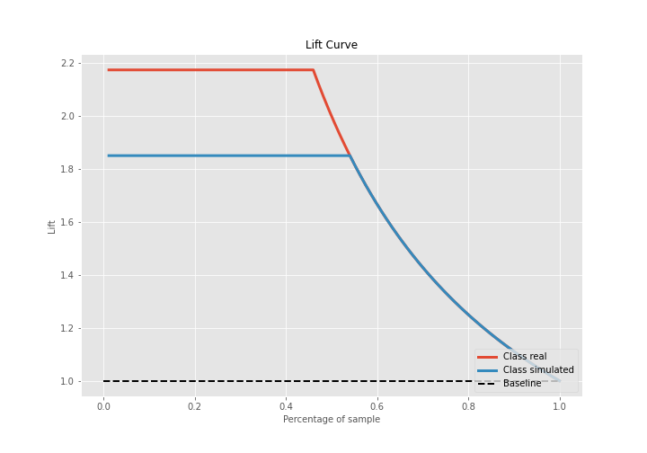

# Summary of 3_Linear

[<< Go back](../README.md)

## Logistic Regression (Linear)
- **n_jobs**: -1
- **explain_level**: 2

## Validation
 - **validation_type**: split
 - **train_ratio**: 0.75
 - **shuffle**: True
 - **stratify**: True

## Optimized metric
accuracy

## Training time

8.2 seconds

## Metric details
|           |    score |     threshold |
|:----------|---------:|--------------:|
| logloss   | 0.107306 | nan           |
| auc       | 1        | nan           |
| f1        | 1        |   0.735438    |
| accuracy  | 1        |   0.735438    |
| precision | 1        |   0.735438    |
| recall    | 1        |   2.89024e-47 |
| mcc       | 1        |   0.735438    |

## Confusion matrix (at threshold=0.735438)
|                      |   Predicted as real |   Predicted as simulated |
|:---------------------|--------------------:|-------------------------:|
| Labeled as real      |                  40 |                        0 |
| Labeled as simulated |                   0 |                       47 |

## Learning curves

## Coefficients
| feature                           |   Learner_1 |
|:----------------------------------|------------:|
| return_skew2                      |  0.53594    |
| return_skew1                      |  0.416073   |
| return_autocorrelation_2_lag1     |  0.380593   |
| sqreturn_correlation_ts1_lag_0    |  0.378146   |
| return_correlation_ts1_lag_0      |  0.378146   |
| return_correlation_ts1_lag_1      |  0.345871   |
| sqreturn_correlation_ts1_lag_1    |  0.345871   |
| return_autocorrelation_1_lag2     |  0.337068   |
| sqreturn_correlation_ts1_lag_2    |  0.199946   |
| return_correlation_ts1_lag_2      |  0.199946   |
| return_autocorrelation_2_lag3     |  0.187647   |
| return_autocorrelation_2_lag2     |  0.178074   |
| return_correlation_ts2_lag_1      |  0.166422   |
| sqreturn_correlation_ts2_lag_1    |  0.166422   |
| sqreturn_correlation_ts2_lag_3    |  0.145639   |
| return_correlation_ts2_lag_3      |  0.145639   |
| return_autocorrelation_1_lag3     |  0.06404    |
| return_autocorrelation_1_lag1     |  0.0410526  |
| sqreturn_correlation_ts1_lag_3    |  0.0234769  |
| return_correlation_ts1_lag_3      |  0.0234769  |
| return_sd1                        |  0.0200778  |
| sqreturn_correlation_ts2_lag_2    |  0.00749259 |
| return_correlation_ts2_lag_2      |  0.00749259 |
| return_mean1                      | -0.158955   |
| price2_granger_cause_price1       | -0.228245   |
| return_mean2                      | -0.3361     |
| return_sd2                        | -0.452681   |
| sqreturn_autocorrelation_ts2_lag3 | -0.474255   |
| sqreturn_autocorrelation_ts1_lag3 | -0.613192   |
| price1_granger_cause_price2       | -0.683925   |
| sqreturn_autocorrelation_ts1_lag1 | -0.791855   |
| sqreturn_autocorrelation_ts1_lag2 | -0.819341   |
| sqreturn_autocorrelation_ts2_lag2 | -0.819386   |
| sqreturn_autocorrelation_ts2_lag1 | -0.95216    |
| intercept                         | -1.75877    |
| return_kurtosis1                  | -3.77959    |
| return_kurtosis2                  | -4.08985    |

## Permutation-based Importance

## Confusion Matrix

## Normalized Confusion Matrix

## ROC Curve

## Kolmogorov-Smirnov Statistic

## Precision-Recall Curve

## Calibration Curve

## Cumulative Gains Curve

## Lift Curve

## SHAP Importance

## SHAP Dependence plots

### Dependence (Fold 1)

## SHAP Decision plots

### Top-10 Worst decisions for class 0 (Fold 1)

### Top-10 Best decisions for class 0 (Fold 1)

### Top-10 Worst decisions for class 1 (Fold 1)

### Top-10 Best decisions for class 1 (Fold 1)

[<< Go back](../README.md)
