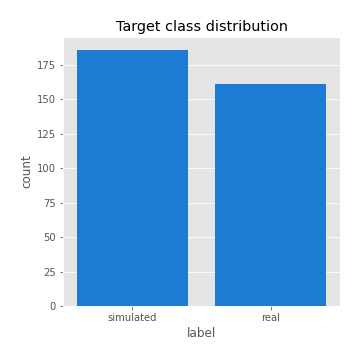

# Exploratory Data Analysis

[<< Go back](../README.md)
## Feature : target
- **Feature type** : categorical
- **Missing** : 0.0%
- **Unique** : 2
- **Count** :347
- **Unique** :2
- **Top** :simulated
- **Freq** :186

## Feature : return_mean1
- **Feature type** : continous
- **Missing** : 0.0%
- **Unique** : 347
- **Count** :347.0
- **Mean** :0.05635576104455448
- **Std** :0.07516182690920342
- **Min** :-0.1930018597415429
- **25%th Percentile** : 0.008033536825844134
- **50%th Percentile** : 0.0568732209979489
- **75%th Percentile** : 0.09380646687985109
- **Max** :0.37175100008111034

## Feature : return_mean2
- **Feature type** : continous
- **Missing** : 0.0%
- **Unique** : 347
- **Count** :347.0
- **Mean** :0.05061363474906791
- **Std** :0.08307577359036855
- **Min** :-0.24205418062825398
- **25%th Percentile** : 0.0064001162569059245
- **50%th Percentile** : 0.05043533829418879
- **75%th Percentile** : 0.09830437531237539
- **Max** :0.36147811969989946

## Feature : return_sd1
- **Feature type** : continous
- **Missing** : 0.0%
- **Unique** : 347
- **Count** :347.0
- **Mean** :1.737315516204393
- **Std** :0.6146541386955038
- **Min** :0.7470080772831957
- **25%th Percentile** : 1.5341511144888744
- **50%th Percentile** : 1.5931341987122585
- **75%th Percentile** : 1.6901149012764136
- **Max** :6.495661311240861

## Feature : return_sd2
- **Feature type** : continous
- **Missing** : 0.0%
- **Unique** : 347
- **Count** :347.0
- **Mean** :1.7196658524834163
- **Std** :0.6284582008730781
- **Min** :0.8592887433004143
- **25%th Percentile** : 1.509657913308907
- **50%th Percentile** : 1.5850560785597516
- **75%th Percentile** : 1.6640719128807284
- **Max** :5.762808157208253

## Feature : return_skew1
- **Feature type** : continous
- **Missing** : 0.0%
- **Unique** : 347
- **Count** :347.0
- **Mean** :-0.06617629188237668
- **Std** :0.5755125572362546
- **Min** :-2.817259764925239
- **25%th Percentile** : -0.1588215048834925
- **50%th Percentile** : 0.001091616646387888
- **75%th Percentile** : 0.1054879401413493
- **Max** :2.5845963767725557

## Feature : return_skew2
- **Feature type** : continous
- **Missing** : 0.0%
- **Unique** : 347
- **Count** :347.0
- **Mean** :-0.15254775049210373
- **Std** :0.7541541319758313
- **Min** :-8.801502855292393
- **25%th Percentile** : -0.19906045320091953
- **50%th Percentile** : -0.03993386143857272
- **75%th Percentile** : 0.09275624369165066
- **Max** :2.123597625075353

## Feature : return_kurtosis1
- **Feature type** : continous
- **Missing** : 0.0%
- **Unique** : 347
- **Count** :347.0
- **Mean** :2.952983078591154
- **Std** :5.77372706959829
- **Min** :-0.483700712272213
- **25%th Percentile** : -0.04112978371754039
- **50%th Percentile** : 0.31969569267142184
- **75%th Percentile** : 3.435368886158079
- **Max** :36.91113889081053

## Feature : return_kurtosis2
- **Feature type** : continous
- **Missing** : 0.0%
- **Unique** : 347
- **Count** :347.0
- **Mean** :3.480423783444595
- **Std** :9.523322587256365
- **Min** :-0.5863441061282137
- **25%th Percentile** : -0.03471141982358339
- **50%th Percentile** : 0.36769403132652334
- **75%th Percentile** : 3.6906339757515925
- **Max** :143.10871011533666

## Feature : return_autocorrelation_1_lag1
- **Feature type** : continous
- **Missing** : 0.0%
- **Unique** : 347
- **Count** :347.0
- **Mean** :-0.010570303868969197
- **Std** :0.05705085450306907
- **Min** :-0.2135576224968752
- **25%th Percentile** : -0.03820376140393684
- **50%th Percentile** : -0.006962298067446652
- **75%th Percentile** : 0.02396676082817756
- **Max** :0.12810656890648087

## Feature : return_autocorrelation_1_lag2
- **Feature type** : continous
- **Missing** : 0.0%
- **Unique** : 347
- **Count** :347.0
- **Mean** :-0.004510705614730641
- **Std** :0.04837443692508695
- **Min** :-0.13309283796645122
- **25%th Percentile** : -0.032961878436975005
- **50%th Percentile** : -0.000718108052826065
- **75%th Percentile** : 0.027281821399759265
- **Max** :0.1561488228015672

## Feature : return_autocorrelation_1_lag3
- **Feature type** : continous
- **Missing** : 0.0%
- **Unique** : 347
- **Count** :347.0
- **Mean** :-0.002330873090691726
- **Std** :0.050128169064186316
- **Min** :-0.1940836867390813
- **25%th Percentile** : -0.03250145176774556
- **50%th Percentile** : -0.0017615378322392349
- **75%th Percentile** : 0.03271038647523086
- **Max** :0.17805869530681923

## Feature : return_autocorrelation_2_lag1
- **Feature type** : continous
- **Missing** : 0.0%
- **Unique** : 347
- **Count** :347.0
- **Mean** :-0.008045557617621633
- **Std** :0.05941699154948833
- **Min** :-0.25075531010123286
- **25%th Percentile** : -0.040920181329551115
- **50%th Percentile** : -0.004244349898502408
- **75%th Percentile** : 0.029109118859212614
- **Max** :0.16349871797309318

## Feature : return_autocorrelation_2_lag2
- **Feature type** : continous
- **Missing** : 0.0%
- **Unique** : 347
- **Count** :347.0
- **Mean** :-0.00010652151751240923
- **Std** :0.048182721759920576
- **Min** :-0.15323211089747296
- **25%th Percentile** : -0.03454064866234576
- **50%th Percentile** : 0.0019331227939847727
- **75%th Percentile** : 0.03325426609247556
- **Max** :0.1735398560230086

## Feature : return_autocorrelation_2_lag3
- **Feature type** : continous
- **Missing** : 0.0%
- **Unique** : 347
- **Count** :347.0
- **Mean** :-0.002032566059660377
- **Std** :0.050789754714402585
- **Min** :-0.14200107169559698
- **25%th Percentile** : -0.03593827451176228
- **50%th Percentile** : -0.0022308581044827446
- **75%th Percentile** : 0.030544116644726605
- **Max** :0.1419999376914021

## Feature : return_correlation_ts1_lag_0
- **Feature type** : continous
- **Missing** : 0.0%
- **Unique** : 347
- **Count** :347.0
- **Mean** :0.31818241801448205
- **Std** :0.10235860214870596
- **Min** :-0.027089510445801036
- **25%th Percentile** : 0.2713757224069483
- **50%th Percentile** : 0.3238884355944386
- **75%th Percentile** : 0.36133187526056587
- **Max** :0.7041861626832071

## Feature : return_correlation_ts1_lag_1
- **Feature type** : continous
- **Missing** : 0.0%
- **Unique** : 347
- **Count** :347.0
- **Mean** :-0.005218778672053988
- **Std** :0.050111012887815824
- **Min** :-0.16985510949917193
- **25%th Percentile** : -0.03859252904504129
- **50%th Percentile** : -0.0006259714753227789
- **75%th Percentile** : 0.029870091634511625
- **Max** :0.12960691972966043

## Feature : return_correlation_ts1_lag_2
- **Feature type** : continous
- **Missing** : 0.0%
- **Unique** : 347
- **Count** :347.0
- **Mean** :-0.0008667979428602006
- **Std** :0.04744280086080357
- **Min** :-0.21653581047581763
- **25%th Percentile** : -0.03175523893056423
- **50%th Percentile** : -0.001004791782248194
- **75%th Percentile** : 0.03048829761303816
- **Max** :0.11861795580509923

## Feature : return_correlation_ts1_lag_3
- **Feature type** : continous
- **Missing** : 0.0%
- **Unique** : 347
- **Count** :347.0
- **Mean** :-0.004686315197375331
- **Std** :0.05052128619051554
- **Min** :-0.1270218498974763
- **25%th Percentile** : -0.038462501944745056
- **50%th Percentile** : -0.005735475235618273
- **75%th Percentile** : 0.027354175138670236
- **Max** :0.1636773216468148

## Feature : return_correlation_ts2_lag_1
- **Feature type** : continous
- **Missing** : 0.0%
- **Unique** : 347
- **Count** :347.0
- **Mean** :-0.005750942958128409
- **Std** :0.053854987861614176
- **Min** :-0.20093919236581337
- **25%th Percentile** : -0.039885662243578375
- **50%th Percentile** : -0.0050514227174079055
- **75%th Percentile** : 0.027555978003296996
- **Max** :0.17208763791364762

## Feature : return_correlation_ts2_lag_2
- **Feature type** : continous
- **Missing** : 0.0%
- **Unique** : 347
- **Count** :347.0
- **Mean** :0.0003356815393280742
- **Std** :0.048169991039120036
- **Min** :-0.11701735111763815
- **25%th Percentile** : -0.03413429748451838
- **50%th Percentile** : -0.0013413305181120834
- **75%th Percentile** : 0.028926093934968564
- **Max** :0.20772887392904255

## Feature : return_correlation_ts2_lag_3
- **Feature type** : continous
- **Missing** : 0.0%
- **Unique** : 347
- **Count** :347.0
- **Mean** :-0.0021403570637452914
- **Std** :0.050194516872261105
- **Min** :-0.17564076057312866
- **25%th Percentile** : -0.02957116378760643
- **50%th Percentile** : -0.001108457986129126
- **75%th Percentile** : 0.029106144892349348
- **Max** :0.12578577770423086

## Feature : sqreturn_autocorrelation_ts1_lag1
- **Feature type** : continous
- **Missing** : 0.0%
- **Unique** : 347
- **Count** :347.0
- **Mean** :0.046971506504824866
- **Std** :0.09454870262941689
- **Min** :-0.10141416854117147
- **25%th Percentile** : -0.014258279675734696
- **50%th Percentile** : 0.023296313677273948
- **75%th Percentile** : 0.0812339197509683
- **Max** :0.49414293176447355

## Feature : sqreturn_autocorrelation_ts1_lag2
- **Feature type** : continous
- **Missing** : 0.0%
- **Unique** : 347
- **Count** :347.0
- **Mean** :0.039044192915313164
- **Std** :0.08806149907548076
- **Min** :-0.10729264058249874
- **25%th Percentile** : -0.012911427157991172
- **50%th Percentile** : 0.016168145832983278
- **75%th Percentile** : 0.06162844291661693
- **Max** :0.4522162366773919

## Feature : sqreturn_autocorrelation_ts1_lag3
- **Feature type** : continous
- **Missing** : 0.0%
- **Unique** : 347
- **Count** :347.0
- **Mean** :0.03307360350760042
- **Std** :0.08013268010840267
- **Min** :-0.11085448771695075
- **25%th Percentile** : -0.014879619092732346
- **50%th Percentile** : 0.012885014751173963
- **75%th Percentile** : 0.06287863715573361
- **Max** :0.41030914918857014

## Feature : sqreturn_autocorrelation_ts2_lag1
- **Feature type** : continous
- **Missing** : 0.0%
- **Unique** : 347
- **Count** :347.0
- **Mean** :0.04630681312432128
- **Std** :0.08758110373849118
- **Min** :-0.1191762919370213
- **25%th Percentile** : -0.012510610281620205
- **50%th Percentile** : 0.025695549370206412
- **75%th Percentile** : 0.08384687394187884
- **Max** :0.510085647437958

## Feature : sqreturn_autocorrelation_ts2_lag2
- **Feature type** : continous
- **Missing** : 0.0%
- **Unique** : 347
- **Count** :347.0
- **Mean** :0.03229442760767265
- **Std** :0.08579440285527845
- **Min** :-0.1050172002939048
- **25%th Percentile** : -0.01407956838833602
- **50%th Percentile** : 0.012367098888812732
- **75%th Percentile** : 0.05238871162005769
- **Max** :0.45676817892778204

## Feature : sqreturn_autocorrelation_ts2_lag3
- **Feature type** : continous
- **Missing** : 0.0%
- **Unique** : 347
- **Count** :347.0
- **Mean** :0.02740530403947594
- **Std** :0.06743533516565456
- **Min** :-0.10444417463332259
- **25%th Percentile** : -0.010336681709548368
- **50%th Percentile** : 0.016228865068354584
- **75%th Percentile** : 0.05150704743604415
- **Max** :0.31225727797735664

## Feature : sqreturn_correlation_ts1_lag_0
- **Feature type** : continous
- **Missing** : 0.0%
- **Unique** : 347
- **Count** :347.0
- **Mean** :0.31818241801448205
- **Std** :0.10235860214870596
- **Min** :-0.027089510445801036
- **25%th Percentile** : 0.2713757224069483
- **50%th Percentile** : 0.3238884355944386
- **75%th Percentile** : 0.36133187526056587
- **Max** :0.7041861626832071

## Feature : sqreturn_correlation_ts1_lag_1
- **Feature type** : continous
- **Missing** : 0.0%
- **Unique** : 347
- **Count** :347.0
- **Mean** :-0.005218778672053988
- **Std** :0.050111012887815824
- **Min** :-0.16985510949917193
- **25%th Percentile** : -0.03859252904504129
- **50%th Percentile** : -0.0006259714753227789
- **75%th Percentile** : 0.029870091634511625
- **Max** :0.12960691972966043

## Feature : sqreturn_correlation_ts1_lag_2
- **Feature type** : continous
- **Missing** : 0.0%
- **Unique** : 347
- **Count** :347.0
- **Mean** :-0.0008667979428602006
- **Std** :0.04744280086080357
- **Min** :-0.21653581047581763
- **25%th Percentile** : -0.03175523893056423
- **50%th Percentile** : -0.001004791782248194
- **75%th Percentile** : 0.03048829761303816
- **Max** :0.11861795580509923

## Feature : sqreturn_correlation_ts1_lag_3
- **Feature type** : continous
- **Missing** : 0.0%
- **Unique** : 347
- **Count** :347.0
- **Mean** :-0.004686315197375331
- **Std** :0.05052128619051554
- **Min** :-0.1270218498974763
- **25%th Percentile** : -0.038462501944745056
- **50%th Percentile** : -0.005735475235618273
- **75%th Percentile** : 0.027354175138670236
- **Max** :0.1636773216468148

## Feature : sqreturn_correlation_ts2_lag_1
- **Feature type** : continous
- **Missing** : 0.0%
- **Unique** : 347
- **Count** :347.0
- **Mean** :-0.005750942958128409
- **Std** :0.053854987861614176
- **Min** :-0.20093919236581337
- **25%th Percentile** : -0.039885662243578375
- **50%th Percentile** : -0.0050514227174079055
- **75%th Percentile** : 0.027555978003296996
- **Max** :0.17208763791364762

## Feature : sqreturn_correlation_ts2_lag_2
- **Feature type** : continous
- **Missing** : 0.0%
- **Unique** : 347
- **Count** :347.0
- **Mean** :0.0003356815393280742
- **Std** :0.048169991039120036
- **Min** :-0.11701735111763815
- **25%th Percentile** : -0.03413429748451838
- **50%th Percentile** : -0.0013413305181120834
- **75%th Percentile** : 0.028926093934968564
- **Max** :0.20772887392904255

## Feature : sqreturn_correlation_ts2_lag_3
- **Feature type** : continous
- **Missing** : 0.0%
- **Unique** : 347
- **Count** :347.0
- **Mean** :-0.0021403570637452914
- **Std** :0.050194516872261105
- **Min** :-0.17564076057312866
- **25%th Percentile** : -0.02957116378760643
- **50%th Percentile** : -0.001108457986129126
- **75%th Percentile** : 0.029106144892349348
- **Max** :0.12578577770423086

## Feature : price2_granger_cause_price1
- **Feature type** : continous
- **Missing** : 0.0%
- **Unique** : 347
- **Count** :347.0
- **Mean** :0.3470100824699618
- **Std** :0.31078340049044434
- **Min** :5.719657502581017e-06
- **25%th Percentile** : 0.07199053785284307
- **50%th Percentile** : 0.26358753498480336
- **75%th Percentile** : 0.6033825151130545
- **Max** :0.9887758595098678

## Feature : price1_granger_cause_price2
- **Feature type** : continous
- **Missing** : 0.0%
- **Unique** : 347
- **Count** :347.0
- **Mean** :0.27228830451078906
- **Std** :0.28402056053932984
- **Min** :1.0531759497764631e-07
- **25%th Percentile** : 0.025572147001830674
- **50%th Percentile** : 0.17417696288252046
- **75%th Percentile** : 0.44861238188921587
- **Max** :0.9954814735448558

[<< Go back](../README.md)
