# Exploratory Data Analysis

[<< Go back](../README.md)
## Feature : target
- **Feature type** : categorical
- **Missing** : 0.0%
- **Unique** : 2
- **Count** :347
- **Unique** :2
- **Top** :simulated
- **Freq** :176

## Feature : return_mean1
- **Feature type** : continous
- **Missing** : 0.0%
- **Unique** : 347
- **Count** :347.0
- **Mean** :0.03202789552226643
- **Std** :0.07910508234155815
- **Min** :-0.22632637961920957
- **25%th Percentile** : -0.018791267369337256
- **50%th Percentile** : 0.025513131251678253
- **75%th Percentile** : 0.07836916302786953
- **Max** :0.37175100008111034

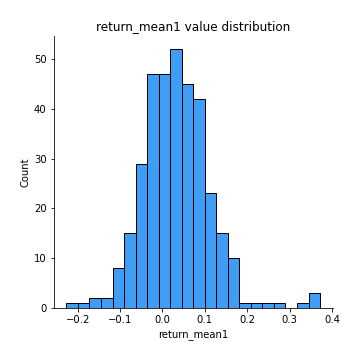
## Feature : return_mean2
- **Feature type** : continous
- **Missing** : 0.0%
- **Unique** : 347
- **Count** :347.0
- **Mean** :0.07035753748187576
- **Std** :0.08902776748366105
- **Min** :-0.2516051924035027
- **25%th Percentile** : 0.01830804806792799
- **50%th Percentile** : 0.06450892532930146
- **75%th Percentile** : 0.12033772543802997
- **Max** :0.37616608147096464

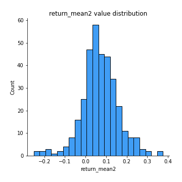
## Feature : return_sd1
- **Feature type** : continous
- **Missing** : 0.0%
- **Unique** : 347
- **Count** :347.0
- **Mean** :1.7356719163026197
- **Std** :0.7879591402810853
- **Min** :0.7470080772831957
- **25%th Percentile** : 1.4384699969806962
- **50%th Percentile** : 1.5045834949577637
- **75%th Percentile** : 1.6902017658202082
- **Max** :9.236766377527575

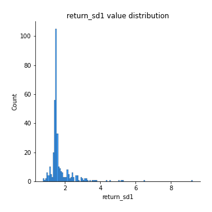
## Feature : return_sd2
- **Feature type** : continous
- **Missing** : 0.0%
- **Unique** : 347
- **Count** :347.0
- **Mean** :1.7727698032321204
- **Std** :0.7278396507600459
- **Min** :0.8455946193085045
- **25%th Percentile** : 1.4930846765505879
- **50%th Percentile** : 1.582204744485816
- **75%th Percentile** : 1.7073250869632168
- **Max** :5.872800253666788

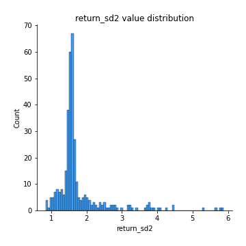
## Feature : return_skew1
- **Feature type** : continous
- **Missing** : 0.0%
- **Unique** : 347
- **Count** :347.0
- **Mean** :-0.11733422593432079
- **Std** :0.6139063710607668
- **Min** :-3.530116233761814
- **25%th Percentile** : -0.2110072555070332
- **50%th Percentile** : -0.06882929303847328
- **75%th Percentile** : 0.060799760680161574
- **Max** :2.224942816365292

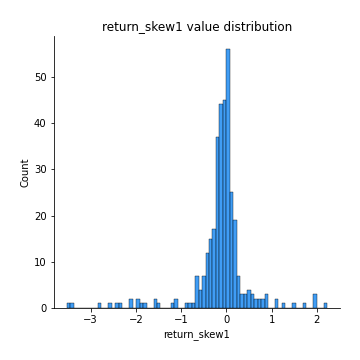
## Feature : return_skew2
- **Feature type** : continous
- **Missing** : 0.0%
- **Unique** : 347
- **Count** :347.0
- **Mean** :-0.20986455151335293
- **Std** :0.7797785858141636
- **Min** :-8.801502855292393
- **25%th Percentile** : -0.3442481381839364
- **50%th Percentile** : -0.12678668429161355
- **75%th Percentile** : 0.057676287011391755
- **Max** :2.2606839051517187

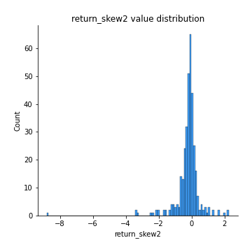
## Feature : return_kurtosis1
- **Feature type** : continous
- **Missing** : 0.0%
- **Unique** : 347
- **Count** :347.0
- **Mean** :3.3230817000418873
- **Std** :5.9210485580682395
- **Min** :-0.3523872071108931
- **25%th Percentile** : 0.26171767352690267
- **50%th Percentile** : 1.014754129978479
- **75%th Percentile** : 3.691025264972352
- **Max** :46.07507808162177

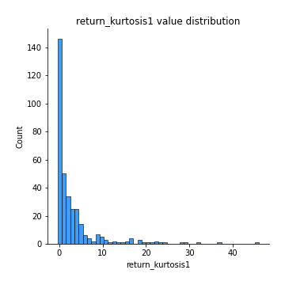
## Feature : return_kurtosis2
- **Feature type** : continous
- **Missing** : 0.0%
- **Unique** : 347
- **Count** :347.0
- **Mean** :4.105369854170076
- **Std** :9.762360182553858
- **Min** :-0.40172062343389836
- **25%th Percentile** : 0.5234061272337514
- **50%th Percentile** : 1.4601274279393972
- **75%th Percentile** : 4.295570012119786
- **Max** :143.10871011533666

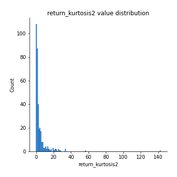
## Feature : return_autocorrelation_1_lag1
- **Feature type** : continous
- **Missing** : 0.0%
- **Unique** : 347
- **Count** :347.0
- **Mean** :-0.011666984551961761
- **Std** :0.05911057367754399
- **Min** :-0.2135576224968752
- **25%th Percentile** : -0.04292448833340019
- **50%th Percentile** : -0.0073825539194493014
- **75%th Percentile** : 0.02855317565855968
- **Max** :0.12810656890648087

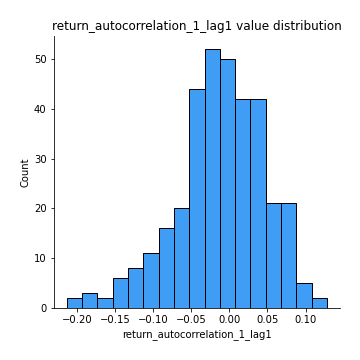
## Feature : return_autocorrelation_1_lag2
- **Feature type** : continous
- **Missing** : 0.0%
- **Unique** : 347
- **Count** :347.0
- **Mean** :-0.005956663506041055
- **Std** :0.05032996021747275
- **Min** :-0.13309283796645122
- **25%th Percentile** : -0.041186297292437626
- **50%th Percentile** : -0.0016392323698294076
- **75%th Percentile** : 0.024864407121807767
- **Max** :0.1778624348306249

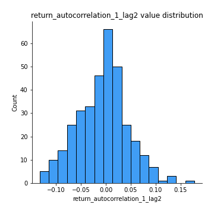
## Feature : return_autocorrelation_1_lag3
- **Feature type** : continous
- **Missing** : 0.0%
- **Unique** : 347
- **Count** :347.0
- **Mean** :-0.0026534533551171705
- **Std** :0.053221083842771154
- **Min** :-0.1940836867390813
- **25%th Percentile** : -0.0341963426924458
- **50%th Percentile** : -0.001593208013365921
- **75%th Percentile** : 0.032839587194001034
- **Max** :0.17805869530681923

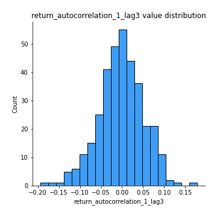
## Feature : return_autocorrelation_2_lag1
- **Feature type** : continous
- **Missing** : 0.0%
- **Unique** : 347
- **Count** :347.0
- **Mean** :-0.003260977844349114
- **Std** :0.06164293065244505
- **Min** :-0.25075531010123286
- **25%th Percentile** : -0.03576166612990589
- **50%th Percentile** : -0.0004795251342804986
- **75%th Percentile** : 0.03356239020198433
- **Max** :0.13762480506008778

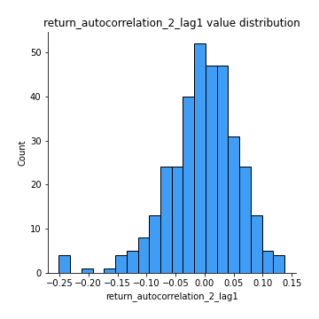
## Feature : return_autocorrelation_2_lag2
- **Feature type** : continous
- **Missing** : 0.0%
- **Unique** : 347
- **Count** :347.0
- **Mean** :0.003676798066364751
- **Std** :0.050392377622652765
- **Min** :-0.15323211089747296
- **25%th Percentile** : -0.030026568016001235
- **50%th Percentile** : 0.002444656428730167
- **75%th Percentile** : 0.041015056169489285
- **Max** :0.1735398560230086

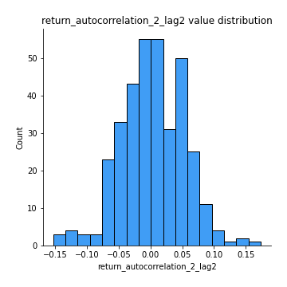
## Feature : return_autocorrelation_2_lag3
- **Feature type** : continous
- **Missing** : 0.0%
- **Unique** : 347
- **Count** :347.0
- **Mean** :0.005312368446844461
- **Std** :0.05152122113361228
- **Min** :-0.14200107169559698
- **25%th Percentile** : -0.02564854048001698
- **50%th Percentile** : 0.0092437926627617
- **75%th Percentile** : 0.0407792306883787
- **Max** :0.14571730978148142

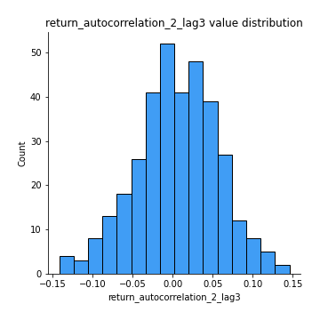
## Feature : return_correlation_ts1_lag_0
- **Feature type** : continous
- **Missing** : 0.0%
- **Unique** : 347
- **Count** :347.0
- **Mean** :0.3064698053273577
- **Std** :0.10782590728005209
- **Min** :-0.027089510445801036
- **25%th Percentile** : 0.2500049835242254
- **50%th Percentile** : 0.2963321275628612
- **75%th Percentile** : 0.3450253264887999
- **Max** :0.7041861626832071

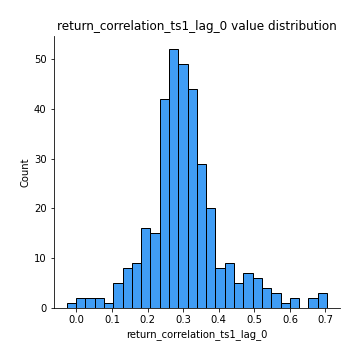
## Feature : return_correlation_ts1_lag_1
- **Feature type** : continous
- **Missing** : 0.0%
- **Unique** : 347
- **Count** :347.0
- **Mean** :-0.002675819052840782
- **Std** :0.05247198678643585
- **Min** :-0.16985510949917193
- **25%th Percentile** : -0.03565258930094107
- **50%th Percentile** : 0.0011096356333715502
- **75%th Percentile** : 0.03261274443423553
- **Max** :0.15499424718508623

## Feature : return_correlation_ts1_lag_2
- **Feature type** : continous
- **Missing** : 0.0%
- **Unique** : 347
- **Count** :347.0
- **Mean** :0.000710648856505842
- **Std** :0.048081728689321944
- **Min** :-0.21653581047581763
- **25%th Percentile** : -0.030638587409870372
- **50%th Percentile** : 0.0009685707217309875
- **75%th Percentile** : 0.03627746212719883
- **Max** :0.12180372320242254

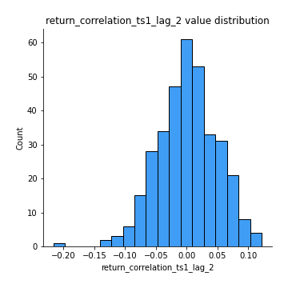
## Feature : return_correlation_ts1_lag_3
- **Feature type** : continous
- **Missing** : 0.0%
- **Unique** : 347
- **Count** :347.0
- **Mean** :0.0036221019558037005
- **Std** :0.05195224780553072
- **Min** :-0.11734645857939675
- **25%th Percentile** : -0.028754613539899092
- **50%th Percentile** : -0.0006178324084716741
- **75%th Percentile** : 0.038060047436892896
- **Max** :0.1636773216468148

## Feature : return_correlation_ts2_lag_1
- **Feature type** : continous
- **Missing** : 0.0%
- **Unique** : 347
- **Count** :347.0
- **Mean** :-0.002356638611592911
- **Std** :0.053355259465568565
- **Min** :-0.2081139431093261
- **25%th Percentile** : -0.03585596546558539
- **50%th Percentile** : -0.001052307586426952
- **75%th Percentile** : 0.032327838997630115
- **Max** :0.17208763791364762

## Feature : return_correlation_ts2_lag_2
- **Feature type** : continous
- **Missing** : 0.0%
- **Unique** : 347
- **Count** :347.0
- **Mean** :0.00040605114858142797
- **Std** :0.05113855560031977
- **Min** :-0.23751835475804678
- **25%th Percentile** : -0.03180978845060051
- **50%th Percentile** : 0.0005662334383626382
- **75%th Percentile** : 0.02872654917551673
- **Max** :0.15388933426238696

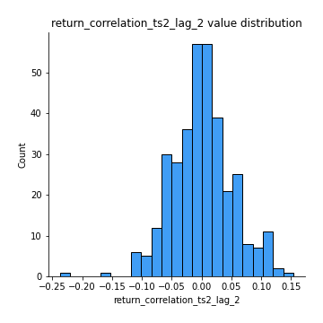
## Feature : return_correlation_ts2_lag_3
- **Feature type** : continous
- **Missing** : 0.0%
- **Unique** : 347
- **Count** :347.0
- **Mean** :-0.00025303461322343364
- **Std** :0.05162063140564778
- **Min** :-0.16212823605110202
- **25%th Percentile** : -0.02872653279325199
- **50%th Percentile** : -0.0002316253774281378
- **75%th Percentile** : 0.035111823984616645
- **Max** :0.12578577770423086

## Feature : sqreturn_autocorrelation_ts1_lag1
- **Feature type** : continous
- **Missing** : 0.0%
- **Unique** : 347
- **Count** :347.0
- **Mean** :0.05314754968696557
- **Std** :0.0942078239757876
- **Min** :-0.1155272957079628
- **25%th Percentile** : -0.01147184631656953
- **50%th Percentile** : 0.032426304125376636
- **75%th Percentile** : 0.09001093732457743
- **Max** :0.49414293176447355

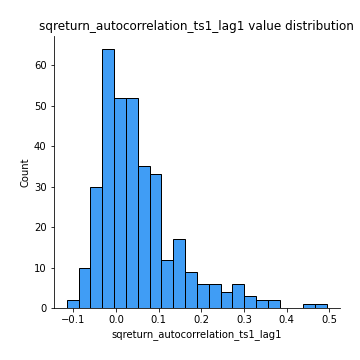
## Feature : sqreturn_autocorrelation_ts1_lag2
- **Feature type** : continous
- **Missing** : 0.0%
- **Unique** : 347
- **Count** :347.0
- **Mean** :0.045142600500766836
- **Std** :0.09661717784766687
- **Min** :-0.11063189470250204
- **25%th Percentile** : -0.014632300885674663
- **50%th Percentile** : 0.018077164594460543
- **75%th Percentile** : 0.07648251546634834
- **Max** :0.540735851444759

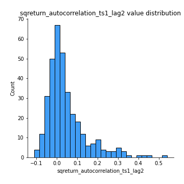
## Feature : sqreturn_autocorrelation_ts1_lag3
- **Feature type** : continous
- **Missing** : 0.0%
- **Unique** : 347
- **Count** :347.0
- **Mean** :0.03826977557703681
- **Std** :0.08122550545926822
- **Min** :-0.08082378514713917
- **25%th Percentile** : -0.01267049784006858
- **50%th Percentile** : 0.020164079132724833
- **75%th Percentile** : 0.06242700024181937
- **Max** :0.44755937369538146

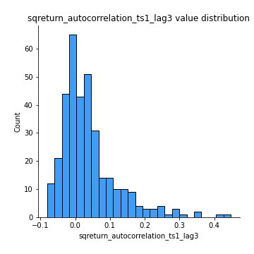
## Feature : sqreturn_autocorrelation_ts2_lag1
- **Feature type** : continous
- **Missing** : 0.0%
- **Unique** : 347
- **Count** :347.0
- **Mean** :0.046036893623870485
- **Std** :0.08551646235164909
- **Min** :-0.115775962588086
- **25%th Percentile** : -0.011311460483683991
- **50%th Percentile** : 0.024836299384200157
- **75%th Percentile** : 0.07906324276411658
- **Max** :0.4190090519891419

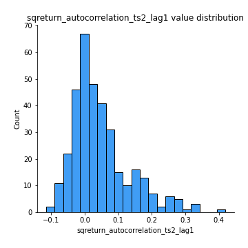
## Feature : sqreturn_autocorrelation_ts2_lag2
- **Feature type** : continous
- **Missing** : 0.0%
- **Unique** : 347
- **Count** :347.0
- **Mean** :0.03614073345081329
- **Std** :0.08728803844250746
- **Min** :-0.08458088896676853
- **25%th Percentile** : -0.012510386998323852
- **50%th Percentile** : 0.012367098888812732
- **75%th Percentile** : 0.05408360618052854
- **Max** :0.5373432415582473

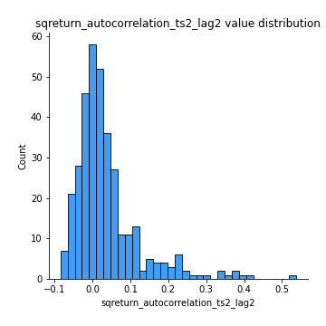
## Feature : sqreturn_autocorrelation_ts2_lag3
- **Feature type** : continous
- **Missing** : 0.0%
- **Unique** : 347
- **Count** :347.0
- **Mean** :0.028695355071948037
- **Std** :0.0700146070873236
- **Min** :-0.09413311885027795
- **25%th Percentile** : -0.014074876632344168
- **50%th Percentile** : 0.012047049281430727
- **75%th Percentile** : 0.057500940416318896
- **Max** :0.30256115637327263

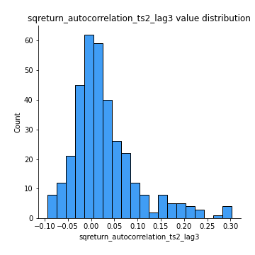
## Feature : sqreturn_correlation_ts1_lag_0
- **Feature type** : continous
- **Missing** : 0.0%
- **Unique** : 347
- **Count** :347.0
- **Mean** :0.3064698053273577
- **Std** :0.10782590728005209
- **Min** :-0.027089510445801036
- **25%th Percentile** : 0.2500049835242254
- **50%th Percentile** : 0.2963321275628612
- **75%th Percentile** : 0.3450253264887999
- **Max** :0.7041861626832071

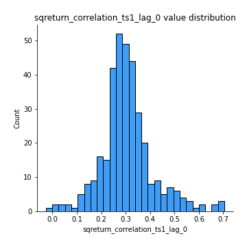
## Feature : sqreturn_correlation_ts1_lag_1
- **Feature type** : continous
- **Missing** : 0.0%
- **Unique** : 347
- **Count** :347.0
- **Mean** :-0.002675819052840782
- **Std** :0.05247198678643585
- **Min** :-0.16985510949917193
- **25%th Percentile** : -0.03565258930094107
- **50%th Percentile** : 0.0011096356333715502
- **75%th Percentile** : 0.03261274443423553
- **Max** :0.15499424718508623

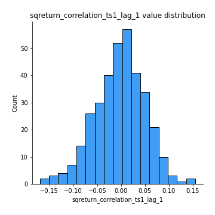
## Feature : sqreturn_correlation_ts1_lag_2
- **Feature type** : continous
- **Missing** : 0.0%
- **Unique** : 347
- **Count** :347.0
- **Mean** :0.000710648856505842
- **Std** :0.048081728689321944
- **Min** :-0.21653581047581763
- **25%th Percentile** : -0.030638587409870372
- **50%th Percentile** : 0.0009685707217309875
- **75%th Percentile** : 0.03627746212719883
- **Max** :0.12180372320242254

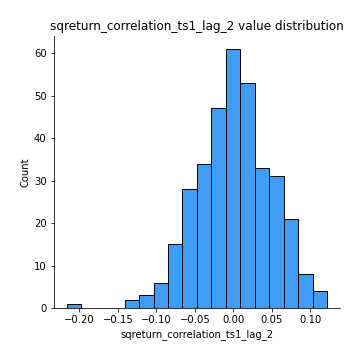
## Feature : sqreturn_correlation_ts1_lag_3
- **Feature type** : continous
- **Missing** : 0.0%
- **Unique** : 347
- **Count** :347.0
- **Mean** :0.0036221019558037005
- **Std** :0.05195224780553072
- **Min** :-0.11734645857939675
- **25%th Percentile** : -0.028754613539899092
- **50%th Percentile** : -0.0006178324084716741
- **75%th Percentile** : 0.038060047436892896
- **Max** :0.1636773216468148

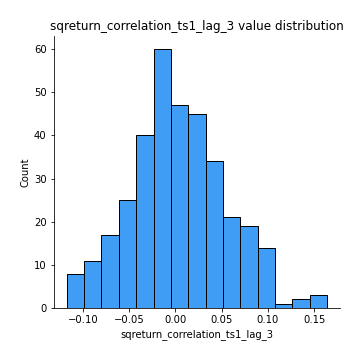
## Feature : sqreturn_correlation_ts2_lag_1
- **Feature type** : continous
- **Missing** : 0.0%
- **Unique** : 347
- **Count** :347.0
- **Mean** :-0.002356638611592911
- **Std** :0.053355259465568565
- **Min** :-0.2081139431093261
- **25%th Percentile** : -0.03585596546558539
- **50%th Percentile** : -0.001052307586426952
- **75%th Percentile** : 0.032327838997630115
- **Max** :0.17208763791364762

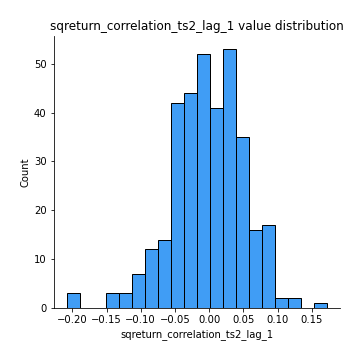
## Feature : sqreturn_correlation_ts2_lag_2
- **Feature type** : continous
- **Missing** : 0.0%
- **Unique** : 347
- **Count** :347.0
- **Mean** :0.00040605114858142797
- **Std** :0.05113855560031977
- **Min** :-0.23751835475804678
- **25%th Percentile** : -0.03180978845060051
- **50%th Percentile** : 0.0005662334383626382
- **75%th Percentile** : 0.02872654917551673
- **Max** :0.15388933426238696

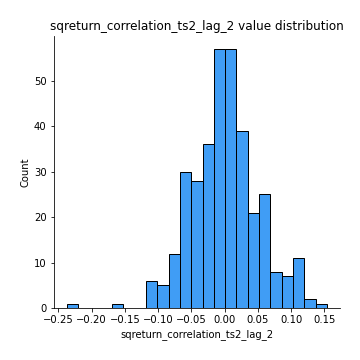
## Feature : sqreturn_correlation_ts2_lag_3
- **Feature type** : continous
- **Missing** : 0.0%
- **Unique** : 347
- **Count** :347.0
- **Mean** :-0.00025303461322343364
- **Std** :0.05162063140564778
- **Min** :-0.16212823605110202
- **25%th Percentile** : -0.02872653279325199
- **50%th Percentile** : -0.0002316253774281378
- **75%th Percentile** : 0.035111823984616645
- **Max** :0.12578577770423086

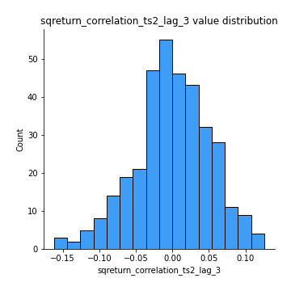
## Feature : price2_granger_cause_price1
- **Feature type** : continous
- **Missing** : 0.0%
- **Unique** : 347
- **Count** :347.0
- **Mean** :0.2972427422183368
- **Std** :0.28764063597277884
- **Min** :6.413548263080965e-06
- **25%th Percentile** : 0.047461951070672845
- **50%th Percentile** : 0.20440009298604248
- **75%th Percentile** : 0.4854620566424673
- **Max** :0.9998680695893446

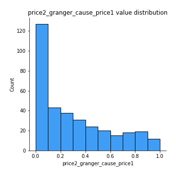
## Feature : price1_granger_cause_price2
- **Feature type** : continous
- **Missing** : 0.0%
- **Unique** : 347
- **Count** :347.0
- **Mean** :0.26947585794131995
- **Std** :0.2865766652651169
- **Min** :6.420974498395298e-10
- **25%th Percentile** : 0.02291359601202022
- **50%th Percentile** : 0.15737929693347602
- **75%th Percentile** : 0.4631070145700711
- **Max** :0.9980822184716812

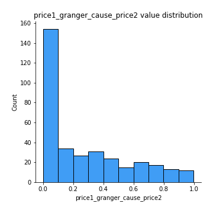

[<< Go back](../README.md)
