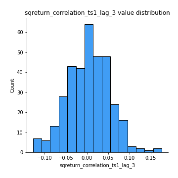

# Exploratory Data Analysis

[<< Go back](../README.md)
## Feature : target
- **Feature type** : categorical
- **Missing** : 0.0%
- **Unique** : 2
- **Count** :347
- **Unique** :2
- **Top** :real
- **Freq** :177

## Feature : return_mean1
- **Feature type** : continous
- **Missing** : 0.0%
- **Unique** : 347
- **Count** :347.0
- **Mean** :0.03543860140789474
- **Std** :0.08137042937375312
- **Min** :-0.20500473906700983
- **25%th Percentile** : -0.013924400240191787
- **50%th Percentile** : 0.03512638441177084
- **75%th Percentile** : 0.08650359470758355
- **Max** :0.37175100008111034

## Feature : return_mean2
- **Feature type** : continous
- **Missing** : 0.0%
- **Unique** : 347
- **Count** :347.0
- **Mean** :0.07517844671991133
- **Std** :0.09431290138112755
- **Min** :-0.24205418062825398
- **25%th Percentile** : 0.02143196410809339
- **50%th Percentile** : 0.06972618230753845
- **75%th Percentile** : 0.1267591129139678
- **Max** :0.5838674234477581

## Feature : return_sd1
- **Feature type** : continous
- **Missing** : 0.0%
- **Unique** : 347
- **Count** :347.0
- **Mean** :1.7151083407614391
- **Std** :0.676425232679658
- **Min** :0.7470080772831957
- **25%th Percentile** : 1.4312074968616824
- **50%th Percentile** : 1.5044452940480004
- **75%th Percentile** : 1.7459242451306416
- **Max** :6.495661311240861

## Feature : return_sd2
- **Feature type** : continous
- **Missing** : 0.0%
- **Unique** : 347
- **Count** :347.0
- **Mean** :1.7691310111066612
- **Std** :0.7546719511084236
- **Min** :0.8592887433004143
- **25%th Percentile** : 1.4918699097474648
- **50%th Percentile** : 1.5780856270576782
- **75%th Percentile** : 1.7047310331918188
- **Max** :6.737618636746393

## Feature : return_skew1
- **Feature type** : continous
- **Missing** : 0.0%
- **Unique** : 347
- **Count** :347.0
- **Mean** :-0.11225703655041258
- **Std** :0.6072778496500846
- **Min** :-3.453087436558107
- **25%th Percentile** : -0.2513719565835248
- **50%th Percentile** : -0.052437498262135465
- **75%th Percentile** : 0.09375290754216004
- **Max** :1.989411030028313

## Feature : return_skew2
- **Feature type** : continous
- **Missing** : 0.0%
- **Unique** : 347
- **Count** :347.0
- **Mean** :-0.23352854288533906
- **Std** :0.8555452767875469
- **Min** :-8.801502855292393
- **25%th Percentile** : -0.3720418096007826
- **50%th Percentile** : -0.11040167030031589
- **75%th Percentile** : 0.062489560786201395
- **Max** :2.2606839051517187

## Feature : return_kurtosis1
- **Feature type** : continous
- **Missing** : 0.0%
- **Unique** : 347
- **Count** :347.0
- **Mean** :3.5761668334867647
- **Std** :6.243944183469399
- **Min** :-0.34046238825004416
- **25%th Percentile** : 0.24676882773990716
- **50%th Percentile** : 1.1288324810375587
- **75%th Percentile** : 3.991611060155577
- **Max** :46.07507808162177

## Feature : return_kurtosis2
- **Feature type** : continous
- **Missing** : 0.0%
- **Unique** : 347
- **Count** :347.0
- **Mean** :4.636802371580972
- **Std** :10.573117324237153
- **Min** :-0.41057281041693683
- **25%th Percentile** : 0.5513486607167464
- **50%th Percentile** : 1.5914483760950007
- **75%th Percentile** : 4.456855491007622
- **Max** :143.10871011533666

## Feature : return_autocorrelation_1_lag1
- **Feature type** : continous
- **Missing** : 0.0%
- **Unique** : 347
- **Count** :347.0
- **Mean** :-0.013007328097437048
- **Std** :0.05756040821174093
- **Min** :-0.19339575314049967
- **25%th Percentile** : -0.053108854508201214
- **50%th Percentile** : -0.010914393888152778
- **75%th Percentile** : 0.02694564560777373
- **Max** :0.13198745570521786

## Feature : return_autocorrelation_1_lag2
- **Feature type** : continous
- **Missing** : 0.0%
- **Unique** : 347
- **Count** :347.0
- **Mean** :-0.005298888401763309
- **Std** :0.04948708306696367
- **Min** :-0.13309283796645122
- **25%th Percentile** : -0.03638694914060567
- **50%th Percentile** : -0.004305628690606851
- **75%th Percentile** : 0.027702296421171023
- **Max** :0.1561488228015672

## Feature : return_autocorrelation_1_lag3
- **Feature type** : continous
- **Missing** : 0.0%
- **Unique** : 347
- **Count** :347.0
- **Mean** :-0.0020126880303512782
- **Std** :0.04975708414968049
- **Min** :-0.1940836867390813
- **25%th Percentile** : -0.03578904619782322
- **50%th Percentile** : 0.0020896376647244782
- **75%th Percentile** : 0.032882636020726136
- **Max** :0.11215986102540969

## Feature : return_autocorrelation_2_lag1
- **Feature type** : continous
- **Missing** : 0.0%
- **Unique** : 347
- **Count** :347.0
- **Mean** :-0.004216855489371566
- **Std** :0.06335724471113022
- **Min** :-0.25075531010123286
- **25%th Percentile** : -0.03577896071272001
- **50%th Percentile** : -0.0013947385982922458
- **75%th Percentile** : 0.03400010153851564
- **Max** :0.31863413537898483

## Feature : return_autocorrelation_2_lag2
- **Feature type** : continous
- **Missing** : 0.0%
- **Unique** : 347
- **Count** :347.0
- **Mean** :0.004420110921381028
- **Std** :0.05278137935417466
- **Min** :-0.15323211089747296
- **25%th Percentile** : -0.03157731268115359
- **50%th Percentile** : 0.00315947754301092
- **75%th Percentile** : 0.039580633440837634
- **Max** :0.20974504043791217

## Feature : return_autocorrelation_2_lag3
- **Feature type** : continous
- **Missing** : 0.0%
- **Unique** : 347
- **Count** :347.0
- **Mean** :0.004493218590466851
- **Std** :0.053183590213445826
- **Min** :-0.14200107169559698
- **25%th Percentile** : -0.028665656923889983
- **50%th Percentile** : 0.0026790259892069254
- **75%th Percentile** : 0.04206559232354458
- **Max** :0.145099084287787

## Feature : return_correlation_ts1_lag_0
- **Feature type** : continous
- **Missing** : 0.0%
- **Unique** : 347
- **Count** :347.0
- **Mean** :0.3050477700359099
- **Std** :0.11377121782404498
- **Min** :-0.027089510445801036
- **25%th Percentile** : 0.24730953156965255
- **50%th Percentile** : 0.2973427284557105
- **75%th Percentile** : 0.35106444139101783
- **Max** :0.7041861626832071

## Feature : return_correlation_ts1_lag_1
- **Feature type** : continous
- **Missing** : 0.0%
- **Unique** : 347
- **Count** :347.0
- **Mean** :-0.009296030262556043
- **Std** :0.048691752037250714
- **Min** :-0.15776193292681923
- **25%th Percentile** : -0.041934420083965404
- **50%th Percentile** : -0.005958164787541664
- **75%th Percentile** : 0.025721730532968362
- **Max** :0.11819480385322509

## Feature : return_correlation_ts1_lag_2
- **Feature type** : continous
- **Missing** : 0.0%
- **Unique** : 347
- **Count** :347.0
- **Mean** :0.005676980404944126
- **Std** :0.04956699997451165
- **Min** :-0.12864410180561703
- **25%th Percentile** : -0.026745004656599777
- **50%th Percentile** : 0.0050422785329039205
- **75%th Percentile** : 0.04350111471880348
- **Max** :0.15209042929185754

## Feature : return_correlation_ts1_lag_3
- **Feature type** : continous
- **Missing** : 0.0%
- **Unique** : 347
- **Count** :347.0
- **Mean** :0.0035694294155963814
- **Std** :0.049917764012300574
- **Min** :-0.1270218498974763
- **25%th Percentile** : -0.032578241395189056
- **50%th Percentile** : 0.003921815907259988
- **75%th Percentile** : 0.03865469722679933
- **Max** :0.17575711043821599

## Feature : return_correlation_ts2_lag_1
- **Feature type** : continous
- **Missing** : 0.0%
- **Unique** : 347
- **Count** :347.0
- **Mean** :-0.004113867808194345
- **Std** :0.05136508503434503
- **Min** :-0.2081139431093261
- **25%th Percentile** : -0.03218074863945558
- **50%th Percentile** : -0.0033906540814499808
- **75%th Percentile** : 0.02968870872527293
- **Max** :0.1331092442052982

## Feature : return_correlation_ts2_lag_2
- **Feature type** : continous
- **Missing** : 0.0%
- **Unique** : 347
- **Count** :347.0
- **Mean** :-0.00037517654074288527
- **Std** :0.051683945137382586
- **Min** :-0.23751835475804678
- **25%th Percentile** : -0.03343717468634956
- **50%th Percentile** : -0.0013623985224785144
- **75%th Percentile** : 0.032948349866513835
- **Max** :0.20772887392904255

## Feature : return_correlation_ts2_lag_3
- **Feature type** : continous
- **Missing** : 0.0%
- **Unique** : 347
- **Count** :347.0
- **Mean** :0.0015973304362559716
- **Std** :0.05297176618261616
- **Min** :-0.17564076057312866
- **25%th Percentile** : -0.02749695159837097
- **50%th Percentile** : -0.0013378052253093752
- **75%th Percentile** : 0.03683976004909825
- **Max** :0.14208732628906512

## Feature : sqreturn_autocorrelation_ts1_lag1
- **Feature type** : continous
- **Missing** : 0.0%
- **Unique** : 347
- **Count** :347.0
- **Mean** :0.04859197850186792
- **Std** :0.09581207205466291
- **Min** :-0.09369430299568332
- **25%th Percentile** : -0.01647262233136229
- **50%th Percentile** : 0.0270981841524645
- **75%th Percentile** : 0.0831240285742545
- **Max** :0.49414293176447355

## Feature : sqreturn_autocorrelation_ts1_lag2
- **Feature type** : continous
- **Missing** : 0.0%
- **Unique** : 347
- **Count** :347.0
- **Mean** :0.042403370519845454
- **Std** :0.09417617121175685
- **Min** :-0.10351375087338544
- **25%th Percentile** : -0.014244237093736038
- **50%th Percentile** : 0.01586082820943277
- **75%th Percentile** : 0.06885043713053814
- **Max** :0.540735851444759

## Feature : sqreturn_autocorrelation_ts1_lag3
- **Feature type** : continous
- **Missing** : 0.0%
- **Unique** : 347
- **Count** :347.0
- **Mean** :0.03643356893667254
- **Std** :0.0807537861970938
- **Min** :-0.10041259756521378
- **25%th Percentile** : -0.013805652456440502
- **50%th Percentile** : 0.016526855465192614
- **75%th Percentile** : 0.06204027372995234
- **Max** :0.44755937369538146

## Feature : sqreturn_autocorrelation_ts2_lag1
- **Feature type** : continous
- **Missing** : 0.0%
- **Unique** : 347
- **Count** :347.0
- **Mean** :0.049441123906216834
- **Std** :0.08989145935919898
- **Min** :-0.08520586663750691
- **25%th Percentile** : -0.008930105185937242
- **50%th Percentile** : 0.02527293529662947
- **75%th Percentile** : 0.07464678766495364
- **Max** :0.510085647437958

## Feature : sqreturn_autocorrelation_ts2_lag2
- **Feature type** : continous
- **Missing** : 0.0%
- **Unique** : 347
- **Count** :347.0
- **Mean** :0.03850073012051232
- **Std** :0.0928824105460345
- **Min** :-0.09052048638041285
- **25%th Percentile** : -0.016143465228128664
- **50%th Percentile** : 0.01174909354472212
- **75%th Percentile** : 0.057620366262740315
- **Max** :0.5373432415582473

## Feature : sqreturn_autocorrelation_ts2_lag3
- **Feature type** : continous
- **Missing** : 0.0%
- **Unique** : 347
- **Count** :347.0
- **Mean** :0.030163652112295363
- **Std** :0.06890904783698251
- **Min** :-0.10226308651918159
- **25%th Percentile** : -0.012893499021297043
- **50%th Percentile** : 0.015600659260481023
- **75%th Percentile** : 0.04949381929424457
- **Max** :0.31225727797735664

## Feature : sqreturn_correlation_ts1_lag_0
- **Feature type** : continous
- **Missing** : 0.0%
- **Unique** : 347
- **Count** :347.0
- **Mean** :0.3050477700359099
- **Std** :0.11377121782404498
- **Min** :-0.027089510445801036
- **25%th Percentile** : 0.24730953156965255
- **50%th Percentile** : 0.2973427284557105
- **75%th Percentile** : 0.35106444139101783
- **Max** :0.7041861626832071

## Feature : sqreturn_correlation_ts1_lag_1
- **Feature type** : continous
- **Missing** : 0.0%
- **Unique** : 347
- **Count** :347.0
- **Mean** :-0.009296030262556043
- **Std** :0.048691752037250714
- **Min** :-0.15776193292681923
- **25%th Percentile** : -0.041934420083965404
- **50%th Percentile** : -0.005958164787541664
- **75%th Percentile** : 0.025721730532968362
- **Max** :0.11819480385322509

## Feature : sqreturn_correlation_ts1_lag_2
- **Feature type** : continous
- **Missing** : 0.0%
- **Unique** : 347
- **Count** :347.0
- **Mean** :0.005676980404944126
- **Std** :0.04956699997451165
- **Min** :-0.12864410180561703
- **25%th Percentile** : -0.026745004656599777
- **50%th Percentile** : 0.0050422785329039205
- **75%th Percentile** : 0.04350111471880348
- **Max** :0.15209042929185754

## Feature : sqreturn_correlation_ts1_lag_3
- **Feature type** : continous
- **Missing** : 0.0%
- **Unique** : 347
- **Count** :347.0
- **Mean** :0.0035694294155963814
- **Std** :0.049917764012300574
- **Min** :-0.1270218498974763
- **25%th Percentile** : -0.032578241395189056
- **50%th Percentile** : 0.003921815907259988
- **75%th Percentile** : 0.03865469722679933
- **Max** :0.17575711043821599

## Feature : sqreturn_correlation_ts2_lag_1
- **Feature type** : continous
- **Missing** : 0.0%
- **Unique** : 347
- **Count** :347.0
- **Mean** :-0.004113867808194345
- **Std** :0.05136508503434503
- **Min** :-0.2081139431093261
- **25%th Percentile** : -0.03218074863945558
- **50%th Percentile** : -0.0033906540814499808
- **75%th Percentile** : 0.02968870872527293
- **Max** :0.1331092442052982

## Feature : sqreturn_correlation_ts2_lag_2
- **Feature type** : continous
- **Missing** : 0.0%
- **Unique** : 347
- **Count** :347.0
- **Mean** :-0.00037517654074288527
- **Std** :0.051683945137382586
- **Min** :-0.23751835475804678
- **25%th Percentile** : -0.03343717468634956
- **50%th Percentile** : -0.0013623985224785144
- **75%th Percentile** : 0.032948349866513835
- **Max** :0.20772887392904255

## Feature : sqreturn_correlation_ts2_lag_3
- **Feature type** : continous
- **Missing** : 0.0%
- **Unique** : 347
- **Count** :347.0
- **Mean** :0.0015973304362559716
- **Std** :0.05297176618261616
- **Min** :-0.17564076057312866
- **25%th Percentile** : -0.02749695159837097
- **50%th Percentile** : -0.0013378052253093752
- **75%th Percentile** : 0.03683976004909825
- **Max** :0.14208732628906512

## Feature : price2_granger_cause_price1
- **Feature type** : continous
- **Missing** : 0.0%
- **Unique** : 347
- **Count** :347.0
- **Mean** :0.3217668434491995
- **Std** :0.2953077821626691
- **Min** :2.6725440214757913e-06
- **25%th Percentile** : 0.053274416730348904
- **50%th Percentile** : 0.24678172293735756
- **75%th Percentile** : 0.5212474929815307
- **Max** :0.9975561886219003

## Feature : price1_granger_cause_price2
- **Feature type** : continous
- **Missing** : 0.0%
- **Unique** : 347
- **Count** :347.0
- **Mean** :0.2793352888141731
- **Std** :0.291267021733364
- **Min** :4.616040500728141e-09
- **25%th Percentile** : 0.02189266032586679
- **50%th Percentile** : 0.17536374690036427
- **75%th Percentile** : 0.47175279058455
- **Max** :0.9946148498749563

[<< Go back](../README.md)
