# Exploratory Data Analysis

[<< Go back](../README.md)
## Feature : target
- **Feature type** : categorical
- **Missing** : 0.0%
- **Unique** : 2
- **Count** :347
- **Unique** :2
- **Top** :simulated
- **Freq** :180

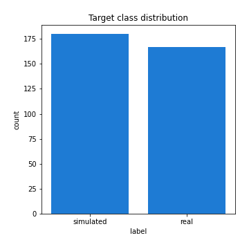
## Feature : return_mean1
- **Feature type** : continous
- **Missing** : 0.0%
- **Unique** : 347
- **Count** :347.0
- **Mean** :0.03275025122625847
- **Std** :0.07637880391156895
- **Min** :-0.22632637961920957
- **25%th Percentile** : -0.018632773207106948
- **50%th Percentile** : 0.035858056784047604
- **75%th Percentile** : 0.08072912208670588
- **Max** :0.35951212719134734

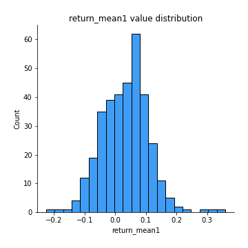
## Feature : return_mean2
- **Feature type** : continous
- **Missing** : 0.0%
- **Unique** : 347
- **Count** :347.0
- **Mean** :0.07357090225277312
- **Std** :0.08987116040679113
- **Min** :-0.24205418062825398
- **25%th Percentile** : 0.023985453511485854
- **50%th Percentile** : 0.07506387476831725
- **75%th Percentile** : 0.11985456796550817
- **Max** :0.4227719108973813

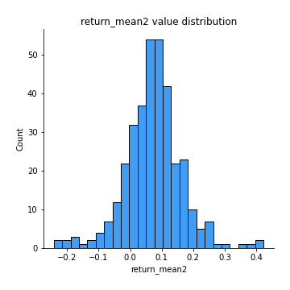
## Feature : return_sd1
- **Feature type** : continous
- **Missing** : 0.0%
- **Unique** : 347
- **Count** :347.0
- **Mean** :1.7022853604550052
- **Std** :0.7394515128870573
- **Min** :0.7470080772831957
- **25%th Percentile** : 1.4325021250259775
- **50%th Percentile** : 1.4936145152013545
- **75%th Percentile** : 1.6807155855963516
- **Max** :9.236766377527575

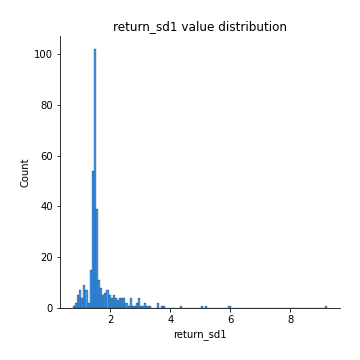
## Feature : return_sd2
- **Feature type** : continous
- **Missing** : 0.0%
- **Unique** : 347
- **Count** :347.0
- **Mean** :1.7434118760995463
- **Std** :0.7346572057632139
- **Min** :0.8592887433004143
- **25%th Percentile** : 1.4916819929370106
- **50%th Percentile** : 1.5686502674181952
- **75%th Percentile** : 1.6548206162927936
- **Max** :6.737618636746393

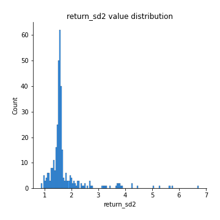
## Feature : return_skew1
- **Feature type** : continous
- **Missing** : 0.0%
- **Unique** : 347
- **Count** :347.0
- **Mean** :-0.1337766234669437
- **Std** :0.550851971093725
- **Min** :-3.530116233761814
- **25%th Percentile** : -0.24964574980512774
- **50%th Percentile** : -0.07700650418803695
- **75%th Percentile** : 0.08822549110638221
- **Max** :2.224942816365292

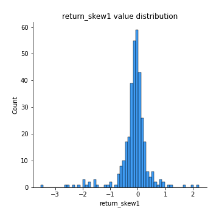
## Feature : return_skew2
- **Feature type** : continous
- **Missing** : 0.0%
- **Unique** : 347
- **Count** :347.0
- **Mean** :-0.167564002896909
- **Std** :0.7010448139020795
- **Min** :-8.801502855292393
- **25%th Percentile** : -0.3170051781660501
- **50%th Percentile** : -0.13225247714176902
- **75%th Percentile** : 0.052829373443155685
- **Max** :2.2606839051517187

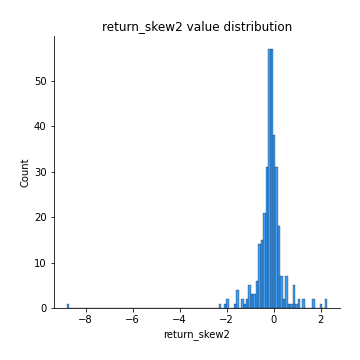
## Feature : return_kurtosis1
- **Feature type** : continous
- **Missing** : 0.0%
- **Unique** : 347
- **Count** :347.0
- **Mean** :3.185769353571685
- **Std** :5.472052227498124
- **Min** :-0.36853370536599117
- **25%th Percentile** : 0.21612306186829633
- **50%th Percentile** : 1.0413949807820235
- **75%th Percentile** : 3.767479093377704
- **Max** :35.56636016047202

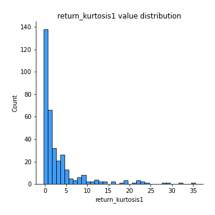
## Feature : return_kurtosis2
- **Feature type** : continous
- **Missing** : 0.0%
- **Unique** : 347
- **Count** :347.0
- **Mean** :3.7560606444873166
- **Std** :8.985075447581194
- **Min** :-0.27181341527696024
- **25%th Percentile** : 0.4732044072704775
- **50%th Percentile** : 1.5133306764399754
- **75%th Percentile** : 4.30151608205566
- **Max** :143.10871011533666

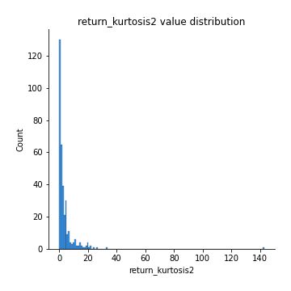
## Feature : return_autocorrelation_1_lag1
- **Feature type** : continous
- **Missing** : 0.0%
- **Unique** : 347
- **Count** :347.0
- **Mean** :-0.016415863421411343
- **Std** :0.05864700246019477
- **Min** :-0.2135576224968752
- **25%th Percentile** : -0.05267411445211549
- **50%th Percentile** : -0.009390724148855355
- **75%th Percentile** : 0.023224099339882183
- **Max** :0.1253959753011446

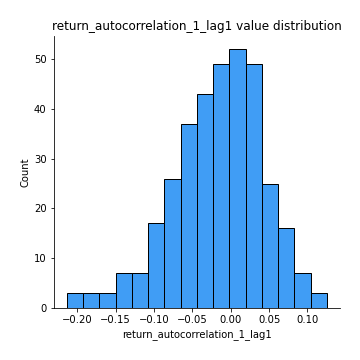
## Feature : return_autocorrelation_1_lag2
- **Feature type** : continous
- **Missing** : 0.0%
- **Unique** : 347
- **Count** :347.0
- **Mean** :-0.004337946592462544
- **Std** :0.05305110039193738
- **Min** :-0.13309283796645122
- **25%th Percentile** : -0.03771450238213201
- **50%th Percentile** : -0.005583441304546397
- **75%th Percentile** : 0.03013542154780008
- **Max** :0.1561488228015672

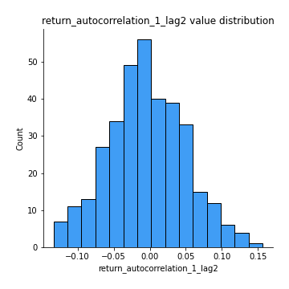
## Feature : return_autocorrelation_1_lag3
- **Feature type** : continous
- **Missing** : 0.0%
- **Unique** : 347
- **Count** :347.0
- **Mean** :-0.0030924815736129334
- **Std** :0.04940538652253858
- **Min** :-0.1940836867390813
- **25%th Percentile** : -0.03286070645614311
- **50%th Percentile** : -0.002602896187623162
- **75%th Percentile** : 0.03124092502865626
- **Max** :0.17805869530681923

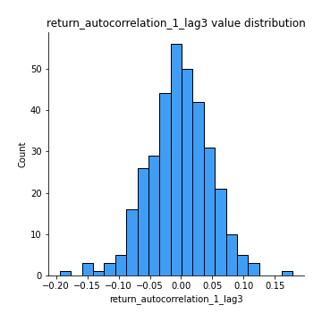
## Feature : return_autocorrelation_2_lag1
- **Feature type** : continous
- **Missing** : 0.0%
- **Unique** : 347
- **Count** :347.0
- **Mean** :-0.003736191776251728
- **Std** :0.05896554505912173
- **Min** :-0.25075531010123286
- **25%th Percentile** : -0.036111835604154235
- **50%th Percentile** : 0.0032013956106743866
- **75%th Percentile** : 0.0323950769976821
- **Max** :0.14751924012076995

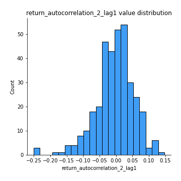
## Feature : return_autocorrelation_2_lag2
- **Feature type** : continous
- **Missing** : 0.0%
- **Unique** : 347
- **Count** :347.0
- **Mean** :0.006559359438823359
- **Std** :0.05383284466729557
- **Min** :-0.15323211089747296
- **25%th Percentile** : -0.031038240128230282
- **50%th Percentile** : 0.005901544317202696
- **75%th Percentile** : 0.046412953425197606
- **Max** :0.1735398560230086

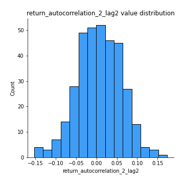
## Feature : return_autocorrelation_2_lag3
- **Feature type** : continous
- **Missing** : 0.0%
- **Unique** : 347
- **Count** :347.0
- **Mean** :0.005790830704460979
- **Std** :0.0489572003539292
- **Min** :-0.1344316177078651
- **25%th Percentile** : -0.02271852502731183
- **50%th Percentile** : 0.006236155490409903
- **75%th Percentile** : 0.03737548233347876
- **Max** :0.16552858551598554

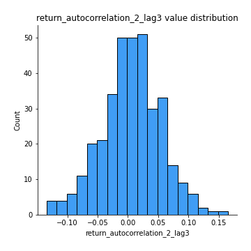
## Feature : return_correlation_ts1_lag_0
- **Feature type** : continous
- **Missing** : 0.0%
- **Unique** : 347
- **Count** :347.0
- **Mean** :0.309276030127506
- **Std** :0.10718262793238527
- **Min** :-0.027089510445801036
- **25%th Percentile** : 0.25164341602353424
- **50%th Percentile** : 0.2970541779614014
- **75%th Percentile** : 0.3556744615592471
- **Max** :0.7041861626832071

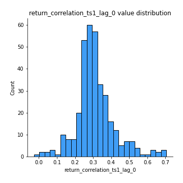
## Feature : return_correlation_ts1_lag_1
- **Feature type** : continous
- **Missing** : 0.0%
- **Unique** : 347
- **Count** :347.0
- **Mean** :-0.008751071119081853
- **Std** :0.05062963176030038
- **Min** :-0.16985510949917193
- **25%th Percentile** : -0.039039644455929064
- **50%th Percentile** : -0.006334827720600718
- **75%th Percentile** : 0.02470884966682737
- **Max** :0.15499424718508623

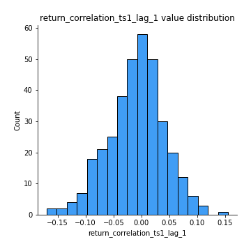
## Feature : return_correlation_ts1_lag_2
- **Feature type** : continous
- **Missing** : 0.0%
- **Unique** : 347
- **Count** :347.0
- **Mean** :0.006161054907795926
- **Std** :0.04957168877351512
- **Min** :-0.21653581047581763
- **25%th Percentile** : -0.027336349372498518
- **50%th Percentile** : 0.00653789089831317
- **75%th Percentile** : 0.040540750371706166
- **Max** :0.16750157405149388

## Feature : return_correlation_ts1_lag_3
- **Feature type** : continous
- **Missing** : 0.0%
- **Unique** : 347
- **Count** :347.0
- **Mean** :0.003431021878148496
- **Std** :0.05321792970767031
- **Min** :-0.1270218498974763
- **25%th Percentile** : -0.030479385731189308
- **50%th Percentile** : 0.0027395629367003758
- **75%th Percentile** : 0.04008443597649997
- **Max** :0.1636773216468148

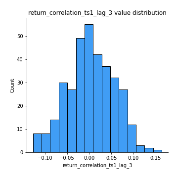
## Feature : return_correlation_ts2_lag_1
- **Feature type** : continous
- **Missing** : 0.0%
- **Unique** : 347
- **Count** :347.0
- **Mean** :-0.00722288548991249
- **Std** :0.052713467817937
- **Min** :-0.20093919236581337
- **25%th Percentile** : -0.040421378521097076
- **50%th Percentile** : -0.005252089971087172
- **75%th Percentile** : 0.02605553744512734
- **Max** :0.17208763791364762

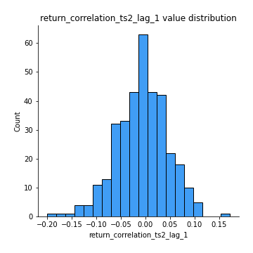
## Feature : return_correlation_ts2_lag_2
- **Feature type** : continous
- **Missing** : 0.0%
- **Unique** : 347
- **Count** :347.0
- **Mean** :0.0029126121151595236
- **Std** :0.054143058605207794
- **Min** :-0.23751835475804678
- **25%th Percentile** : -0.03439754135672725
- **50%th Percentile** : 0.0026979248538658252
- **75%th Percentile** : 0.03979638970244846
- **Max** :0.20772887392904255

## Feature : return_correlation_ts2_lag_3
- **Feature type** : continous
- **Missing** : 0.0%
- **Unique** : 347
- **Count** :347.0
- **Mean** :0.0024473443125015096
- **Std** :0.05166237886506151
- **Min** :-0.17564076057312866
- **25%th Percentile** : -0.028119028093359724
- **50%th Percentile** : 0.0005156439438987019
- **75%th Percentile** : 0.0367713185804535
- **Max** :0.13128380114518473

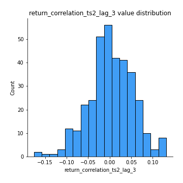
## Feature : sqreturn_autocorrelation_ts1_lag1
- **Feature type** : continous
- **Missing** : 0.0%
- **Unique** : 347
- **Count** :347.0
- **Mean** :0.043896390169409966
- **Std** :0.0919017275984589
- **Min** :-0.08816504989690817
- **25%th Percentile** : -0.017383187623049707
- **50%th Percentile** : 0.02384471157471599
- **75%th Percentile** : 0.07922207005784616
- **Max** :0.49414293176447355

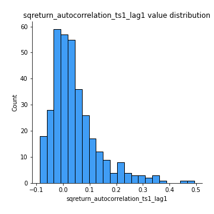
## Feature : sqreturn_autocorrelation_ts1_lag2
- **Feature type** : continous
- **Missing** : 0.0%
- **Unique** : 347
- **Count** :347.0
- **Mean** :0.04143426616590218
- **Std** :0.09352145647449138
- **Min** :-0.10281229790408031
- **25%th Percentile** : -0.012776131482892986
- **50%th Percentile** : 0.01466360140472958
- **75%th Percentile** : 0.06497789036337075
- **Max** :0.540735851444759

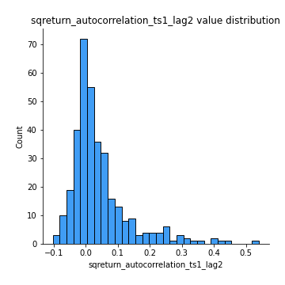
## Feature : sqreturn_autocorrelation_ts1_lag3
- **Feature type** : continous
- **Missing** : 0.0%
- **Unique** : 347
- **Count** :347.0
- **Mean** :0.030570323821659
- **Std** :0.07935766473126322
- **Min** :-0.09512707425132078
- **25%th Percentile** : -0.01794125281065312
- **50%th Percentile** : 0.009421362205443673
- **75%th Percentile** : 0.06015629428693138
- **Max** :0.44755937369538146

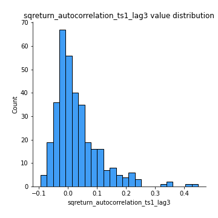
## Feature : sqreturn_autocorrelation_ts2_lag1
- **Feature type** : continous
- **Missing** : 0.0%
- **Unique** : 347
- **Count** :347.0
- **Mean** :0.041574542392432766
- **Std** :0.08850052438474117
- **Min** :-0.12465394719855775
- **25%th Percentile** : -0.01563133710008848
- **50%th Percentile** : 0.022529642572539425
- **75%th Percentile** : 0.07317653774074089
- **Max** :0.510085647437958

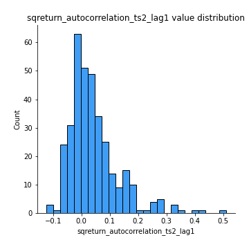
## Feature : sqreturn_autocorrelation_ts2_lag2
- **Feature type** : continous
- **Missing** : 0.0%
- **Unique** : 347
- **Count** :347.0
- **Mean** :0.04059880477486067
- **Std** :0.08752912641744742
- **Min** :-0.07792051490547101
- **25%th Percentile** : -0.010301767839204728
- **50%th Percentile** : 0.016272181473907757
- **75%th Percentile** : 0.05743733356029036
- **Max** :0.45676817892778204

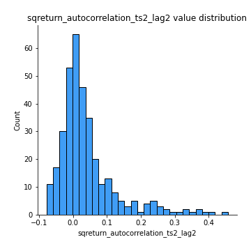
## Feature : sqreturn_autocorrelation_ts2_lag3
- **Feature type** : continous
- **Missing** : 0.0%
- **Unique** : 347
- **Count** :347.0
- **Mean** :0.02647369247535933
- **Std** :0.06835099106216784
- **Min** :-0.12680965541732148
- **25%th Percentile** : -0.016923429169187095
- **50%th Percentile** : 0.011324429403567163
- **75%th Percentile** : 0.055749120888273274
- **Max** :0.31225727797735664

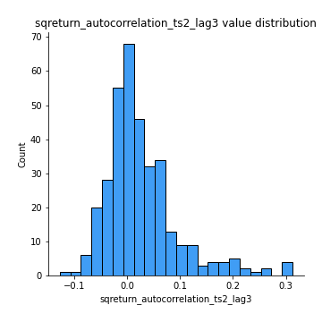
## Feature : sqreturn_correlation_ts1_lag_0
- **Feature type** : continous
- **Missing** : 0.0%
- **Unique** : 347
- **Count** :347.0
- **Mean** :0.309276030127506
- **Std** :0.10718262793238527
- **Min** :-0.027089510445801036
- **25%th Percentile** : 0.25164341602353424
- **50%th Percentile** : 0.2970541779614014
- **75%th Percentile** : 0.3556744615592471
- **Max** :0.7041861626832071

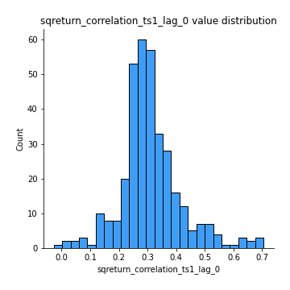
## Feature : sqreturn_correlation_ts1_lag_1
- **Feature type** : continous
- **Missing** : 0.0%
- **Unique** : 347
- **Count** :347.0
- **Mean** :-0.008751071119081853
- **Std** :0.05062963176030038
- **Min** :-0.16985510949917193
- **25%th Percentile** : -0.039039644455929064
- **50%th Percentile** : -0.006334827720600718
- **75%th Percentile** : 0.02470884966682737
- **Max** :0.15499424718508623

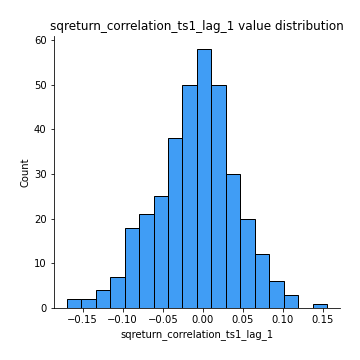
## Feature : sqreturn_correlation_ts1_lag_2
- **Feature type** : continous
- **Missing** : 0.0%
- **Unique** : 347
- **Count** :347.0
- **Mean** :0.006161054907795926
- **Std** :0.04957168877351512
- **Min** :-0.21653581047581763
- **25%th Percentile** : -0.027336349372498518
- **50%th Percentile** : 0.00653789089831317
- **75%th Percentile** : 0.040540750371706166
- **Max** :0.16750157405149388

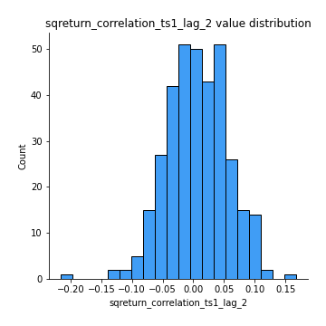
## Feature : sqreturn_correlation_ts1_lag_3
- **Feature type** : continous
- **Missing** : 0.0%
- **Unique** : 347
- **Count** :347.0
- **Mean** :0.003431021878148496
- **Std** :0.05321792970767031
- **Min** :-0.1270218498974763
- **25%th Percentile** : -0.030479385731189308
- **50%th Percentile** : 0.0027395629367003758
- **75%th Percentile** : 0.04008443597649997
- **Max** :0.1636773216468148

## Feature : sqreturn_correlation_ts2_lag_1
- **Feature type** : continous
- **Missing** : 0.0%
- **Unique** : 347
- **Count** :347.0
- **Mean** :-0.00722288548991249
- **Std** :0.052713467817937
- **Min** :-0.20093919236581337
- **25%th Percentile** : -0.040421378521097076
- **50%th Percentile** : -0.005252089971087172
- **75%th Percentile** : 0.02605553744512734
- **Max** :0.17208763791364762

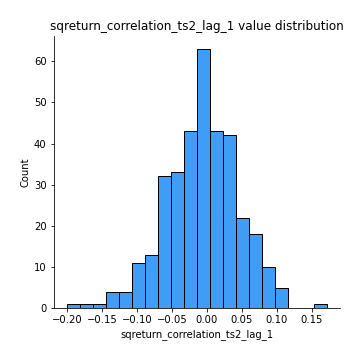
## Feature : sqreturn_correlation_ts2_lag_2
- **Feature type** : continous
- **Missing** : 0.0%
- **Unique** : 347
- **Count** :347.0
- **Mean** :0.0029126121151595236
- **Std** :0.054143058605207794
- **Min** :-0.23751835475804678
- **25%th Percentile** : -0.03439754135672725
- **50%th Percentile** : 0.0026979248538658252
- **75%th Percentile** : 0.03979638970244846
- **Max** :0.20772887392904255

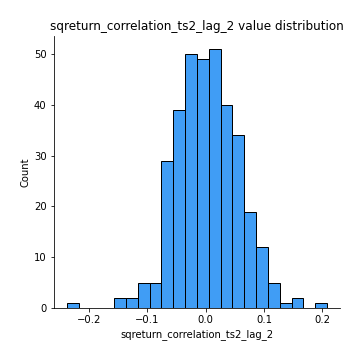
## Feature : sqreturn_correlation_ts2_lag_3
- **Feature type** : continous
- **Missing** : 0.0%
- **Unique** : 347
- **Count** :347.0
- **Mean** :0.0024473443125015096
- **Std** :0.05166237886506151
- **Min** :-0.17564076057312866
- **25%th Percentile** : -0.028119028093359724
- **50%th Percentile** : 0.0005156439438987019
- **75%th Percentile** : 0.0367713185804535
- **Max** :0.13128380114518473

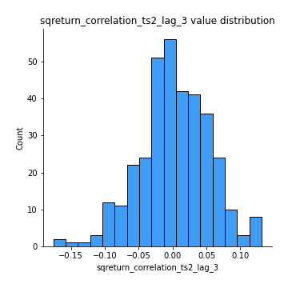
## Feature : price2_granger_cause_price1
- **Feature type** : continous
- **Missing** : 0.0%
- **Unique** : 347
- **Count** :347.0
- **Mean** :0.3108671717352372
- **Std** :0.29466889128320284
- **Min** :9.273017555689903e-06
- **25%th Percentile** : 0.04467064245455458
- **50%th Percentile** : 0.219710577344419
- **75%th Percentile** : 0.5221803780483564
- **Max** :0.9965133691269751

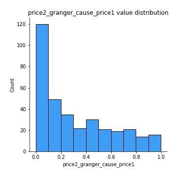
## Feature : price1_granger_cause_price2
- **Feature type** : continous
- **Missing** : 0.0%
- **Unique** : 347
- **Count** :347.0
- **Mean** :0.25195368496420967
- **Std** :0.2776522475255249
- **Min** :1.094749521659324e-12
- **25%th Percentile** : 0.016594391985758086
- **50%th Percentile** : 0.14071903058511448
- **75%th Percentile** : 0.42732078855632377
- **Max** :0.9987707448205503

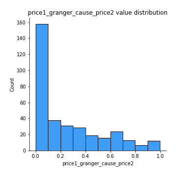

[<< Go back](../README.md)
