# Exploratory Data Analysis

[<< Go back](../README.md)
## Feature : target
- **Feature type** : categorical
- **Missing** : 0.0%
- **Unique** : 2
- **Count** :347
- **Unique** :2
- **Top** :simulated
- **Freq** :175

## Feature : return_mean1
- **Feature type** : continous
- **Missing** : 0.0%
- **Unique** : 347
- **Count** :347.0
- **Mean** :-0.009356998466694803
- **Std** :0.13381682861287403
- **Min** :-0.5013545209770143
- **25%th Percentile** : -0.0940105528645285
- **50%th Percentile** : 0.014291104838812697
- **75%th Percentile** : 0.08080402606765724
- **Max** :0.3986510916753376

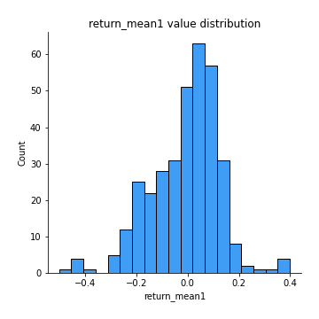
## Feature : return_mean2
- **Feature type** : continous
- **Missing** : 0.0%
- **Unique** : 347
- **Count** :347.0
- **Mean** :0.04066400018600392
- **Std** :0.08172084364690538
- **Min** :-0.24205418062825398
- **25%th Percentile** : -0.004386935053413545
- **50%th Percentile** : 0.041695752133706764
- **75%th Percentile** : 0.08414823912580746
- **Max** :0.37616608147096464

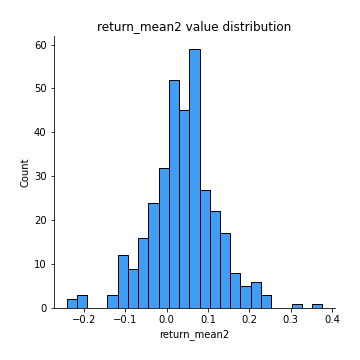
## Feature : return_sd1
- **Feature type** : continous
- **Missing** : 0.0%
- **Unique** : 347
- **Count** :347.0
- **Mean** :1.8333664156175333
- **Std** :0.7477952467887927
- **Min** :0.7470080772831957
- **25%th Percentile** : 1.6271228751864786
- **50%th Percentile** : 1.7433458387461418
- **75%th Percentile** : 1.828145022903089
- **Max** :9.236766377527575

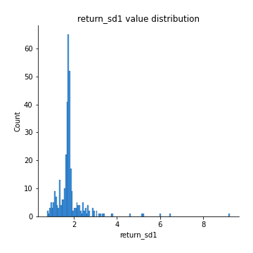
## Feature : return_sd2
- **Feature type** : continous
- **Missing** : 0.0%
- **Unique** : 347
- **Count** :347.0
- **Mean** :1.7660126152006406
- **Std** :0.7674226203267557
- **Min** :0.8455946193085045
- **25%th Percentile** : 1.484751353845903
- **50%th Percentile** : 1.5776385332641083
- **75%th Percentile** : 1.6836236706419447
- **Max** :6.737618636746393

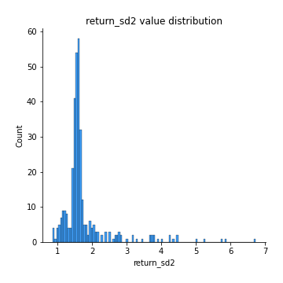
## Feature : return_skew1
- **Feature type** : continous
- **Missing** : 0.0%
- **Unique** : 347
- **Count** :347.0
- **Mean** :-0.06269726578011925
- **Std** :0.6258679411617135
- **Min** :-3.530116233761814
- **25%th Percentile** : -0.19180610203071985
- **50%th Percentile** : -0.00034606214910826047
- **75%th Percentile** : 0.14542167782707657
- **Max** :2.5845963767725557

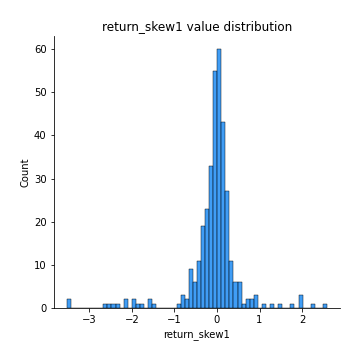
## Feature : return_skew2
- **Feature type** : continous
- **Missing** : 0.0%
- **Unique** : 347
- **Count** :347.0
- **Mean** :-0.263450122949854
- **Std** :0.8422384043551452
- **Min** :-8.801502855292393
- **25%th Percentile** : -0.42974305997766743
- **50%th Percentile** : -0.19036870139215922
- **75%th Percentile** : 0.06393078398506416
- **Max** :2.242019525651531

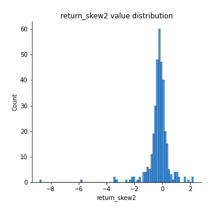
## Feature : return_kurtosis1
- **Feature type** : continous
- **Missing** : 0.0%
- **Unique** : 347
- **Count** :347.0
- **Mean** :3.4067457979651383
- **Std** :6.01211908227671
- **Min** :-0.3720220000440846
- **25%th Percentile** : 0.3469239056643534
- **50%th Percentile** : 1.08258488337747
- **75%th Percentile** : 3.583058820532593
- **Max** :46.07507808162177

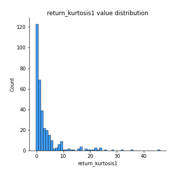
## Feature : return_kurtosis2
- **Feature type** : continous
- **Missing** : 0.0%
- **Unique** : 347
- **Count** :347.0
- **Mean** :4.944302152640247
- **Std** :10.360566394869137
- **Min** :0.006407924828228495
- **25%th Percentile** : 1.2529033595244798
- **50%th Percentile** : 2.0291114198021307
- **75%th Percentile** : 4.45777438765429
- **Max** :143.10871011533666

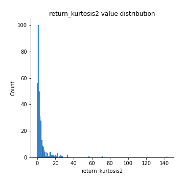
## Feature : return_autocorrelation_1_lag1
- **Feature type** : continous
- **Missing** : 0.0%
- **Unique** : 347
- **Count** :347.0
- **Mean** :0.024030258360756274
- **Std** :0.07048496441555745
- **Min** :-0.19339575314049967
- **25%th Percentile** : -0.017318750103511676
- **50%th Percentile** : 0.027959941846426806
- **75%th Percentile** : 0.07381879519543494
- **Max** :0.20529929757730378

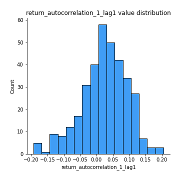
## Feature : return_autocorrelation_1_lag2
- **Feature type** : continous
- **Missing** : 0.0%
- **Unique** : 347
- **Count** :347.0
- **Mean** :0.029125124307138706
- **Std** :0.06899748520716192
- **Min** :-0.13309283796645122
- **25%th Percentile** : -0.018546531662046
- **50%th Percentile** : 0.021667180532616986
- **75%th Percentile** : 0.08242600727111224
- **Max** :0.2102172430464798

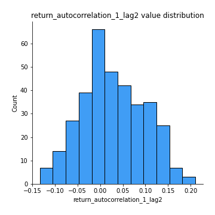
## Feature : return_autocorrelation_1_lag3
- **Feature type** : continous
- **Missing** : 0.0%
- **Unique** : 347
- **Count** :347.0
- **Mean** :0.03628427523463215
- **Std** :0.06692310179426898
- **Min** :-0.1940836867390813
- **25%th Percentile** : -0.005556867708629303
- **50%th Percentile** : 0.03951373986786417
- **75%th Percentile** : 0.08385970130944218
- **Max** :0.21243184817949098

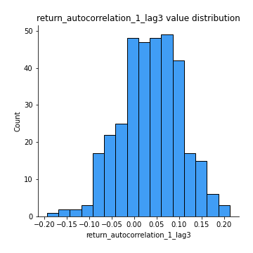
## Feature : return_autocorrelation_2_lag1
- **Feature type** : continous
- **Missing** : 0.0%
- **Unique** : 347
- **Count** :347.0
- **Mean** :-0.0073438284496505045
- **Std** :0.060501765461064345
- **Min** :-0.25075531010123286
- **25%th Percentile** : -0.040563338934070894
- **50%th Percentile** : -0.0037738310046310213
- **75%th Percentile** : 0.032441102250954174
- **Max** :0.31863413537898483

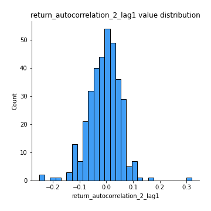
## Feature : return_autocorrelation_2_lag2
- **Feature type** : continous
- **Missing** : 0.0%
- **Unique** : 347
- **Count** :347.0
- **Mean** :0.0003698169921226566
- **Std** :0.05206770777252708
- **Min** :-0.15323211089747296
- **25%th Percentile** : -0.03612202958599045
- **50%th Percentile** : -0.0012370196935426883
- **75%th Percentile** : 0.0335291523958919
- **Max** :0.20974504043791217

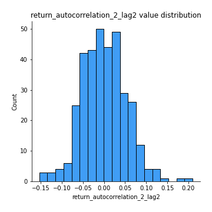
## Feature : return_autocorrelation_2_lag3
- **Feature type** : continous
- **Missing** : 0.0%
- **Unique** : 347
- **Count** :347.0
- **Mean** :-7.802742412091087e-05
- **Std** :0.04888880794787604
- **Min** :-0.14200107169559698
- **25%th Percentile** : -0.02995535859853387
- **50%th Percentile** : 0.0007884741750277437
- **75%th Percentile** : 0.03149030641557979
- **Max** :0.1419999376914021

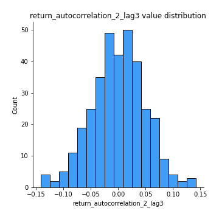
## Feature : return_correlation_ts1_lag_0
- **Feature type** : continous
- **Missing** : 0.0%
- **Unique** : 347
- **Count** :347.0
- **Mean** :0.28635363202178776
- **Std** :0.11803290250437665
- **Min** :-0.027089510445801036
- **25%th Percentile** : 0.2145915768828639
- **50%th Percentile** : 0.2733548340615349
- **75%th Percentile** : 0.3411665558420851
- **Max** :0.7041861626832071

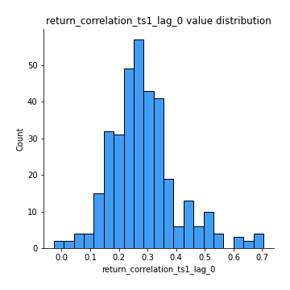
## Feature : return_correlation_ts1_lag_1
- **Feature type** : continous
- **Missing** : 0.0%
- **Unique** : 347
- **Count** :347.0
- **Mean** :0.00727978409501657
- **Std** :0.053862229296777205
- **Min** :-0.15776193292681923
- **25%th Percentile** : -0.02855572310935425
- **50%th Percentile** : 0.01251006945996675
- **75%th Percentile** : 0.044591784575769185
- **Max** :0.158149921879676

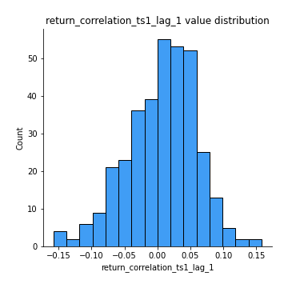
## Feature : return_correlation_ts1_lag_2
- **Feature type** : continous
- **Missing** : 0.0%
- **Unique** : 347
- **Count** :347.0
- **Mean** :0.008813643301555504
- **Std** :0.04825853023432775
- **Min** :-0.12864410180561703
- **25%th Percentile** : -0.023479014249963653
- **50%th Percentile** : 0.008973160499559544
- **75%th Percentile** : 0.04236328737817911
- **Max** :0.14804697364342867

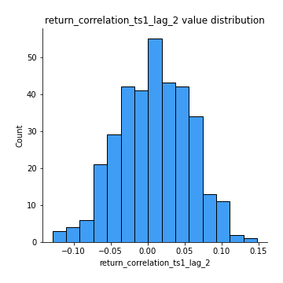
## Feature : return_correlation_ts1_lag_3
- **Feature type** : continous
- **Missing** : 0.0%
- **Unique** : 347
- **Count** :347.0
- **Mean** :0.013183081784062637
- **Std** :0.052248674898073146
- **Min** :-0.1270218498974763
- **25%th Percentile** : -0.0234417524979074
- **50%th Percentile** : 0.013288594596812905
- **75%th Percentile** : 0.05134816043574682
- **Max** :0.1636773216468148

## Feature : return_correlation_ts2_lag_1
- **Feature type** : continous
- **Missing** : 0.0%
- **Unique** : 347
- **Count** :347.0
- **Mean** :0.007211327794710742
- **Std** :0.054402972588999884
- **Min** :-0.20093919236581337
- **25%th Percentile** : -0.026316911622302704
- **50%th Percentile** : 0.008958729502326
- **75%th Percentile** : 0.04366347690274854
- **Max** :0.17208763791364762

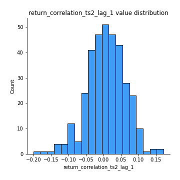
## Feature : return_correlation_ts2_lag_2
- **Feature type** : continous
- **Missing** : 0.0%
- **Unique** : 347
- **Count** :347.0
- **Mean** :0.011759649265279393
- **Std** :0.05204446480124968
- **Min** :-0.23751835475804678
- **25%th Percentile** : -0.01788461078450719
- **50%th Percentile** : 0.013857165519767258
- **75%th Percentile** : 0.04520804173097587
- **Max** :0.20772887392904255

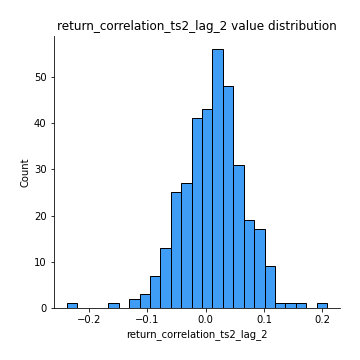
## Feature : return_correlation_ts2_lag_3
- **Feature type** : continous
- **Missing** : 0.0%
- **Unique** : 347
- **Count** :347.0
- **Mean** :0.010172309706741402
- **Std** :0.05326855610054275
- **Min** :-0.17564076057312866
- **25%th Percentile** : -0.02109425412850289
- **50%th Percentile** : 0.01627561183249864
- **75%th Percentile** : 0.047014160996989095
- **Max** :0.13128380114518473

## Feature : sqreturn_autocorrelation_ts1_lag1
- **Feature type** : continous
- **Missing** : 0.0%
- **Unique** : 347
- **Count** :347.0
- **Mean** :0.05018378732466547
- **Std** :0.09142752026005205
- **Min** :-0.08202048310890467
- **25%th Percentile** : -0.007951773734568953
- **50%th Percentile** : 0.02748971168841695
- **75%th Percentile** : 0.0800738403567664
- **Max** :0.49414293176447355

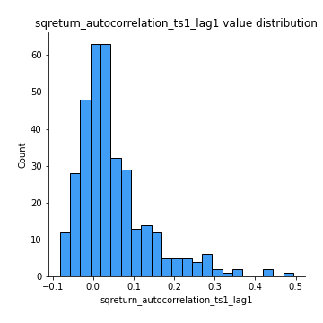
## Feature : sqreturn_autocorrelation_ts1_lag2
- **Feature type** : continous
- **Missing** : 0.0%
- **Unique** : 347
- **Count** :347.0
- **Mean** :0.043314305933732235
- **Std** :0.0891484906218001
- **Min** :-0.09719477443854019
- **25%th Percentile** : -0.011258696473656505
- **50%th Percentile** : 0.022875374446624734
- **75%th Percentile** : 0.0665113056810914
- **Max** :0.540735851444759

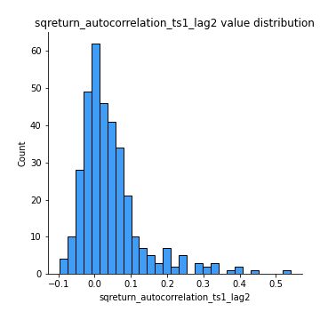
## Feature : sqreturn_autocorrelation_ts1_lag3
- **Feature type** : continous
- **Missing** : 0.0%
- **Unique** : 347
- **Count** :347.0
- **Mean** :0.03596781628776515
- **Std** :0.07692969851376985
- **Min** :-0.08626059279138693
- **25%th Percentile** : -0.013552265997710769
- **50%th Percentile** : 0.015283347931758066
- **75%th Percentile** : 0.06248700259772799
- **Max** :0.41030914918857014

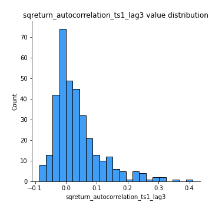
## Feature : sqreturn_autocorrelation_ts2_lag1
- **Feature type** : continous
- **Missing** : 0.0%
- **Unique** : 347
- **Count** :347.0
- **Mean** :0.04597535099813725
- **Std** :0.0873792744499735
- **Min** :-0.08520586663750691
- **25%th Percentile** : -0.013249120005583401
- **50%th Percentile** : 0.024001793134355548
- **75%th Percentile** : 0.07673656701728544
- **Max** :0.510085647437958

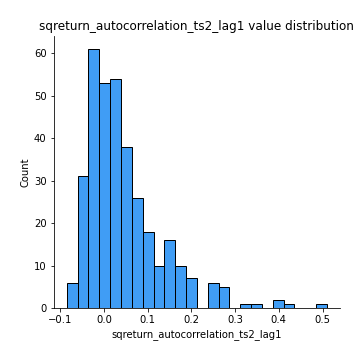
## Feature : sqreturn_autocorrelation_ts2_lag2
- **Feature type** : continous
- **Missing** : 0.0%
- **Unique** : 347
- **Count** :347.0
- **Mean** :0.03630751126072144
- **Std** :0.08463560949485878
- **Min** :-0.08443973594604202
- **25%th Percentile** : -0.016434130778537163
- **50%th Percentile** : 0.012239267024428074
- **75%th Percentile** : 0.055566491858685535
- **Max** :0.45676817892778204

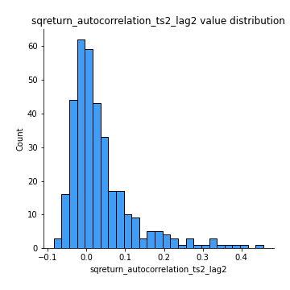
## Feature : sqreturn_autocorrelation_ts2_lag3
- **Feature type** : continous
- **Missing** : 0.0%
- **Unique** : 347
- **Count** :347.0
- **Mean** :0.026435559839908796
- **Std** :0.06715073210065067
- **Min** :-0.07300388655781855
- **25%th Percentile** : -0.01641012620251683
- **50%th Percentile** : 0.007738770776192683
- **75%th Percentile** : 0.05366447238352463
- **Max** :0.31225727797735664

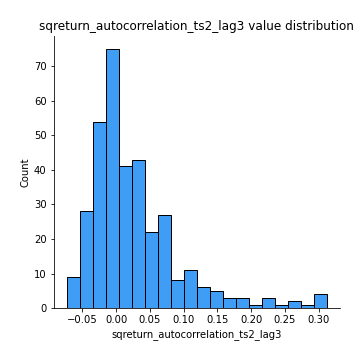
## Feature : sqreturn_correlation_ts1_lag_0
- **Feature type** : continous
- **Missing** : 0.0%
- **Unique** : 347
- **Count** :347.0
- **Mean** :0.28635363202178776
- **Std** :0.11803290250437665
- **Min** :-0.027089510445801036
- **25%th Percentile** : 0.2145915768828639
- **50%th Percentile** : 0.2733548340615349
- **75%th Percentile** : 0.3411665558420851
- **Max** :0.7041861626832071

## Feature : sqreturn_correlation_ts1_lag_1
- **Feature type** : continous
- **Missing** : 0.0%
- **Unique** : 347
- **Count** :347.0
- **Mean** :0.00727978409501657
- **Std** :0.053862229296777205
- **Min** :-0.15776193292681923
- **25%th Percentile** : -0.02855572310935425
- **50%th Percentile** : 0.01251006945996675
- **75%th Percentile** : 0.044591784575769185
- **Max** :0.158149921879676

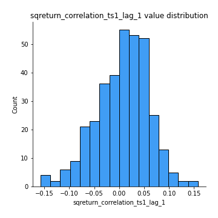
## Feature : sqreturn_correlation_ts1_lag_2
- **Feature type** : continous
- **Missing** : 0.0%
- **Unique** : 347
- **Count** :347.0
- **Mean** :0.008813643301555504
- **Std** :0.04825853023432775
- **Min** :-0.12864410180561703
- **25%th Percentile** : -0.023479014249963653
- **50%th Percentile** : 0.008973160499559544
- **75%th Percentile** : 0.04236328737817911
- **Max** :0.14804697364342867

## Feature : sqreturn_correlation_ts1_lag_3
- **Feature type** : continous
- **Missing** : 0.0%
- **Unique** : 347
- **Count** :347.0
- **Mean** :0.013183081784062637
- **Std** :0.052248674898073146
- **Min** :-0.1270218498974763
- **25%th Percentile** : -0.0234417524979074
- **50%th Percentile** : 0.013288594596812905
- **75%th Percentile** : 0.05134816043574682
- **Max** :0.1636773216468148

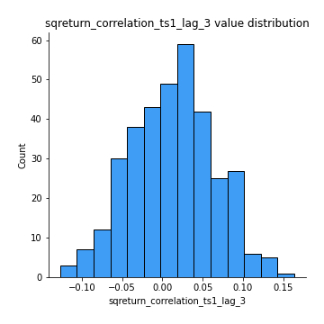
## Feature : sqreturn_correlation_ts2_lag_1
- **Feature type** : continous
- **Missing** : 0.0%
- **Unique** : 347
- **Count** :347.0
- **Mean** :0.007211327794710742
- **Std** :0.054402972588999884
- **Min** :-0.20093919236581337
- **25%th Percentile** : -0.026316911622302704
- **50%th Percentile** : 0.008958729502326
- **75%th Percentile** : 0.04366347690274854
- **Max** :0.17208763791364762

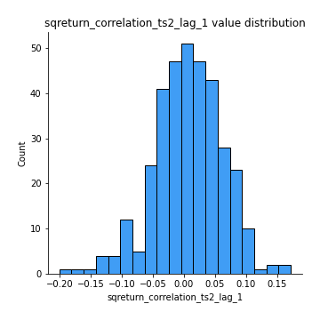
## Feature : sqreturn_correlation_ts2_lag_2
- **Feature type** : continous
- **Missing** : 0.0%
- **Unique** : 347
- **Count** :347.0
- **Mean** :0.011759649265279393
- **Std** :0.05204446480124968
- **Min** :-0.23751835475804678
- **25%th Percentile** : -0.01788461078450719
- **50%th Percentile** : 0.013857165519767258
- **75%th Percentile** : 0.04520804173097587
- **Max** :0.20772887392904255

## Feature : sqreturn_correlation_ts2_lag_3
- **Feature type** : continous
- **Missing** : 0.0%
- **Unique** : 347
- **Count** :347.0
- **Mean** :0.010172309706741402
- **Std** :0.05326855610054275
- **Min** :-0.17564076057312866
- **25%th Percentile** : -0.02109425412850289
- **50%th Percentile** : 0.01627561183249864
- **75%th Percentile** : 0.047014160996989095
- **Max** :0.13128380114518473

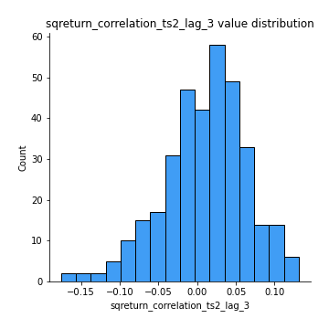
## Feature : price2_granger_cause_price1
- **Feature type** : continous
- **Missing** : 0.0%
- **Unique** : 347
- **Count** :347.0
- **Mean** :0.24207065251741003
- **Std** :0.2829577553957025
- **Min** :2.2704618958753707e-18
- **25%th Percentile** : 0.0036780037241498243
- **50%th Percentile** : 0.09775865552358795
- **75%th Percentile** : 0.4378676920359489
- **Max** :0.9885712803689185

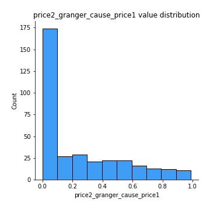
## Feature : price1_granger_cause_price2
- **Feature type** : continous
- **Missing** : 0.0%
- **Unique** : 347
- **Count** :347.0
- **Mean** :0.27473139558902665
- **Std** :0.2674984616380942
- **Min** :4.378162651868451e-07
- **25%th Percentile** : 0.03882663321839034
- **50%th Percentile** : 0.18343299492376408
- **75%th Percentile** : 0.4531994490294014
- **Max** :0.9951398266867577

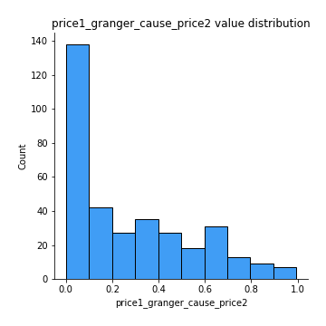

[<< Go back](../README.md)
