# Summary of 2_DecisionTree

[<< Go back](../README.md)

## Decision Tree
- **n_jobs**: -1
- **criterion**: gini
- **max_depth**: 3
- **explain_level**: 2

## Validation
 - **validation_type**: split
 - **train_ratio**: 0.75
 - **shuffle**: True
 - **stratify**: True

## Optimized metric
accuracy

## Training time

11.1 seconds

## Metric details
|           |    score |   threshold |
|:----------|---------:|------------:|
| logloss   | 0.981402 |     nan     |
| auc       | 0.840116 |     nan     |
| f1        | 0.873563 |       0.625 |
| accuracy  | 0.873563 |       0.625 |
| precision | 0.883721 |       0.625 |
| recall    | 0.977273 |       0     |
| mcc       | 0.747357 |       0.625 |

## Confusion matrix (at threshold=0.625)
|                      |   Predicted as real |   Predicted as simulated |
|:---------------------|--------------------:|-------------------------:|
| Labeled as real      |                  38 |                        5 |
| Labeled as simulated |                   6 |                       38 |

## Learning curves
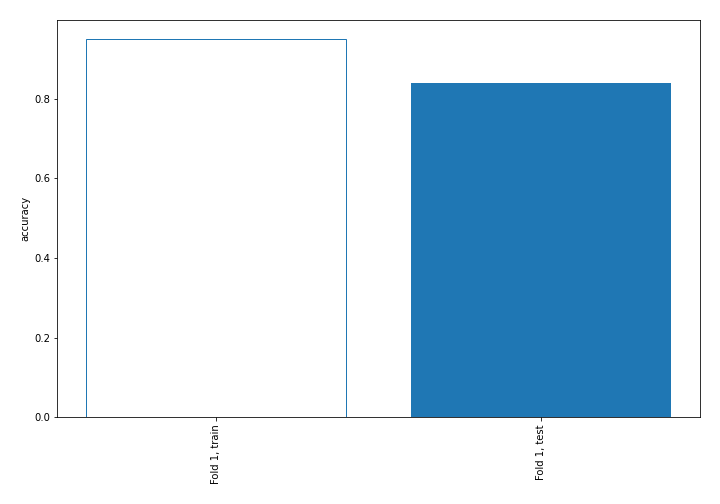

## Decision Tree 

### Tree #1
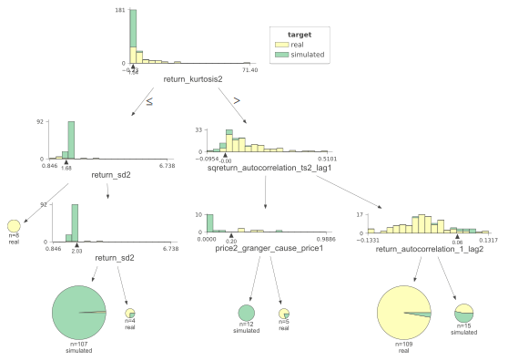

### Rules

if (return_kurtosis2 > 1.541) and (sqreturn_autocorrelation_ts2_lag1 > -0.003) and (return_autocorrelation_1_lag2 <= 0.063) then class: real (proba: 97.25%) | based on 109 samples

if (return_kurtosis2 <= 1.541) and (return_sd2 > 1.677) and (return_sd2 <= 2.028) then class: simulated (proba: 99.07%) | based on 107 samples

if (return_kurtosis2 > 1.541) and (sqreturn_autocorrelation_ts2_lag1 > -0.003) and (return_autocorrelation_1_lag2 > 0.063) then class: simulated (proba: 53.33%) | based on 15 samples

if (return_kurtosis2 > 1.541) and (sqreturn_autocorrelation_ts2_lag1 <= -0.003) and (price2_granger_cause_price1 <= 0.204) then class: simulated (proba: 100.0%) | based on 12 samples

if (return_kurtosis2 <= 1.541) and (return_sd2 <= 1.677) then class: real (proba: 100.0%) | based on 8 samples

if (return_kurtosis2 > 1.541) and (sqreturn_autocorrelation_ts2_lag1 <= -0.003) and (price2_granger_cause_price1 > 0.204) then class: real (proba: 80.0%) | based on 5 samples

if (return_kurtosis2 <= 1.541) and (return_sd2 > 1.677) and (return_sd2 > 2.028) then class: real (proba: 75.0%) | based on 4 samples

## Permutation-based Importance
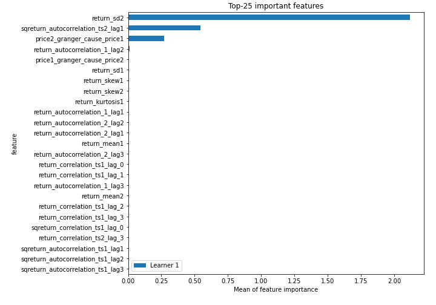
## Confusion Matrix

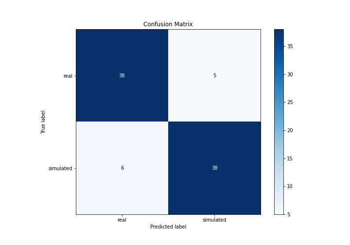

## Normalized Confusion Matrix

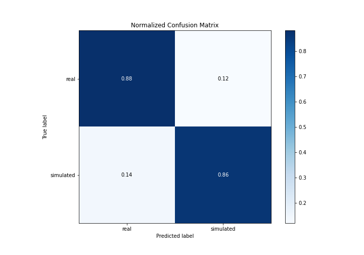

## ROC Curve

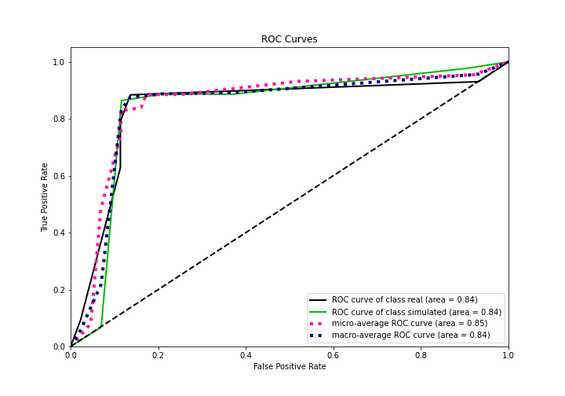

## Kolmogorov-Smirnov Statistic

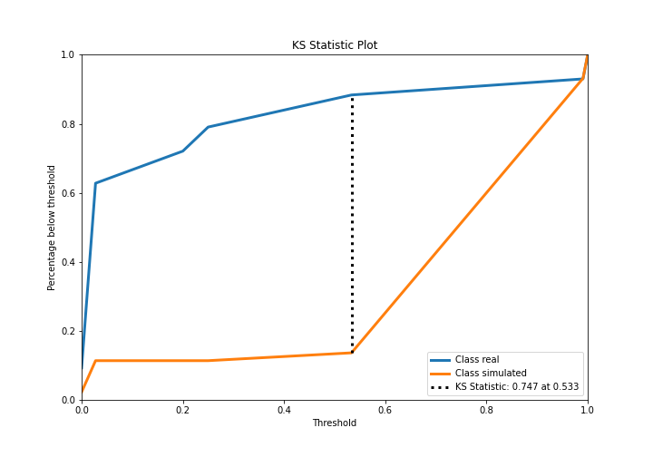

## Precision-Recall Curve

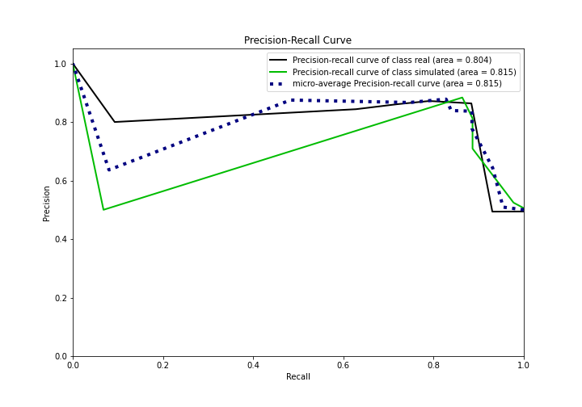

## Calibration Curve

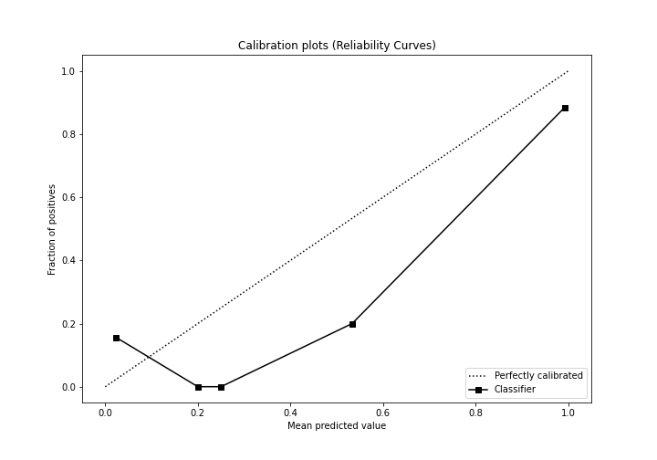

## Cumulative Gains Curve

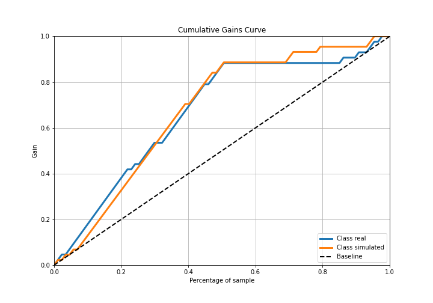

## Lift Curve

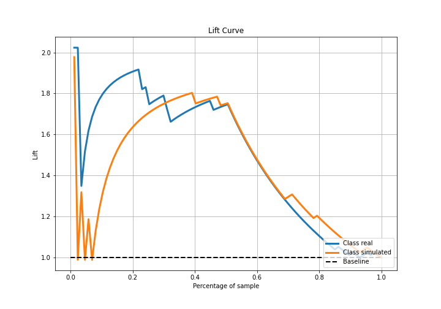

## SHAP Importance
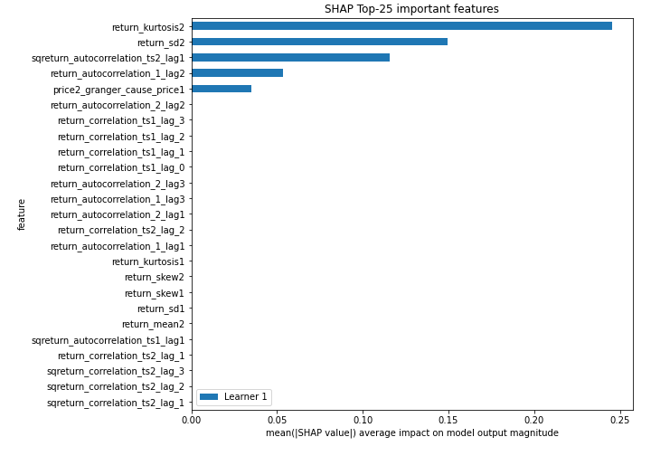

## SHAP Dependence plots

### Dependence (Fold 1)
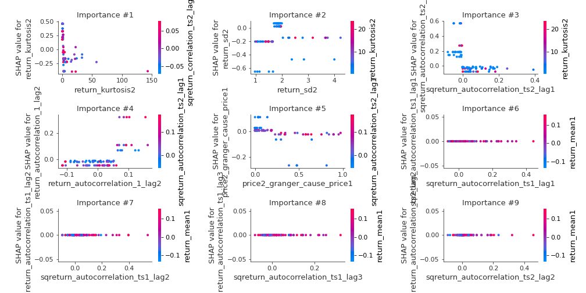

## SHAP Decision plots

### Top-10 Worst decisions for class 0 (Fold 1)
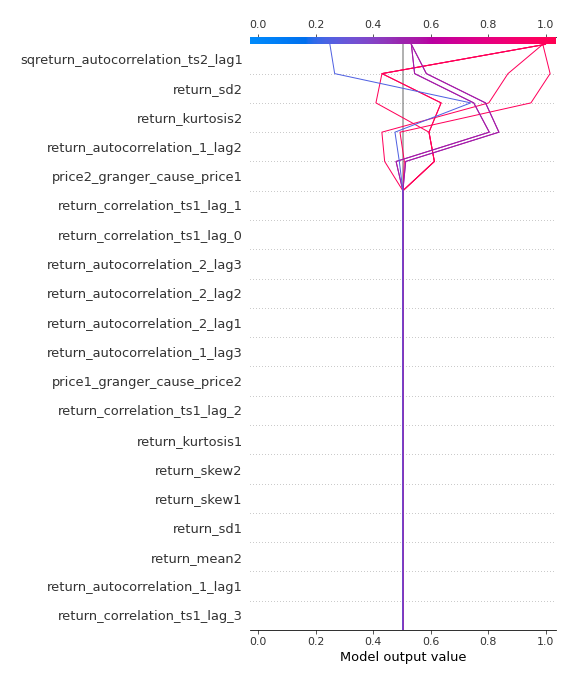
### Top-10 Best decisions for class 0 (Fold 1)
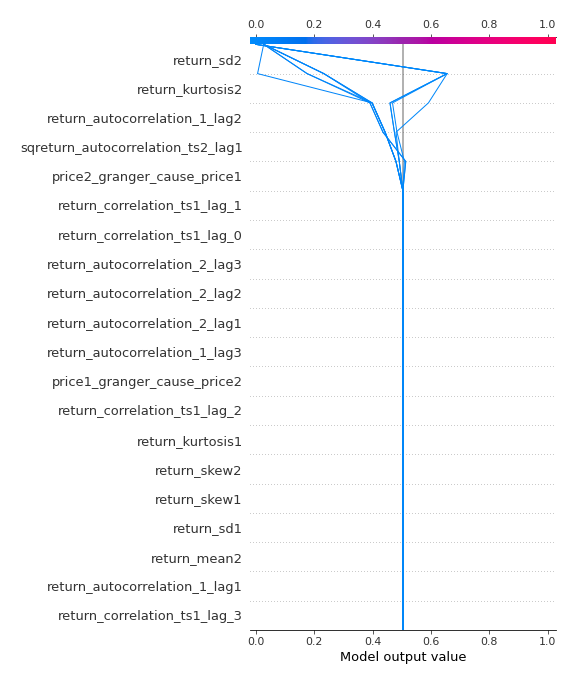
### Top-10 Worst decisions for class 1 (Fold 1)
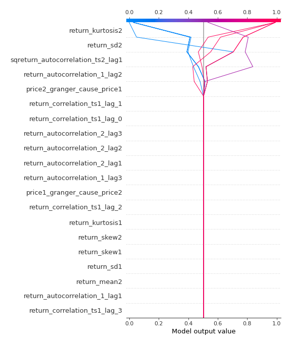
### Top-10 Best decisions for class 1 (Fold 1)
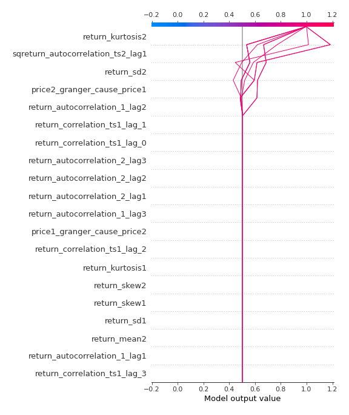

[<< Go back](../README.md)
