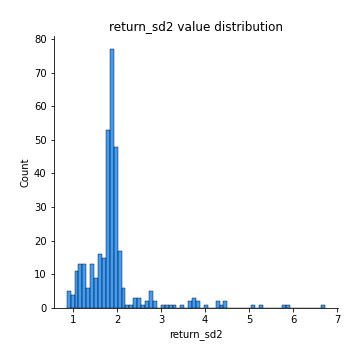
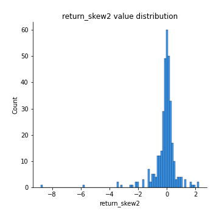

# Exploratory Data Analysis

[<< Go back](../README.md)
## Feature : target
- **Feature type** : categorical
- **Missing** : 0.0%
- **Unique** : 2
- **Count** :347
- **Unique** :2
- **Top** :simulated
- **Freq** :175

## Feature : return_mean1
- **Feature type** : continous
- **Missing** : 0.0%
- **Unique** : 347
- **Count** :347.0
- **Mean** :0.030283016558706716
- **Std** :0.10554203849252945
- **Min** :-0.3381653716306412
- **25%th Percentile** : -0.028996424919301163
- **50%th Percentile** : 0.03512638441177084
- **75%th Percentile** : 0.09164969270142279
- **Max** :0.37175100008111034

## Feature : return_mean2
- **Feature type** : continous
- **Missing** : 0.0%
- **Unique** : 347
- **Count** :347.0
- **Mean** :-0.005014664745101347
- **Std** :0.10977904634585495
- **Min** :-0.3008468362725558
- **25%th Percentile** : -0.08516083906091278
- **50%th Percentile** : 0.007721844486257425
- **75%th Percentile** : 0.06898885960518682
- **Max** :0.37616608147096464

## Feature : return_sd1
- **Feature type** : continous
- **Missing** : 0.0%
- **Unique** : 347
- **Count** :347.0
- **Mean** :1.8722841116115803
- **Std** :0.7453717579063658
- **Min** :0.7470080772831957
- **25%th Percentile** : 1.6516499293471365
- **50%th Percentile** : 1.8062479775119535
- **75%th Percentile** : 1.9184031242714383
- **Max** :9.236766377527575

## Feature : return_sd2
- **Feature type** : continous
- **Missing** : 0.0%
- **Unique** : 347
- **Count** :347.0
- **Mean** :1.9203458901713828
- **Std** :0.7426039054172286
- **Min** :0.8455946193085045
- **25%th Percentile** : 1.6370099273875067
- **50%th Percentile** : 1.8459933242556161
- **75%th Percentile** : 1.9539685757813088
- **Max** :6.737618636746393

## Feature : return_skew1
- **Feature type** : continous
- **Missing** : 0.0%
- **Unique** : 347
- **Count** :347.0
- **Mean** :-0.05895090507410721
- **Std** :0.6646869424596329
- **Min** :-3.530116233761814
- **25%th Percentile** : -0.2750725939248973
- **50%th Percentile** : -0.011464234943702495
- **75%th Percentile** : 0.22921025850917914
- **Max** :2.5845963767725557

## Feature : return_skew2
- **Feature type** : continous
- **Missing** : 0.0%
- **Unique** : 347
- **Count** :347.0
- **Mean** :-0.11021246141972377
- **Std** :0.8682515262094488
- **Min** :-8.801502855292393
- **25%th Percentile** : -0.2461753916191839
- **50%th Percentile** : -0.001222213543518732
- **75%th Percentile** : 0.2040712160153511
- **Max** :2.242019525651531

## Feature : return_kurtosis1
- **Feature type** : continous
- **Missing** : 0.0%
- **Unique** : 347
- **Count** :347.0
- **Mean** :4.144492055658443
- **Std** :5.827998560343175
- **Min** :-0.003484242550565675
- **25%th Percentile** : 1.1268817110835578
- **50%th Percentile** : 1.9799269187070894
- **75%th Percentile** : 4.122234746361331
- **Max** :46.07507808162177

## Feature : return_kurtosis2
- **Feature type** : continous
- **Missing** : 0.0%
- **Unique** : 347
- **Count** :347.0
- **Mean** :4.6368753000069765
- **Std** :10.488591959048028
- **Min** :-0.2279038568349061
- **25%th Percentile** : 0.5992670423480289
- **50%th Percentile** : 1.6844302612820123
- **75%th Percentile** : 4.40507914533392
- **Max** :143.10871011533666

## Feature : return_autocorrelation_1_lag1
- **Feature type** : continous
- **Missing** : 0.0%
- **Unique** : 347
- **Count** :347.0
- **Mean** :0.008226917283570622
- **Std** :0.06119813088867081
- **Min** :-0.19339575314049967
- **25%th Percentile** : -0.026797781504352247
- **50%th Percentile** : 0.014194228494300612
- **75%th Percentile** : 0.04939747604014136
- **Max** :0.14772043275941418

## Feature : return_autocorrelation_1_lag2
- **Feature type** : continous
- **Missing** : 0.0%
- **Unique** : 347
- **Count** :347.0
- **Mean** :0.012678662885388745
- **Std** :0.055500722435002765
- **Min** :-0.13309283796645122
- **25%th Percentile** : -0.02328316869654048
- **50%th Percentile** : 0.011554095635660785
- **75%th Percentile** : 0.0499192606065639
- **Max** :0.16352396930027568

## Feature : return_autocorrelation_1_lag3
- **Feature type** : continous
- **Missing** : 0.0%
- **Unique** : 347
- **Count** :347.0
- **Mean** :0.017303153472578582
- **Std** :0.05541706448355134
- **Min** :-0.1940836867390813
- **25%th Percentile** : -0.012335444879763811
- **50%th Percentile** : 0.020749341452659574
- **75%th Percentile** : 0.05392672025843224
- **Max** :0.17805869530681923

## Feature : return_autocorrelation_2_lag1
- **Feature type** : continous
- **Missing** : 0.0%
- **Unique** : 347
- **Count** :347.0
- **Mean** :-0.010055695272527298
- **Std** :0.059443956054688496
- **Min** :-0.25075531010123286
- **25%th Percentile** : -0.04412084187687889
- **50%th Percentile** : -0.004580481152468063
- **75%th Percentile** : 0.026300345372995436
- **Max** :0.31863413537898483

## Feature : return_autocorrelation_2_lag2
- **Feature type** : continous
- **Missing** : 0.0%
- **Unique** : 347
- **Count** :347.0
- **Mean** :-0.004641416059784393
- **Std** :0.05057246416588129
- **Min** :-0.15323211089747296
- **25%th Percentile** : -0.039358602630306876
- **50%th Percentile** : -0.007397875343052502
- **75%th Percentile** : 0.029849197036606975
- **Max** :0.20974504043791217

## Feature : return_autocorrelation_2_lag3
- **Feature type** : continous
- **Missing** : 0.0%
- **Unique** : 347
- **Count** :347.0
- **Mean** :-0.004088362231325716
- **Std** :0.04775750823120102
- **Min** :-0.14200107169559698
- **25%th Percentile** : -0.033648279368136136
- **50%th Percentile** : -0.0053313135532921255
- **75%th Percentile** : 0.025596902048604868
- **Max** :0.14685076655741797

## Feature : return_correlation_ts1_lag_0
- **Feature type** : continous
- **Missing** : 0.0%
- **Unique** : 347
- **Count** :347.0
- **Mean** :0.33069405400472746
- **Std** :0.11780556146614203
- **Min** :-0.027089510445801036
- **25%th Percentile** : 0.26369570650761043
- **50%th Percentile** : 0.33580163062387935
- **75%th Percentile** : 0.3986332653420178
- **Max** :0.7041861626832071

## Feature : return_correlation_ts1_lag_1
- **Feature type** : continous
- **Missing** : 0.0%
- **Unique** : 347
- **Count** :347.0
- **Mean** :-0.0026621045718162187
- **Std** :0.04983038026900023
- **Min** :-0.15776193292681923
- **25%th Percentile** : -0.033418346120765524
- **50%th Percentile** : 0.000401174020455929
- **75%th Percentile** : 0.0296030402698557
- **Max** :0.15499424718508623

## Feature : return_correlation_ts1_lag_2
- **Feature type** : continous
- **Missing** : 0.0%
- **Unique** : 347
- **Count** :347.0
- **Mean** :0.0024902986674454762
- **Std** :0.047887719522824404
- **Min** :-0.12864410180561703
- **25%th Percentile** : -0.02940233577017995
- **50%th Percentile** : 0.0003333864895400894
- **75%th Percentile** : 0.038418599700069396
- **Max** :0.12434270845026239

## Feature : return_correlation_ts1_lag_3
- **Feature type** : continous
- **Missing** : 0.0%
- **Unique** : 347
- **Count** :347.0
- **Mean** :0.005816471500625445
- **Std** :0.050674220758635924
- **Min** :-0.1270218498974763
- **25%th Percentile** : -0.031781451533991006
- **50%th Percentile** : 0.006447669169800254
- **75%th Percentile** : 0.03987048282778277
- **Max** :0.1636773216468148

## Feature : return_correlation_ts2_lag_1
- **Feature type** : continous
- **Missing** : 0.0%
- **Unique** : 347
- **Count** :347.0
- **Mean** :-0.0028667423647240125
- **Std** :0.05077818609882482
- **Min** :-0.20093919236581337
- **25%th Percentile** : -0.02884889441189616
- **50%th Percentile** : -0.001052307586426952
- **75%th Percentile** : 0.029210408927715013
- **Max** :0.17208763791364762

## Feature : return_correlation_ts2_lag_2
- **Feature type** : continous
- **Missing** : 0.0%
- **Unique** : 347
- **Count** :347.0
- **Mean** :0.002197744199916861
- **Std** :0.05109930203845131
- **Min** :-0.23751835475804678
- **25%th Percentile** : -0.03047061140835501
- **50%th Percentile** : 0.0003470923375363182
- **75%th Percentile** : 0.03633025213638155
- **Max** :0.20772887392904255

## Feature : return_correlation_ts2_lag_3
- **Feature type** : continous
- **Missing** : 0.0%
- **Unique** : 347
- **Count** :347.0
- **Mean** :0.00263414952636099
- **Std** :0.051579090963429546
- **Min** :-0.17564076057312866
- **25%th Percentile** : -0.025792314758919535
- **50%th Percentile** : 0.0046902788897027715
- **75%th Percentile** : 0.03704587045448331
- **Max** :0.13128380114518473

## Feature : sqreturn_autocorrelation_ts1_lag1
- **Feature type** : continous
- **Missing** : 0.0%
- **Unique** : 347
- **Count** :347.0
- **Mean** :0.04785157931478445
- **Std** :0.09228605038198902
- **Min** :-0.08991050744886869
- **25%th Percentile** : -0.013981697889995207
- **50%th Percentile** : 0.019952017381231448
- **75%th Percentile** : 0.08110094140697258
- **Max** :0.49414293176447355

## Feature : sqreturn_autocorrelation_ts1_lag2
- **Feature type** : continous
- **Missing** : 0.0%
- **Unique** : 347
- **Count** :347.0
- **Mean** :0.040156703000475566
- **Std** :0.09072955290983815
- **Min** :-0.0953061939941706
- **25%th Percentile** : -0.015003078504378793
- **50%th Percentile** : 0.013757042332990207
- **75%th Percentile** : 0.06287505926873135
- **Max** :0.540735851444759

## Feature : sqreturn_autocorrelation_ts1_lag3
- **Feature type** : continous
- **Missing** : 0.0%
- **Unique** : 347
- **Count** :347.0
- **Mean** :0.032958325822424084
- **Std** :0.07679909786818107
- **Min** :-0.08831417734498181
- **25%th Percentile** : -0.014398683150109264
- **50%th Percentile** : 0.011027052021325206
- **75%th Percentile** : 0.05810039384347518
- **Max** :0.41030914918857014

## Feature : sqreturn_autocorrelation_ts2_lag1
- **Feature type** : continous
- **Missing** : 0.0%
- **Unique** : 347
- **Count** :347.0
- **Mean** :0.047329333434337865
- **Std** :0.08761088360140439
- **Min** :-0.09536572535685182
- **25%th Percentile** : -0.007700218867974914
- **50%th Percentile** : 0.025695549370206412
- **75%th Percentile** : 0.08325599617483875
- **Max** :0.510085647437958

## Feature : sqreturn_autocorrelation_ts2_lag2
- **Feature type** : continous
- **Missing** : 0.0%
- **Unique** : 347
- **Count** :347.0
- **Mean** :0.03834439730677566
- **Std** :0.08472873375257083
- **Min** :-0.10693929864913927
- **25%th Percentile** : -0.010082137730469794
- **50%th Percentile** : 0.014100002019052208
- **75%th Percentile** : 0.05935652066075513
- **Max** :0.45676817892778204

## Feature : sqreturn_autocorrelation_ts2_lag3
- **Feature type** : continous
- **Missing** : 0.0%
- **Unique** : 347
- **Count** :347.0
- **Mean** :0.026145328976862656
- **Std** :0.06751793307479728
- **Min** :-0.11078184093217908
- **25%th Percentile** : -0.01563617706118695
- **50%th Percentile** : 0.010183227334158442
- **75%th Percentile** : 0.051439360715729604
- **Max** :0.31225727797735664

## Feature : sqreturn_correlation_ts1_lag_0
- **Feature type** : continous
- **Missing** : 0.0%
- **Unique** : 347
- **Count** :347.0
- **Mean** :0.33069405400472746
- **Std** :0.11780556146614203
- **Min** :-0.027089510445801036
- **25%th Percentile** : 0.26369570650761043
- **50%th Percentile** : 0.33580163062387935
- **75%th Percentile** : 0.3986332653420178
- **Max** :0.7041861626832071

## Feature : sqreturn_correlation_ts1_lag_1
- **Feature type** : continous
- **Missing** : 0.0%
- **Unique** : 347
- **Count** :347.0
- **Mean** :-0.0026621045718162187
- **Std** :0.04983038026900023
- **Min** :-0.15776193292681923
- **25%th Percentile** : -0.033418346120765524
- **50%th Percentile** : 0.000401174020455929
- **75%th Percentile** : 0.0296030402698557
- **Max** :0.15499424718508623

## Feature : sqreturn_correlation_ts1_lag_2
- **Feature type** : continous
- **Missing** : 0.0%
- **Unique** : 347
- **Count** :347.0
- **Mean** :0.0024902986674454762
- **Std** :0.047887719522824404
- **Min** :-0.12864410180561703
- **25%th Percentile** : -0.02940233577017995
- **50%th Percentile** : 0.0003333864895400894
- **75%th Percentile** : 0.038418599700069396
- **Max** :0.12434270845026239

## Feature : sqreturn_correlation_ts1_lag_3
- **Feature type** : continous
- **Missing** : 0.0%
- **Unique** : 347
- **Count** :347.0
- **Mean** :0.005816471500625445
- **Std** :0.050674220758635924
- **Min** :-0.1270218498974763
- **25%th Percentile** : -0.031781451533991006
- **50%th Percentile** : 0.006447669169800254
- **75%th Percentile** : 0.03987048282778277
- **Max** :0.1636773216468148

## Feature : sqreturn_correlation_ts2_lag_1
- **Feature type** : continous
- **Missing** : 0.0%
- **Unique** : 347
- **Count** :347.0
- **Mean** :-0.0028667423647240125
- **Std** :0.05077818609882482
- **Min** :-0.20093919236581337
- **25%th Percentile** : -0.02884889441189616
- **50%th Percentile** : -0.001052307586426952
- **75%th Percentile** : 0.029210408927715013
- **Max** :0.17208763791364762

## Feature : sqreturn_correlation_ts2_lag_2
- **Feature type** : continous
- **Missing** : 0.0%
- **Unique** : 347
- **Count** :347.0
- **Mean** :0.002197744199916861
- **Std** :0.05109930203845131
- **Min** :-0.23751835475804678
- **25%th Percentile** : -0.03047061140835501
- **50%th Percentile** : 0.0003470923375363182
- **75%th Percentile** : 0.03633025213638155
- **Max** :0.20772887392904255

## Feature : sqreturn_correlation_ts2_lag_3
- **Feature type** : continous
- **Missing** : 0.0%
- **Unique** : 347
- **Count** :347.0
- **Mean** :0.00263414952636099
- **Std** :0.051579090963429546
- **Min** :-0.17564076057312866
- **25%th Percentile** : -0.025792314758919535
- **50%th Percentile** : 0.0046902788897027715
- **75%th Percentile** : 0.03704587045448331
- **Max** :0.13128380114518473

## Feature : price2_granger_cause_price1
- **Feature type** : continous
- **Missing** : 0.0%
- **Unique** : 347
- **Count** :347.0
- **Mean** :0.24074482627035645
- **Std** :0.29427469547306384
- **Min** :1.7904217217149066e-13
- **25%th Percentile** : 0.0067049332755584525
- **50%th Percentile** : 0.09379787303628766
- **75%th Percentile** : 0.4133123846518342
- **Max** :0.9885712803689185

## Feature : price1_granger_cause_price2
- **Feature type** : continous
- **Missing** : 0.0%
- **Unique** : 347
- **Count** :347.0
- **Mean** :0.32242811659118925
- **Std** :0.28693102476028753
- **Min** :6.402674878420067e-06
- **25%th Percentile** : 0.06360000648077521
- **50%th Percentile** : 0.24109263314927018
- **75%th Percentile** : 0.5457975857854914
- **Max** :0.9951398266867577

[<< Go back](../README.md)
